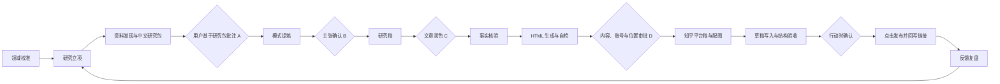

# 工作流方法与门禁

## 状态总览

`STATUS.md` 是状态真相源。A/B/C/D 四个人工门禁不可默认跳过。

## 0. 领域校准

把兴趣改写为 `对象 × 场景 × 关键张力 × 观察窗口`。完成条件：用户说清长期对象、读者和不研究什么。

## 1. 研究立项

一个周期只回答一个问题，记录暂定假设、推翻证据、读者困境、时间盒和停止条件。

## 2. 资料发现与中文研究包

默认 5 篇核心材料：定义/机制、近期进展、真实案例、反方/失败案例、邻近领域连接。先在 `02-reading-queue.md` 记录原始链接、日期、材料类型和支持/挑战关系，再生成 `02-research-pack.md`，不能把“去读五篇原文”作为默认交付。

研究包对每份材料执行“翻译式总结”，不是全文逐字翻译：

1. 中文标题、作者/机构、日期与来源角色。
2. 这份材料试图解决什么问题。
3. 核心主张与因果机制，必要术语首次出现时给出中文解释并保留英文名。
4. 最关键的实验、案例或数据，以及这些证据实际能证明到哪里。
5. 局限、反例、利益相关性和不能外推的边界。
6. 它支持或挑战本期哪个假设。
7. 2–4 个需要用户形成判断的问题。
8. 原文链接与章节/页码定位，仅置于末尾供核验；不得以大段原文代替总结。

若材料很长，优先完整覆盖与研究问题相关的章节，并明确标记未覆盖范围。事实、作者主张与 AI 推断必须分开。

## 3. 人的阅读与批注

用户默认阅读 `02-research-pack.md`，至少写出：原来以为、现在注意到、同意/不同意、跨材料联系、缺失证据。AI 负责解释与追问，只整理用户判断、补出处，不把翻译总结中的结论冒充用户洞见。用户明确要求时再打开原文核验具体段落。

**门禁 A：** 至少两份关键材料有实质判断，并出现一处惊讶、冲突或认知变化。

## 4. 模式提炼

寻找重复机制、条件反转、成本转移、二阶效应和邻域迁移。每个候选包含可反驳表述、来源事实、用户连接、最强反例、适用边界、缺失证据、置信度和质量评分。

## 5. 主张确认与研究稿

用户确认：大多数人认为、我观察到、真正机制、成立边界、对读者意味着什么。

**门禁 B：** 用户确认核心主张、最强证据和最强反方观点。

AI 随后生成 `06-draft.md`，用于保存论证骨架、素材、推断标记和编辑记录。研究稿允许有清单和过程语言，但不得作为发布稿。

## 6. 文章润色

从研究稿新建 `06-article.md`，不得只在原文件上做句子级美化。依次完成：

1. **文章类型与读者入口卡**：先判断研究结果型、技术观点型或案例复盘型，再按 [读者中心写作规则](reader-centered-writing.md) 写清角色、知识距离、当前处境、已有认知、切身利害、默认判断、读后改变、非范围和开场策略。角色标签不是读者模型；“技术负责人”之后仍要回答他正在经历什么、已知道什么、为什么此刻会在意。
2. **同心开场定向**：开场先承担定向功能，再承担吸引功能。技术观点文优先借鉴 Nature 的信息依赖顺序，在前 150–250 个汉字按需要完成“共同现状 → 直接压力 → 解释缺口 → 核心判断”。不得机械套用故事、反问、金句或案例。
3. **案例前置检查**：只有当目标读者能立即识别场景、理解它与自己的利害关系、无需先学习陌生术语，并能知道案例将证明什么时，案例才可放在第一段；否则先补最小背景和问题框架，再进入案例。没有真实项目证据时明确标为假设场景，不得写成事故复盘。
4. **读者问题链**：不用作者的材料目录组织正文。先列出读者接受主张前会依次提出的问题，再让每一节只回答一个问题；缺少前置答案时不得跳入架构、理论或解决方案。
5. **单线推进**：所有段落服务同一主张；证据嵌入论证，不按材料顺序罗列。每段遵循“旧信息连接 → 新信息推进”，新概念首次出现时接到读者已经掌握的概念上。
6. **去笔记化**：删除研究过程、门禁、材料编号、AI/用户标记和待办语气。
7. **反方与回应**：公平呈现最强反方，让回应推动主张变精确。
8. **正文与证据分层**：主文只保留读者问题、核心判断、机制、最强证据、边界和行动含义；完整架构、方法、协议和次要证据进入补充层。借鉴 Nature 的聚焦原则，不把研究充分等同于正文材料越多。
9. **节奏编辑**：合并重复解释，打散清单，强化转折、段落长度和关键句；每节结尾制造下一问题的必要性，而不是总结本节目录。
10. **结构可视化**：调用 `visual-markdown-toolbox` 扫描三步以上流程、三个以上模块、状态变化和反馈闭环；存在结构价值时优先增加 1–2 个可编辑的流程图或架构图，并在图后解释关键边。按内容选择 Mermaid、PlantUML、D2 或 Graphviz，不把所有关系硬画成普通 flowchart。
11. **生成图克制**：AI 生成插画默认 0 张，确有不可替代的表达价值时最多 1–2 张；逐张记录段落映射和表达任务，预览不贴切就删除。
12. **标题、开头与结尾测试**：标题兑现正文冲突；只读标题和前 150–250 字应能释义“写给谁、为什么现在值得读、作者主张什么”；结尾回收开场利害并完成判断升级或行动落点。
13. **反向提纲与释义测试**：逐节写一句“本节回答读者什么问题、读完新增什么判断”。任一节无法回答就删除、合并或重排。交给用户时优先询问其如何理解标题、首段和核心主张，而不是只问“好不好读”。

**门禁 C：** 用户明确判断文章已不再像笔记，并值得目标读者读完；同时，用户对标题、首段和核心主张的释义与作者意图基本一致。未通过则继续润色，不得进入 HTML。

门禁 C 通过时，把当前 `06-article.md` 视为内容基线。此后新增/删除核心观点、改变结论或适用边界、引入新的事实论据，都会让门禁 C 自动失效：在发布包记录变更摘要，重新完成事实核验和门禁 C，再进入 HTML 或门禁 D。只改排版、交互或不改变论点的视觉资产不使 C 失效，但受影响的渲染、图片加载和响应式检查必须重跑。无法判定时按实质内容变更处理。

## 7. 核验、HTML 与知乎发布

先核验事实、引用、推断边界、标题、反方、隐私和保密信息。内容有误时退回 `06-article.md` 修改并重新过门禁 C。

核验通过后，强制调用 `html-generate`：

- 先在 `07-publish-package.md` 锁定视觉资产清单：逐项记录文本图表、确定性渲染图和生成式图片的对应段落、表达任务、文件路径与数量；封面不是默认必需资产。
- 输入只能是 `06-article.md`。
- 自动或按用户指定选择骨架，生成 `07-article.html`。
- HTML 不改核心正文，只做层级、布局、图表和交互表达。
- 完成 console、内容可见性、375/768/1440 溢出和图表渲染自检。
- 用户明确要求封面或生成式图片时，先生成、人工检查语义贴切性并保存为项目本地资产；发布包记录最终提示词、用途、路径、尺寸和预览结论。HTML 验收增加图片加载检查，并至少人工复核 375 与 1440 宽度的首屏裁切。
- 把骨架选择、自检结果和风险写入 `07-publish-package.md`。

用户明确不要 HTML 时才可跳过，并在 `STATUS.md` 记录放宽原因。

**门禁 D：** 展示最终正文、HTML、关键改动、风险、知乎发布形式、目标位置和发布账号；用户明确批准前不得向平台写入草稿或上传图片。

门禁 D 通过后，按以下协议执行知乎发布：

1. 默认从 `06-article.md` 生成 `08-zhihu-answer.md`。开头直接回答目标问题；允许按问答语境压缩和重排，但不得改变核心主张、事实边界和引用关系。用户指定独立文章时生成 `{NN}-zhihu-article.md`，执行 [知乎独立文章平台适配](zhihu-independent-article.md)。
2. 独立文章先用当前可见编辑器确认字段，不凭记忆补“摘要”“标签”或“专栏”配置；标题、首屏、封面和话题形成相关性闭环。
3. 优先把 Markdown 中已审核的流程图、架构图确定性渲染成 SVG/PNG 后上传；渲染图不计入生成式图片额度。
4. AI 生成插画默认 0 张，确有表达价值时最多 1–2 张。每张在发布包记录对应段落、表达任务和文本图表不能替代的理由；映射说不清或预览不贴切就删除。独立文章封面输出 1440 × 810，并验收 16:9 原图与 3:2 居中裁切。
5. 上传使用本地文件；平台正文不得包含 `file://`、本地绝对路径、Markdown 图片占位或损坏图片。
6. 使用内置浏览器打开已登录知乎账号与目标位置，将正文、链接和图片写入草稿。
7. 在浏览器 DOM 中验收并写回 `07-publish-package.md`。通用字段：账号、正文字数、标题数、正文图片、外链与 URL、自动保存、按钮状态；问答增加问题；独立文章增加新发布/更新、标题、封面、话题、投稿至问题、创作声明和内容来源。投稿至问题最多 1 个，没有强匹配就保持未选择。
8. 草稿验收通过后停在最终按钮前，复述账号、位置或目标 URL、标题、字数、标题数、正文图片、封面、链接、话题、投稿至问题、声明、来源和按钮名称，取得**行动时确认**。门禁 D 的内容批准不能替代这次确认。
9. 仅在确认后点击一次。成功后访问公开页核验标题、封面、正文图、话题和 URL；失败则保留草稿、记录错误并停止，不得盲目重试。

## 8. 反馈复盘

反馈按理解、认同、反驳、应用和机会分类。若反馈是“像笔记/没人看”，归因于文章润色阶段；若“案例突兀、无法带入、看不出与我有什么关系”，归因于读者入口卡或开场定向失败，先修读者模型、利害和旧→新信息桥接，不得只换案例或做句子级美化；若 HTML 难读或渲染异常，归因于 HTML 阶段；若平台草稿结构、图片或链接异常，归因于知乎发布协议；若生成图不贴切，优先减少生成图并把可表达的关系迁回文本图表。更新模式边界、置信度和下一期问题。
