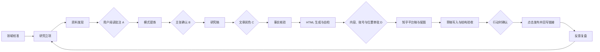

# 工作流方法与门禁

## 状态总览

`STATUS.md` 是状态真相源。A/B/C/D 四个人工门禁不可默认跳过。

## 0. 领域校准

把兴趣改写为 `对象 × 场景 × 关键张力 × 观察窗口`。完成条件：用户说清长期对象、读者和不研究什么。

## 1. 研究立项

一个周期只回答一个问题，记录暂定假设、推翻证据、读者困境、时间盒和停止条件。

## 2. 资料发现

默认 5 篇核心材料：定义/机制、近期进展、真实案例、反方/失败案例、邻近领域连接。记录原始链接、日期、材料类型和支持/挑战关系。

## 3. 人的阅读与批注

用户至少写出：原来以为、现在注意到、同意/不同意、跨材料联系、缺失证据。AI 只整理、补出处和追问。

**门禁 A：** 至少两份关键材料有实质判断，并出现一处惊讶、冲突或认知变化。

## 4. 模式提炼

寻找重复机制、条件反转、成本转移、二阶效应和邻域迁移。每个候选包含可反驳表述、来源事实、用户连接、最强反例、适用边界、缺失证据、置信度和质量评分。

## 5. 主张确认与研究稿

用户确认：大多数人认为、我观察到、真正机制、成立边界、对读者意味着什么。

**门禁 B：** 用户确认核心主张、最强证据和最强反方观点。

AI 随后生成 `06-draft.md`，用于保存论证骨架、素材、推断标记和编辑记录。研究稿允许有清单和过程语言，但不得作为发布稿。

## 6. 文章润色

从研究稿新建 `06-article.md`，不得只在原文件上做句子级美化。依次完成：

1. **读者承诺**：一句话回答谁会看、为什么现在看、读后改变什么。
2. **开场重构**：以冲突、反直觉或高代价问题建立阅读张力。
3. **单线推进**：所有段落服务同一主张；证据嵌入论证，不按材料顺序罗列。
4. **去笔记化**：删除研究过程、门禁、材料编号、AI/用户标记和待办语气。
5. **反方与回应**：公平呈现最强反方，让回应推动主张变精确。
6. **节奏编辑**：合并重复解释，打散清单，强化转折、段落长度和关键句。
7. **结构可视化**：调用 `visual-markdown-toolbox` 扫描三步以上流程、三个以上模块、状态变化和反馈闭环；存在结构价值时优先增加 1–2 个可编辑的流程图或架构图，并在图后解释关键边。按内容选择 Mermaid、PlantUML、D2 或 Graphviz，不把所有关系硬画成普通 flowchart。
8. **生成图克制**：AI 生成插画默认 0 张，确有不可替代的表达价值时最多 1–2 张；逐张记录段落映射和表达任务，预览不贴切就删除。
9. **标题与结尾**：标题兑现正文冲突；结尾完成一次判断升级或行动落点。

**门禁 C：** 用户明确判断文章已不再像笔记，并值得目标读者读完。未通过则继续润色，不得进入 HTML。

## 7. 核验、HTML 与知乎发布

先核验事实、引用、推断边界、标题、反方、隐私和保密信息。内容有误时退回 `06-article.md` 修改并重新过门禁 C。

核验通过后，强制调用 `html-generate`：

- 输入只能是 `06-article.md`。
- 自动或按用户指定选择骨架，生成 `07-article.html`。
- HTML 不改核心正文，只做层级、布局、图表和交互表达。
- 完成 console、内容可见性、375/768/1440 溢出和图表渲染自检。
- 把骨架选择、自检结果和风险写入 `07-publish-package.md`。

用户明确不要 HTML 时才可跳过，并在 `STATUS.md` 记录放宽原因。

**门禁 D：** 展示最终正文、HTML、关键改动、风险、知乎目标问题和发布账号；用户明确批准前不得向平台写入草稿或上传图片。

门禁 D 通过后，按以下协议执行知乎发布：

1. 从 `06-article.md` 生成 `08-zhihu-answer.md`。开头直接回答目标问题；允许按问答语境压缩和重排，但不得改变核心主张、事实边界和引用关系。
2. 优先把 Markdown 中已审核的流程图、架构图确定性渲染成 SVG/PNG 后上传；渲染图不计入生成式图片额度。
3. AI 生成插画默认 0 张，确有表达价值时最多 1–2 张。每张在发布包记录对应段落、表达任务和文本图表不能替代的理由；映射说不清或预览不贴切就删除，不为凑封面保留。
4. 上传使用本地文件；平台正文不得包含 `file://`、本地绝对路径、Markdown 图片占位或损坏图片。
5. 使用内置浏览器打开已登录知乎账号和目标问题，将正文、链接和图片写入草稿。
6. 在浏览器 DOM 中验收并写回 `07-publish-package.md`：账号、问题、正文字数、标题数、文本图表渲染数、生成式图片数、图片加载状态、外链数与 URL、自动保存状态、发布按钮可用性。
7. 草稿验收通过后停在“发布回答”按钮前，向用户明确复述账号、问题、字数、图片数和链接数，取得**行动时确认**。门禁 D 的内容批准不能替代这次确认。
8. 仅在确认后点击一次。成功则记录公开 URL、账号、发布时间与结果；失败则保留草稿、记录错误并停止，不得盲目重试。

## 8. 反馈复盘

反馈按理解、认同、反驳、应用和机会分类。若反馈是“像笔记/没人看”，归因于文章润色阶段；若 HTML 难读或渲染异常，归因于 HTML 阶段；若平台草稿结构、图片或链接异常，归因于知乎发布协议；若生成图不贴切，优先减少生成图并把可表达的关系迁回文本图表。更新模式边界、置信度和下一期问题。
