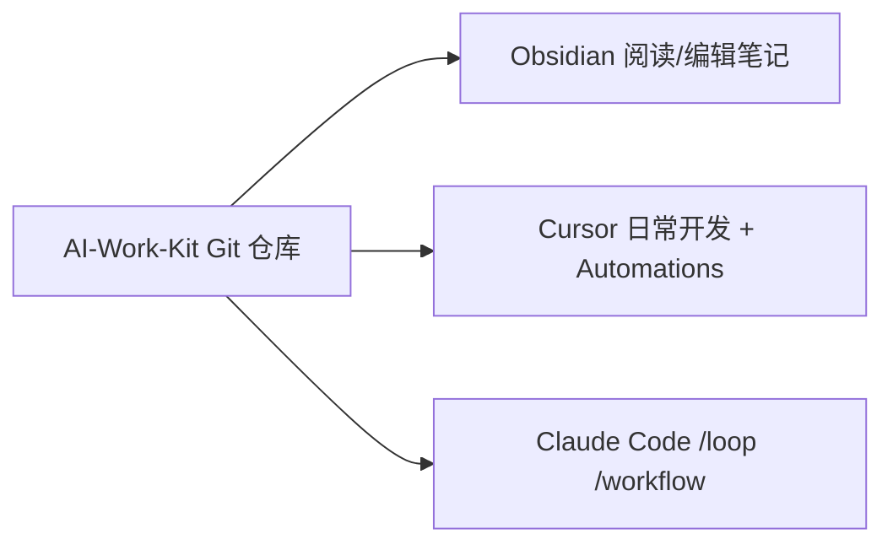

# Claude Code 集成 AI-Work-Kit 指南

> **目标**：Cursor 与 Claude Code **共用同一份** AI-Work-Kit（Obsidian Vault + Plans + Contexts + Skills），在 Claude Code 里完成 `/loop`、`/workflow` 等 Agent 能力，并与 Cursor 日常协作互补。

---

## 1. 架构：一个 Kit，两个入口



| 层级 | 存什么 | Cursor | Claude Code |
|------|--------|--------|-------------|
| 流程 | Skill、模板 | `.cursorrules` + `.cursor/skills/` | `CLAUDE.md` + `.claude/skills/` |
| 记忆 | plan、决策、日报 | `Plans/`、`Contexts/` | **同路径** |
| 检索 | RAG | enquire → `.cursor/mcp.json` | enquire → **`.mcp.json`** |
| 自动化 | Loop | Cursor Automations | **`/loop`**、**`/schedule`** |
| 编排 | 大任务 | Agent 多步 | **`/workflow`**、**`ultracode`** |

**原则**：Kit 是跨工具的 Loop 基础设施；Claude Code 不是替代 Cursor，而是补 **定时循环** 和 **重型 workflow**。

---

## 2. 前置条件

- 已 clone AI-Work-Kit，Obsidian 能正常打开 Vault
- 已安装 [Claude Code](https://code.claude.com/)（CLI / Desktop / VS Code 扩展均可）
- Node.js（enquire-mcp 需要 `npx`）
- （可选）Cursor 侧已在使用 Kit，便于对照

---

## 3. 五分钟接入

### 3.1 在 Claude Code 打开 Kit

```bash
cd /你的路径/AI-Work-Kit
claude
```

首次进入可运行 `/init`，Claude 会扫描仓库；**已有 `CLAUDE.md` 时以仓库内文件为准**。

### 3.2 项目说明（已内置）

仓库根目录 **`CLAUDE.md`** 已从 `.cursorrules` 适配，包含：

- 知识库目录结构
- Skill 触发规则（续做、日报、学习等）
- MCP 检索约定
- 输出格式

Claude Code **每个会话自动加载** `CLAUDE.md`，等价于 Cursor 的 `.cursorrules`。

### 3.3 MCP：知识库语义搜索（可选）

```bash
# 1. 初始化 enquire 索引（若 Cursor 侧已做过可跳过）
npx -y @oomkapwn/enquire-mcp setup --vault "/你的路径/AI-Work-Kit"

# 2. 配置 Claude Code 项目 MCP
cp .mcp.json.example .mcp.json
# 编辑 .mcp.json，把 --vault 改成你的绝对路径

# 3. 在 Claude Code 里重载 MCP（或重启 claude）
# 会话中输入 /mcp 确认 enquire 已连接
```

新增笔记后更新索引：

```bash
npx -y @oomkapwn/enquire-mcp index --vault "/你的路径/AI-Work-Kit"
```

详见 [[MCP进阶指南]]。

### 3.4 Skill：两种用法

| 方式 | 做法 | 何时用 |
|------|------|--------|
| **A. 显式引用** | 对话里 `@Skills/review_assistant.md` | 最快，零配置 |
| **B. 自动 Skill** | 同步到 `.claude/skills/` | 说「续做」「日报」自动匹配 |

**方式 B — 一次性同步**（在 Kit 根目录执行）：

```bash
mkdir -p .claude/skills
for d in .cursor/skills/*/; do
  name=$(basename "$d")
  rm -rf ".claude/skills/$name"
  cp -r "$d" ".claude/skills/$name"
done
```

之后在 Claude Code 说触发词即可，与 Cursor 行为对齐。Obsidian 侧仍维护 `Skills/*.md` 人类可读版。

---

## 4. 命令对照：Cursor → Claude Code

在 **AI-Work-Kit 仓库内**打开 Claude Code 时：

| 任务 | Cursor | Claude Code |
|------|--------|-------------|
| 续做 plan | `/resume plan=Plans/... 进度=...` | 同上，或 `@Skills/resume_assistant.md` + 续做 |
| 排查开工 | `/template-generator 任务类型=排查，背景=...` | 同上 |
| 今日日报 | `/review-assistant 日报` | 同上，或 `@Skills/review_assistant.md` |
| 搜历史 | 「知识库里有没有 xxx？」（enquire） | 同上（需 `.mcp.json`） |
| 学习 | `/learn-assistant 续学` | 同上 |
| 写回笔记 | 对话确认后写入 | 同上 |

在 **业务代码仓库**打开 Claude Code 时：

- 把 Kit 当**外置记忆**：对话里 `@/绝对路径/AI-Work-Kit/Skills/xxx.md`
- 或在本机全局配置 Claude 用户级 Skill，内容与 Kit 同步

---

## 5. Loop Engineering：在 Kit 上跑 `/loop`

自动日报是典型 Loop 作品，八要素对照：

| 要素 | AI-Work-Kit 自动日报 |
|------|----------------------|
| Goal | 生成当日日报 → `Contexts/日报/YYYY-MM-DD.md` |
| Trigger | 每天固定时间 |
| Context | `review_assistant` + 日报模板 + Plans |
| Skills | `Skills/review_assistant.md` |
| Verifier | 模板结构、仅本人 git、正文不写元信息 |
| Stop | 文件写入完成 |
| Memory | `Contexts/日报/` 长期沉淀 |
| Human escalation | 材料不足时要求用户补充 |

### 5.1 Claude Code `/loop` 示例

在 Kit 根目录的 Claude Code 会话中：

```text
/loop 30 21 * * * 执行 review-assistant 日报模式：
读 Skills/review_assistant.md 与 Templates/日报模板.md，
扫描 ~/git/* 仅统计 --author=wanglongxiang（+王龙祥）的 commit，
扫描本仓库当日 Plans/，
写入 Contexts/日报/YYYY-MM-DD.md
```

或用自然语言：

```text
/loop every day at 9:30pm 按 AI-Work-Kit 日报 Skill 写今日日报并 commit
```

> **注意**：`/loop` 在 Claude Code 本地运行；扫 `~/git/*` 需本机路径可访问。Cloud 会话需单独配置代码仓库访问。

### 5.2 与 Cursor Automations 的关系

| | Cursor Automations | Claude `/loop` |
|---|-------------------|----------------|
| 触发 | Cursor 云端/本地 Automations | Claude Code 本地调度 |
| 适合 | 你已配好的每晚 21:30 日报 | 领导要求的 `/loop` 作业、本地 cron 化 |
| Kit 数据 | 同一 `Contexts/日报/` | 同一 `Contexts/日报/` |

**两边可以共存**，避免同一时刻重复跑两次；或只保留一种触发。

---

## 6. Dynamic Workflows：在 Kit 上跑 `/workflow`

Workflow 适合 **比单次 Chat 更大、需要并行 subagent** 的任务。

### 6.1 触发方式

```text
ultracode: 审计 Plans/学习/ 各课完成度，对照 Contexts/LLM学习/概念/，输出学习进度报告到 Contexts/LLM学习/笔记/

/deep-research Loop Engineering 与 Claude Dynamic Workflows 的区别，结合 AI-Work-Kit 工作流举例
```

已固化的命名 workflow（存于 `.claude/workflows/`，已入库）：

| 名称 | 用途 | 触发说法 |
|------|------|----------|
| `learning-audit` | 审计 `Plans/学习/` 各课声称状态 vs 实际证据（复选框/概念卡/笔记），报告写入 `Contexts/LLM学习/笔记/` | 「审计我的学习进度」「跑 learning-audit」 |

或设置会话级自动 workflow：

```text
/effort ultracode
```

### 6.2 查看与管理

```text
/workflows          # 列出运行中/已完成 workflow
```

满意的 run 按 `s` 可保存为 `.claude/workflows/` 下的可复用命令。

### 6.3 何时用 workflow vs 普通 Agent

| 场景 | 普通 Agent / Skill | Workflow |
|------|-------------------|----------|
| 续做一个 plan | ✅ `/resume` | 过重 |
| 写今日日报 | ✅ review-assistant | 过重 |
| 审计全库学习进度 + 多文件交叉验证 | 单会话易漏 | ✅ workflow |
| 全目录 code audit | 单会话协调难 | ✅ workflow |

---

## 7. 与 Cursor 同时使用的规范

1. **Git 是唯一同步源** — Plans、Contexts、日报改完 commit；避免两边同时改同一 plan。
2. **规则文件各维护一份** — `.cursorrules`（Cursor）与 `CLAUDE.md`（Claude）；大改时两边同步要点。
3. **MCP 各配各的** — Cursor：`.cursor/mcp.json`；Claude：`.mcp.json`；`--vault` 指向同一路径。
4. **Skill 以 `.cursor/skills/` 为源** — 变更后重新 cp 到 `.claude/skills/`（或写脚本同步）。
5. **个人覆盖不进 Git** — Claude 可用 `CLAUDE.local.md`、`.claude/settings.local.json` 放个人路径（如 `~/git` 列表）。

---

## 8. 目录清单（Claude 侧新增/可选）

```
AI-Work-Kit/
├── CLAUDE.md                 # ✅ 项目说明（Claude 自动加载）
├── CLAUDE.local.md           # 可选，个人路径，gitignore
├── .mcp.json                 # 可选，从 .mcp.json.example 复制
├── .mcp.json.example         # ✅ 示例
├── .claude/
│   ├── settings.json         # 可选，权限/hooks
│   ├── skills/               # 可选，从 .cursor/skills 同步
│   └── workflows/            # workflow 保存后出现
├── .cursorrules              # Cursor 用，与 CLAUDE.md 对齐
├── Skills/                   # 人类可读 Skill，@ 引用
├── Plans/ · Contexts/ · Templates/   # 共用
└── Contexts/Claude-Code集成AI-Work-Kit.md  # 本文
```

---

## 9. 验收：集成是否成功

在 Kit 根目录开 Claude Code，逐项试：

- [ ] 说「续做」+ 给一个真实 plan 路径 → 输出结构化下一步
- [ ] `@Skills/review_assistant.md` + 「日报」→ 写入 `Contexts/日报/`
- [ ] 「知识库里有没有 RAG 相关笔记？」→ enquire 命中（需 MCP）
- [ ] `/loop` 或定时任务能触发一次日报流程
- [ ] `ultracode:` 或 `/deep-research` 能跑完并产出报告
- [ ] Cursor 里能看到 Claude 写入的 `Contexts/` 文件（git pull 或同目录）

---

## 10. 常见问题

### Q：Claude Code 能替代 Cursor 吗？

不能完整替代。Kit 设计是 **Cursor 日常开发 + Claude Code Loop/Workflow** 互补；Figma、Automations 等仍主要在 Cursor。

### Q：没有 MCP 能用吗？

能。用 `@Plans/...`、`@Skills/...` 手动给上下文；只是「不知道在哪份笔记」时要自己搜。

### Q：CLAUDE.md 和 .cursorrules 要双份维护吗？

核心规则保持一致即可。大改 `.cursorrules` 时，同步更新 `CLAUDE.md` 对应段落。长期可考虑脚本从一份生成两份。

### Q：作业怎么交？

- **语音笔记**：讲 Kit = Loop Engineering 的手工层 + 自动日报 = `/loop` 层
- **`/loop` 作品**：自动日报（Claude 或 Cursor 二选一或都演示）
- **`/workflow` 作品**：对 Kit 跑 audit / deep-research，截图 `/workflows`

---

## 11. 相关链接

- [[分享包-快速开始]]
- [[MCP进阶指南]]
- [[Contexts/LLM学习/学习路线-LLM与提示词]]
- [[Skills/README]]
- Claude Code 官方：[Memory / CLAUDE.md](https://code.claude.com/docs/en/memory) · [Dynamic Workflows](https://code.claude.com/docs/en/workflows)

---

## 12. 一键同步脚本（可选）

保存为 `scripts/sync-claude-skills.sh`（需自行创建）：

```bash
#!/usr/bin/env bash
set -euo pipefail
ROOT="$(cd "$(dirname "$0")/.." && pwd)"
mkdir -p "$ROOT/.claude/skills"
for d in "$ROOT/.cursor/skills"/*/; do
  name=$(basename "$d")
  rm -rf "$ROOT/.claude/skills/$name"
  cp -r "$d" "$ROOT/.claude/skills/$name"
done
echo "Synced .cursor/skills → .claude/skills"
```
