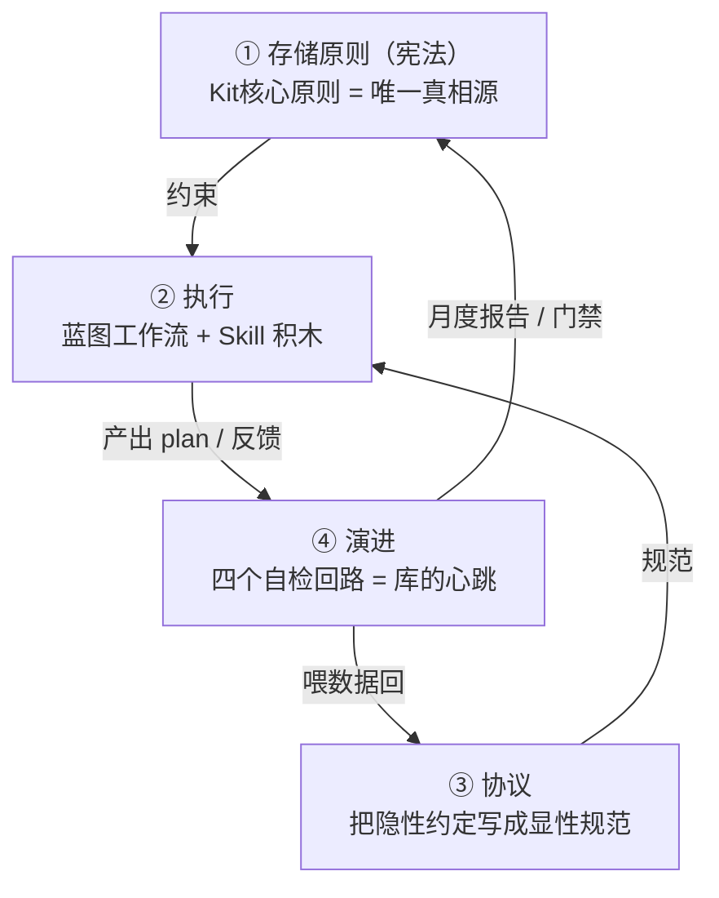

# AI-Work-Kit 架构总览

> **本文定位**：给整套库一个**鸟瞰视角 + 设计理念 + 现状评估**。
> 它**不复述任何规则**——放哪/不放哪去 [[Contexts/决策/Kit核心原则]]，Skill/看板/门禁去 [[Contexts/决策/AI-Work-Kit工作流总览]]，路径地图去 [[Contexts/决策/新手引导与最佳实践]]，字段格式去 [[Templates/模板约定]]。
> 本文只负责把这些零件**串成一张全局心智图**，回答"这套库为什么长这样"。

---

## 一、一句话

AI-Work-Kit 是一套**编辑器中性、自我演进的个人工作流操作系统**：用三层存储划清"任务态 / 通用态 / 模板态"的边界，用一组 Skill 把开发与学习流程固化成可路由的动作，再用四个自动化回路让库能自己体检、纠错、沉淀。

根本命题：把"**我上次是怎么做的？**"变成"**系统告诉我现在该怎么做**"。

---

## 二、四层架构（鸟瞰：如何咬合）

| 层 | 角色 | 真相源 / 入口 |
|----|------|--------------|
| **① 存储原则** | 库的宪法：放哪、不放哪、做完怎么办 | [[Contexts/决策/Kit核心原则]] |
| **② 执行** | 把流程变成可路由的蓝图 + Skill 动作 | [[Contexts/决策/AI-Work-Kit工作流总览]] · `Skills/` |
| **③ 协议** | 把约定固化成可校验的规范 | `Contexts/决策/*协议.md` |
| **④ 演进** | 让库自己报告：谁在用、谁在腐烂、谁与代码脱钩 | `scripts/vault-evolve.py` |

**咬合方式**：宪法（①）约束所有写入；协议（③）把"应该怎样"写清；执行（②）按 Skill 跑出 plan 并在末尾吐反馈；演进（④）把反馈/关系/漂移聚合成月度报告，再回流去修正宪法与协议。这是一个**闭环**，不是单向写入。

### 各层一句话

- **① 存储原则** — 三层存储：`Templates/` 长期骨架 / `Plans/` 做完即删的任务态 / `Contexts/` 跨任务通用资料；判定标准是"换个新任务读了会不会被误导成当前背景"。一条反直觉但关键的设计：**默认删 plan**，刻意不让"已完成功能清单"沉淀下来污染未来上下文。
- **② 执行** — `workflow-router` 是自然语言入口，`full-cycle` 是通用编排引擎，读 `.workflows/blueprints/<name>.json` 组合 Skill；`client-dev` 是 15 步客户端开发蓝图，`computer-mgmt` 是无 Epic 轻量清单。Skill 靠路由硬规则互不越界。详见 §三。
- **③ 协议** — 关系图谱（5 类双向关系）、漂移检测（`verified_against` 锚定代码 commit）、母子 plan 投影（子 plan 是 WBS 唯一真理源）、Skill 反馈（`utility` 二选一防中庸垃圾数据），外加一份个性化的 [[Contexts/决策/对话用词习惯]]。
- **④ 演进** — 四回路：反馈（skill_run）/ 关系图谱（relations-check）/ 漂移（drift-scan）/ 进化调度（vault-evolve 月度 launchd 自动）。脚本层把协议变成**可执行门禁**——`plan-gate-check.sh` 是唯一开工卡点，串起投影、反馈、看板格式、文档引用四道校验，任一失败即 BLOCKED。

---

## 三、两条主线

### 主线 A · 业务开发线（蓝图 + Epic 数据上下文）

入口 `workflow-router`（自然语言或 `/full-cycle`），先选蓝图；`client-dev` 建 `Plans/Epic/`，Epic 只存子 Plan 路径、WBS 和摘要，不驱动流程。阶段由 `workflow-gate.sh` 读蓝图和子 Plan 文件事实派生。Skill 分工与路由细则见 [[Contexts/决策/AI-Work-Kit工作流总览]]，决策树见 [[Contexts/决策/新手引导与最佳实践]] 地图③。

防越界是这条线的设计灵魂：**互斥锁**（单阶段词不准被劫持成全流程）、**降级兜底**（≥3 个 Skill 命中 → 转 `resume-assistant` 问用户）、**禁止擅自下 A/B/C 结论**、**figma-ui 与 feature-dev 互斥**（含"界面/对稿/Figma"强制走 figma-ui）。一句话概括：**把"Agent 替用户拿主意"当头号风险来防**。

### 主线 B · LLM 学习线

与开发线并行的第二条闭环：概念卡（统一模板，每张带"Kit 中的对应"列把理论锚到实践）→ 课程 plan（带 DoD 四条硬验收 + 费曼自测）→ 学习笔记 → 日报/周报自动采集进度。学习与业务工作**并轨不割裂**：同一套日报既记代码变更也记学习进度。入口 `/learn-assistant`，审计 `/learning-audit-assistant`，路线见 [[学习/学习路线-LLM与提示词]]。

---

## 四、设计理念（这套库为什么高级）

这是本文最想补的那块——把散落在各文档里的设计意图收成几条原则：

1. **机制化，而非靠自律。** 规则有唯一真相源且不重复（[[Contexts/决策/Kit核心原则]] §六"别重复写规则"）；约定有脚本兜底；腐烂有回路告警；越界有门禁拦截。人不需要记住所有纪律，库会拦你。
2. **上下文卫生优先于信息囤积。** 默认删 plan、禁止归档"已完成功能清单"、Contexts 只放"换任务仍成立"的事实——核心都是**防止陈旧任务态污染未来对话**。这是它区别于普通笔记库的根本。
3. **单一真相源 + 只读投影。** 同一事实只有一处可写（如 WBS 状态只认子 plan，Epic 看板是只读投影），从源头消灭"两处不一致的撒谎态"。
4. **强制表态，拒绝中庸数据。** `utility` 只给 `high`/`not-needed` 不给 `medium`，逼 Agent 给出可用于聚合的清晰信号，而不是一堆没法决策的"中等"。
5. **编辑器中性。** Obsidian 管沉淀、任意 AI 编辑器管执行；Skill 真理源在 `Skills/`，经 `sync-claude-skills.sh` 同步三端。换工具不换库。

---

## 五、现状评估（数据流跑到哪了）

> 时效性结论。详细体检发现与可执行修复链 → `Plans/工作流审计/`（做完即删，不在本长期文档承载）。

**结论：脚手架已完整，演进回路仍需继续喂数据。**

四层里前三层（宪法 / 执行 / 协议）和脚本门禁都已成型且在实战中自我纠错过（如 2026-06-25 母子投影"撒谎态"已被规则捕获并修正）。真正的短板集中在第四层的**数据密度**：

| 回路 | 现状 | 影响 |
|------|------|------|
| 反馈（skill_run） | 已升级为全量强制；`plan-gate-check.sh` 默认要求所有 plan 末尾有合法反馈块 | 后续重点转为提升真实样本质量 |
| 冷却判定 | "90 天无 high 引用即冷却" | 样本稀疏 → 几乎所有 Contexts 假阳性入冷却名单 |
| 关系图谱 | 仅 11/34 个 Contexts 带 `relations:` | 概念卡/模板/日周报在图谱外，dependents 护栏缺数据 |

换句话说：**框架已经很完整，缺的是让数据流真正跑起来**。修复链按因果是 反馈推广（攒信号）→ 冷却算法加护栏（防误删）→ 补关系图谱（喂护栏）。

---

## 六、相关

- [[Contexts/决策/Kit核心原则]] — 真相源（放哪 / 不放哪 / 做完怎么办）
- [[Contexts/决策/AI-Work-Kit工作流总览]] — Skill 速查 + 看板 + 门禁
- [[Contexts/决策/新手引导与最佳实践]] — 3 张地图（入门 / 全流程 / 决策树）+ 四回路
- [[Templates/模板约定]] — 文件名 / YAML / Epic 字段 / 续做格式
- [[Contexts/决策/Skill反馈协议]] · [[Contexts/决策/母子plan投影规则]] · [[Contexts/决策/关系图谱协议]] · [[Contexts/决策/Contexts漂移检测协议]] — 四条协议真相源
- [[索引]] — 目录速查
