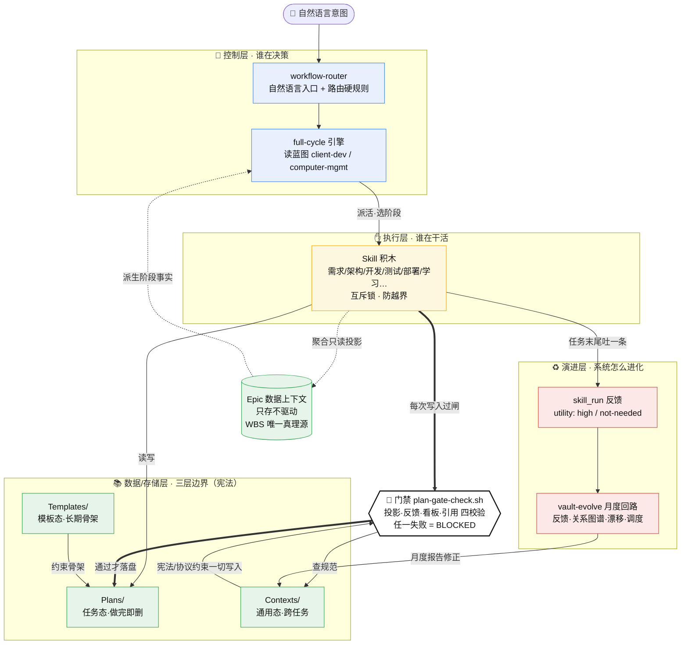

# AI-Work-Kit 运行时拓扑

> **本文定位**：一张浓缩整库灵魂的**运行时拓扑图**——一次任务在库里怎么跑起来，谁决策、谁干活、谁保质量、系统怎么进化。
> 抽象**分层**心智模型（四层如何咬合）走 [[Contexts/决策/AI-Work-Kit架构总览]] §二；本文只负责运行时**数据流**，不复述规则。两图互补：总览是静态分层，本文是动态跑起来。

---

## 一图流

---

## 怎么读（四个灵魂问题各走一条线）

1. **谁决策**（蓝）：用户意图 → `workflow-router` 按路由硬规则选 Skill → `full-cycle` 引擎读蓝图编排。Epic 用虚线**反哺**引擎派生阶段，但自己**不驱动**——「只存不驱动」是三层重构的核心。
2. **谁干活**（黄）：Skill 是唯一动手的层，读写 `Plans/`。互斥锁保证单阶段词不被劫持成全流程。
3. **谁保质量**（黑框 `🚦` = 贯穿机制①）：所有写入都得**过闸** `plan-gate-check.sh`——向左查 `Contexts/` 的协议规范，向上受 `Templates/` 骨架约束，四道校验任一失败即 BLOCKED。这是横向拦截。
4. **怎么进化**（红 = 贯穿机制②）：Skill 每次收工吐一条 `skill_run` 反馈 → `vault-evolve` 月度聚合 → 回流**修正 Contexts 的宪法/协议** → 协议又反过来收紧门禁。库自己体检、纠错、沉淀。

**两条贯穿机制的差异**一眼可见：门禁是**空间上的横切**（每次写入都拦），反馈回路是**时间上的纵贯**（跑得越久库越准）。

---

## 相关

- [[Contexts/决策/AI-Work-Kit架构总览]] — 抽象四层分层视角（本文的姐妹篇，讲咬合）
- [[Contexts/决策/Kit核心原则]] — 三层存储真相源
- [[Contexts/决策/AI-Work-Kit工作流总览]] — Skill 速查 + 看板 + 门禁
