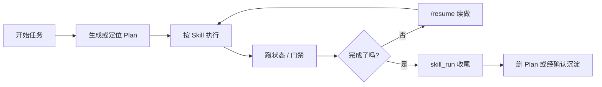

# 新手引导与最佳实践

## 先记住三句话

1. **开始任务**：直接说“开始/启动/做一个…”，让 `workflow-router` 选工作流。
2. **看卡点**：先看人话状态，再看底层 gate。
3. **继续任务**：永远用 `/resume plan=... 进度=...` 接回上下文。

---

## 第一次跑通

### 1. 打开 Vault

```bash
cd ~/git/AI-Work-Kit
```

用 Obsidian 打开本目录。AI 编辑器可以是 Cursor、Claude Code、Codex 或其它支持自定义 prompt / MCP 的工具。

### 2. 跑基础检查

```bash
python3 scripts/relations-check.py
python3 scripts/doc-script-refs-check.py
```

两条都通过，说明文档关系和脚本引用没有明显破损。

### 3. 启动看板

```bash
bash scripts/workflow-board-boot.sh
```

浏览器打开 `http://127.0.0.1:7777/`，看到看板即可。

---

## 日常三动作

| 你要做什么 | 入口 |
|------------|------|
| 开始一个新需求 / 新项目 | `开始...`、`启动...`、`workflow=client-dev` |
| 看当前卡点 | `python3 scripts/workflow-status.py --workflow client-dev --epic Plans/Epic/xxx.md` |
| 续做旧任务 | `/resume plan=Plans/.../xxx.md 进度=...` |

底层排查才用：

```bash
bash scripts/workflow-gate.sh --workflow client-dev --epic Plans/Epic/xxx.md --json
bash scripts/plan-gate-check.sh Plans/功能开发/xxx.md
```

---

## 任务分流

| 场景 | 走哪条 |
|------|--------|
| 新功能 / 含业务逻辑 | `workflow-router` → `client-dev` → Epic |
| Bug / 排查 | `bugfix` 或排查 plan |
| 纯 UI 小改 | `figma-ui` |
| 看 PRD / 需求评审 | `requirement-analyst` |
| 需求排序 / 确认 Backlog | `backlog-prioritization-assistant` |
| 架构方案 | `architecture-design-assistant` |
| 拆纵向 Story / 估故事点 | `task-splitter` |
| 按 Story 做 TDD 功能开发 | `feature-dev-assistant` |
| 全量集成测试 | `test-generator` |
| Code Review | `code-review` |
| PM 物料 / 配置对照 | `material-prep-assistant` |
| 日报 / 周报 / 复盘 | `report-assistant` |

---

## 最小闭环

client-dev 的业务闭环是：需求→排序→架构→纵向 Story/故事点→逐 Story TDD→全量集成→Done；不含发布。



---

## 高频命令

```bash
# 看工作流状态
python3 scripts/workflow-status.py --workflow client-dev --epic Plans/Epic/xxx.md

# 看底层门禁
bash scripts/workflow-gate.sh --workflow client-dev --epic Plans/Epic/xxx.md --json

# 写代码前 / 任务结束前
bash scripts/plan-gate-check.sh Plans/功能开发/xxx.md

# 关系图谱检查
python3 scripts/relations-check.py

# 文档脚本引用检查
python3 scripts/doc-script-refs-check.py

```

---

## 判断标准

这份引导只回答“下一步去哪”。如果某段内容开始解释为什么、列完整规则、保存历史过程，就不该留在本文。
