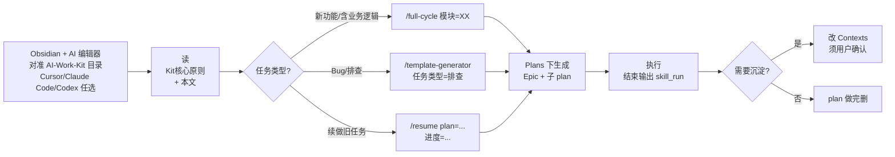
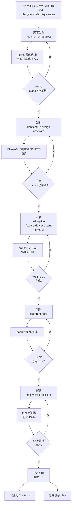
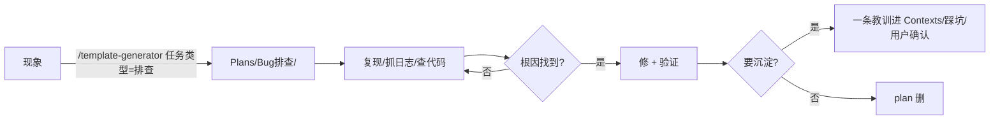

# 新手引导与最佳实践

> **自己复习用**·三张地图说尽全部路径与决策点。  
> 规则细节 → [[Kit核心原则]] · 命令清单 → [[AI-Work-Kit工作流总览]] · 字段格式 → [[Templates/模板约定]]。  
> 本文**只画路径**，不复述规则。

---

## 安装（0 → 1）

> AI-Work-Kit 是 **编辑器中性** 的：Obsidian 管沉淀；任意支持自定义 prompt + MCP 的 AI 编辑器（Cursor / Claude Code / Codex / 其它）管执行。

### 1. 克隆仓库

```bash
git clone <仓库地址> ~/git/AI-Work-Kit
cd ~/git/AI-Work-Kit
```

### 2. 装 Obsidian + 5 个插件

1. 下载 https://obsidian.md → "Open folder as vault" 选本目录
2. Settings → Community plugins → 关闭 Restricted mode → Browse 装并启用：

| 插件 | 必/选 | 干啥 |
|------|------|------|
| **Dataview** | 必 | 关系图谱视图、查询锦囊渲染 |
| **Templater** | 必 | `Plans/【分类】/` 新建文件自动套模板（配置见 [[Templater使用说明]]）|
| **Linter** | 推 | 保存时自动整理 frontmatter / 去 BOM（避免今天踩过的坑）|
| **Tasks** | 推 | 跨 plan 聚合 `- [ ]` 待办 |
| **Periodic Notes** | 推 | 周报/月度复盘按钮一键创建 |

### 3. 选一个 AI 编辑器（任选一个或多个并存）

| 编辑器 | Skill 安装 | MCP 配置 |
|--------|----------|--------|
| **Cursor** | `cp -r .cursor/skills/* ~/.cursor/skills/` | `cp .cursor/mcp.json.example .cursor/mcp.json` → 改里面的 vault 绝对路径 |
| **Claude Code** | `scripts/sync-claude-skills.sh --sync`（自动同步到 `~/.claude/skills/`）| `.claude/workflows/` 已配好；集成细节 [[Claude-Code集成AI-Work-Kit]] |
| **Codex / 其它 MCP-兼容** | 把 `Skills/*.md` 或 `.claude/skills/*/SKILL.md` 内容贴成自定义 prompt | 按编辑器 MCP 文档对接 `enquire-mcp` |

> Skill 真理源在 `Skills/*.md`（给人读）；`.cursor/skills/` 和 `.claude/skills/` 是 Agent 加载格式，由 `sync-claude-skills.sh` 保证三端一致。

### 4.（可选）启动月度 Vault 进化调度

```bash
cp scripts/com.aiworkkit.vault-evolve.plist ~/Library/LaunchAgents/
launchctl load ~/Library/LaunchAgents/com.aiworkkit.vault-evolve.plist
```

之后每月 1 号 10:07 自动跑全套报告 → `Contexts/决策/Vault进化报告-YYYY-MM.md`。

### 5. 验装

```bash
python3 scripts/relations-check.py   # 应输出 ✓ 关系图谱一致
python3 scripts/vault-evolve.py --dry-run --only relations,links
```

OK 就进 **地图 ①**。

---

## 地图 ① · 入门路径（第一次跑通）



**关键 3 句**：
1. 入口只有 3 个：`/full-cycle` · `/template-generator` · `/resume`。
2. plan 默认**做完删**；要沉淀必须显式说「存档到 Contexts」。
3. 任务结束必须输出 `skill_run` YAML（协议见 [[Skill反馈协议]]，校验跑 `scripts/plan-gate-check.sh`）。

---

## 地图 ② · 业务全流程（Epic 五阶段 + 门禁）



**门禁脚本统一入口**：每次切换阶段前跑 `scripts/plan-gate-check.sh <plan路径>`。看板：`scripts/full-cycle-boot.sh` → http://127.0.0.1:7777/

**每个阶段必跑校验**：
- frontmatter 字段（status / lifecycle_state / epic）
- 反馈块（skill_run YAML 存在 + utility 合法）
- 关系字段一致性（独立 `relations-check.py`）

---

## 地图 ③ · 决策树（我现在该用哪个 Skill）

```mermaid
flowchart TD
    Start{我现在要干什么?}

    Start -->|新功能 含业务逻辑| F1["/full-cycle 模块=XX<br/>建 Epic + 全流程"]
    Start -->|续做旧任务| F2["/resume plan=...<br/>进度=..."]

    Start -->|看 PRD / 评审需求| R["/requirement-analyst<br/>无论质量好坏都先走"]
    Start -->|有方案 要开发| A["/architecture-design-assistant<br/>架构方案"]
    Start -->|开发拆任务| TS["/task-splitter<br/>WBS 切片"]
    Start -->|写功能代码| FD["/feature-dev-assistant<br/>需 Epic"]
    Start -->|纯 UI 小改 ≤1人日| U["/figma-ui<br/>plan 在 功能开发/<br/>含业务逻辑=否"]

    Start -->|Bug 排查| B["/template-generator<br/>任务类型=排查"]
    Start -->|要变更影响分析| CIA["/change-impact-analysis"]
    Start -->|要测试方案| TG["/test-generator"]
    Start -->|要部署/发布| Dep["/deployment-assistant"]

    Start -->|学习 LLM| L["/learn-assistant"]
    Start -->|看学习进度| LA["/learning-audit-assistant"]

    Start -->|PM 配置对照表| PM["/material-prep<br/>→ Contexts/"]
    Start -->|日报 周报 月度复盘| Rev["/review-assistant"]

    Start -->|看进度看板| K["scripts/full-cycle-boot.sh"]
    Start -->|检查能否写代码| G["scripts/plan-gate-check.sh"]
```



**避坑 4 句**：
1. **PRD 质量差**也要先跑 `/requirement-analyst`——这是质量保险，不是质量证书。
2. **PM 物料**写 `Contexts/`，**不要**写业务仓 `docs/`。
3. **学习 plan** 做完可删；概念卡留 `Contexts/LLM学习/`（属通用知识）。
4. **Figma UI** 是「纯 UI ≤1 人日」的例外通道，含业务逻辑必走 Epic。

---

## 附录 A · 独立分支小图

### Bug 排查



### LLM 学习


### Figma UI（纯 UI 小改）


---

## 附录 B · Kit 自身演进的四个回路

> 这是工作流的「心跳监测」——让 Vault 自己告诉你哪些 Contexts 在工作、哪些在腐烂、哪些与代码脱钩、哪些该删该补。

| 回路 | 协议 / 脚本 | 触发时机 | 心跳粒度 |
|------|-----------|---------|---------|
| **反馈回路** | [[Skill反馈协议]] · `scripts/plan-gate-check.sh` · `scripts/feedback-aggregate.py` | 每个 Skill 结束 | 任务级 |
| **关系图谱** | [[关系图谱协议]] · `scripts/relations-check.py` | 改 frontmatter relations 后 | 结构级 |
| **漂移检测** | [[Contexts漂移检测协议]] · `scripts/drift-scan.py` | 周扫业务仓 | 时效级 |
| **Vault 进化调度** | `scripts/vault-evolve.py` · `scripts/com.aiworkkit.vault-evolve.plist` | 月度自动 / 手动 | 调度级（统一报告）|

### 自动化运行

| 节奏 | 脚本 | 安装 |
|------|------|------|
| **每月 1 号自动** | `vault-evolve.py`（合 5 节报告）| `cp scripts/com.aiworkkit.vault-evolve.plist ~/Library/LaunchAgents/ && launchctl load ~/Library/LaunchAgents/com.aiworkkit.vault-evolve.plist` |
| **手动跑全部** | `python3 scripts/vault-evolve.py` | — |
| **手动跑单节** | `python3 scripts/vault-evolve.py --only links` | 支持 `feedback` / `drift` / `relations` / `aging` / `links` |
| **预览不落盘** | `python3 scripts/vault-evolve.py --dry-run` | — |

**月度复盘自动化**：每月 1 号自动跑 → 写到 `Contexts/决策/Vault进化报告-YYYY-MM.md` → 月度复盘时打开并 review。

---

## 附录 C · 高频脚本速查

| 何时跑 | 脚本 |
|--------|------|
| 写代码前 / 任务结束前自检 | `scripts/plan-gate-check.sh <plan>` |
| 改 frontmatter `relations:` 后 | `scripts/relations-check.py` |
| 加新 Contexts/Templates/Skills 文件后 | `scripts/relations-check.py --write-dependents` |
| 月度复盘前（全套）| `scripts/vault-evolve.py` |
| 月度复盘前（仅反馈聚合）| `scripts/feedback-aggregate.py` |
| 周扫业务仓漂移 | `scripts/drift-scan.py` |
| 老化扫描 / 死链巡逻 | `scripts/vault-evolve.py --only aging` / `--only links` |
| 文档脚本引用一致性 | `scripts/doc-script-refs-check.py`（vault-wide）/ `... <plan>`（per-file，已接入 plan-gate-check）|
| 改 Skill 文件后（三端校验） | `scripts/sync-claude-skills.sh` |
| 真正同步到全局 `~/.claude/skills/` | `scripts/sync-claude-skills.sh --sync` |
| 启动 Epic 进度看板 | `scripts/full-cycle-boot.sh` |
| 启动指定 Epic 看板 | `scripts/full-cycle-boot.sh --epic Plans/Epic/xxx.md` |
| Epic 全阶段门禁 | `scripts/full-cycle-gate.sh --epic Plans/Epic/xxx.md` |
| 学习开/收尾 | `scripts/learning-progress-read.sh` / `snapshot.sh` |
| 刷新索引进度表 | `scripts/generate-pipeline-status.sh --write` |

---

## 附录 D · Obsidian 插件清单

| 插件 | 状态 | 用途 |
|------|------|------|
| Dataview | ✅ 必装 | 关系图谱视图 / 查询锦囊 |
| Templater | 装了未深用 | 文件夹自动套模板（高级）|
| Tasks | 推荐 | 跨 plan 聚合 `- [ ]` |
| Linter | 推荐 | 保存自动整理 frontmatter |
| Periodic Notes | 已装 | 周报/月报一键 |
| Advanced Tables | 推荐 | 表格 Tab 对齐（你的 plan 都是表）|

---

## 附录 E · 相关入口

- [[Kit核心原则]] — 真理源（放哪 / 不放哪 / 做完怎么办）
- [[AI-Work-Kit工作流总览]] — Skill 速查 + 看板 + 门禁
- [[Templates/模板约定]] — 文件名 / YAML / Epic 字段 / 续做格式
- [[Templates/查询锦囊]] — 5 条高频 Dataview
- [[Skills/README]] — Skill 索引
