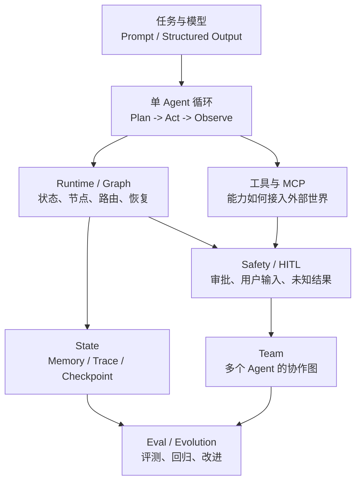

# 智能体开发学习知识图谱

> 用途：给智能体开发学习提供全局定位。它记录稳定的能力结构和学习进度，不记录每次编码过程；具体事实仍以对应 Plan 和代码测试为准。

## 全图

## 当前进度

| 能力域 | 状态 | 已建立的理解 | 证据 / 入口 | 下一问题 |
|---|---|---|---|---|
| 任务与模型 | 已实践 | LLM 输出先是候选数据；进入控制流前需要结构契约。 | `agent/capabilities/planning.py` 的计划 Schema；工具 `outputSchema` 测试。 | 如何为模型输出设计任务级 schema 与失败反馈？ |
| 单 Agent 循环 | 已实践 | 规划、行动、观察是策略；循环和状态流转可交给 runtime。 | `agent/langgraph_runtime.py`。 | 什么任务不值得进入多步骤循环？ |
| 工具与 MCP | 入门 | 本地工具已采用 MCP 风格 `content`、`structuredContent`、`isError`，但尚未接入真实 MCP client/server/transport。 | `agent/tools/registry.py`。 | MCP 的工具发现、调用与传输各解决什么？ |
| Runtime / Graph | 已实践 | Graph 负责节点、状态、条件边、暂停与恢复；业务策略不应被 Graph 吞掉。 | `agent/langgraph_runtime.py`、`agent/team_graph_runtime.py`。 | 何时单 Agent Graph 已足够，何时需要 Team？ |
| Safety / HITL | 已实践 | 审批、用户输入和未知执行结果都是中断类型；未知副作用必须交人工，不自动重试。 | `agent/capabilities/act.py`、相关离线测试。 | 如何把工具风险分类从示例规则演化为可审计策略？ |
| State | 已实践 | checkpoint 用于恢复状态，trace 用于审计，memory 用于跨任务经验；三者不互相替代。 | SQLite checkpoint、TraceStore、Memory。 | 长期 memory 如何检索、压缩和评测？ |
| Team | 已实践 | 角色是职责与观察视角，不是 Graph 的替代品；控制流仍属于 Team Graph。 | Planner / Predictor / Executor / Reviewer Team。 | 多角色何时带来实际收益，而非额外噪声？ |
| Eval / Evolution | 基础已具备 | 单元测试、固定分支和 trace 是起点；尚未形成任务集、评分器和回归门禁。 | `agent/tests/`、R3 trace。 | 怎样定义“任务完成且过程合规”的评测样例？ |

## 当前学习边界

`Runtime / HITL / checkpoint 恢复`支线已完成当前目标，除非出现真实 bug 或新需求，不继续增加中断类型、自动重试或恢复策略。

下一主题：**真实 MCP 工具接入**。目标不是马上接天气服务，而是先理解并跑通 MCP client、server、工具发现、`tools/call` 和结果协议；天气工具可作为后续受控案例。

## 学习节奏

每次学习只推进一个能力域，按以下闭环进行：

1. 定位：它在全图哪个节点，解决什么运行问题。
2. 概念：只回答一个核心问题。
3. 实践：做一个最小、可运行、可验证的切片。
4. 回图：更新本文件的状态、证据、已建立理解和下一问题。

连续深入两个问题后，先回到本图确认位置，再决定继续下钻还是切换能力域。

## 更新规则

- 状态只使用：`未开始`、`入门`、`实践中`、`已实践`、`待复盘`。
- 每次完成一个学习阶段，只更新对应表格的一行和“当前学习边界”。
- 记录稳定结论与可复核证据链接；详细过程、终端日志和一次性实现细节留在 Plan 或代码中。
- 新结论改变本图结构时，先补节点或边，再更新进度表。
