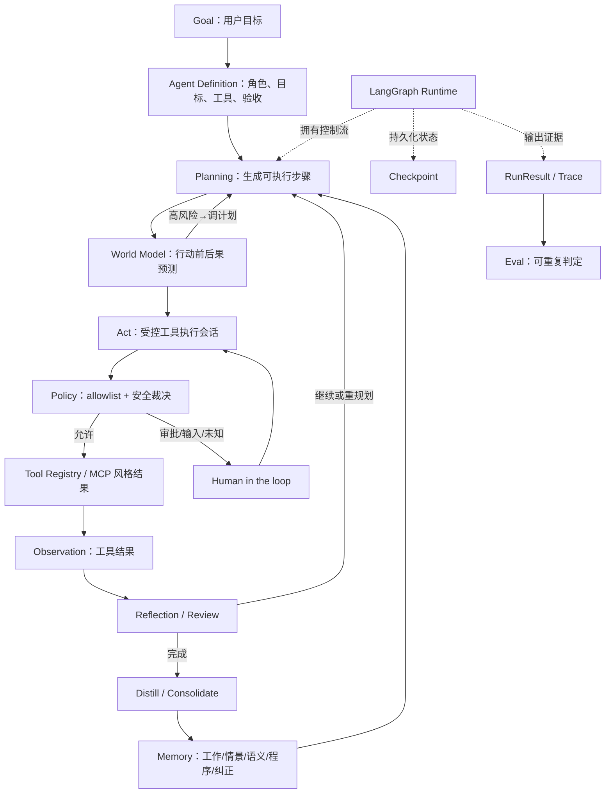
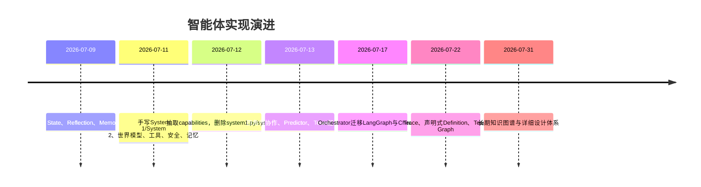

# 智能体开发知识图谱

> 长期入口：不是背诵组件清单，而是沿着“遇到问题—比较方案—作出设计—编码验证”的路径理解智能体。详细行为下钻到专题文档；学习过程仍留在 `Plans/学习循环/`，这里只保留可复用的问题解决链。

## 零、学习主线：架构是问题逼出来的


每个专题都必须回答五个“为什么”：</n+
1. 为什么普通LLM问答解决不了这个问题？
2. 为什么需要这个模块，而不是加一段Prompt？
3. 为什么模块边界画在这里？
4. 为什么选择当前方案，而不是另一个常见方案？
5. 什么测试能证明设计真的解决了原问题？

## 一、阅读顺序

| 如果你想知道 | 先读 |
|---|---|
| 全系统长什么样 | [[01-整体架构与模块边界]] |
| 一个任务如何跑完 | [[02-Agent-Loop与运行时流程]] |
| 上下文与长期学习如何工作 | [[03-上下文工程-RAG与记忆]] |
| 工具怎样安全执行 | [[04-Tool-MCP与执行模型]] → [[07-安全权限与Human-in-the-loop]] |
| 为什么能暂停、恢复、分叉 | [[05-State-Checkpoint与故障恢复]] |
| 单智能体和Team差在哪里 | [[06-多智能体编排与A2A]] |
| 如何证明系统可靠 | [[08-Trace-Eval与可观测性]] |
| 如何走向生产 | [[09-部署并发成本与生产保障]] |
| 一个概念对应哪个文件和测试 | [[10-架构代码测试映射]] |

### 推荐学习方式

不要按“读完十篇”衡量进度。每学一篇执行一次闭环：

1. 先只看“问题与约束”，自己画第一版方案。
2. 再看方案比较，说明自己方案会在哪个场景失败。
3. 对照最终架构，手写核心接口或状态模型。
4. 不看源码复述一次主流程和异常流程。
5. 运行或补写一个成功测试、一个失败测试。
6. 能解释取舍后，才把节点标为“已编码验证”。

## 二、证据状态图例

| 标记 | 含义 |
|---|---|
| `✅ 已实现` | 当前代码存在且路径已核对 |
| `🧪 有测试` | 有对应测试函数，但不等于本次环境已跑通 |
| `🏁 本次通过` | 2026-07-31在当前环境实际执行成功 |
| `🟡 部分实现` | 核心机制存在，生产能力或协议完整性不足 |
| `⬜ 参考设计` | 知识体系应覆盖，但当前代码没有实现 |
| `⚠️ 漂移` | 历史文档与当前代码或依赖不一致 |

## 三、核心知识关系



## 四、系统能力地图

| 能力节点 | 当前状态 | 关键实现 | 关键证据/缺口 |
|---|---|---|---|
| 声明式Agent Definition | ✅ 已实现 / 🧪 有测试 | `agent/agent_definition.py`、`definitions/`、`prompts/` | JSON字段、Prompt、工具名均校验；控制流不配置化 |
| 单智能体Agent Loop | ✅ 已实现 / 🧪 有测试 | `agent/langgraph_runtime.py` | load→plan→predict→act→reflect→memory |
| 多智能体Team Graph | ✅ 已实现 / 🧪 有测试 | `agent/team_graph_runtime.py`、`roles/` | 四角色共享 capability；handoff 当前是Trace证据 |
| 规划与计划调整 | ✅ 已实现 / 🧪 有测试 | `capabilities/planning.py` | 初始计划有Schema；`revise_plan`输出尚未完整Schema校验 |
| 世界模型 | ✅ 已实现 | `agent/world_model.py` | LLM预测后按非空risk筛选；缺确定性风险规则与评测集 |
| 工具执行会话 | ✅ 已实现 / 🧪 有测试 | `capabilities/act.py` | pending calls可Checkpoint；最多5轮工具调用 |
| 工具Schema与结果契约 | ✅ 已实现 / 🧪 有测试 | `tools/registry.py` | JSON Schema Draft 2020-12；采用MCP风格但不是完整MCP Server |
| 人工审批 | ✅ 已实现 / 🧪 有测试 | `interrupt_for_human`、`kind=approval` | 精确恢复同一Tool Call，拒绝后丢弃同轮后续调用 |
| 缺失信息询问 | ✅ 已实现 / 🧪 有测试 | 虚拟工具 `request_user_input` | 不生成action_id，不索取秘密 |
| 未知副作用处理 | ✅ 已实现 / 🧪 有测试 | `kind=unknown` | 人工确认已执行/未执行/仍未知，禁止盲重试 |
| Checkpoint与恢复 | ✅ 已实现 / 🧪 有测试 | SQLite Saver、resume/recover | fork只允许修改`steps`并重新预测 |
| Trace持久化 | ✅ 已实现 / 🧪 有测试 | `runtime.py`、`trace_store.py` | 原子替换JSON；失败降级为warning |
| 离线Eval | 🟡 部分实现 | `agent/tests/` | 43个测试函数；没有独立数据集、评分器和趋势报表 |
| 结构化记忆 | ✅ 已实现 | `memory.py`、`self_improve.py` | JSON文件；无租户隔离、向量检索、并发控制 |
| RAG | ⬜ 参考设计 | 无 | 当前`Memory.to_context()`是规则拼接，不是RAG |
| 真正MCP Client/Server | ⬜ 参考设计 | 无 | 只有MCP风格`CallToolResult/outputSchema` |
| 真正A2A协议 | ⬜ 参考设计 | 无 | Team只在同进程图中记录handoff |
| 生产服务与多租户 | ⬜ 参考设计 | 无 | 当前是本地CLI、单进程、文件/SQLite存储 |

## 四·五、问题到能力的映射

| 原始问题 | 如果只靠Prompt会怎样 | 被逼出的能力 | 下钻文档 |
|---|---|---|---|
| 长任务做到一半进程退出 | 从头重跑，可能重复副作用 | State、Checkpoint、Resume | [[05-State-Checkpoint与故障恢复]] |
| 模型会编造工具名和参数 | 运行时报错或越权 | Definition、Tool Schema、allowlist | [[04-Tool-MCP与执行模型]] |
| 删除/写入等操作风险高 | 模型一句话就产生不可逆后果 | Policy、Approval、Audit | [[07-安全权限与Human-in-the-loop]] |
| 工具超时，不知道是否已经执行 | 盲重试造成重复扣款/重复写入 | action_id、unknown interruption、人工核对 | [[04-Tool-MCP与执行模型]] |
| 模型输出看似合理但任务没完成 | 无法稳定判断质量 | Acceptance、Review、Eval | [[08-Trace-Eval与可观测性]] |
| 多个角色各写一套规划/执行逻辑 | 重复、漂移、难测试 | Capability复用、Role薄壳、Graph编排 | [[06-多智能体编排与A2A]] |
| 历史经验越积越长 | 上下文爆炸、错误经验污染 | 分型记忆、蒸馏、检索与遗忘 | [[03-上下文工程-RAG与记忆]] |
| 线上失败无法复现 | 只能看最终答案猜过程 | RunEvent、Trace、Checkpoint回放 | [[08-Trace-Eval与可观测性]] |

## 五、概念节点最小Schema

以后新增概念必须至少包含以下字段，避免图谱只有名词没有证据：

```yaml
id: action-execution-unknown
definition: 工具可能已经产生副作用，但调用方没有收到可确认结果
relations:
  produced_by: tool-adapter
  pauses: agent-run
  resolved_by: human-in-the-loop
design_docs:
  - Contexts/智能体开发/04-Tool-MCP与执行模型.md
code_refs:
  - agent/capabilities/act.py
test_refs:
  - agent/tests/test_act.py
evidence_status: 有测试
mastery: 已编码验证
last_verified: 2026-07-31
```

## 六、关系类型

| 关系 | 解释 | 示例 |
|---|---|---|
| `owns_control_flow` | 谁决定下一节点 | Runtime → Graph edges |
| `consumes` | 消费输入但不拥有 | Planning → Memory context |
| `constrains` | 对行动施加约束 | Definition/Safety → Tool call |
| `persists` | 保存状态或证据 | Checkpoint → State；Trace → RunResult |
| `resolves` | 处理暂停或不确定性 | Human → Interruption |
| `evaluates` | 根据标准判定质量 | Review/Eval → Run/Outcome |
| `implemented_by` | 概念对应代码 | Action Session → `act.py` |
| `verified_by` | 行为对应测试/运行证据 | Resume exact call → `test_runtime.py` |
| `supersedes` | 新结构替代旧结构 | capability+runtime → system1/system2 |

## 七、当前实现的演进主线



## 八、已确认漂移

1. Epic旧学习地图仍引用已删除的 `agent/system1.py`、`agent/system2.py`、`agent/team.py` 和 `agent/a2a.py`；现状应以 `capabilities/`、`langgraph_runtime.py`、`team_graph_runtime.py` 为准。
2. Epic早期掌握度仍有“智能体待实践/生疏”，与后续编码事实冲突；本图谱改用证据状态，不用单一主观熟练度覆盖事实。
3. `pyproject.toml` 未声明代码直接依赖的 `openai`；当前两套Python环境均无法直接运行测试。
4. 历史记录称若干测试通过，这是当时证据；2026-07-31只确认43个测试函数存在，未在本次环境复现通过。

## 九、维护协议

每次Agent代码或学习循环收口时：

1. 专题文档先更新真实行为、Schema、异常与代码映射。
2. 再更新本页节点状态、关系和`last_verified`。
3. 新增代码必须提供测试引用；无法验证时标记“有测试/待运行”，不得写“已通过”。
4. 参考设计与当前实现必须分段，不允许把未来能力写成现状。
5. 删除/重命名代码时运行链接与路径漂移检查，并更新Epic长期入口。
