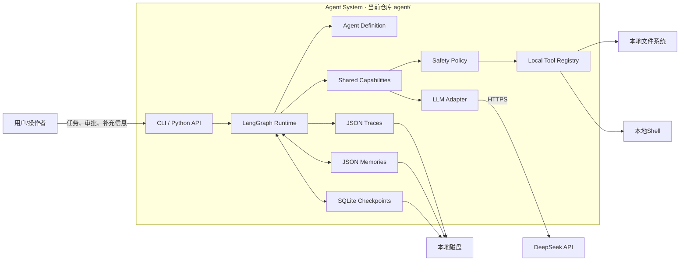
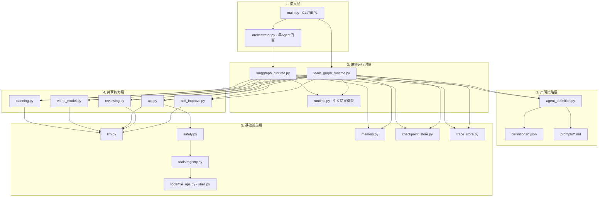

# 整体架构与模块边界

## 一、从问题开始

### 场景

用户给智能体一句“整理这些文件并生成报告”。模型需要读取目录、决定步骤、执行文件操作、发现信息不足时追问、遇到危险动作时暂停，并在进程重启后继续。

### 如果只写一个LLM循环

```python
while True:
    response = model(messages, tools)
    if response.tool_calls:
        execute(response.tool_calls)
    else:
        return response.text
```

它很快会暴露问题：

| 失败 | 根因 | 不能只靠Prompt修复的原因 |
|---|---|---|
| 模型规划了不存在的外部服务 | 模型不知道真实能力边界 | 权限和注册事实必须由代码校验 |
| 危险Shell直接执行 | 推理与授权混在一起 | 安全裁决不能交给被约束的模型 |
| 工具超时后直接重试 | 不知道副作用是否发生 | 需要持久action_id和未知状态 |
| 进程退出后从头开始 | 循环状态只在内存 | 需要durable checkpoint |
| 最终答案看似完整但未达标 | 没有独立验收 | 需要acceptance、review和eval |
| 单/多智能体各复制一套逻辑 | 身份、能力和控制流混在一起 | 需要模块边界与依赖规则 |

### 架构目标

因此系统必须把六类关注点分开：声明策略、控制流、认知能力、外部行动、安全裁决、状态与证据。

## 二、方案比较与决策

| 方案 | 优点 | 主要问题 | 结论 |
|---|---|---|---|
| 单文件Agent Loop | 最易开始、机制直观 | 状态/策略/工具耦合，难恢复和测试 | 只适合最小实验 |
| 每个角色自带完整能力 | 多Agent概念直观 | 规划、执行、安全重复实现并漂移 | 已被R1/R2重构淘汰 |
| 共享Capability + 两种Runtime | 能力只写一份，单/多Agent只差组装 | 图状态和接口设计更复杂 | 当前采用 |
| 完全声明式工作流DSL | 易配置、可视化 | 条件边、恢复和类型约束被藏进自制DSL | 当前不采用；Definition只声明策略 |

**核心决策**：Role定义“是谁”，Capability定义“会什么”，Tool定义“能对外做什么”，Runtime定义“下一步执行谁”，Policy定义“是否允许做”。

## 三、当前系统定位

当前 `agent/` 是一个**教学与架构验证用、本地单进程的Python智能体运行时**：

- 单智能体由 `LangGraphRuntime` 编排共享能力。
- 多智能体由 `TeamGraphRuntime` 编排Planner/Predictor/Executor/Reviewer四个角色。
- 两种运行时共享planning/act/reviewing、工具、安全、记忆与Trace契约。
- 默认调用DeepSeek兼容OpenAI Chat Completions接口。
- 状态持久化使用LangGraph SQLite Checkpoint，Trace和Memory使用本地JSON。
- 当前不是HTTP服务、MCP Server、A2A网络系统或多租户生产平台。

## 四、系统上下文图



### 信任边界

| 边界 | 左侧 | 右侧 | 风险 |
|---|---|---|---|
| 用户输入边界 | 用户 | CLI/Runtime | 任务歧义、恶意指令、敏感信息 |
| 模型边界 | Runtime | 外部LLM API | 数据外发、非确定输出、Schema漂移 |
| 工具边界 | Act/Policy | 文件与Shell | 不可逆副作用、越权、输出注入 |
| 持久化边界 | Runtime | 本地JSON/SQLite | 并发写、敏感数据、损坏与版本迁移 |
| 人工决策边界 | Interruption | 操作者 | 错批、过期决策、重复执行 |

## 五、容器/分层图



## 六、模块边界表

| 模块 | 职责 | 明确不负责 | 输入 | 输出/副作用 |
|---|---|---|---|---|
| `main.py` | 参数、REPL、人工决策采集、结果展示 | 业务规划和工具逻辑 | CLI参数、文本/JSON | 调用runtime、打印结果 |
| `orchestrator.py` | 单Agent稳定门面 | 图节点实现 | task/decision/checkpoint | `RunResult` |
| `agent_definition.py` | 加载并校验策略元数据与Prompt | 图控制流 | definition id、文件 | 不可变`AgentDefinition` |
| `langgraph_runtime.py` | 单Agent图、状态、路由、暂停恢复 | 具体能力算法 | task/Command/state | checkpoint、trace、memory |
| `team_graph_runtime.py` | 四角色图、交接证据、评审重试 | 跨进程A2A传输 | task/Command/state | handoff、checkpoint、trace |
| `capabilities/planning.py` | 计划、风险调整、评审后修订 | 执行工具 | task、memory、tools、feedback | steps/decision |
| `world_model.py` | 逐步骤后果与风险预测 | 最终安全授权 | steps、context | predictions/risky |
| `capabilities/act.py` | 可Checkpoint工具会话、人工中断、结果验证 | 决定全局步骤顺序 | step、context、definition | progress/action events/tool effects |
| `capabilities/reviewing.py` | 中途反思与终局独立评审 | 执行与持久化 | task、steps、results、acceptance | continue/replan/done或accept/revise |
| `self_improve.py` | 经验蒸馏、语义去重 | 直接决定何时触发 | task、steps、results、memory | facts/patterns/corrections |
| `safety.py` | 工具调用的最后策略裁决与审计 | OS沙箱、IAM、秘密管理 | tool、args | allow/deny/approval、内存日志 |
| `tools/registry.py` | 注册工具、暴露输入Schema、校验输出Schema | 执行编排 | name/schema/function/result | tool metadata/validated result |
| `memory.py` | 五类记忆读写与上下文渲染 | 向量检索、租户隔离 | entries/keyword | JSON文件/context text |
| `checkpoint_store.py` | 打开LangGraph SQLite Saver | 定义状态语义 | path | saver + connection |
| `trace_store.py` | 原子写入/回读规范化RunResult | 指标聚合和评分 | `RunResult` | versioned JSON trace |
| `llm.py` | DeepSeek客户端、普通/JSON调用、一次修复 | Prompt业务语义 | messages/tools | 标准化model result |

## 七、依赖规则

1. 接入层只能调用公开门面或runtime，不直接调用工具函数。
2. Runtime拥有节点和边；Definition只声明策略，不拥有控制流。
3. Role只持有身份并委派Capability；Role之间不直接互调。
4. Capability可以依赖LLM/安全/工具，但不得依赖CLI。
5. 工具实现不依赖Runtime状态；通过MCP风格结果返回。
6. Safety是最终裁决，Definition allowlist不是安全批准。
7. Checkpoint保存可恢复状态，Trace保存可审计证据，两者不可互相替代。
8. Memory提供历史上下文，不得被当作当前事实或权限来源。

## 八、单/多智能体的结构差异

| 维度 | 单Agent | Team Graph |
|---|---|---|
| 控制流 | 一个Runtime顺序调用能力 | 图节点调用四个角色薄壳 |
| 规划 | `planning.make_plan` | `Planner.make_plan`→同一planning |
| 预测 | `world_model.predict` | `Predictor.evaluate`→同一world model |
| 执行 | `act.start/advance` | `Executor`→同一act |
| 评审 | 每步`reflect` | 全部执行后`Reviewer.review` |
| 返工 | replan剩余步骤 | Reviewer打回→Planner revise→整轮重跑 |
| 协作证据 | 节点事件 | 额外记录handoff sender/recipient/intent |
| 能力代码 | 共用 | 共用 |

## 九、异常推演

| 场景 | 不分层时 | 当前架构中的责任归属 |
|---|---|---|
| 模型调用未授权工具 | 执行器可能直接查找并运行 | Definition过滤候选，Safety最终裁决 |
| 工具输出格式错误 | 脏数据进入下一轮模型 | Registry按outputSchema拒绝，Runtime失败收口 |
| Trace磁盘写失败 | 可能把业务成功误报失败 | TraceStore错误转warning，业务结果保持真实 |
| 人工拒绝第一个Tool Call | 后续同轮调用可能基于错误前提继续 | Act丢弃该模型轮次的后续pending calls |
| 操作者修改Checkpoint绕过审批 | 直接篡改pending state | recovery fork只允许修改`steps`并重新预测 |

## 十、代码与验证练习

1. 不看架构图，给`AgentDefinition`、`Runtime`、`Capability`、`Tool`、`Policy`各写一句职责和非职责。
2. 画出“写文件需要审批”的调用链，标明哪个模块有最终决定权。
3. 新增一个只读工具，说明应修改哪些文件、不应修改哪些Runtime文件。
4. 写一个失败测试：Agent定义包含未知工具时必须在启动期失败。
5. 解释为什么Checkpoint和Trace都保存状态信息，却不能合并成一个组件。

对应测试入口：`test_agent_definition.py`、`test_role_definitions.py`、`test_runtime.py`、`test_tool_results.py`。

## 十一、质量属性与当前边界

| 属性 | 当前机制 | 当前限制 |
|---|---|---|
| 可恢复 | SQLite checkpoint、resume/recover | 本地单库，无备份/迁移策略 |
| 可审计 | RunEvent、action_id、handoff、Trace JSON | 审计日志部分仅内存；无集中查询 |
| 安全 | allowlist、安全规则、人工审批、未知副作用处理 | Shell非沙箱；规则匹配有限；无IAM |
| 可测试 | 43个unittest函数、Fake Memory/LLM | 本次环境依赖缺失；无端到端在线模型测试 |
| 可扩展 | Definition、Tool Registry、runtime-neutral RunResult | Provider写死DeepSeek；注册表全局可变 |
| 一致性 | 工具输出Schema、计划Schema | 评审/预测/蒸馏输出未全部Schema校验 |
| 并发 | LangGraph State结构化 | SQLite连接、JSON与内存全局状态不适合多进程 |
| 成本 | 最大步骤/工具轮次/重试 | 无Token、金额、延迟预算与模型路由 |

## 十二、学习完成标准

达到以下条件才算理解整体架构：

- 能从一个新问题判断应该新增Tool、Capability、Policy还是Graph节点。
- 能解释单Agent和Team为什么共享能力但不能共享完全相同的控制流。
- 能指出当前架构在并发、沙箱、依赖管理和评测上的生产缺口。
- 能不看本文画出接入、策略、编排、能力、基础设施五层及依赖方向。

## 十三、参考目标边界

生产化时建议把当前单进程拆成：API Gateway、Agent Service、Durable Worker、Policy Service、Tool Gateway、Memory/Retrieval Service、Trace/Eval Pipeline。该目标拓扑详见[[09-部署并发成本与生产保障]]；在实现之前必须保持“参考设计”标签。
