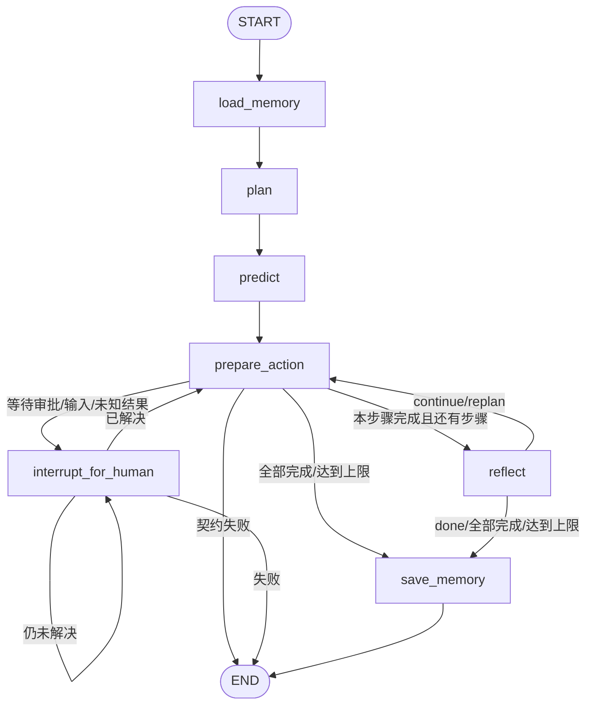
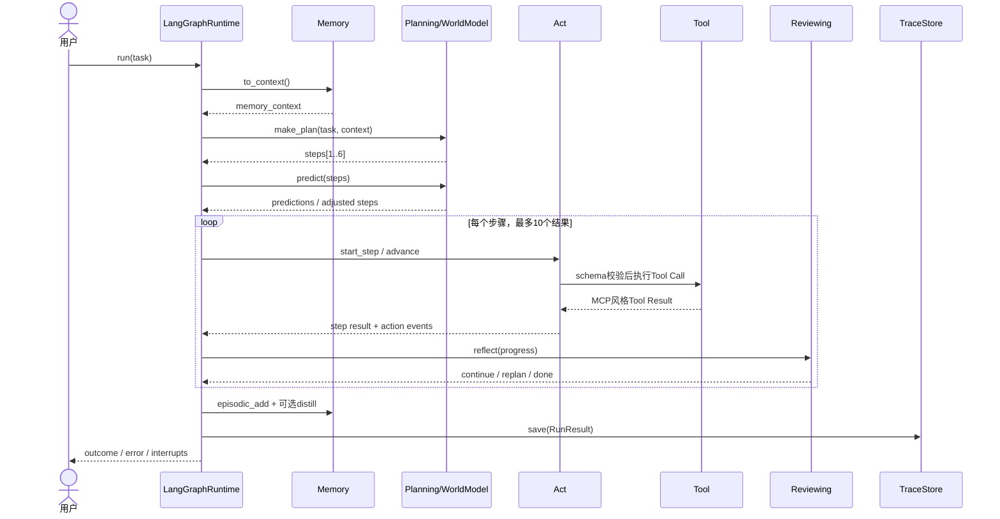

# Agent Loop与运行时流程

## 一、问题：模型只能回答一次，任务却要推进很多步

一个任务可能经历：理解目标、读取经验、拆计划、预测风险、调用多个工具、处理中断、检查进展、调整计划、保存结果。LLM单次调用既不知道当前处于哪一步，也不会自动保存执行状态。

### 最小while循环为什么不够

| 失败方式 | 示例 | 系统需要补什么 |
|---|---|---|
| 无限循环 | 模型反复调用同一工具 | 步骤/工具轮次/图递归上限 |
| 状态丢失 | 进程在审批时退出 | 可序列化State与Checkpoint |
| 副作用重放 | 恢复时再次写文件 | 精确保存pending Tool Call |
| 失败不可定位 | 只有最终“失败了” | 节点事件、结构化RunResult |
| 计划与执行混乱 | 模型一边规划一边扩大目标 | 节点边界与条件边 |
| 人工决策接不回去 | 审批后重新从头问模型 | interrupt/resume语义 |

## 二、方案空间

| 方案 | 优点 | 缺点 | 适用范围 |
|---|---|---|---|
| 手写while循环 | 最透明、代码少 | 恢复、分支、观测都要自建 | 1～2个无副作用工具的Demo |
| 固定DAG | 路径清晰、容易测试 | 不适合动态重规划和人工暂停 | 稳定的内容流水线 |
| 状态机/图运行时 | 分支、循环、Checkpoint显式 | State与Reducer设计复杂 | 长任务、工具副作用、HITL |
| 自主Planner生成工作流 | 灵活 | 可预测性和权限边界弱 | 受限沙箱内探索性任务 |

**当前决策**：控制流使用代码定义的LangGraph StateGraph；模型只能填充计划、预测和评审结果，不能动态改写图结构。

## 三、单Agent图



### 节点职责

| 节点 | 读取 | 写入 | 关键副作用 |
|---|---|---|---|
| `load_memory` | Memory | `memory_context` | 读取本地记忆 |
| `plan` | task/context/definition | `steps` | 调LLM并校验1～6步 |
| `predict` | steps/context | 可能改写`steps` | 调LLM预测风险，高风险时调整计划 |
| `prepare_action` | 当前step、results、session | result/session/interruption/failure | 工具调用、工作记忆写入 |
| `interrupt_for_human` | pending interruption/session | resolution或failure | LangGraph `interrupt()` |
| `reflect` | task/steps/results/acceptance | stop/lesson/steps | 继续、提前完成或重规划 |
| `save_memory` | task/steps/results/lesson | outcome | 情景记忆、经验蒸馏、清工作记忆 |

## 四、一次正常执行的时序



## 五、AgentState详细设计

| 字段 | 类型 | 初值 | 生产者 | 消费者 | 约束 |
|---|---|---|---|---|---|
| `task` | string | 用户输入 | `run` | plan/review/memory | 当前无非空校验 |
| `memory_context` | string | `""` | load_memory | plan/predict | 当前为拼接文本 |
| `steps` | list[string] | `[]` | plan/predict/reflect | prepare/review/memory | 初始计划1～6步；重规划后需保持可执行 |
| `results` | reducer list[string] | `[]` | prepare_action | reflect/save | 单Agent用`Annotated[..., add]`追加 |
| `has_lesson` | boolean | false | reflect | save_memory | replan强制true |
| `should_stop` | boolean | false | reflect | route | `done`时true |
| `outcome` | string | `""` | save_memory | runtime result | 默认最后一个result |
| `execution_session` | object | `{}` | act/runtime | act/HITL | 必须JSON可序列化 |
| `pending_interruption` | object | `{}` | act | HITL/router | kind∈approval/input/unknown |
| `action_events` | list[object] | `[]` | act | trace event | 当前字段不使用Reducer，保存最近更新 |
| `failure` | string | `""` | node/exception | router/result | 非空即失败收口 |

### 为什么State里同时有session、interruption和events

- `execution_session`回答“模型对话和pending Tool Call进行到哪”。
- `pending_interruption`回答“现在具体等待人做什么决定”。
- `action_events`回答“这次推进发生了哪些可审计行动”。

三者合并会让恢复状态、用户界面和审计证据互相污染。

## 六、核心算法伪代码

```text
run(task):
  创建 thread_id 与 run_id
  初始化 AgentState
  stream graph updates:
    每个节点更新 → RunEvent(completed)
    interrupt → RunEvent(paused) + 返回 paused RunResult
  读取最终 State
  if failure: 返回 failed RunResult
  else: 返回 completed RunResult
  无论成功/暂停/失败，尽力持久化 Trace

prepare_action(state):
  index = 已完成结果数
  if 没有执行会话:
    为 steps[index] 创建可序列化Action Session
  progress = advance(session)
  if interrupted: 保存session与interruption
  if contract_error: 写failure
  if done: 追加result并清空session
```

## 七、终止与预算

| 限制 | 当前值 | 作用 | 缺口 |
|---|---:|---|---|
| 初始计划长度 | 1～6步 | 抑制无界计划 | revise输出未同等严格校验 |
| 单Agent结果数 | `MAX_STEPS=10` | 限制重规划后的总执行 | 达到上限仍以最后结果作为outcome |
| 每步骤工具轮次 | `MAX_TOOL_ROUNDS=5` | 防止工具循环 | 返回“达到上限”，未分类为错误码 |
| 图递归 | `MAX_STEPS*2+10` | LangGraph硬兜底 | 与实际节点数是经验公式 |
| Team重试 | 默认3 | 限制Reviewer反复打回 | 当前条件使用`attempt > max_retries`，语义需测试锁定 |

## 八、公开接口契约

当前是真实Python契约，不是HTTP接口。

| 方法 | 输入 | 输出 | 失败方式 |
|---|---|---|---|
| `Orchestrator.run(task)` | string | outcome string | 失败抛`RuntimeError` |
| `run_with_trace(task)` | string | `RunResult` | 失败编码在`error` |
| `resume(thread_id, decision, parent_run_id)` | ID + 决策对象 | 新`RunResult` | Thread未知时`ValueError` |
| `checkpoint_history(thread_id)` | ID | `CheckpointInfo[]` | 空历史 |
| `recover(thread_id, checkpoint_id, state_patch)` | ID + 可选steps patch | 新`RunResult` | 非法patch/Checkpoint抛`ValueError` |
| `TeamGraphRuntime.run(task, max_retries)` | string + int | `RunResult` | 失败编码在`error` |

### RunResult语义

```json
{
  "run_id": "新执行实例ID",
  "thread_id": "跨暂停恢复保持不变的状态线ID",
  "parent_run_id": "触发本次恢复的上一个Run，可为空",
  "task": "原始任务",
  "outcome": "成功结果；暂停/失败时为空",
  "error": "业务失败原因；成功/暂停时为空",
  "warnings": ["非致命降级"],
  "interrupts": [{"id": "...", "value": {"kind": "approval"}}],
  "recovered_from_checkpoint_id": "可为空",
  "recovery_mode": "replay | fork | null"
}
```

## 九、异常推演

| 异常 | 捕获位置 | RunResult | 是否可恢复 |
|---|---|---|---|
| 规划返回非法JSON | `llm.chat_json`一次修复后失败 | `error` | 新Run重试或修Prompt |
| 计划不符合Schema | `_validate_steps` | `error` | 修模型/策略后新Run |
| Tool Result违约 | `act`/registry | `contract_error`→`error` | 修适配器后recover需谨慎 |
| 工具结果未知 | `act` | paused + unknown interruption | 是，人工核对 |
| 审批/信息缺失 | `interrupt()` | paused | 是，resume |
| Trace写失败 | `_persist_trace` | outcome不变 + warning | 业务无需；证据需补偿 |
| 节点未处理异常 | `_execute_graph` | `error` + failed event | 取决于Checkpoint |

## 十、学习练习与完成标准

1. 手写最小while Agent Loop，再列出它无法处理的三种恢复场景。
2. 不看源码重画单Agent图，并写出每条条件边的判断条件。
3. 给“达到工具调用上限”设计更明确的错误语义和测试。
4. 写一个测试证明暂停后resume不会重新调用LLM生成新的Tool Call。
5. 解释为什么Runtime捕获异常返回`RunResult.error`，而`Orchestrator.run()`又把它转成异常。

能独立实现`run → pause → resume → complete`并证明副作用不重放，才算真正理解Agent Runtime。
