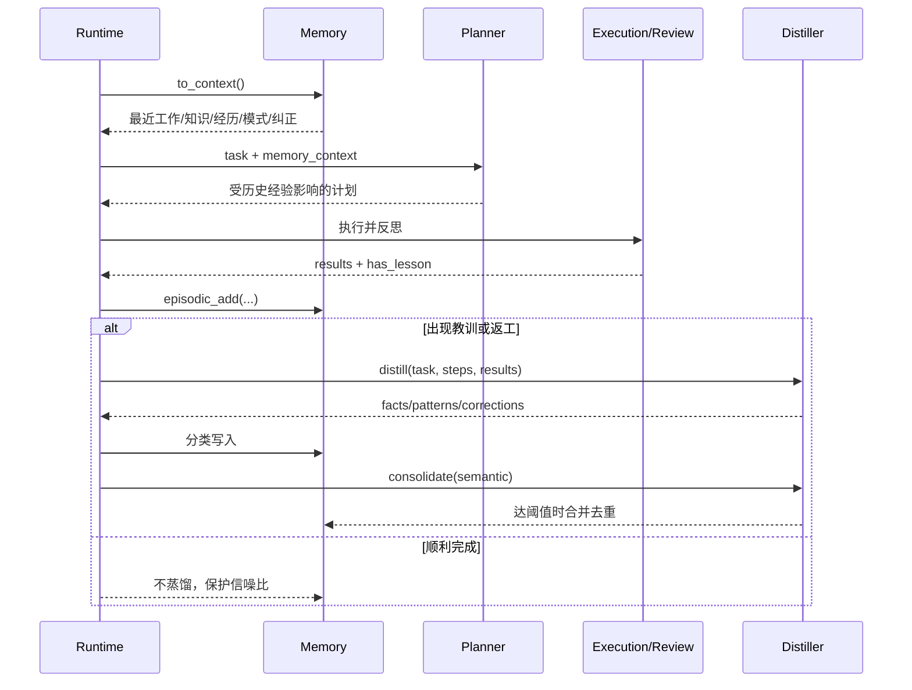

# 上下文工程、RAG与记忆

## 一、问题：聊天历史不是可靠记忆

把全部历史消息都塞给模型是最直觉的方案，但它会同时带来：上下文膨胀、旧信息干扰、错误经验反复出现、不同用户数据混合，以及“模型看过”却不知道哪条应该执行。

### 三类信息不要混为一谈

| 类型 | 回答的问题 | 示例 |
|---|---|---|
| 当前状态 | 这次任务进行到哪里 | 已完成步骤、pending action |
| 记忆 | 过去有哪些经验可复用 | 上次遇到超时不要盲重试 |
| 外部知识/RAG | 世界上或资料库里有哪些事实 | 产品文档、代码、制度 |

State由Runtime管理；Memory由学习策略管理；RAG由检索系统管理。三者都进入上下文，但生命周期和可信度不同。

## 二、方案比较

| 方案 | 优点 | 失败方式 | 当前选择 |
|---|---|---|---|
| 全量聊天历史 | 实现最简单 | Token增长、噪声、难删除 | 不采用 |
| 最近N条消息 | 成本可控 | 丢关键经验、无语义筛选 | 只适合短对话 |
| 分型JSON记忆 + 规则截取 | 机制透明、便于学习 | 检索粗糙、并发与隔离弱 | 当前采用 |
| 向量/混合RAG | 可从大量资料召回 | 需要切分、索引、重排、权限 | 参考目标，未实现 |
| 事件溯源 + 派生记忆 | 可追溯、可重建 | 架构复杂、成本高 | 生产化候选 |

**当前决策**：用五类结构化记忆展示“写入—筛选—拼装”的基本机制；不把它误称为RAG。未来外部知识检索应作为独立服务接入Context Builder。

## 三、当前记忆模型

| 类型 | 当前存储 | 上限 | 写入时机 | 进入上下文 |
|---|---|---:|---|---|
| Working | 进程内list | 无硬上限；渲染最近5条 | 每个step完成 | 最近5条summary；单Agent结束清空 |
| Episodic | `.memory/episodic.json` | 50 | Run结束 | 最近3个任务及outcome |
| Semantic | `.memory/semantic.json` | 100 | 经验蒸馏facts | 最近10条fact |
| Procedural | `.memory/procedural.json` | 50 | 经验蒸馏patterns | 最近5条触发模式 |
| Corrections | `.memory/corrections.json` | 50 | 经验蒸馏corrections | 最近5条“别踩/教训” |

### 数据结构

```json
{
  "working": {"step": "读取目录", "result": "...", "summary": "..."},
  "episodic": {"task": "...", "steps": ["..."], "results": ["..."], "outcome": "..."},
  "semantic": {"fact": "通用事实", "source": "原任务"},
  "procedural": {"pattern": "触发条件", "steps": ["操作1", "操作2"]},
  "correction": {"mistake": "错误做法", "lesson": "正确做法", "source": "原任务"}
}
```

## 四、记忆读写流程



## 五、为什么只在“有教训”时蒸馏

如果每次成功都写“成功完成任务”，语义记忆会被无价值事实淹没。当前使用硬/软信号：

- 单Agent：`reflect.has_lesson=true`或replan。
- Team：Reviewer曾打回，`has_review_rejection=true`。
- 达到20条Semantic时才调用LLM合并，平衡调用成本与去重收益。

这个策略仍有局限：顺利任务也可能产生高价值新知识；“是否值得记忆”需要独立评测，而不能永远依赖返工信号。

## 六、Context Builder当前实现

`Memory.to_context()`按固定顺序拼成文本：

```text
【工作记忆】最近5条summary

【已知知识】最近10条semantic fact

【近期经历】最近3个task: outcome

【已学会的操作模式】最近5条pattern

【踩过的坑】最近5条mistake → lesson
```

### 当前优点

- 透明：每条信息为何进入上下文一目了然。
- 有界：每类只取最近若干条。
- 分类表达：纠正记忆拥有更强提示格式。

### 当前问题

- “最近”不等于“相关”，没有语义召回或关键词筛选。
- 没有Token预算和逐段压缩。
- 记忆内容没有置信度、有效期、版本和权限标签。
- JSON写入无锁、无事务，Team完成后未清理working memory。
- 所有运行共享同一目录，没有用户/项目/租户隔离。
- 工具和网页中的恶意文本可能经蒸馏进入长期记忆，形成持久化Prompt Injection。

## 七、RAG参考设计（当前未实现）


### 文档Chunk最低字段

| 字段 | 用途 |
|---|---|
| `chunk_id` | 稳定引用与去重 |
| `document_id/version` | 版本与失效控制 |
| `text` | 召回内容 |
| `source_uri` | 引用与审计 |
| `tenant/project/acl` | 权限过滤 |
| `created_at/expires_at` | 新鲜度 |
| `trust_level` | 用户内容、内部制度、工具输出等可信度 |
| `embedding_model` | 索引兼容与重建 |

### RAG不应解决的问题

- 不负责保存图执行状态。
- 不负责授予工具权限。
- 不保证检索内容正确；仍需来源、时间和交叉验证。
- 不应该把秘密或无权限内容仅靠Prompt隐藏。

## 八、异常与污染推演

| 场景 | 风险 | 设计措施 |
|---|---|---|
| 错误事实进入Semantic | 长期重复误导 | source、置信度、人工纠正、版本/撤销 |
| 工具输出含“忽略规则” | 持久化Prompt Injection | 工具输出不可信标记，蒸馏前净化与评测 |
| 两进程同时保存Memory | JSON覆盖/损坏 | 生产改数据库事务或单写者 |
| 用户A读到用户B经验 | 数据泄露 | tenant/project分区与ACL |
| 旧制度比新制度更相关 | 过期答案 | version、effective_at、expires_at、重排新鲜度 |
| 召回内容过多 | 模型忽略关键证据 | Token预算、重排、多样性、摘要 |

## 九、验证设计

当前仓库没有独立Memory/RAG测试，这是明确缺口。至少应补：

1. 容量裁剪：Episodic第51条写入后只保留最近50条。
2. 去重：同一Semantic fact和Correction lesson不重复写入。
3. 生命周期：单Agent完成后Working清空；暂停时不能清空。
4. 相关性：无关的最新记忆不能挤掉相关旧记忆。
5. 隔离：不同tenant查询互不可见。
6. 注入：工具结果中的指令不能成为可执行长期规则。
7. 新鲜度：旧版本知识不得压过已生效的新版本。

## 十、学习练习与完成标准

1. 给“代码Review Agent”设计五类记忆各两条真实样例。
2. 实现一个关键词相关性选择器，替换单纯“最近N条”。
3. 写出Memory与RAG的接口边界，证明两者不是同一组件。
4. 为一条错误Semantic memory设计撤销和回溯流程。
5. 用20条候选上下文做Token预算，解释保留/删除依据。

能回答“什么应该进入上下文、为什么、可信度多高、何时失效、如何撤销”，才算掌握上下文工程，而不只是会接向量数据库。

