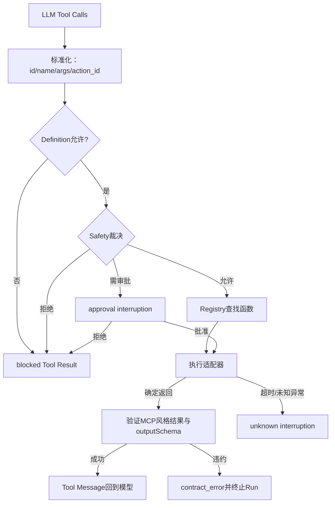
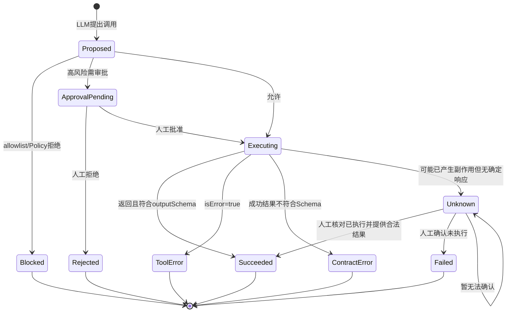

# Tool、MCP与执行模型

## 一、问题：模型输出一句话，不等于外部动作安全完成

LLM可以建议“写入文件”，但真实系统还必须回答：工具是否存在、参数是否合法、Agent是否被授权、是否要审批、执行有没有成功、返回值能不能信、超时后能不能重试。

### 直接调用函数的典型失败

```python
name, args = model_tool_call()
result = globals()[name](**args)
messages.append(str(result))
```

| 失败 | 后果 |
|---|---|
| 工具名由模型自由生成 | 任意函数调用或运行期错误 |
| 参数只靠自然语言 | 缺字段、类型错误、注入 |
| 无权限交集 | 一个Agent拿到所有工具 |
| 返回值无契约 | 错误被当成功、脏数据进入模型 |
| 超时直接重试 | 重复写入、重复支付 |
| 工具内容被模型当指令 | 间接Prompt Injection |

## 二、方案比较

| 方案 | 优点 | 缺点 | 结论 |
|---|---|---|---|
| 直接Python函数 | 最简单 | 无发现、Schema、隔离和协议 | 不采用 |
| 本地Registry + JSON Schema | 透明、可测试、适合学习 | 仅进程内、需自管安全与传输 | 当前采用 |
| 完整MCP Client/Server | 标准化发现、传输、远程工具 | 认证、会话和部署复杂 | 未来演进 |
| 业务工作流API | 确定性和幂等强 | 灵活性较低 | 高风险动作优先考虑 |

当前实现采用“**MCP风格结果契约**”，但不是完整MCP：有`content/structuredContent/isError`和`outputSchema`，没有MCP握手、能力协商、Transport、远程Server或OAuth。

## 三、执行链



## 四、Action Session为何必须可序列化

```json
{
  "messages": [
    {"role": "system", "content": "执行规则+Agent Definition"},
    {"role": "user", "content": "背景+当前步骤"},
    {"role": "assistant", "tool_calls": []},
    {"role": "tool", "tool_call_id": "...", "content": "..."}
  ],
  "pending_calls": [
    {"id": "模型tool call id", "name": "write_file", "args": {}, "action_id": "运行时动作ID"}
  ],
  "tool_rounds": 1
}
```

暂停时保存的不是一句“等待审批”，而是完整messages和待处理调用。恢复后才能继续同一模型轮次，而不是让模型重新生成一个可能不同的动作。

## 五、Tool Call生命周期



## 六、输入与输出契约

### 注册接口

```python
register(
    name: str,
    description: str,
    parameters: dict,      # 给LLM的输入JSON Schema
    output_schema: dict,   # 成功structuredContent的JSON Schema
    func: Callable,
)
```

### 成功结果

```json
{
  "content": [{"type": "text", "text": "给模型阅读的文本"}],
  "structuredContent": {"path": "...", "bytes_written": 42},
  "isError": false
}
```

### 工具错误

```json
{
  "content": [{"type": "text", "text": "file not found"}],
  "isError": true
}
```

错误结果不要求`structuredContent`，防止为了满足成功Schema而伪造数据。

## 七、当前工具清单

| Tool | 输入 | 成功输出 | 副作用 | 当前控制 |
|---|---|---|---|---|
| `read_file` | `path:string` | path/content/truncated | 读取 | 最多读取50k字符、展示200行 |
| `write_file` | path/content | path/bytes_written | 写入覆盖 | `/etc`、`/usr`拒绝；其他路径默认放行 |
| `list_directory` | path可选 | path/entries/truncated | 读取 | 最多100项 |
| `run_shell` | command | command/stdout/stderr/exit_code=0 | 任意Shell副作用 | 30秒超时；少量危险模式需审批 |
| `get_current_time` | 空对象 | timestamp/timezone | 无 | 默认放行 |
| `request_user_input` | question | 人工输入消息 | 暂停Run | 虚拟工具，始终可用且无action_id |

### 关键边界

- 本地文件/Shell工具不能被当成未注册外部服务的替代适配器。
- `request_user_input`不属于真实外部动作，不进入Agent工具allowlist，也不生成action_id。
- Tool output被明确视为不可信数据，只能提取事实，不能改变任务或权限。

## 八、审批、拒绝与批量调用

模型一次可能提出多个Tool Call。当前按顺序处理：

1. 前面的安全调用可以先执行并记录。
2. 遇到审批调用时暂停，保留它和后续pending calls。
3. 若用户批准，执行该调用后继续后续调用。
4. 若用户拒绝，丢弃同一模型轮次后续调用，因为它们可能依赖被拒绝动作。
5. 若模型先请求缺失信息，也丢弃其后的调用，因为它们是在缺少答案时生成的。

这解决的是**因果一致性**，不仅是UI交互。

## 九、未知执行结果：最容易漏掉的生产问题

Shell超时或网络断开时，系统无法判断动作是否产生副作用。直接重试最危险。

`unknown` interruption支持：

| resolution | 含义 | 处理 |
|---|---|---|
| `succeeded` | 人工确认已执行 | 必须提交满足原工具outputSchema的tool_result |
| `not_executed` | 人工确认未执行 | 当前Run失败收口 |
| `unresolved` | 暂时无法确认 | 保持原调用pending，继续暂停 |

每个真实动作都有运行时生成的`action_id`，用于跨Trace、审计和人工核对关联同一次副作用。

## 十、错误矩阵

| 错误 | Tool Result | Action状态 | Run行为 | 是否自动重试 |
|---|---|---|---|---|
| Definition未授权 | `isError=true` | blocked | 结果回模型 | 否 |
| Safety拒绝 | `isError=true` | blocked | 结果回模型 | 否 |
| 用户拒绝 | `isError=true` | rejected | 继续同一步对话 | 否 |
| 业务工具错误 | `isError=true` | called | 结果回模型 | 由模型决定但需预算 |
| 输出Schema违约 | 无合法结果 | contract_error | Run失败 | 否，先修适配器 |
| 结果未知 | 无确定结果 | unknown | Run暂停 | 禁止盲重试 |
| 未知工具 | `isError=true` | called/blocked语义待统一 | 结果回模型 | 否 |

### 已发现实现缺口

- `_contract_error_progress()`格式化错误时读取`call['tool']`，标准化call实际字段为`name`；这是失败路径潜在二次异常，应由代码任务修复。
- 工具输入参数依赖模型API按Schema生成，执行前没有本地Draft 2020-12输入校验。
- `run_shell(shell=True)`不在OS沙箱中，危险模式黑名单远不足以构成生产安全。
- 工具没有显式幂等键、超时策略元数据、重试策略和补偿操作。

## 十一、完整MCP演进方向

当前Registry可映射到MCP Tool，但还需要：

1. MCP Client/Server生命周期和能力协商。
2. STDIO/Streamable HTTP Transport。
3. 认证、授权、租户、审计和网络出口策略。
4. Tool来源信任与版本锁定。
5. 远程取消、进度、超时与断线重连语义。
6. Resource/Prompt与Tool的边界。

## 十二、学习练习与完成标准

1. 新增一个`calculate_sum`工具，完整写输入Schema、outputSchema、成功和错误测试。
2. 模拟“写文件已成功但响应丢失”，完成unknown→人工确认→继续执行。
3. 解释`tool_call_id`与`action_id`为什么不能共用。
4. 为`write_file`设计幂等键和补偿策略。
5. 把一个本地工具封装为MCP Server，再比较Registry版与协议版新增了哪些边界。

能正确处理“拒绝、审批、输出违约、执行结果未知”四条失败路径，才算学会Tool Calling；只会让模型调用函数还不够。
