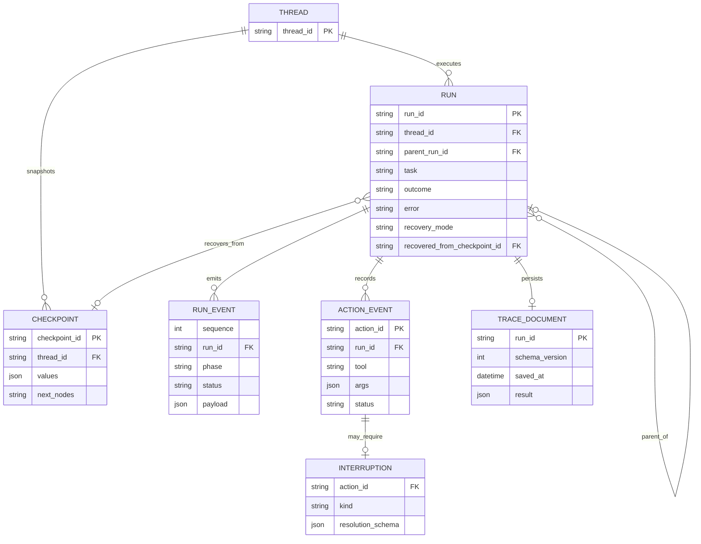
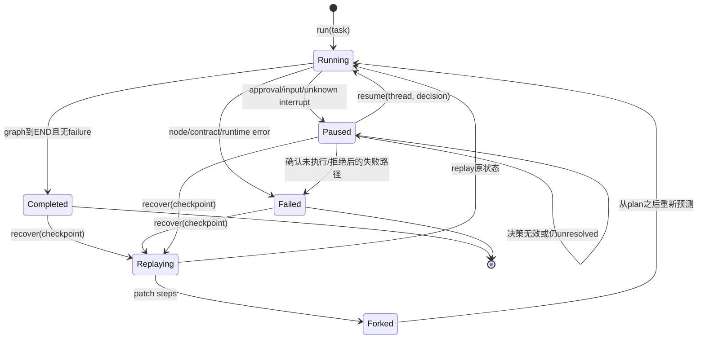
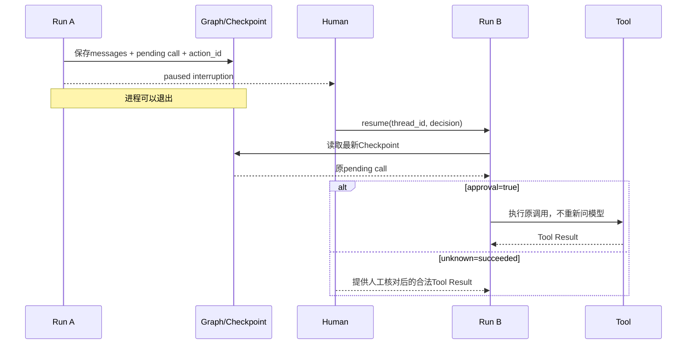

# State、Checkpoint与故障恢复

## 一、问题：长任务一定会中断，副作用却不能随便重放

进程退出、机器重启、人工审批等待数小时、工具超时、操作者想回到某个历史节点，这些都要求系统恢复。但“重新运行整个Prompt”可能重复删除、写入或发送动作。

### 先区分四个概念

| 概念 | 回答的问题 | 当前标识 |
|---|---|---|
| Thread | 哪一条持续演进的状态线 | `thread_id` |
| Run | 哪一次启动/恢复/回放尝试 | `run_id` |
| Checkpoint | Thread在某一图步骤的状态快照 | `checkpoint_id` |
| Trace | 某次Run实际发生了什么 | RunEvent序列/JSON |

一个Thread可以有多个Run；一个Run会经过多个Checkpoint；恢复会创建新Run但复用Thread。

## 二、方案比较

| 方案 | 优点 | 风险 | 结论 |
|---|---|---|---|
| 从头重跑 | 无状态系统最简单 | 重复副作用、成本高 | 有外部动作时禁止 |
| 只保存聊天消息 | 容易实现 | 不知道图节点、pending action和决策 | 不足 |
| 应用手写阶段表 | 可控 | 每个分支都要手工维护一致性 | 小工作流可用 |
| 图状态Checkpoint | 节点、next、state统一保存 | State必须可序列化且更新语义严谨 | 当前采用 |
| 完整事件溯源 | 可重建任意状态 | 复杂、存储与Schema演进成本高 | 生产候选 |

## 三、数据关系



## 四、当前持久化分工

| 数据 | 存储 | 生命周期 | 用途 | 不应该承担 |
|---|---|---|---|---|
| Graph State | `agent/.checkpoints/runtime.sqlite` | Thread级 | resume、recover、history | 长期分析与指标 |
| Run Trace | `agent/traces/{run_id}.json` | Run级 | 审计、回读、Eval输入 | 精确恢复图执行 |
| Memory | `agent/.memory/*.json` | 跨Run | 经验复用 | 当前任务状态 |
| Safety audit | 进程内list | 进程级 | 当前会话观察 | durable审计 |

Checkpoint和Trace看起来都记录过程，但语义不同：Checkpoint针对“接下来怎么继续”，Trace针对“刚才发生了什么”。

## 五、Run状态机



## 六、Resume、Replay、Fork的差别

| 操作 | 输入 | 是否修改历史状态 | 新Run | 典型用途 |
|---|---|---|---|---|
| `resume` | 最新Thread + 人工decision | 通过Command恢复interrupt | 是 | 审批、补信息、核对未知动作 |
| `recover` replay | 指定Checkpoint | 否 | 是 | 重放历史分支、排查问题 |
| `recover` fork | Checkpoint + `steps` patch | 创建新状态分支 | 是 | 人工修正计划后探索新路径 |

Fork当前只允许修改`steps`。Runtime调用`update_state(..., as_node="plan")`，使图从规划之后重新进入风险预测，避免操作者直接修改`pending_interruption/failure/results`绕过安全流程。

## 七、恢复接口与Schema

### 状态修补

```json
{
  "steps": [
    "先读取目标文件并确认内容",
    "获得审批后再覆盖写入"
  ]
}
```

约束：

- 只允许键`steps`。
- 值必须为字符串数组。
- 当前校验允许空数组和空字符串，低于initial plan的严格Schema；这是应补的边界。
- 不允许修改results、pending action、approval或failure。

### CheckpointInfo

```json
{
  "checkpoint_id": "LangGraph checkpoint id",
  "next_nodes": ["prepare_action"]
}
```

### 恢复元数据

| 字段 | replay | fork | resume |
|---|---|---|---|
| `parent_run_id` | 可选 | 可选 | 通常为暂停Run |
| `recovered_from_checkpoint_id` | 指定ID | 指定ID | 最新Checkpoint |
| `recovery_mode` | `replay` | `fork` | `replay` |
| `patched_fields` event | `[]` | `["steps"]` | 无 |

## 八、精确恢复Tool Call



核心不变量：`resume`不得让模型重新生成待审批动作；否则参数、action_id和副作用语义都会改变。

## 九、并发与一致性问题

当前SQLite连接使用`check_same_thread=False`，只解决同连接跨线程限制，不等于完整并发安全。生产环境还要解决：

- 同一Thread两个操作者同时resume的竞争。
- 决策提交重复、过期Checkpoint和乐观锁。
- Worker崩溃在“工具已执行、Checkpoint未写”之间的缝隙。
- JSON Memory与Trace的跨进程原子性。
- Checkpoint Schema升级和历史兼容。
- 数据保留、加密、备份与租户删除。

推荐决策令牌至少包含`thread_id + checkpoint_id + interruption_id/action_id + version`，服务端使用compare-and-set拒绝过期决策。

## 十、故障矩阵

| 故障点 | 已知状态 | 恢复策略 | 禁止行为 |
|---|---|---|---|
| LLM调用前崩溃 | 无新副作用 | 重跑节点 | 无 |
| LLM返回Tool Call后、保存前崩溃 | 调用尚未执行 | 重跑可能生成不同调用 | 不应假定参数相同 |
| Tool执行前已Checkpoint | pending call已知 | resume执行 | 不重新生成调用 |
| Tool执行后响应丢失 | 副作用未知 | unknown + 人工/幂等查询 | 禁止盲重试 |
| Tool结果已收、Checkpoint前崩溃 | 可能重放调用 | 需要幂等键/外部动作日志 | 仅靠本地State不够 |
| Trace保存失败 | 业务State可完整 | warning + 异步补偿 | 不默认篡改业务成功 |
| SQLite损坏 | Thread状态不可用 | 备份/恢复/灾备 | 不能用Trace直接无条件续跑 |

## 十一、验证证据

`agent/tests/test_runtime.py`覆盖：

- 正常完成与Trace持久化。
- replan与framework checkpoints。
- 规划失败结构化收口。
- Trace失败只产生warning。
- 审批恢复原Tool提案，不重启会话。
- 新Runtime从SQLite恢复。
- unknown和input中断。
- 无效人工决策保持中断。
- Tool output违约终止。
- Checkpoint replay与fork。
- fork禁止修改可绕过审批的State。

本次环境缺依赖，以上是“测试文件覆盖”，不是2026-07-31实际通过结论。

## 十二、学习练习与完成标准

1. 为“发送邮件”画出崩溃发生在五个不同时间点时的恢复策略。
2. 实现一个内存Checkpointer版pause/resume，再重启进程观察失败。
3. 给resume接口增加version，写两个并发审批只有一个成功的测试。
4. 解释为什么Trace不能直接替代Checkpoint恢复。
5. 给State Schema做一次字段迁移设计，保证旧Checkpoint可读。

能明确指出每个副作用前后系统“知道什么、不知道什么、允许怎么恢复”，才算掌握durable execution。
