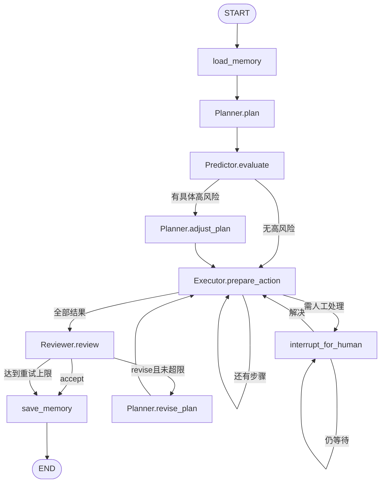
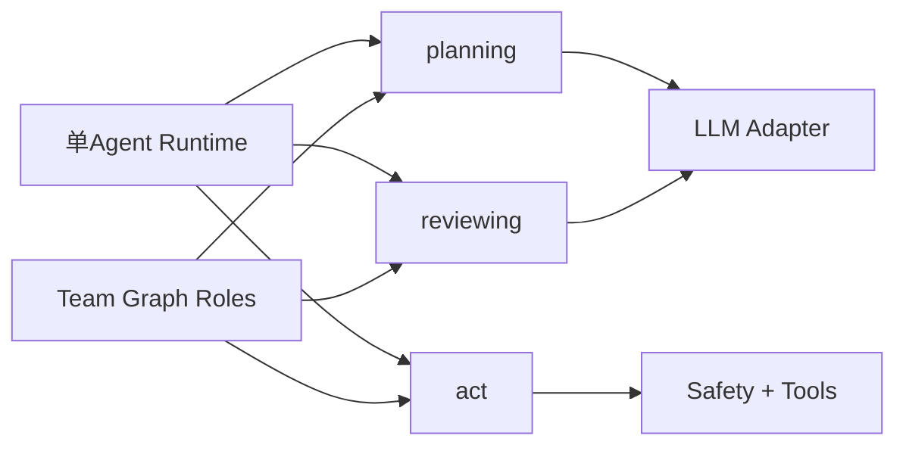
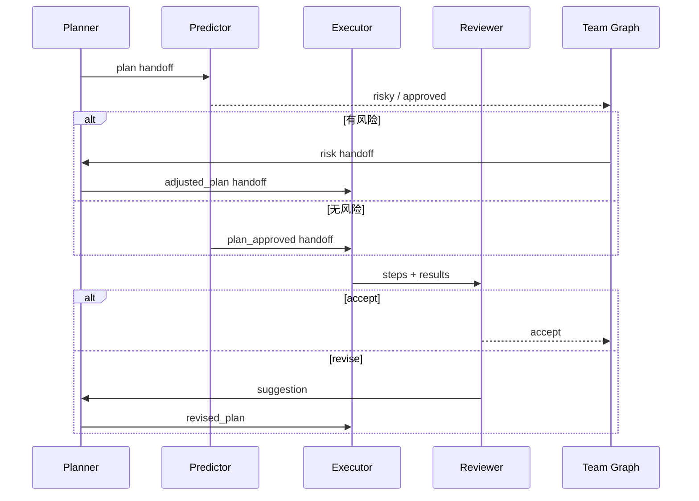

# 多智能体编排与A2A

## 一、问题：一个模型既规划、执行又审查自己，责任无法独立

多智能体不是为了把一次LLM调用变成四次，而是解决需要**独立上下文、独立责任或并行能力**的问题。例如执行者已经接受了自己的方案，再让它审查自己，容易重复原有假设。

### 不该使用多智能体的情况

- 任务能被一个确定工作流完成。
- 角色只换人设Prompt，没有独立信息或责任。
- 通信成本高于任务本身。
- 失败后仍由同一控制器无条件接受所有输出。

## 二、方案比较与演进决策

| 方案 | 优点 | 问题 | 结论 |
|---|---|---|---|
| 单Agent反思 | 成本低、状态简单 | 反思不独立 | 当前单Agent保留 |
| 每角色复制完整Agent | 直观 | planning/act/review重复并漂移 | 已淘汰 |
| Role薄壳 + Capability共享 | 独立身份与能力复用兼得 | Runtime需明确路由 | 当前采用 |
| MessageBus驱动同进程控制流 | 留痕直观 | 消息与路由逻辑重复 | 已迁移为Graph控制流 |
| 真正A2A网络协议 | 跨服务/框架协作 | 认证、发现、任务状态复杂 | 当前未实现 |

**当前决策**：LangGraph代码拥有路由；Role只加载自己的Definition并调用共享Capability；handoff只作为结构化执行证据，不是控制命令。

## 三、Team Graph



## 四、角色契约

| 角色 | 目标 | 可用工具 | 独立性 | 不负责 |
|---|---|---|---|---|
| Planner | 拆成1～6个可执行步骤 | 无 | 消费执行者工具清单但自己不执行 | 工具调用、最终验收 |
| Predictor | 逐步预测具体风险 | 无 | 在执行前独立判断 | 修改计划、授权动作 |
| Executor | 只执行当前批准步骤 | 5个本地工具 | 看步骤和已有结果，不负责全局决策 | 计划、风险授权、终审 |
| Reviewer | 根据任务/记录/验收接受或打回 | 无 | 没参与规划和执行 | 直接改计划或执行 |

Definition来自`definitions/*.json + prompts/*.md`；角色类约20～40行，只负责把Definition传给共享Capability。

## 五、共享能力为什么重要



安全修复、Tool output校验和Prompt Injection规则只需在`act.py`修一次，两种编排同时受益。单/多智能体真正应该不同的是责任分离和控制流，不是底层执行代码。

## 六、Handoff数据模型

```json
{
  "sender": "Planner",
  "recipient": "Predictor",
  "intent": "plan",
  "content": ["步骤1", "步骤2"]
}
```

当前handoff用途：

- 保存角色间责任转移证据。
- 在Trace中还原“谁把什么交给谁”。
- 不触发路由；下一节点由Graph edge决定。

`TeamState.handoffs`使用`Annotated[list, add]`累积，避免节点更新覆盖历史。

## 七、评审打回流程



Reviewer只给`suggestion`，Planner决定`tweak`还是`replan`。这保持了“评审不越权修改计划”的边界。

## 八、TeamState与重试语义

| 字段 | 作用 | 更新点 |
|---|---|---|
| `risky` | Predictor筛出的风险 | predict |
| `verdict` | accept/revise/reason/suggestion | review |
| `attempt` | 执行整轮次数 | 每轮第一个step开始 |
| `max_retries` | Reviewer打回预算 | run输入，默认3 |
| `has_review_rejection` | 是否出现可蒸馏教训 | review拒绝时永久true |
| `handoffs` | 协作证据累计 | plan/predict/adjust/review/revise |
| `results` | 本轮完整结果 | 每步直接构造新列表；revise时清空 |

当前`attempt > max_retries`才停止，意味着命名“max_retries”和“最多尝试次数”容易混淆。应以测试锁定期望：例如`max_retries=3`究竟允许1次初始+3次返工，还是总共3次。

## 九、为什么这还不是真正A2A

真正跨系统A2A还需要：

- Agent发现与能力描述。
- 认证授权、服务身份和信任域。
- Task/Message/Artifact的协议状态。
- 异步任务、取消、流式更新和超时。
- 跨进程幂等、重试、去重和投递保证。
- 不暴露内部Memory/Tool实现的边界。

当前Team角色在同一Python进程、同一Graph State内运行，handoff是领域事件/Trace，不是网络消息协议。

## 十、异常推演

| 场景 | 当前处理 | 风险/改进 |
|---|---|---|
| Predictor把泛化不确定性都判高风险 | Planner反复调计划 | 需要预测评测集与具体风险规则 |
| Reviewer永远打回 | 达重试上限后保存最后结果 | outcome可能仍不达标，应明确失败/部分成功 |
| Planner revise输出非法steps | 当前缺完整Schema校验 | 与initial plan统一校验 |
| 角色Definition配置未知工具 | 启动加载失败 | 正确，fail fast |
| Executor暂停等待审批 | Team Checkpoint保存同一session | resume不重放提案 |
| Handoff content过大 | 全量进入State/Trace | 需要摘要、Artifact引用和大小预算 |

## 十一、验证与练习

当前测试覆盖安全直达、风险调整、Reviewer打回、重试上限、Trace降级、暂停恢复和未知动作。

学习练习：

1. 先用单Agent完成“写报告”，列出它在哪一步需要独立Reviewer。
2. 新增Researcher角色，但能力必须来自共享Capability，禁止复制Tool Loop。
3. 设计两个可并行节点，说明它们为何不共享可变State。
4. 将handoff改为跨进程消息时，补齐task id、幂等键、超时和认证字段。
5. 证明多Agent质量提升大于额外模型调用成本，否则退回单Agent。

能说明“独立性从哪里来、控制权在哪里、共享什么、不共享什么”，才算理解多智能体。

