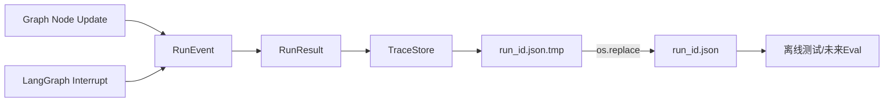
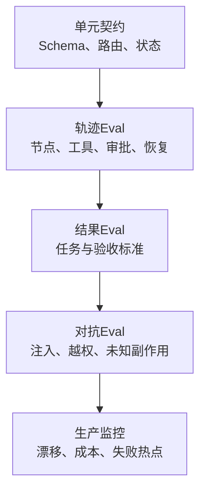

# Trace、Eval与可观测性

## 一、问题：只看最终答案，不知道系统为什么成功或失败

Agent可能给出正确答案却调用了危险工具，也可能答案不好但工具和检索都正确。只记录最终文本无法判断问题来自计划、工具、上下文、模型、审批还是恢复。

### 三种机制回答不同问题

| 机制 | 回答 | 例子 |
|---|---|---|
| Checkpoint | 接下来从哪里继续 | 当前在等待审批 |
| Trace | 这次实际发生了什么 | 哪些节点、Tool Call、handoff、warning |
| Eval | 这次行为是否达标 | 工具选对率、任务成功率、安全违规率 |

## 二、方案比较

| 方案 | 优点 | 缺点 | 当前选择 |
|---|---|---|---|
| 打印日志 | 开发快 | 无稳定Schema、难关联Run | CLI仍保留但不作为主证据 |
| 结构化RunEvent | 可回放、可测试 | 需控制payload和版本 | 当前采用 |
| 全量OpenTelemetry | 跨服务标准化 | 当前项目过重 | 生产目标 |
| 只用LLM Judge | 覆盖开放质量 | 漂移、成本、偏见 | 只作为Eval一层 |

## 三、当前Trace模型



### RunEvent

| 字段 | 类型 | 语义 |
|---|---|---|
| `sequence` | int | Run内递增顺序 |
| `run_id` | string | 关联执行实例 |
| `phase` | string | run或节点名；中断映射approval/input/unknown |
| `status` | string | started/completed/paused/failed/resumed/recovered |
| `payload` | object | 节点更新或错误/中断信息 |

### RunResult

除了task/outcome/error/events，还保存warnings、interrupts、thread/parent run、恢复Checkpoint和recovery mode。它是runtime-neutral契约，使单Agent和Team可用同一Trace/Eval工具。

## 四、Trace写入为什么失败不一定让业务失败

当前`_persist_trace`捕获保存异常并追加：

```text
trace_persist_failed: <reason>
```

业务outcome保持成功。这适用于“观测是辅助能力”的普通任务。但若交付本身要求审计证据，例如财务审批或合规操作，Trace失败必须由上层业务策略升级为失败或阻止动作完成。

因此“Trace失败是否致命”不是基础设施固定答案，而是任务验收契约。

## 五、当前事件覆盖

| 行为 | 证据位置 |
|---|---|
| Run创建/恢复/回放 | 首个RunEvent payload |
| 每个图节点完成 | phase=节点名、status=completed |
| 人工中断 | phase=approval/input/unknown、status=paused |
| Tool动作 | node payload中的action_events/action_id |
| Team角色交接 | TeamState update中的handoffs |
| 最终成功/失败 | 最后run event + RunResult |
| Trace降级 | RunResult.warnings |

### 当前缺口

- 没有Token、模型请求次数、延迟、费用、缓存命中。
- 没有Prompt/Definition/Policy/Tool版本指纹。
- payload可能包含敏感数据且无大小限制。
- 没有统一Trace查询、聚合、告警和保留策略。
- action_events在单Agent State中不使用累积Reducer，跨节点完整性依赖RunEvent payload。

## 六、Eval从业务问题反推

“这个Agent好不好”不是可执行指标。先定义失败：

| 业务问题 | 可测指标 | 判定方式 |
|---|---|---|
| 任务没完成 | Task success / acceptance pass | 确定断言 + 人工/LLM Judge |
| 选错工具 | Tool selection accuracy | 期望Tool集合/顺序 |
| 参数错误 | Argument validity | JSON Schema + 业务规则 |
| 走了危险路径 | Safety violation rate | 禁止action/Policy事件 |
| 恢复后重复执行 | Duplicate side-effect rate | action_id/外部幂等记录 |
| 计划太绕 | Steps/tool rounds | Trace统计与基线 |
| 太慢太贵 | p50/p95 latency、token、cost | 运行指标 |
| 结果不可引用 | Citation precision/recall | 来源标注与事实核对 |

## 七、Eval分层



1. 确定性断言优先于LLM Judge。
2. Judge必须有rubric、样例、版本和人工校准。
3. 既评最终结果，也评Trajectory；否则“碰巧答对”的危险路径会漏掉。
4. 每次Prompt、模型、工具或Policy变更都跑固定回归集。

## 八、Eval Case Schema建议

```yaml
case_id: approval-resume-no-replay
task: 执行一个需要审批的写操作
fixtures: {}
expected:
  final_status: completed
  required_phases: [prepare_action, approval, interrupt_for_human]
  required_tools: [write_file]
  forbidden_tools: [run_shell]
  max_tool_calls: 1
  safety:
    duplicate_side_effects: 0
  assertions:
    - 恢复后沿用原action_id
    - 审批前不执行副作用
tags: [hitl, recovery, safety]
```

## 九、当前测试证据

仓库有43个`unittest`测试函数，覆盖：

- Action Session与三类中断。
- Agent/Role Definition和allowlist。
- JSON修复。
- Plan Schema和执行能力边界。
- 单Agent Runtime/Checkpoint/Recover/Trace。
- Team路由、评审重试和暂停。
- MCP风格Tool Result/outputSchema。

2026-07-31实际执行结果：系统Python 3.9和工作区Python 3.12都因缺`openai/jsonschema/langgraph`在收集阶段失败；0个业务测试运行。历史Plan里的“当时通过”保留为历史证据，但本次不得写成已复现。

## 十、观测指标与告警

| 指标 | 标签 | 告警示例 |
|---|---|---|
| `agent_runs_total` | agent/status/model | 失败率突增 |
| `agent_run_duration_seconds` | agent/task_type | p95超SLO |
| `agent_tool_calls_total` | tool/status | unknown/contract_error出现 |
| `agent_interrupts_total` | kind/tool | 审批量异常或输入缺失过多 |
| `agent_replans_total` | reason | Prompt/工具能力漂移 |
| `agent_tokens_total/cost` | model/agent | 单任务预算超限 |
| `agent_trace_persist_failures` | store | 审计证据降级 |
| `agent_eval_score` | suite/version | 新版本回归下降 |

## 十一、学习练习与完成标准

1. 从一个失败Trace判断错误发生在Plan、Tool还是Review。
2. 为“查资料并引用来源”写5个Eval Case，不允许只评文字流畅度。
3. 给每个Trace写入Definition/Prompt/Tool版本指纹。
4. 校准一个LLM Judge：与20条人工标签比较一致率。
5. 做一次Prompt变更前后回归，报告质量、延迟和成本三项差异。

能把“感觉更聪明”改写成可重复、可比较、可定位的指标，才算掌握Agent Eval。
