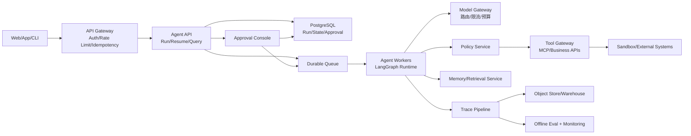
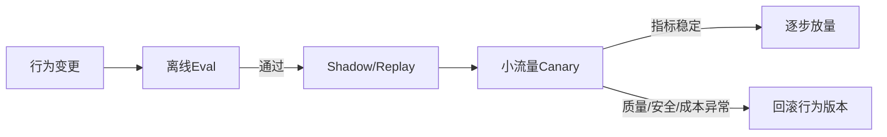

# 部署、并发、成本与生产保障

> 本篇是从当前本地原型走向生产的参考设计；除“当前基线”外，不代表仓库已实现。

## 一、问题：本地跑通不等于生产可用

当前CLI一次由一个人操作，数据写本地JSON/SQLite。生产环境会同时出现多个用户、多个Worker、长时间审批、模型限流、工具故障、版本发布和合规删除。

### 原型直接上线会发生什么

| 原型假设 | 生产现实 | 后果 |
|---|---|---|
| 一个进程 | Worker随时重启/扩缩容 | 内存audit丢失 |
| 一个用户 | 多租户并发 | Memory/Trace串数据 |
| 本地文件 | 容器临时磁盘 | Checkpoint和Trace丢失 |
| 无重复请求 | 网络重试普遍存在 | 同一任务/动作重复 |
| 模型一直可用 | 限流、超时、价格变化 | 队列堆积、成本失控 |
| Prompt改完即生效 | 行为变化难预测 | 线上回归和安全风险 |

## 二、目标方案比较

| 方案 | 优点 | 风险 | 适用 |
|---|---|---|---|
| 单体API + 数据库 | 改造最小 | 长任务占连接、扩展有限 | 内部小流量 |
| API + Durable Worker + Queue | 解耦请求与长任务、可恢复 | 基础设施增加 | 推荐生产起点 |
| 微服务拆分每个能力 | 独立扩缩容 | 分布式复杂度过早 | 规模/合规逼迫后 |
| Serverless每节点 | 弹性 | 冷启动、状态和工具连接复杂 | 短节点、突发任务 |

## 三、参考生产拓扑



## 四、服务边界

| 服务 | 职责 | 数据所有权 |
|---|---|---|
| API Gateway | 身份、租户、限流、请求幂等 | 请求元数据 |
| Agent API | 创建Run、查询状态、提交决策 | Run/Thread索引 |
| Worker | 执行图节点、保存Checkpoint | 短期执行租约 |
| Model Gateway | Provider路由、重试、Token与费用 | 模型调用日志 |
| Policy Service | 权限、风险、审批规则版本 | Policy/decision |
| Tool Gateway | 工具发现、输入输出、超时、幂等 | Action状态 |
| Memory/Retrieval | 分区记忆、知识检索、ACL | Memory/Index |
| Trace/Eval | 证据、指标、回归、告警 | Trace/Eval dataset |

## 五、并发控制

### Thread单写者

同一Thread同一时刻只允许一个Worker推进。可用数据库lease：

```text
claim(thread_id, expected_version, worker_id, lease_until)
```

更新Checkpoint使用乐观锁；version不匹配说明另一个Worker或人工决策已推进，当前结果必须放弃。

### Action幂等

```text
idempotency_key = tenant_id + thread_id + action_id + tool_version
```

Tool Gateway在执行副作用前持久化`prepared`，执行后记录`succeeded/failed/unknown`。重试先查询该键，不直接重复调用外部系统。

## 六、队列与重试

| 错误 | 是否重试 | 策略 |
|---|---|---|
| 模型429/临时5xx | 是 | 指数退避+jitter+预算 |
| Tool确定未执行的连接失败 | 可 | 仅幂等工具自动重试 |
| Tool结果unknown | 否 | 查询外部状态或人工处理 |
| 输入/输出Schema错误 | 否 | 修模型输出或适配器 |
| Policy拒绝 | 否 | 返回业务结果 |
| Worker失租 | 否/重新claim | 旧Worker结果不得提交 |
| Trace暂时失败 | 异步重试 | 审计必需任务阻止完成 |

## 七、成本与延迟预算

一次Agent Run成本近似：

```text
总成本 = Σ模型输入输出Token成本 + Tool/API成本 + 检索/存储成本 + 重试成本
总延迟 = 关键路径上的模型延迟 + Tool延迟 + 排队 + 人工等待
```

控制手段：

- 每Run最大模型调用、Token、费用、工具轮次、墙钟时间。
- 简单分类/校验用小模型，复杂规划和评审按需升级。
- 缓存稳定Prompt前缀、检索结果和幂等Tool结果。
- 可并行且无共享写的节点并行；不要为了并行破坏因果顺序。
- HITL等待不占用Worker，靠Checkpoint和队列唤醒。

## 八、SLO示例

| 指标 | 示例目标 | 说明 |
|---|---|---|
| Run创建可用性 | 99.9% | 不等于最终任务成功 |
| 非HITL任务p95 | < 60s | 按任务类型分桶 |
| Checkpoint成功率 | 99.99% | 有副作用工作流更高 |
| 重复副作用率 | 0 | 关键安全指标 |
| unknown action人工处理时间 | p95 < 30min | 需要告警与工单 |
| Trace完整率 | >99.9% | 审计任务要求100% |
| Eval回归门槛 | 核心集不得下降 | 同时看成本和延迟 |

## 九、多租户与数据治理

所有Run、Checkpoint、Memory、Trace、Tool credential都必须携带`tenant_id/project_id/user_id`并在存储层强制过滤。还需要：

- 静态/传输加密和KMS。
- PII/Secret脱敏与最小日志。
- 数据保留、导出和删除流程。
- Region与跨境约束。
- Tool credential按租户和用途隔离。
- Model Provider数据使用/保留策略。

## 十、发布与回滚

Agent行为版本至少包含：代码、模型、Prompt、Definition、Tool Schema、Policy、Memory/Retrieval配置。



回滚不能只回代码；若Prompt/Policy/Tool Schema变化，必须能恢复整个行为版本。历史Checkpoint恢复时还要兼容旧版本或固定到原版本Worker。

## 十一、当前到目标的差距

| 领域 | 当前 | 生产目标 |
|---|---|---|
| 接入 | CLI/Python API | Authenticated API + Approval UI |
| 状态 | 本地SQLite | Durable DB/Graph state service |
| 记忆 | 共享JSON | 分区数据库+检索+ACL |
| Tool | 本地函数/Shell | Tool Gateway/MCP+沙箱+幂等 |
| 并发 | 单进程假设 | lease/版本/队列/多Worker |
| 观测 | 每Run JSON | 集中Trace、指标、告警、Eval |
| 依赖 | pyproject不完整 | 锁定依赖、镜像、SBOM、扫描 |
| 灾备 | 无 | 备份、恢复演练、RPO/RTO |

## 十二、学习练习与完成标准

1. 把当前CLI改画成API+Queue+Worker时序，标出每次持久化位置。
2. 设计两个Worker同时resume同一Thread的冲突测试。
3. 为一个支付Tool写幂等状态表和unknown恢复流程。
4. 给一次Prompt发布设计Eval→Canary→Rollback门禁。
5. 估算一个10万Run/月系统的模型、存储和人工审批成本。

能设计“重启不丢、并发不重、越权不做、成本可控、版本可回滚”的运行体系，才算进入生产级Agent工程。

