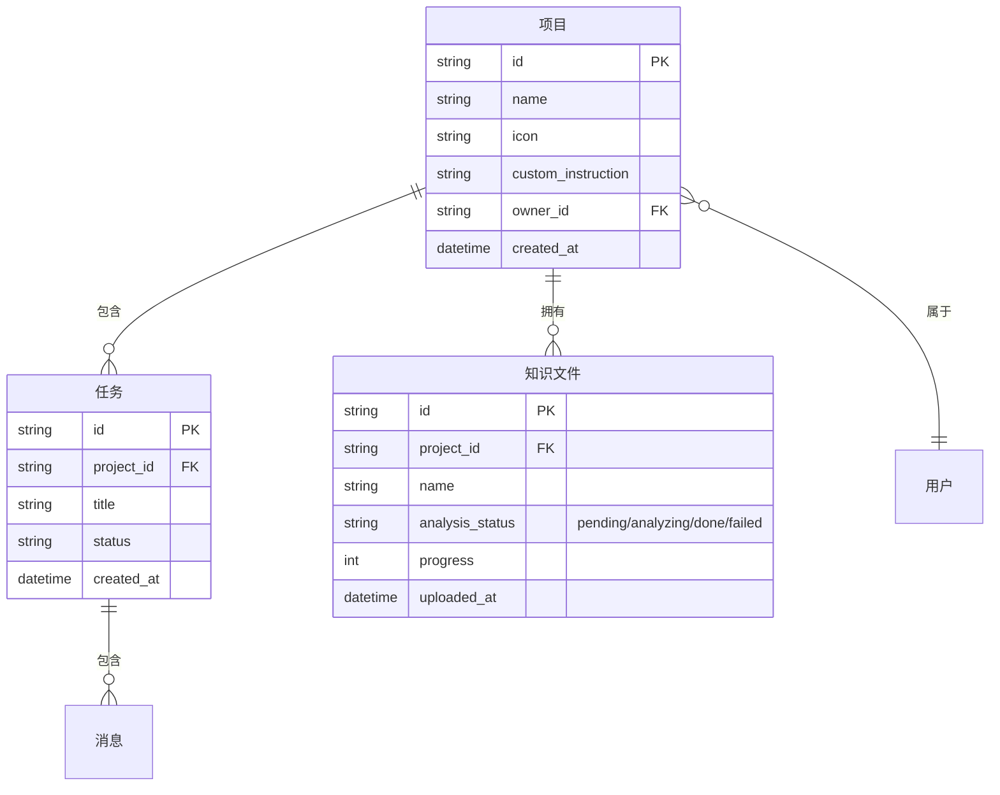
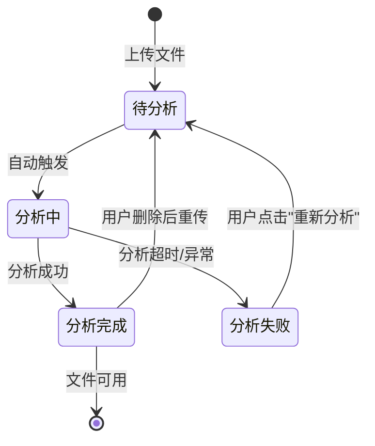
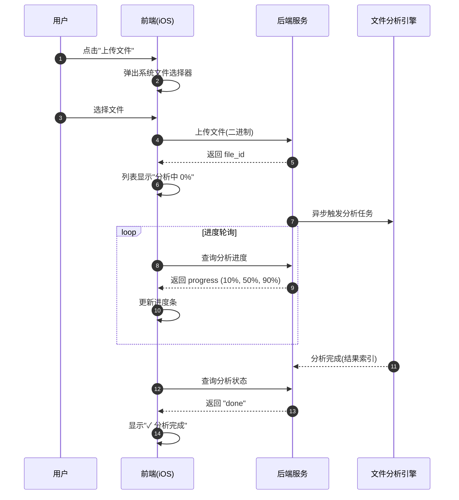

# 业务逻辑梳理与图表

> 梳理业务逻辑不是一上来就画界面，而是**先理逻辑、再画图、后写代码**。四张图画清楚，往往胜过几十行表格。
>
> 上游方法论：[[需求分析规范]]（这是「细节层 How」的核心落地手段）。

---

## 一、核心理念：四步法

| 步骤 | 要回答的问题 | 产出图 |
|------|-------------|--------|
| ① 找实体 | 这个功能涉及哪些"东西"？（用户、订单、项目、文件…） | 实体关系图（ER 图） |
| ② 定状态 | 每个实体从生到死会经历哪些阶段？ | 状态机图（State Machine） |
| ③ 画流程 | 谁（角色/系统）在什么条件下做了什么？ | 泳道/时序图（Swimlane/Sequence） |
| ④ 拆交互 | 用户进入后的完整路径与所有判断分支？ | 决策流程图（Flowchart） |

**做完这四步，业务逻辑才算"梳理清楚了"**，才能进入数据字典和验收标准阶段。

> **选图原则**：
> - 需要理清数据表结构 → ER 图
> - 单个对象状态变化复杂 → 状态机图
> - 有多个角色/系统参与、关注调用顺序 → 泳道图 / 时序图
> - 用户路径分支多、判断点多 → 决策流程图

---

## 二、四种图的标准用法（Mermaid 模板）

所有图均可用 Mermaid 写在 Markdown 里直接渲染。

### 图1：实体关系图（ER 图）—— 找"有什么"

理清功能涉及的核心数据对象及其关系。开发看到它就知道要建几张表、表之间怎么关联。



### 图2：状态机图 —— 理"生命周期"

理清核心对象从创建到销毁的所有状态，以及什么动作触发状态变更。测试用例就是沿着状态机一条条走。



### 图3：泳道/时序图 —— 画"谁干什么、按什么顺序"

把不同角色（用户、前端、后端、第三方）在同一业务流程中的动作、调用顺序、参数与返回画出来。API 设计和联调全靠它。



### 图4：决策流程图 —— 拆"用户路径与判断分支"

当用户路径分支多、判断点多时，用 `graph TD` 把"正常操作到底 + 各分支"画全。每个菱形判断都要有「是/否」两条出线。

```mermaid
graph TD
    subgraph 用户侧
        A[用户进入项目Tab] --> B{是否有项目?}
        B -->|无| C[展示空态插画 + 创建按钮]
        B -->|有| D[展示项目列表]
    end

    subgraph 创建项目分支
        C --> E[点击"创建第一个项目"]
        D --> F[点击右上角"+"]
        E --> G[弹出创建弹窗]
        F --> G
        G --> H{名称是否为空?}
        H -->|是| I["创建"按钮置灰]
        H -->|否| J["创建"按钮可点]
        J --> K[点击创建]
        K --> L[调用后端创建接口]
        L -->|成功| M[关闭弹窗 + 跳转项目详情]
        L -->|失败| N[Toast "项目创建失败"]
    end
```

---

## 三、梳理完业务逻辑的检查清单

画完图后逐项自检；**任何一项没打勾，说明业务逻辑还没理透，需要补图。**

| 检查项 | 说明 | 是否完成 |
|--------|------|----------|
| 核心实体已识别 | ER 图中实体 ≥ 1 个，关系已标注 | ☐ |
| 主要状态已定义 | 状态机图里每个实体的状态数 ≥ 2 个 | ☐ |
| 主路径已画 | 流程图覆盖了"用户正常操作到底"的完整路径 | ☐ |
| 异常分支已画 | 图中明确标出"失败/超时/空"等分支 | ☐ |
| 系统边界清晰 | 时序图/泳道图明确区分前端、后端、第三方职责 | ☐ |
| 决策节点完整 | 决策图里所有菱形判断点都有"是/否"两条出线 | ☐ |
| 反向路径明确 | 用户怎么退出/返回/取消，已在图中体现 | ☐ |

---

## 四、为什么用图而不是堆表格

四张图（ER + 状态机 + 时序 + 决策流程）合在一起，往往比几十个文字矩阵表更精准、更完整、更容易对齐：

- **开发**看 ER 图就知道建表，看时序图就知道接口顺序。
- **测试**沿状态机和决策图逐条走，自然得到测试用例。
- **产品**看决策流程图能直接确认"分支齐不齐"。

一份分析若已能用四张图讲清，就不必再堆砌表格——避免 [[需求分析规范]] 第七节说的"过度解读、堆砌问题数"。

---

## 相关

- 方法论规范：[[需求分析规范]]
- 分析清单：[[PRD分析检查清单]]
- 输出模板：`Templates/需求分析-带验收标准模板.md`
- Skill：`Skills/requirement_analyst.md`
