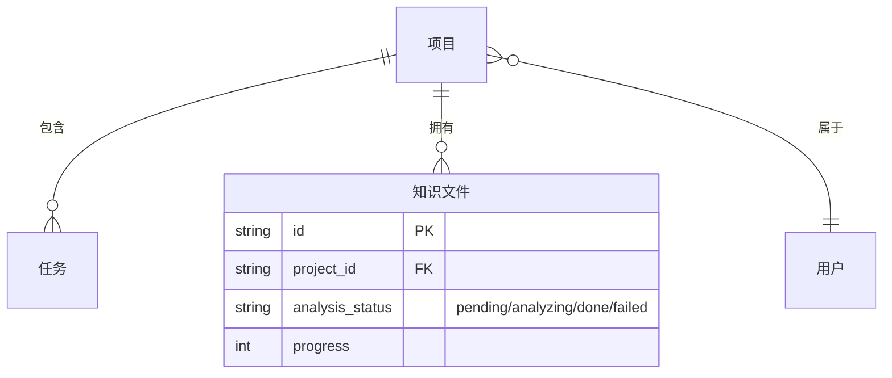
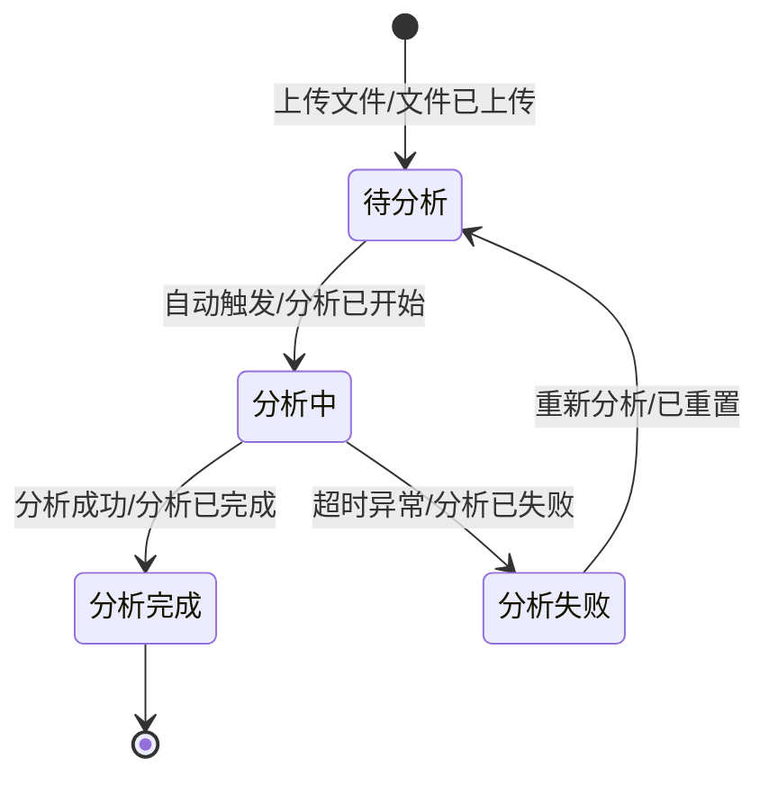
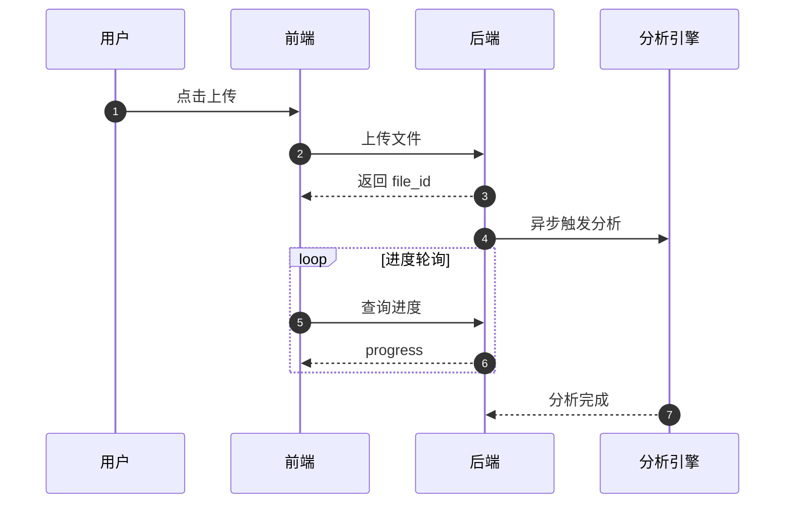
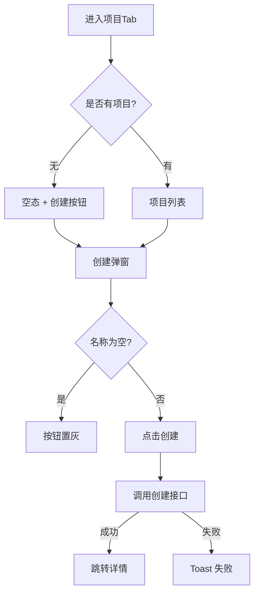

# 需求分析规范

> **本文是需求分析这套工作流的唯一方法论源**——整体思想、三层面、事件建模、四图、逐类检查项、分卷输出全在这里。改方法只改这一处。
>
> 目标：开发前把"产品想要什么"翻译成"团队理解一致、可执行、可验收"的明确产物，避免"我以为"和"你做出来"之间的差距。
>
> 配套：门禁字段 [[需求分析产出标准]] · 问题样例 [[示例-创建自动化任务-PRD问题模式]] · 输出模板 `Templates/需求分析-带验收标准模板.md` · Skill `Skills/requirement_analyst.md`。

---

## 〇、整体思想：事件驱动

> **一句话**：先用「业务事件」还原真相，再翻译成人能对齐、机器能验收的契约。

**事件链是贯穿全卷的唯一脊柱**——人类卷讲事件的人话流程，AI 底稿用事件链推导模型/边界/遗漏，AC 锚定事件。**链闭环 ⇒ 需求完整。**

```text
业务事件（过去式，真相单元）
   ↑ 由谁触发              ↓ 谁守规则              ↓ 留下什么
 命令（要做的动作）   聚合（不变条件/业务规则）   状态迁移 + AC 锚点
```

| 产物 | 与事件的关系 |
|------|-------------|
| 人类卷「关键业务时刻」 | 事件按时间排成一条人话流程线 |
| 底稿 事件风暴表 | `命令 → 聚合/不变条件 → 事件` |
| 底稿 状态机 | **每条迁移挂一个事件**；无事件的迁移=漏命令 |
| 遗漏检查 | **事件链闭环**：哪个事件无命令触发？哪个命令无结果事件？ |
| 可测 AC | **每条锚定一个事件**（Then 即「某事件已发生」） |

> 这把「事件建模的收敛」与「单一可信源」合为一件事：所有产物挂同一组事件，天然一致。

---

## 一、三层面：Why / What / How

拿到任何需求，按此顺序组织，**不要一上来就画界面或写代码**。

| 层面 | 要回答的问题 | 产出物 |
|------|-------------|--------|
| **战略层（Why）** | 解决什么痛点？不做会怎样？带来什么价值？ | 一句话目标 + 量化指标（如错误率 30%→1%）|
| **范围层（What）** | 做哪些功能？明确不做哪些？ | Epic/Feature 清单 + 排除项 |
| **细节层（How）** | 事件、流程、字段、边界、验收 | 事件风暴 + 四图 + 数据字典 + AC + 异常矩阵 |

> 先讲"为什么做"，再讲"做到什么算好"，最后讲"具体怎么做"——对齐目标后再看细节。跳过 Why 直接讲 How，评审会变成"该不该做"的争论。

---

## 二、工作流程

```
1. 获取输入        2. 三层面对齐        3. 事件建模+五手段      4. 逐类挑问题       5. 分卷输出       6. 评审确认
   (PRD/口头)   →   (Why/What/How)  →   (事件链+四图+表)   →   (逻辑/交互/遗漏) →  (人类卷+底稿)  →  (复述拉齐)
```

- **输入**：PRD（飞书/Word）或口头描述；口头需求先整理成文字草稿再分析。
- **何时做**：收到 PRD/口头需求 → **先** `/requirement-analyst`；P0 未闭环（含关键遗漏）→ **不**进 `/feature-dev-assistant` 写代码。
- **分析七步**：① 摘要复述（防误读）② 入口矩阵 ③ 字段规则 ④ **事件建模+四图（阻断关卡，图全才往下）** ⑤ 逻辑扫描 ⑥ 交互扫描 ⑦ 遗漏扫描。
- **产出**：存档 `Plans/需求分析/YYYY-MM-DD-模块名.md`；AC 单独成表供 QA。
- **确认**：评审会上让开发**复述**要做什么、测试列 3~5 个测试点，复述正确才算通过。

---

## 三、事件驱动建模 + 四图（业务逻辑核心 · 阻断关卡）

**先抓事件、再理逻辑、后写代码**。以业务事件为真相单元起步，🚧 事件链与四图未完成前**禁止**进入挑问题与输出环节。

| 步骤 | 回答 | 产出 |
|------|------|------|
| ⓪ 抓事件 | 业务上「发生了什么」（过去式，如「订单已支付」）？谁触发（命令）？谁守规则（聚合/不变条件）？ | 事件清单 + `命令 → 聚合/不变条件 → 事件` 触发链 |
| ① 找实体 | 事件涉及哪些"东西"（聚合根） | ER 图 |
| ② 定状态 | 每个实体的生命周期 | 状态机图（**每条迁移挂一个事件**）|
| ③ 画流程 | 谁/系统按什么顺序做了什么 | 泳道/时序图（正常流+异常流+人工介入点）|
| ④ 拆交互 | 用户完整路径与所有判断分支 | 决策流程图（菱形判断必有「是/否」两条出线）|

> **事件是脊柱**：状态机无事件的迁移=漏命令；遗漏检查即事件链闭环。**能用图讲清就别堆表格。**

### 四图 Mermaid 模板

**① ER 图 —— 找"有什么"**（开发看它就知道建几张表）



**② 状态机 —— 理"生命周期"**（迁移挂事件；测试用例沿状态机走）



**③ 时序/泳道 —— 画"谁干什么、按什么顺序"**（API 设计与联调靠它）



**④ 决策流程图 —— 拆"路径与判断分支"**（每个菱形必有「是/否」）



### 画图后自检

任何一项没打勾，说明逻辑没理透、需补图：

- [ ] 事件链闭环（无悬空事件/命令），状态机每条迁移挂了事件
- [ ] 核心实体已识别，关系已标注
- [ ] 主路径 + 异常分支（失败/超时/空）都已画
- [ ] 时序图区分了前端/后端/第三方职责
- [ ] 决策图所有菱形都有「是/否」两条出线
- [ ] 用户怎么退出/返回/取消已体现

---

## 四、其余表达手段

事件+四图是主线，配合以下手段，**不能只用文字**：

- **① 用户故事**：`作为……我想要……以便……`，配用户旅程地图（操作前→中→后）。
- **② 原型/交互稿**：低保真线框，标点击热区与跳转流向。一张图胜千字。
- **③ 数据字典**：字段名/类型/必填/范围/默认值/来源/校验，逐字段写清。
- **④ 验收标准（AC）**：Given-When-Then，可测无歧义，**Then 锚定一个事件已发生**，必补反例（如买 90 元时不触发满 100 减 10）。

---

## 五、逐类挑问题（逻辑 · 交互 · 遗漏）

> **核心 KPI 是「遗漏」**：逻辑问题是 PRD 写了两处矛盾；遗漏是 PRD 整段缺失、开发只能猜。聚焦最致命 3~5 个，>10 条多为过度解读。

### 5.1 逻辑问题（写了，但有问题）

条件互斥 · 必填vs展示 · 按钮激活条件是否覆盖所有模式 · 创建/编辑复用页一致性 · 默认值异常（默认项下线）· 编辑副作用（影响执行中任务）· 预填与用户输入冲突以谁为准。

### 5.2 交互冲突（写了，但互相打架）

入口不对称（空态有/有数据没有）· Tab 隔离（控件仅某 Tab，其它 Tab 怎么做）· 返回栈（保存后回哪、未保存返回提示）· 状态刷新（成功后列表/空态/角标同步）· 与全局一致（列表是否同源）。

### 5.3 整体遗漏（没写，但应该有）⭐

**逐维度对照打勾 PRD 是否写明**：

- **用户旅程闭环**：进入/退出、创建后跳哪、成功反馈、列表(字段/排序/分页/空态)、详情、编辑差异、删除/停用/启用（定时类必漏）、搜索筛选、失败重试。
- **表单类**：每种频率/模式的子字段与校验、模式切换是否清空已填、时间与时区（夏令时/跨天）、边界值（间隔最小值、名称最大长度）。
- **状态与异常**（PRD 常整段缺失）：加载中、空数据、请求失败/超时、无权限/未登录、服务不可用、校验失败、保存中防连点、部分字段加载失败。
- **数据/接口/持久化**：API 清单（增删改查启停）、错误码与重试、幂等（连点防重）、离线/弱网、后端约束（数量上限/频率/敏感词）。
- **关联模块**：上游依赖（列表从哪来、为空怎办）、下游影响（创建后哪些页刷新）、同类功能对齐、多端（仅 App？PC 同文档？）。
- **非功能**：成功指标、埋点、无障碍（iOS 44pt）、性能（列表上限/首屏）、安全合规（输入审核/隐私）、验收用例。

---

## 六、分卷输出 + 人类校验门禁

正文物理拆两卷，分隔符 `<!-- AI工作底稿 ↓ -->`，规范见 [[Templates/模板约定]] §分卷规范：

- **人类卷（≤3 页 · 给人对齐）**：A 用户使用地图（角色→目标）/ B 关键业务时刻（事件时间线）/ C 业务规则 Do-Don't。**禁止**字段类型、异常矩阵、依赖编号。
- **AI 工作底稿**：事件风暴表 + ER/状态机 + 数据字典 + 边界/异常矩阵 + 集成与人机协同边界 + 逻辑/交互/遗漏问题 + AC（锚事件）。
- 章节骨架以**模板为单一可信源**（`Templates/需求分析-带验收标准模板.md`），改结构只改模板一处。

**人类校验门禁**（收尾自检，不对外输出）：删掉底稿后，没读过 PRD 的开发须 5 分钟答清——①先点哪里再点哪里（入口）②解决什么场景的什么问题（价值）③什么能做什么不能做（边界）。答不清则重写人类卷、把冗余踢进底稿。

---

## 七、Push 产品格式

每条问题（含遗漏）包含：**类型**（逻辑矛盾/交互冲突/整体遗漏）· **现象** · **PRD 现状**（摘录或「全文未提及」）· **建议补全方向**（2-3 个方案）· **严重度**（P0 阻塞/P1 建议/P2 知晓）。

Push 时分三块列出：**逻辑问题 · 交互冲突 · 需求遗漏**。P0 遗漏与 P0 矛盾**同等阻塞** `feature-dev-assistant`。

---

## 八、质量自检清单

- [ ] 一句话说清这个需求干什么（战略层）、明确知道哪些不做（范围层）
- [ ] 列了业务事件、画了触发链；状态机每条迁移挂事件；事件链闭环（遗漏核心）
- [ ] 四图齐全（或注明不适用理由）
- [ ] 字段类型/必填/来源写清（数据字典）
- [ ] 异常（网络失败/空数据/超长）都有反馈设计（边界）
- [ ] AC 用 Given-When-Then 锚事件，QA 能直接测
- [ ] 口头说的都已写进文档（单一可信源）
- [ ] 人类卷三问能 5 分钟答清

---

## 九、角色沟通 + 避坑

| 对象 | 重点讲 | 不用多讲 | 交付物 |
|------|--------|----------|--------|
| 开发 | 数据流向、异常、扩展性、性能 | 业务价值、体验细节 | 时序图 + 数据字典 |
| 测试 | 边界、AC、已知限制 | Why、原型 | AC 表 + 异常矩阵 |
| 产品/业务 | 价值、范围、进度 | 实现细节 | 人类卷 + 原型 |

**避坑**：① 禁"口嗨类比"（不说"像淘宝一样"，必须说清逻辑）② 单一可信源（结论必沉淀文档，口头共识后补发消息）③ 评审后让听众复述 ④ 不跳过 Why ⑤ 不堆砌问题数（聚焦 3~5 个）。

---

## 相关

- 门禁字段：[[需求分析产出标准]]
- 问题样例：[[示例-创建自动化任务-PRD问题模式]]
- 输出模板：`Templates/需求分析-带验收标准模板.md`
- 分卷规范：[[Templates/模板约定]] §分卷规范
- Skill：`Skills/requirement_analyst.md`
