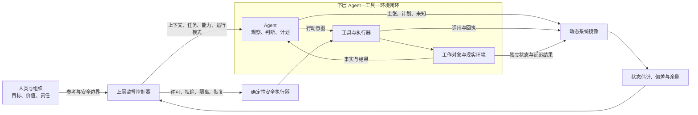
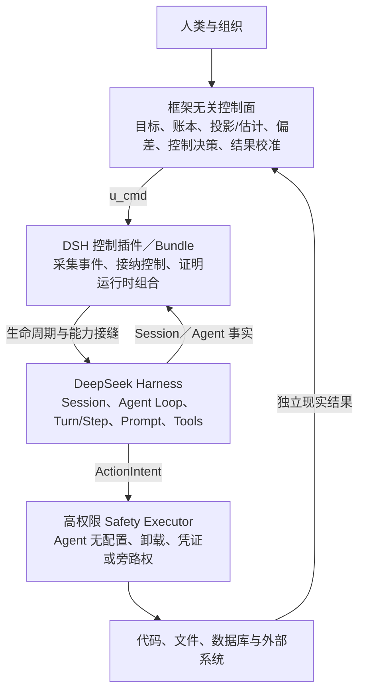

# 智能体生产系统真正要控制的，不是模型，而是它改变世界的条件

把一个 Agent 做到“能写代码、能调工具、能跑完任务”，通常只需要几周；把它接入真实生产之后，问题却会突然变形。团队开始补日志、权限、评估、工作流、人工审批和暂停按钮，但功能越列越长，仍然回答不了最关键的问题：这个 Agent 此刻依据什么在行动，控制命令是否真的进入了它的下一步，工具返回成功后现实世界是否已经按预期改变？

这不是控制功能还不够多，而是控制对象一开始就定义错了。

智能体生产系统真正要控制的，不是 LLM 的隐藏思维，也不是某一段输出文本，而是 **Agent 在什么信息、能力、权限、预算和恢复条件下，可以继续自主地改变世界**。只有先把这个被控系统说清楚，日志、评估、权限和暂停按钮才会从零散功能变成一个控制闭环。

## 为什么“再加一个控制功能”解决不了问题

很多 Agent 平台的建设顺序很相似：先接模型和工具，再加执行记录；担心风险，就补审批和权限；任务变长，就加计划、记忆和检查点；效果不稳定，再做评估、画像和进化。

每一步单独看都合理，合在一起却未必形成可控性。因为这些模块经常默认了不同的系统边界：

- 日志记录的是模型和工具发生过什么；
- 权限控制的是某个 API 能不能被调用；
- 评估判断的是某份输出好不好；
- 编排关心的是任务怎样被拆分和分派；
- 暂停按钮试图阻止一个正在运行的进程。

但真实任务并不生活在任何一个模块里。一个编码 Agent 可能读了过期需求，基于不完整依赖图修改了正确文件，运行了错误测试，得到成功退出码，然后在用户真正关心的页面上制造了回归。这里没有哪个局部模块必然报错，失败发生在它们之间丢失的因果关系里。

因此，第一步不是继续补功能，而是回答：**谁在控制谁，系统状态在哪里，什么事实足以触发什么动作？**

## Agent 不是普通执行器，它本身就是下层控制器

传统软件中的执行器通常接收一个相对确定的命令，再按规则改变外部状态。Agent 不同。它会观察信息、形成任务理解、选择策略、调用工具、读取结果并决定下一步。换句话说，Agent 已经在自己的任务环境里构成了一个控制环。

如果人类平台把它继续当成普通执行器，就会走向两个极端。

一种是逐步把所有判断写回规则和审批，最后得到一个昂贵的工作流引擎，Agent 的自主价值被消耗掉。另一种是只给目标和工具，等结果不好时再看日志，所谓控制退化成事后审计。

更合理的关系是嵌套控制：Agent 是下层控制器，人类生产系统是上层监督控制器。上层不替 Agent 完成每一次判断，而是决定它在什么条件下还能继续判断和行动。

这张图最重要的不是模块数量，而是两条边：现实环境必须把结果反馈给系统镜像；监督控制必须能通过能力边界真正影响工具执行。少了前一条，系统不知道世界有没有按预期变化；少了后一条，控制只能依赖 Agent 自觉配合。

## 工程控制论的启发，不是“精确控制 LLM”

钱学森在 1954 年出版的 *Engineering Cybernetics*，价值不在于给今天的语言模型提供一套现成公式，而在于一种建模次序：先定义系统边界、输入与输出，再讨论反馈、扰动、误差、稳定性和控制装置。

这恰好修正了 Agent 平台常见的倒序设计——我们习惯先画控制台和功能模块，再为它们寻找理论解释。

但这层借鉴有一条必须守住的边界：LLM 的隐藏认知不是可以被稳定读取的连续状态，语义输出也不会因为加了反馈就单调收敛。把“思考过程”画成可精确测量的状态变量，只会制造新的虚假确定性。

我们真正能建模的，是可被外部证伪的功能状态，例如：

- 当前行动绑定了哪个目标版本；
- 模型实际看到了哪些材料和工具；
- 哪些主张有独立证据，哪些仍是未知；
- 工具究竟执行了什么，现实效果是否可确认；
- 剩余预算、权限、监督和恢复路径是否还能支撑下一步；
- 当前模型、提示、技能、记忆和工具组合是否仍处于已验证范围。

《工程控制论》第三版序言其实给出了同样重要的提醒：技术科学的前提和命题必须接受工程实践检验，理论本身也会随技术发展被修改。对 Agent 系统而言，这意味着系统模型不能被写成永久画像。模型、上下文、工具或插件一旦变化，旧的能力结论就可能失效，需要重新辨识。

## 从“记录很多”到“形成动态系统镜像”

日志多，不代表系统可观测。真正服务于控制的观测，必须能重建一条因果链：Agent 基于哪个目标，看到了什么，作出了什么主张和承诺，发起了什么行动，执行器实际做了什么，工作世界发生了什么变化，结果又如何校准此前判断。

要做到这一点，至少要把六类东西分账。

第一层是**持久事实**。消息、工具调用、结果、参考版本和检查点以追加事件保存，历史不能被后来的估计覆盖。

第二层是**确定性投影**。它只把相同事件序列折叠成相同状态，例如当前 Turn、已完成的工具调用、目标 revision 和事件水位。它不猜测事实背后的含义。

第三层才是**认识性估计**。系统在投影和外部观测之上判断目标是否冲突、证据是否充分、世界状态是否过期，并允许明确输出 `unknown`。

第四层是**偏差与控制余量**。不是给 Agent 打一个模糊健康分，而是分别观察目标、上下文、证据、资源、安全、监督和恢复余量。一个任务可以方向正确，却已经没有足够恢复路径承受下一次试错。

第五层是**控制命令与实际生效**。控制器说“暂停”“补上下文”或“撤销写权限”，只代表命令已经发出；Runtime 是否在下一次模型请求、下一 Step、下一 Turn 或工具执行边界真正接纳，是另一个事实。

第六层是**现实结果**。API 返回成功、命令退出码为零、构建通过，都不能自动升级为“用户目标已完成”。现实世界必须被独立读取和对账，延迟结果也可能重新打开一个曾经通过即时验收的任务。

这六层分开之后，失败才有可能被准确归因：是事件丢了、投影错了、估计过期、控制命令错过接纳点、执行器被旁路，还是现实效果根本没有发生。

## DSH 不是控制系统，它是被控制的 Runtime

DeepSeek Harness（DSH）最容易被误解的地方，是它看起来已经拥有 Session、Agent Loop、Goal、Prompt、Tools、Sandbox 和插件系统，于是很容易被直接称为“智能体控制系统”。但这些能力首先回答的是：**Agent 怎样运行。**

本文讨论的控制系统回答的是另一个问题：**Agent 在什么条件下还能继续运行并改变世界。**

如果最终采用 DSH，完整关系不是“fork DSH，把它改成控制系统”，而是四层装配：

DSH 位于下层，继续拥有自己的 Agent Loop、Turn/Step 编排、模型和工具装配。控制系统不应该在外面重写第二套 orchestration。它只通过 out-of-tree Cordis 插件，把“传感器”和“控制接纳点”装进 DSH：采集 Session 与 Agent 事件，在 pre-step、request、tool、turn-stopping 等位置接收控制，并证明当时实际加载了哪些 Profile、Bundle、Patch、Provider 和工具策略。

插件之上的框架无关控制面，才负责 DSH 没有提供的监督语义：任务参考、认识性状态估计、偏差与余量、控制决定、现实结果校准。插件之下的高权限 Safety Executor 和 Watchdog，则保证 Agent 不能靠修改配置、卸载 Provider、取得长期凭证或绕过执行端点来逃开约束。

因此，DSH 提供的是 Runtime 能力和控制接缝，不是完整控制闭环。将来即使把 DSH 换成现有 LangGraph Runtime，也只需要替换插件/Adapter 层，上面的 Mission、Ledger、Projection、Estimate、ControlDecision、Safety 和 Outcome 契约不应随之重写。

明确这个层级后，DSH 的工程价值才不会被高估或低估。它把可持久重放的 Session 事实放在 `session/event`，把队列、状态、prompt 拦截、请求构造和 continuation 等实时协调放在 `agent/*`。一条 follow-up 消息从入队到进入模型输入，中间还要经过 claim、pre-step、step start 和 request 等接纳点。

这暴露出“控制指令已经发送”和“控制已经作用于 Agent”之间的差异。生产系统需要自己定义跨 Runtime 的控制应用回执，把监听器已拦截、继续委托、提前短路、真正接纳、已经应用和效果验证分开记录。`ControlApplicationReceipt` 是控制系统基于 DSH 事件映射出的契约，并不是 DSH 原生对象。

Session Projection 也提供了一个重要边界：事件投影由同步纯函数折叠 committed events。这支持把确定性事实投影和不确定状态估计分开，但 Projection 是可选 Runtime 能力，不是世界真相，更不能替代上层认识性估计。

Goal 同样需要区分原生能力和派生契约。DSH 原生提供 revision、phase、轮数限制以及进程内 activation/disarm；控制面再把这些事实与授权主体、预算、有效期和撤销状态组合，派生 `ContinuationLease`。目标仍为 active，不等于存在有效 Lease，但也不能反过来说 DSH 原生就有这样一张 Lease。

最后，Cordis 的可逆 effect 只会在插件卸载时撤销已经注册并带 disposer 的效应。它不会自动回滚文件、数据库、支付或其他现实副作用。现实恢复仍然必须经过查询、对账、隔离或补偿。

这也是为什么安全边界不能简单写成“插件不安全、独立进程才安全”。真正的问题是权限：谁能改配置、谁能卸载安全 Provider、谁掌握执行凭证、是否存在旁路。安全能力可以用插件实现，但它的挂载权、配置权和最终执行权不能由被控 Agent 支配。

## 一次“全都成功”的失败

Harness 自己公开的一次 Web Agent 事故复盘，把上述问题变得非常具体。

Agent 修改了 GUI 源码，完成了构建，拿到了 HTTP 200，还启动并验证了一个替代服务器。每一步都像是成功的，但它并不知道用户当前页面究竟由哪个 URL、进程和源码目录承载。源码编辑、构建成功、HTTP 200、替代服务器和用户正在看的页面，被当成了可以互换的事实。

最终问题不是 Agent 没有执行能力，而是多个局部成功没有共享同一个现实验收对象。

修复方向也不是再加一句“请认真验证”的 prompt，而是把当前 URL 和运行模式变成模型可见且可由工具查询的状态，拒绝错误的独立服务器，并针对真正的生产刷新和开发热更新读取外部结果。

这类事故揭示了 Agent 生产控制的一个底线：**模型可见的关键世界身份必须可重建，完成声明必须落到同一个外部对象上。** 内部流程全绿，只能证明流程跑过，不能证明世界正确。

## 稳定不等于每次输出相同

如果不追求精确控制 LLM，智能体系统还能谈“稳定”吗？可以，但定义必须改变。

开放语义任务中的稳定，不是同一输入永远得到同一文本，而是几类风险始终有界：

- 目标偏差不会持续扩大而无人察觉；
- 循环、重试、并发、token、时间和人工成本不会无限增长；
- 真实副作用不超出授权作用域、速率和预算；
- 系统能区分有效探索、停滞、退化和完成；
- 再行动一步之后，仍保留可达的暂停、隔离、对账或补偿路径；
- 任何阶段都有明确的决定者、执行者和接管者；
- 新结果能够推翻旧判断，旧版本能力不会被永久继承。

这个定义看起来没有一个漂亮的总分，却更接近生产现实。一个统一健康分会掩盖硬缺口：证据余量充足不能抵消安全余量已经耗尽，任务进展很快也不能抵消目标版本已经变化。

## MVP 应该先验证闭环，而不是先建平台大全

从这个母模型推导出来的 MVP，不应从多 Agent 名册、编排画布、评估中心和进化实验室同时起步。那些产品能力最终可能都需要，但它们会把太多假设绑在一起，导致实验失败时无法归因。

更小的验证对象是：一个固定版本的 Agent，在一类长任务里，使用少量受控工具，完成一个可以独立验收的现实结果。系统只验证四件事：

1. 能否从事件和外部事实重建控制相关状态；
2. 能否在干预窗口内把控制命令真正作用到 Runtime 或能力边界；
3. 能否识别工具假成功、目标漂移、上下文丢失和效果未知；
4. 能否在不显著摧毁任务价值的前提下，保留恢复与人工接管路径。

> 2026-08-17 实现决策更新：当前工程已选择全仓 TypeScript；DSH 是唯一生产默认 Runtime，现有 LangGraph 行为迁写为 TypeScript/LangGraph.js Learning Runtime，不建设生产热切换 Adapter。下层闭环测试决定 DSH 是否具备生产切换条件，LangGraph.js 只用于学习和离线对照。

实验可以分成三组：基线组只有 Agent 与常规日志；观测组增加因果账本、投影和状态估计但只告警；闭环组再加入能力收缩、继续授权、检查点、恢复和效果验证。三组锁定相同模型、工具、任务和故障种子，联合比较任务成功、真实损失、时延、成本、人工负担和误杀。

只有闭环组能重复地更早发现关键偏差，并在真实任务价值没有不可接受下降的前提下限制损失，这套控制母模型才获得了第一份工程证据。

## 先决定 Agent 在什么条件下可以继续

Agent 进入生产以后，最危险的错觉不是“模型会犯错”——这件事大家已经知道。真正危险的是，我们把日志存在、命令发出、API 成功和目标 active，依次误认为状态可观测、控制已生效、现实已改变和任务可继续。

工程控制论带来的启发，不是把概率型模型改造成确定性机器，而是迫使我们把这些不同事实拆开：先定义系统，再谈观测；先证明控制可达，再谈策略；先保留恢复路径，再扩大自主权。

因此，智能体生产系统的第一性问题不该是“还需要哪些平台功能”，而应该是：

> 在当前目标、证据、能力、权限、监督和恢复条件下，这个 Agent 是否仍被允许继续改变世界？

当系统能够持续、可验证地回答这个问题，编排、评估、治理和进化才有共同的地基。否则，我们只是用越来越完整的控制台，观看一个仍未被定义的系统运行。

## 参考资料

- H. S. Tsien, [*Engineering Cybernetics*](https://books.google.com/books/about/Engineering_Cybernetics.html?id=NfgvAAAAIAAJ), McGraw-Hill, 1954.
- [《工程控制论》第三版序言及目录](https://www.ecsponline.com/book/2018/yz/9787030300942-003007-curved-sam.pdf)，科学出版社。
- DeepSeek Harness: [Architecture](https://github.com/deepseek-ai/deepseek-harness/blob/47f943859bef60e4160492346772ded9b24f765a/docs/architecture.md), [Agent lifecycle](https://github.com/deepseek-ai/deepseek-harness/blob/47f943859bef60e4160492346772ded9b24f765a/docs/agent-lifecycle.md), [Session projection](https://github.com/deepseek-ai/deepseek-harness/blob/47f943859bef60e4160492346772ded9b24f765a/docs/subsystems/session-projection.md), [Goal subsystem](https://github.com/deepseek-ai/deepseek-harness/blob/47f943859bef60e4160492346772ded9b24f765a/docs/subsystems/goal.md).
- DeepSeek Harness, [Post-mortem 0003: Web agent validated a replacement server instead of its current GUI](https://github.com/deepseek-ai/deepseek-harness/blob/47f943859bef60e4160492346772ded9b24f765a/docs/postmortem/0003-web-agent-gui-feedback-loop.md).
