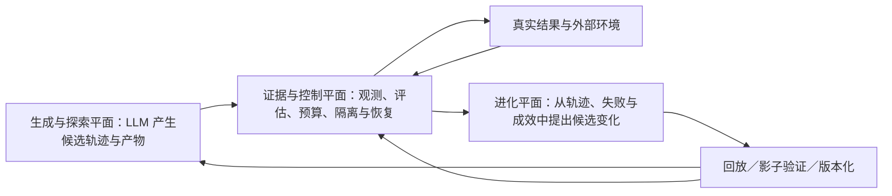

# 模式图

## 模式卡：绿灯不等于正确——系统级快速失败先于自动进化

- 可反驳的模式表述：当 AI Agent 已能稳定生成通过既有代码断言的实现后，主要风险会从“代码显式失败”转为“任务表面完成但系统目标实际未实现”的静默错误。如果工作流不能把这类系统级偏差及时转化为低成本、可定位的失败信号，迭代只会更快地积累传递误差；因此，自动进化的首要基础设施不是自动修改规则，而是让智能体系统快速出错。
- 来源事实：材料 1 发现实现变便宜后，评估、审查与维护成为核心劳动，且评估信号可能无效、波动、过期或过贵；材料 2 发现自动测试成功与整体可合并之间存在明显缺口，通过测试的 PR 仍需人工修复。
- 我的连接/解释：代码断言仍然有效，只是智能体已经能避开它所定义的失败空间。现在的错误发生在更高层：代码是绿的、任务状态是完成的，但系统结果是错的，且没有任何信号把它暴露出来。若不能把这种静默错误变成快速失败，进化环就没有反馈数据。以前的代码需要工程化，现在的智能体需要精确的系统控制。
- AI 推断：问题不是增加更多同类代码断言，而是建立系统级断言。它需要比较任务目标、各环节输入输出产物、实际系统行为与下游结果之间是否一致，并在局部成功掩盖整体偏差时强制失败；失败事件还应带回误差来源、发现延迟、修复成本和影响范围。
- 最强反例：在任务目标可以被现有测试完整形式化、Agent 无法通过代理指标绕开真实目标且环境稳定时，代码断言通过可能就足以代表系统正确，不需要额外的系统级控制。反过来，如果系统级目标无法形成可信参照，新增判定可能只产生主观噪声和误报。
- 适用边界：面向目标会涌现、存在多级代理指标、跨环节传递多、Agent 迭代频率高且局部成功可能掩盖整体错误的复杂软件工作；要求系统级失败信号可定位、可行动且不会因噪声大量误触发。
- 缺失证据：系统级正确性的参照物是什么；“绿灯但错误”的发生频率、发现延迟和成本如何量化；系统级断言能否在不显著增加误报的情况下提前暴露错误；评估规则如何根据静默失败持续进化。
- 置信度：中低
- 质量评分：新颖性 4/5，解释力 3/5，证据 2/5，边界 3/5，行动性 4/5
- 评分说明：证据能支持“自动测试成功不等于系统产物可用”和“评估信号存在盲区”，但尚不能证明系统级快速失败是自动进化的必要条件。

## 本期要解决的设计命题

- 用户原话：让智能体系统，变得跟代码一样可以轻松断言。
- 目标状态：系统级错误可以像代码断言失败一样，被自动、快速、低成本、可定位地暴露，而不是等任务完成或进入回归阶段后才由人发现。
- 与双环的关系：执行环负责产生并响应系统级失败信号；进化环根据静默失败、误报和漏报持续改进系统断言。
- 与产物评估的关系：每个工作输入、输出产物是系统断言的观测面，但“评估所有产物”只是手段，不等同于已经实现系统可断言性。
- 与 PID 的关系：PID“微分”是利用错误变化趋势提前阻尼的候选机制，但必须先有可信、可观测的系统误差信号。

## 新证据导航（尚待用户阅读判断）

- AgentSpec 表明：对于能够预先表达的边界，可以把 Agent 规则形式化为触发器、谓词和干预动作，并在每一步执行前检查。这支持“系统断言可以成为运行时基础设施”。
- Real-Time Detection and Repair 表明：基于逐步遥测的时序监控可以在任务中途预警，确定性校验可以重算 Agent 声称的结果并确认必要调用是否实际发生；失败被发现后可回滚重跑。这支持“快速失败—恢复”的执行环。
- 二者共同留下的核心空白：预定义规则只能断言已知风险；统计异常只能识别偏离健康轨迹。对于“轨迹看起来正常、结果也很合理、但系统目标其实错了”，仍必须找到可外部验证的真实参照。

## 模式卡：用可进化架构管理 LLM 的不确定性

- 可反驳的模式表述：LLM 智能体系统的首要架构问题不是把每一步约束为确定行为，也不是预先穷举规则，而是在保留 LLM 探索、生成和适应能力的同时，使不确定性的表现可观测、后果有边界、失败可恢复、经验可进化。若系统只能检查已知错误，却不能从静默失败、误报、漏报和真实结果中改变下一轮的观测与控制方式，它仍然无法获得系统级可断言性。
- 来源事实：AgentSpec 用运行时触发器、谓词和干预执行已知约束；Real-Time Detection and Repair 同时使用逐步遥测、确定性检查、完成度检查、升级和回滚，并明确不同失败需要不同机制。
- 我的连接/解释：Linux 只提供“架构先于规则细节”的有限启发。Linux 要可靠执行确定性计算；LLM 智能体系统则要同时发挥和管理不确定性。它的控制架构不能以消灭不确定性为目标，进化模块也必须成为一级能力。
- AI 推断：架构可分为三个协同平面。生成与探索平面允许 LLM 产生多种候选轨迹和产物；证据与控制平面记录来源、评估产物、限制预算与副作用，并在必要时隔离、回滚或升级；进化平面消费轨迹、静默失败、误报、漏报和真实结果，修改下一版提示、技能、评估器、工作流和控制策略，经验证后版本化生效。
- 最强反例：控制若过强，可能把 LLM 压缩成低效的确定性流程，损失其探索、泛化和应对未知情形的价值；控制若过弱，则会放大“顺利完成但实际错误”的静默失败。若任务单一、短期且风险固定，少量规则也可能比建设通用架构更经济。
- 适用边界：多环节、多工具、多 Agent、持续运行并需要规则长期进化的复杂工作流；公共边界必须保留足够领域语义，不能只采集 token、延迟等通用遥测。
- 缺失证据：哪些不确定性应被保留、哪些后果必须被硬约束；最小架构应包含哪些不可缺能力；进化平面用什么证据触发变化；候选变化如何在不污染线上系统的情况下验证；谁或什么批准升级；架构开销是否低于它减少的静默失败与返工成本。
- 置信度：中低
- 质量评分：新颖性 4/5，解释力 4/5，证据 2/5，边界 3/5，行动性 4/5
- 评分说明：现有材料能证明多类检查需要统一运行时承载，但尚未证明“四种不确定性治理属性”足以构成最小架构，也未证明三平面是最优划分。

### 已确认的核心架构性质（2026-08-12）

- 用户已确认：智能体系统不是消灭 LLM 的不确定性，而是让不确定性可观测、后果有边界、失败可恢复、经验可进化。
- 尚未确认：三平面是否是最合适的架构划分，以及进化候选进入线上系统的具体治理边界。

### AI 提出的 LLM 原生三平面结构（待用户确认）

- 保留不确定性原则：系统允许多候选、分支探索和开放式生成，不以单一路径的确定性为目标。
- 约束后果原则：不要求每一步都可预测，但关键副作用、资源预算、完成声明和交付结果必须可观测并有影响边界。
- 可恢复原则：失败或高风险信号出现时，系统能够隔离、回退、换路或升级，而不是继续放大误差。
- 证据闭环原则：控制过程不仅输出成功/失败，还要留下足以让进化平面修改提示、技能、评估器、工作流和控制策略的证据。
- 不可盲改原则（AI 推断，待确认）：进化候选先经回放或影子验证，再版本化发布，并保留回滚能力。
