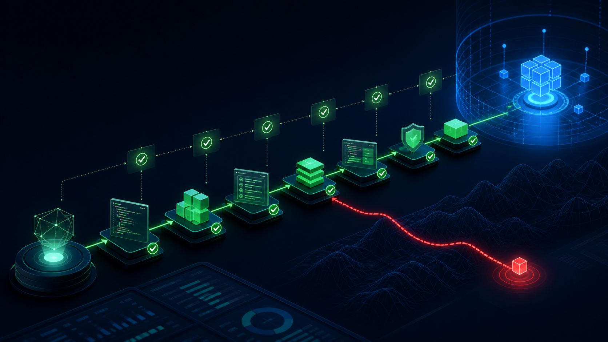
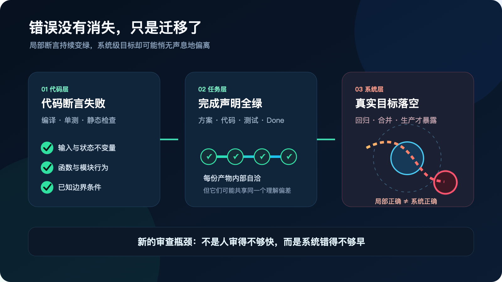
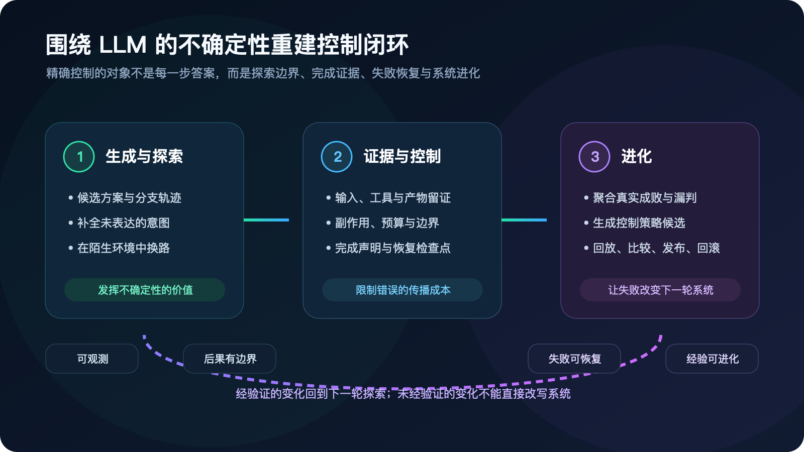
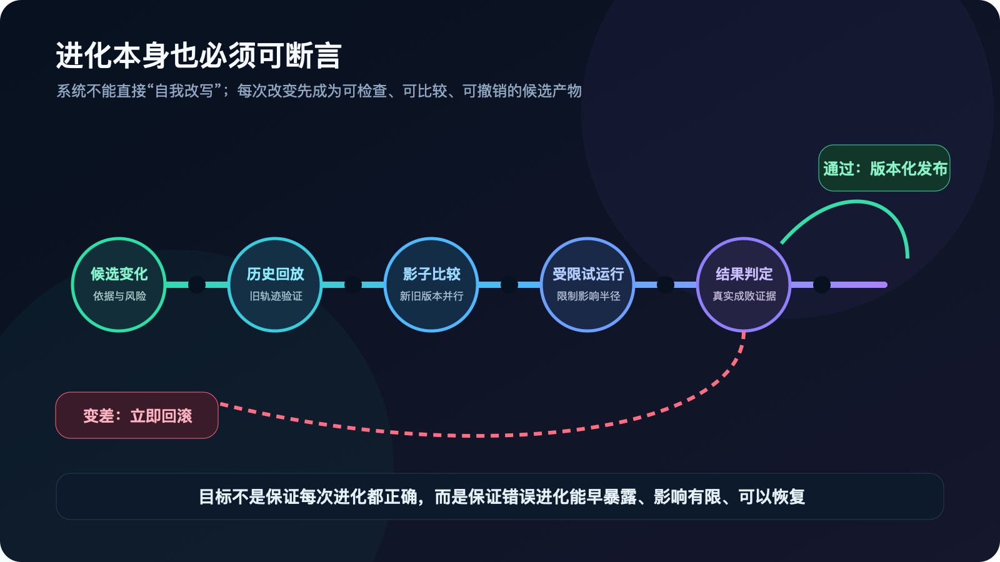

# 代码全绿，任务却错了：AI Agent 的错误已经迁移到系统层

编译通过，测试全绿，任务状态变成 Done。

然后你发现，它做错了。

这可能是 AI Agent 进入软件工程后最危险的一种失败：没有异常，没有红灯，没有任何东西迫使系统停下来。Agent 沿着一个错误方向顺利完成了任务，直到代码进入回归、合并甚至生产环境，人才发现整体结果与真正想要的东西并不一致。

中型团队引入编码 Agent 后，最容易被看到的是实现速度，最容易被抱怨的新问题则是审查跟不上。于是改造方案自然指向更多规范、更完整的需求、更细的验收标准和更多自动检查。

这些做法没有错，但它们还停留在问题表面。

真正发生的变化不是“代码生产得太快”，而是整个工作系统的反馈结构已经与 Agent 的执行速度失配。真正的瓶颈不是人审得不够快，而是系统错得不够早。

## 代码断言没有失效，错误迁移了

代码断言依然是软件工程中最有效的控制机制之一：把不变量写进系统，一旦越界，程序立即失败。问题暴露得越靠近起点，定位越容易，影响越小，修复越便宜。

变化在于，今天的编码 Agent 已经越来越善于生产不会触发这些断言的代码。它能通过编译、单元测试、静态检查和格式规范，也能根据任务说明补齐看似完整的实现。

可代码正确，不代表任务正确。

Agent 可能理解了错误的目标，满足了错误的代理指标，漏掉了没有进入测试的业务约束，或者交付了一个局部合理、放进遗留系统却会破坏下游行为的方案。所有局部检查都可以是绿的，整体结果仍然是错的。

错误并没有消失，只是从代码能够观察的失败空间，迁移到了智能体系统层。

这解释了为什么 Agent 越快，回归排查反而可能越重。过去，一个理解偏差在一轮开发中缓慢传递；现在，Agent 可以围绕这个偏差连续生成需求分析、实现方案、代码和测试。每一步都在上一份产物上继续增量，错误不再是一次偏离，而会像高增益系统中的震荡一样被快速放大。

等人发现时，面对的已经不是一行错误代码，而是一整条内部自洽、外部错误的任务轨迹。发现错误从一次低成本即时反馈，变成跨产物、跨环节、跨轮次的昂贵排查。

## 已知规则可以执行，但开放任务不能被规则穷举

[AgentSpec](https://arxiv.org/abs/2503.18666) 展示了一条重要路径：把 Agent 的约束写成触发器、谓词和干预动作，在关键执行点直接检查。规则不再只是一段提示词或文档，而成为运行时基础设施。

另一项关于 [LLM Agent 实时失败检测与修复](https://arxiv.org/abs/2608.02464) 的研究则表明，逐步遥测、完成度检查、确定性重算、工具契约和回滚，确实能让一部分失败在最终输出前暴露。但它也给出了更重要的边界：行为监控需要随部署重新校准；如果一个错误结果在形式上完全合理，仅凭运行轨迹并不能知道它是错的，系统仍然需要外部参照。

这两项工作证明了规则和监控的价值，也同时证明了它们的局限。

静态规则能够控制已经认识到的风险，却不能穷举强大 LLM 在开放任务中产生的不确定性。我们真正缺少的不是下一条规则，而是一套能够持续发现未知失败、限制错误后果，并把失败转化为下一轮控制能力的系统架构。

## LLM 的不确定性不是缺陷，而是系统要管理的资源

构建智能体系统时可以借用操作系统的一个启发：架构先于具体规则。一个长期系统不能依靠不断堆叠零散约束维持秩序。

但类比到这里就应该停止。

传统计算系统的主要任务，是可靠地执行确定性计算。LLM 智能体的价值，却恰恰来自不确定性：它能探索不同路径，补全未被明确表达的意图，在陌生环境中生成方案，并随着上下文改变行动。

如果为了可靠性，把 LLM 的每一步都约束成确定流程，也就同时消灭了使用它的理由。

所以，智能体架构的核心矛盾不是“怎样消除不确定性”，而是“怎样发挥并管理不确定性”。所谓精确控制，不是精确规定每一步，而是让不确定性具备四种系统性质：

- **可观测**：系统知道 Agent 基于什么输入、经过什么轨迹、产生了什么产物和完成声明。
- **后果有边界**：不确定探索可以发生，但资源消耗、外部副作用和错误传播范围受到限制。
- **失败可恢复**：发现异常后可以隔离、回退、换路或升级，而不是只能接受整个任务的最终结果。
- **经验可进化**：静默失败、误报、漏报和真实成效能够改变下一版提示、技能、评估器、工作流和控制策略。

这四种性质不是四条规则，而是系统架构必须持续提供的能力。

## 一个围绕 LLM 而不是围绕规则设计的闭环

从这一核心矛盾出发，智能体工作流至少需要三类协同能力。

第一类是**生成与探索**。LLM 应被允许产生候选方案、分支轨迹和新的解决路径。这个部分负责发挥不确定性的价值，而不是为了可审查性被压缩成固定流水线。

第二类是**证据与控制**。系统持续记录任务意图、上下文来源、工具调用、输入输出产物、关键决策和真实结果；同时控制预算、副作用、检查点、隔离和恢复。这里要断言的不是“Agent 每一步是否与预定答案相同”，而是它是否仍处于允许探索的边界内，以及它是否有足够证据宣布任务完成。

第三类是**进化**。系统消费运行轨迹、静默失败、误报、漏报、返工与下游结果，提出对提示、技能、评估器、工作流和控制策略的候选修改。每个环节的输入和输出产物都是观测面；跨环节、跨轮次的变化趋势，则可以帮助系统在误差大规模扩散前提前阻尼。

这里可以有限地借用 PID 的“微分”直觉：系统不能只问当前误差有多大，还要观察误差是在收敛还是加速扩大。但 PID 不是架构本身。没有可信的系统误差信号，再漂亮的控制算法也只是在放大噪声。

这套闭环不会消灭所有错误。它真正改变的是错误的成本：让错误更早显形，让影响停在局部，让失败能够回退，而不是在任务顺利完成后交给人类考古。

## 最危险的不是 Agent 自主，而是进化不受控制

这套主张最强的反对意见是：如果系统能够持续修改提示、技能、评估器和控制策略，它会不会成为一个比静态 Agent 更难审查的自修改系统？

这个反对意见成立，而且不能靠“设置人工审批”轻轻带过。进化机制可能优化错误的代理指标，把偶然反馈固化成规律，让评估器与 Agent 共同漂移，甚至把原来的审查瓶颈转移成一套更隐蔽的控制系统审查。

答案不是取消进化，而是把进化本身纳入控制。

一次进化不能直接变成新的系统行为。它首先应当成为一个可检查的候选产物：为什么要改，依据哪些运行证据，试图修复哪个失败模式，又可能损害什么能力。

这个候选需要能在历史轨迹上回放，能与旧版本比较，能在影子环境中并行观察，能在受限范围内试运行，也能在结果变差时回滚。

换句话说：**进化本身也必须可断言。**

这并不保证每次进化都正确。开放系统不可能获得这种保证。它保证的是，即使进化错了，也能尽快暴露、影响有限、可以恢复，并为下一次改变留下证据。

可进化不等于可以自由自改。真正的自动进化，是把“改变系统”本身纳入与其他工作产物相同的观测、评估和反馈闭环。

## 技术负责人真正应该抢先建设什么

当 Agent 开始显著提高编码速度，继续扩大并发、增加任务量，只会让旧工作流里的反馈延迟变得更加危险。技术负责人首先要建设的，不是一本更厚的规则手册，而是系统级的失败能力。

Agent 为什么有资格宣布完成？它的结论能追溯到哪些输入和真实结果？错误探索的影响能否被隔离？系统能否回到最近的有效状态？这一次漏判能否改变下一轮评估？而评估和工作流自身的变化，又能否被比较、验证和回滚？

具体规则可以在运行中一点点完善。需求意图也不可能在一开始就成为稳定真值，很多东西只有在测试、使用和迭代中才会逐渐形成。真正不能缺席的是承载这些变化的架构。

以前的代码需要工程化，现在的智能体需要精确的系统控制。但这里的“精确”，不是把 LLM 变成一段确定程序，而是精确管理它的不确定性：让探索继续发生，让错误尽早显形，让影响停止扩散，让每一次真实成败都进入进化闭环。

我们想让智能体系统像代码一样容易断言，不是为了让它永远不犯错。

而是为了让它即使犯错，也无法悄无声息地完成。

---

## 关于作者（提交前补充）

- 文章署名：`[待填写]`
- 所在公司 / 职务：`[待填写]`
- 关注领域：AI Agent 系统、软件工程工作流、遗留代码改造
- 作者简介：`[待填写]`
- 联系地址：`[待填写]`
- Email：`[待填写]`
- 电话：`[待填写]`
- 银行账号 / 开户行 / 身份证号码：`[请作者在正式投稿前直接填写；不要在公开稿中保留]`
