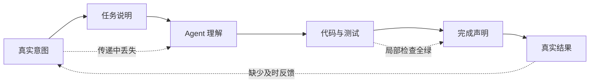

# 代码全绿，任务却错了：AI Agent 的错误已经迁移到系统层

编译通过，测试全绿，任务状态变成 Done。

然后你发现：它做错了。

这可能是编码 Agent 最危险的一种失败。没有报错，没有红灯，甚至没有任何迹象提醒团队停下来。Agent 只是沿着一个错误的理解，顺利完成了整个任务。

我们很容易把它归因于“人审不过来”：Agent 写得太快，所以要增加评审、补充规则、细化需求。

但真正的问题也许不是人审得不够快，而是系统错得不够早。

## 一个错误，为什么能一路绿灯

假设你让 Agent 修改遗留系统里的退款流程。

它理解了需求，改完代码，补齐测试，所有检查都通过。直到联调时大家才发现：新逻辑虽然满足了任务说明，却破坏了一个没有写进测试的下游对账规则。

此时，代码没有违背任何已知断言。错的是更上游的东西：任务说明没有完整承载真实意图，Agent 又围绕这个不完整的目标，连续生成了方案、代码和测试。

于是出现一种新的失败路径：

代码测试回答的是：“实现是否满足已经写下的约束？”

团队真正关心的却是：“这次任务是否仍然服务于真实目标？”

这两个问题不是一回事。前一个问题全绿，并不能证明后一个问题正确。

Agent 越快，这种偏差还可能被放大。过去，一个误解只会影响一轮开发；现在，同一个误解会连续进入需求分析、实现方案、代码和测试。等人发现时，面对的已经不是一行错误代码，而是一整条内部自洽、外部错误的任务轨迹。

## 再加规则，为什么不够

规则当然有用。

[AgentSpec](https://arxiv.org/abs/2503.18666) 展示了如何把约束写成触发器、检查条件和干预动作，在 Agent 执行到关键节点时直接拦截。另一项关于 [LLM Agent 实时失败检测与修复](https://arxiv.org/abs/2608.02464) 的研究也表明，逐步遥测、完成度检查、确定性重算和回滚，能够让一部分错误在最终输出前暴露。

但它们也揭示了同一个边界：规则只能捕获我们已经会描述的错误。

如果一个结果在形式上完全合理，只是偏离了没有写下来的真实意图，系统仍然需要外部结果来判断对错。开放任务里的偏差不可能被提前穷举，监控器也需要随着真实运行不断校准。

所以，团队缺少的不是“最后一条规则”。那条规则永远不会出现。

真正缺少的是一套系统：它既能执行已知规则，也能从未知失败里长出下一条规则。

## 系统级断言，断言的不是每一步

这里最容易走向另一个极端：既然 Agent 不够可靠，就把每一步都固定下来。

可一旦每一步都只能按照预设流程执行，LLM 最有价值的能力——探索、补全和应对陌生情况——也被一起消灭了。

因此，系统级控制的目标不是让 Agent 永远走同一条路，而是让它的探索满足四个条件：

- 看得见：知道它依据了什么、做过什么、还在假设什么；
- 有边界：错误行动的影响范围和成本受到限制；
- 可恢复：失败后能回到最近的有效状态；
- 会进化：真实结果能改变下一轮评估和控制。

这四点可以落在三个彼此分工的平面上：

生成与探索平面负责“让 Agent 去做”；证据与控制平面负责“判断它是否仍有资格继续”；受控进化平面负责“让一次失败变成下一次更早的判断能力”。

控制不保证 Agent 永远不犯错。它改变的是错误的成本：更早暴露、停在局部、能够回退，而不是等任务完成后再让人类考古。

## 系统会进化，进化本身也要受控

如果评估器、提示词、技能和工作流都能根据反馈变化，新的风险也随之出现：系统可能优化错误的代理指标，把偶然反馈固化成规则，甚至让 Agent 和评估器一起漂移。

因此，一次改进不能直接变成新的生产行为。

它应该先成为一个候选变更：为什么改，依据什么证据，想修复哪类失败，可能损害什么能力。然后在历史轨迹上回放，与旧版本比较，在有限范围内灰度，并保留回滚路径。

换句话说，进化本身也必须可断言。

这里追求的依然不是“每次变化都正确”。开放系统做不到这一点。我们能做到的是：即使改错了，也能尽早发现、限制影响、恢复旧状态，并留下足够证据修正下一次变化。

## 技术负责人应该先建设什么

当 Agent 开始显著提高编码速度，团队最先要补的不是更多并发，而是任务层的失败能力。

至少要能回答五个问题：

1. Agent 为什么有资格宣布完成？
2. 它的关键判断能追溯到哪些输入和证据？
3. 一次错误探索的影响能否被隔离？
4. 系统能否回到最近的有效状态？
5. 这次漏判能否改变下一轮评估，而且这种改变能否回滚？

具体规则可以在运行中逐步完善。真正不能缺席的，是承载这些规则、证据和变化的控制闭环。

以前，我们把代码工程化，是为了让错误尽早失败。

现在，我们也需要把智能体工程化。不是为了让它永远不犯错，而是为了让它即使犯错，也无法悄无声息地完成。
