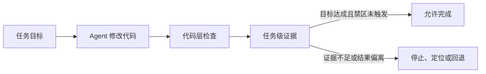

# 代码全绿，任务却错了：Agent 需要的不是更多测试，而是任务级断言

你让 Agent 重构一段遗留的计价逻辑。

它删掉重复代码，抽出公共模块，补齐单元测试。编译通过，测试全绿，静态检查没有问题。Agent 报告：任务已完成。

上线前，团队拿一批历史订单重放，发现少量订单的结算金额变了。原因不是公式写错，而是重构改变了舍入顺序。每个函数都符合自己的测试，最终账单却不再与旧系统一致。

代码是绿的，任务是错的。

这类错误不会因为 Agent 写得更快而消失。恰恰相反：Agent 可以围绕同一个错误理解，同时生成方案、代码和测试，让整套产物看起来更加自洽。

真正缺少的，不是最后一轮代码审查，而是一种资格判断：在什么证据出现之前，Agent 不能宣布任务完成？

## 代码测试，只证明代码满足了已写下的要求

单元测试可以证明计价函数符合给定样例，类型检查可以证明接口没有明显错误，静态扫描可以证明代码没有触犯已知规则。

它们都很重要，但它们只能检查已经进入代码世界的约束。

“重构后历史订单的结算结果不能变化”是另一层要求。它横跨计价、舍入、账单和对账，未必属于任何一个函数，也未必被写进原有测试。

这正是编码 Agent 带来的新错觉：当局部检查越来越容易全绿，团队会下意识地把“代码通过检查”当成“任务实现目标”。

可这两件事之间，缺了一道任务级判断。

## 任务级断言，断言的是“凭什么算完成”

所谓任务级断言，不是一条更复杂的单元测试。它是一份完成契约：在任务开始前，先约定什么结果必须出现、什么结果绝不能出现，以及用什么证据判断。

放到计价重构里，这份契约可以很具体：

| 完成问题 | 本次重构的答案 |
|---|---|
| 想改变什么 | 删除重复实现，统一计价逻辑 |
| 什么不能改变 | 相同订单输入必须得到相同结算结果 |
| 用什么证明 | 重放一批包含边界情况的历史订单，并比对账单与对账记录 |
| 证据不一致怎么办 | 任务不能进入 Done，回到差异定位 |

这样一来，Agent 能否完成任务，不再由它自己生成的总结决定，而由外部证据决定。

这张图里最重要的是最后一道门。代码层检查回答“实现有没有明显错误”，任务级证据回答“这次修改有没有真正达到目的”。只有两者都成立，任务才有资格完成。

## 系统级错误，必须用系统外的证据来发现

如果所有证据都来自 Agent 自己，它很容易形成一个封闭循环：Agent 解释需求，Agent 编写代码，Agent 生成测试，最后再由 Agent 总结自己已经完成。

这条链内部可以完全一致，却仍然与真实目标不一致。

因此，任务级断言需要尽可能连接独立证据。对于不同任务，这种证据可能是：

- 历史数据重放后的行为差异；
- 下游系统真实接收到的状态；
- 用户能否完成关键操作；
- 账务、权限或库存是否保持不变量；
- 灰度环境中的真实业务结果。

这里的“系统级”并不意味着一定要建设庞大的平台。它只是要求判断边界不能停在 Agent 生成的代码和测试里。

如果一次修改会影响账单，完成证据就必须看到账单；如果会影响用户权限，完成证据就必须看到最终权限状态。证据要越过 Agent 的自我描述，抵达它真正改变的对象。

## 未知错误不可能全部提前写成规则

任务级断言也有边界。

如果团队从未意识到舍入顺序可能影响结算，就不可能预先写出对应检查。第一次未知失败，任何系统都未必能完全避免。

真正能够工程化的是两件事。

第一，不让未知直接承担无限后果。高风险修改先在历史回放、影子环境或小范围灰度中运行，让第一次失败发生在可承受的范围内。

第二，不让同一种未知失败第二次仍然未知。发现舍入差异后，把历史订单比对变成新的完成证据；下一次类似重构，它就会在上线前失败。

所以，让错误“尽早失败”不是承诺预知所有错误，而是建立一条逐渐缩短的反馈路径：

`真实失败 → 留下证据 → 形成候选断言 → 历史回放 → 进入下一轮完成门禁`

已知错误由断言直接拦截，未知错误由隔离和反馈控制成本。两者缺一不可。

## 规则不是越多越好，关键是错误能不能留下来

[AgentSpec](https://arxiv.org/abs/2503.18666) 说明，已经表达出来的约束可以进入 Agent 运行时，在关键执行点被检查和强制执行。关于 [LLM Agent 实时失败检测与修复](https://arxiv.org/abs/2608.02464) 的研究也展示了逐步遥测、完成度检查、确定性验证和回滚的价值。

这些机制能处理已知风险，却不能替团队预知所有开放任务中的偏差。真正重要的是：系统能否把一次真实失败保存成下一次可以执行的判断，而不是只留下一份复盘文档。

当然，新断言也不能因为一次事故就直接进入所有任务。它需要在历史轨迹上回放，确认能拦住目标错误，又不会制造大量误杀；必要时先灰度，并保留撤销路径。

断言需要进化，断言的进化本身也需要证据。

## Agent 真正缺少的是“完成资格”

当 Agent 开始显著提高编码速度，团队很容易先扩充任务量，再用更多人工评审追赶。

但人工不可能永远跟在每条高速生成链路后面。更值得先建设的是任务完成协议：

- 目标和禁区是否被写清楚；
- 完成证据是否来自真实受影响对象；
- 证据不足时，系统能否拒绝 Done；
- 未知失败是否被限制在可承受范围；
- 已发生的失败能否变成下一轮断言。

代码测试仍然不可替代。变化只是：它不再独自承担“任务正确”的证明责任。

以前，我们用断言阻止错误代码继续运行。

现在，我们也需要用任务级断言阻止错误任务顺利完成。
