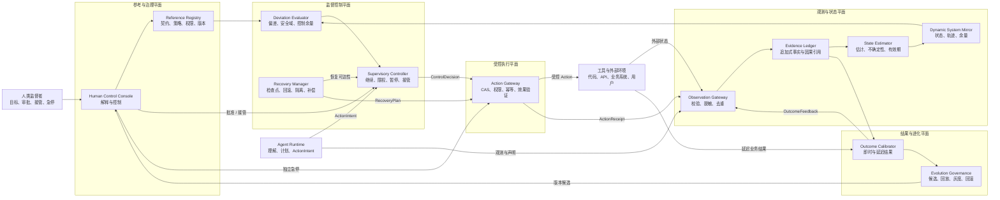
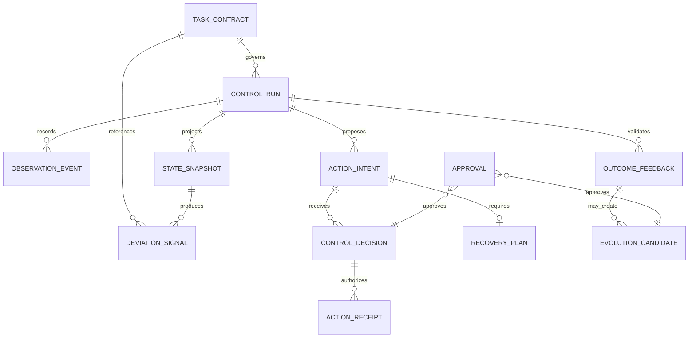
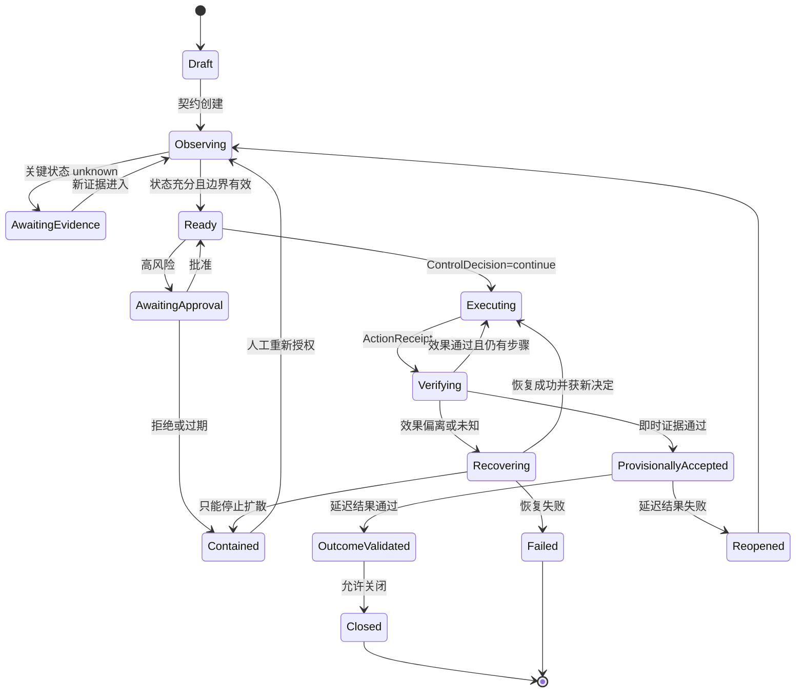
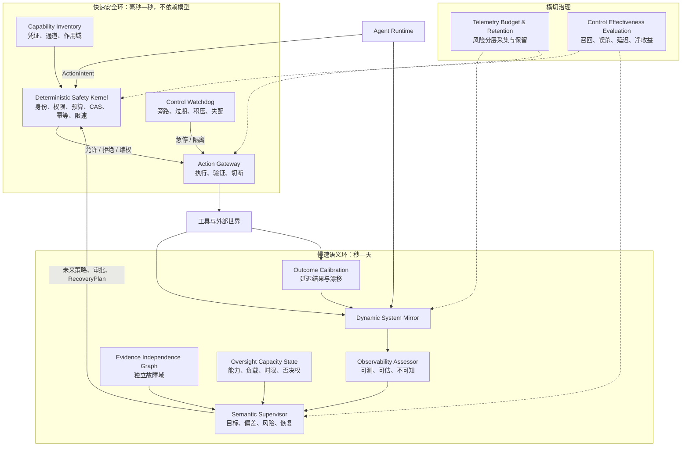
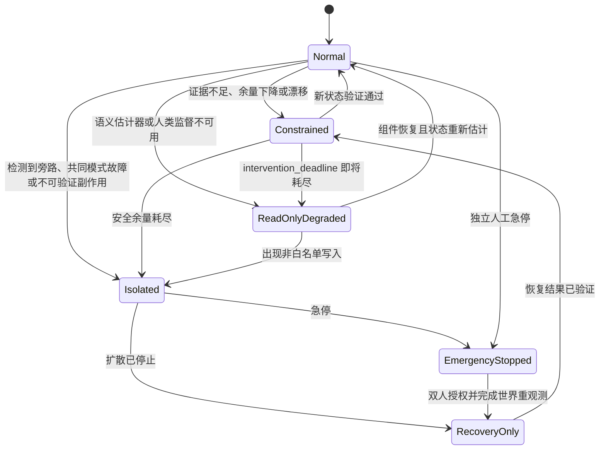
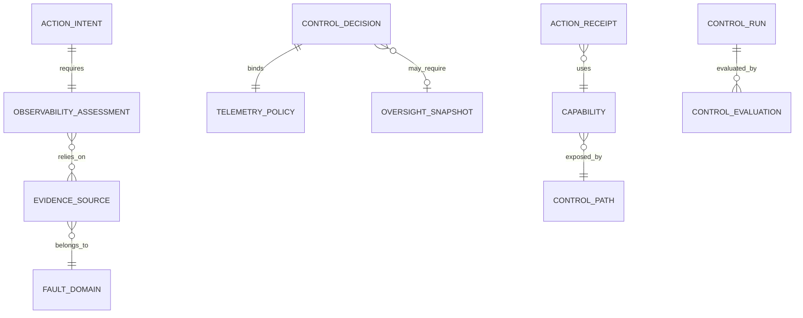

# 智能体生产控制面参考架构 v0.2

> 状态：压力测试加固后的概念架构草案。输入来自系统内容本体、六列控制矩阵、工程轨迹推演和九项反方压力测试；尚未经过真实仓库、真实事故数据和容量测试验证，不视为已采纳实施方案。

## 一、目标与非目标

本系统不替 Agent 完成任务，而是在 Agent 之外建立监督闭环，使人类持续知道：系统在追求什么、当前是什么状态、偏离在哪里、下一行动能否执行、行动后世界是否真的改变、失败能否恢复，以及延迟结果是否推翻了此前判断。

成功不等于 Agent 永不犯错，而是错误能在损害扩散前被发现，行动影响有界，状态可重建，失败可恢复，真实结果能校准下一轮控制。

第一版不设计基础模型，不保存完整隐藏思维链作为承重证据，不追求统一健康总分，不支持任意多 Agent 自治组织，不允许失败样本自动修改线上控制律，也不替代领域专家的目标和价值判断。

## 二、架构原则

| 原则 | 强制约束 |
|---|---|
| 控制与生成分离 | Agent 可提出行动和完成声明，不能批准自己的高风险行动或最终完成状态。 |
| 事实与估计分离 | 原始观测追加保存；状态估计必须携带证据、不确定性、有效期和估计器版本。 |
| 模型不进入可信内核 | 模型可辅助估计和解释；身份、证据账本、版本契约、硬拒绝、行动网关和急停必须在模型失效时继续工作。 |
| 副作用只走行动网关 | Agent 不持有绕过控制面的生产写权限。 |
| 行动前后双控制 | 执行前验证授权、风险和恢复；执行后独立验证真实效果。 |
| unknown 不是 pass | 关键状态未知、过期或冲突时，补证、限权、暂停或转人工。 |
| 双恢复空间 | 内部代码/状态回滚，与外部隔离、止损和业务补偿分别建模。 |
| 延迟完成 | 区分执行结束、暂时验收和真实结果验证；延迟结果可重开任务。 |
| 执行与进化隔离 | 当前故障只生成进化候选；回放、对照、审批、灰度和回滚准备后才改变系统。 |

## 三、总体架构



图中有两个嵌套闭环：Agent 通过行动改变任务环境；上层控制面通过动态系统镜像观察整个“Agent—工具—环境”闭环，并改变其权限、路径和状态。

## 四、模块边界

| ID | 模块 | 单一职责 | 主要输入/输出 | 禁止承担 |
|---|---|---|---|---|
| M1 | Reference Registry | 保存版本化目标、边界、策略、权限 | 人类命令 → TaskContract、PolicyVersion | 不估计状态，不执行行动 |
| M2 | Observation Gateway | 身份校验、Schema 校验、脱敏、去重和时间标记 | 原始事实 → ObservationEvent | 不解释事实，不做控制决定 |
| M3 | Evidence Ledger | 追加保存事实、声明、决定、回执、审批和因果引用 | 标准事件 → 可审计事件流 | 不覆盖历史，不冒充最新状态 |
| M4 | State Estimator | 从历史构造面向控制目标的估计状态 | Ledger + 参考版本 → StateSnapshot | 不把推断写成事实 |
| M5 | Dynamic System Mirror | 提供整个下层闭环的当前投影与轨迹 | 快照、版本、余量 → 系统视图 | 不成为新的事实源；必须可重建 |
| M6 | Deviation & Margin Evaluator | 比较目标、安全域、预测和实际状态 | Contract + Snapshot → DeviationSignal、Margins | 不决定最终控制动作 |
| M7 | Supervisory Controller | 综合偏差、权限、风险和恢复能力签发控制决定 | Intent + Deviation + Recovery → ControlDecision | 不直接调用业务工具 |
| M8 | Recovery Manager | 行动前评估可逆性，失败后编排恢复 | Intent + 世界快照 → RecoveryPlan/Receipt | 不把代码回滚等同于业务恢复 |
| M9 | Action Gateway | 外部副作用唯一出口，校验 CAS、预算、权限、幂等和效果 | Decision + Intent + RecoveryPlan → ActionReceipt | 不接受 Agent 自批或过期决定 |
| M10 | Outcome Calibrator | 回写即时/延迟结果，识别漏判和误判 | 业务结果 → OutcomeFeedback、CalibrationResult | 不直接修改线上策略 |
| M11 | Evolution Governance | 归因、聚类、回放、对照、审批、灰度和回滚准备 | Calibration → EvolutionCandidate/Version | 不参与当前任务即时自救 |
| M12 | Human Control Console | 展示目标、状态、证据、未知、余量和待决事项 | Mirror/Decision ↔ 人类命令 | 不用总分遮蔽证据和不确定性 |

## 五、依赖方向与最小可信控制内核

不可绕过的依赖规则：

1. Agent 只能提交 `ActionIntent`，不能签发 `ControlDecision`；
2. Action Gateway 只执行签名有效、未过期且引用最新快照的决定；
3. 有副作用行动使用状态版本 compare-and-set，防止基于过期世界执行；
4. 高风险行动没有有效 `RecoveryPlan` 时失败关闭；
5. Outcome 通过新事件校准历史，不覆盖旧判断；
6. Evolution 只能产生候选，审批和灰度后才能进入 Registry；
7. 人工急停直接作用于 Action Gateway，不依赖模型、估计器或主控制器可用。

为终止“谁监控监控者”的无限递归，最小可信控制内核只保留可确定性验证的能力：身份与授权、追加式账本、版本 Registry、硬拒绝规则、Action Gateway、人工急停和独立看门狗。看门狗监测事件丢失、快照过期、队列积压、策略版本失配和网关旁路。

模型模块不可用时，可继续允许策略明确的低风险只读行为，但未知高风险写操作必须失败关闭。

## 六、运行时数据模型



| 实体 | 核心字段 | 关键约束 |
|---|---|---|
| TaskContract | contract_id、version、goals、non_goals、safe_boundaries、success_failure、evidence_obligations | 变更创建新版本；旧决定继续引用旧版本 |
| ControlRun | run_id、contract_version、lifecycle_state、current_sequence、control_mode | 状态迁移只由控制面执行 |
| ObservationEvent | observation_id、run_id、sequence、subject、source、raw_fact、observed_at、reliability、provenance | `(run_id, sequence)` 唯一；事实不可覆盖 |
| StateSnapshot | snapshot_id、through_sequence、estimated_state、unknowns、contradictions、confidence、valid_until、estimator_version | 可从 Ledger 重建；过期快照不能批准高风险行动 |
| DeviationSignal | reference、direction、severity、trend、safety_distance、evidence_refs | 无比较基准不得生成工程误差 |
| ActionIntent | intent_id、snapshot_id、action_type、target、arguments_ref、risk、expected_effect | 高风险参数使用密封引用，不把密钥写入账本 |
| ControlDecision | decision_id、mode、snapshot_id、conditions、issuer、expires_at | Intent 提出者不能自批；过期自动失效 |
| RecoveryPlan | reversibility、checkpoint、rollback、isolation、compensation、owner、verification | 不可逆行动必须有隔离与止损方案 |
| ActionReceipt | decision_id、execution_status、idempotency_key、interface_receipt、observed_effect、executed_at | 接口成功与真实效果分开记录 |
| OutcomeFeedback | horizon、actual_result、value、side_effects、calibration | 支持迟到并重开任务，不覆盖当时判断 |
| EvolutionCandidate | target_version、failure_cluster、evidence_set、proposed_change、regression_risk、status | 单个事故不能自动上线 |
| Approval | subject_type、subject_id、approver、decision、reason、decided_at | 审批身份和职责分离可验证 |

## 七、任务状态机



Agent 只能请求 `Ready` 或 `ProvisionallyAccepted`；`OutcomeValidated` 只能由外部结果和评价规则触发。

## 八、最小 API Schema

| 方法 | 路径 | 说明 | 幂等 |
|---|---|---|---|
| POST | `/v1/contracts` | 创建版本化任务契约 | Idempotency-Key 必填 |
| POST | `/v1/runs` | 基于契约版本启动运行 | 必须 |
| POST | `/v1/runs/{id}/observations` | 追加直接观测 | observation_id 去重 |
| GET | `/v1/runs/{id}/state` | 获取快照、未知和八类余量 | 只读 |
| POST | `/v1/runs/{id}/action-intents` | 提交行动意图并请求控制决定 | intent_id 去重 |
| POST | `/v1/decisions/{id}/approvals` | 批准或拒绝 | 最终决定唯一 |
| POST | `/v1/decisions/{id}:execute` | 网关内部执行签发决定 | 决定 ID + 业务幂等键 |
| POST | `/v1/runs/{id}:pause` | 阻止新增行动，继续观测 | 命令幂等 |
| POST | `/v1/runs/{id}:handoff` | 移交任务、状态与责任 | 命令幂等 |
| POST | `/v1/runs/{id}/outcomes` | 追加即时或延迟结果 | outcome_id 去重 |
| POST | `/v1/runs/{id}:request-completion` | 请求暂时验收，不直接关闭 | 同一快照幂等 |
| POST | `/v1/emergency-stop` | 切断能力、租户或全局副作用 | 最高优先级 |

关键 `ActionIntent` 至少包含：`intent_id`、`snapshot_id`、`contract_version`、行动类型和作用对象、密封参数引用、业务幂等键、目标与证据引用、风险等级、可逆性、预期效果和效果验证方式。

关键 `ControlDecision` 至少包含：`decision_id`、`mode`、`based_on_snapshot`、`expires_at`、条件、各控制余量及可信度、审批要求和 `recovery_plan_id`。

### 错误码

| HTTP | code | 调用方处理 |
|---|---|---|
| 400 | CONTRACT_INVALID | 修订目标、边界和成功定义 |
| 409 | STALE_STATE | 重新读取状态并重新决策，禁止原样重试 |
| 409 | VERSION_MISMATCH | 同步契约、策略、估计器或工具版本 |
| 412 | EVIDENCE_INSUFFICIENT | 补证、降权或暂停 |
| 403 | POLICY_DENIED | 不重试；走人工变更流程 |
| 428 | APPROVAL_REQUIRED | 保持暂停并请求指定角色审批 |
| 412 | RECOVERY_UNAVAILABLE | 改变方案或人工明确承担不可逆风险 |
| 429 | CONTROL_BUDGET_EXCEEDED | 降级、缩小范围或接管 |
| 503 | STATE_ESTIMATOR_UNAVAILABLE | 只允许白名单低风险行为 |
| 502 | EFFECT_UNVERIFIED | 禁止盲目重试；先查询、对账或隔离 |
| 202 | OUTCOME_PENDING | 保持暂时验收，不关闭运行 |

## 九、非功能约束

| 维度 | 首版建议约束 | 验证方式 |
|---|---|---|
| 完整性 | 每个决定可追溯到契约、快照和证据；事件不可静默丢失 | 完整性校验、重放、故障注入 |
| 一致性 | 高风险行动使用快照 CAS；过期决定不得执行 | 并发和竞态测试 |
| 可用性 | 控制模型不可用时低风险只读可降级，高风险写失败关闭 | 断模、断网和积压演练 |
| 时延 | 硬规则同步执行；模型估计可异步，但过期即阻断或降权 | 分层延迟 SLO、过期测试 |
| 安全 | Agent 无生产写凭证；网关短期令牌、最小权限、租户隔离、职责分离 | 旁路攻击、权限扫描、轮换演练 |
| 隐私 | 入账前脱敏；敏感参数用受保护引用；内容分级保留 | 分类审计、删除与重建测试 |
| 可恢复 | 高风险行动前完成恢复评估；急停独立可用 | 恢复、隔离和外部补偿演练 |
| 可解释 | 每次阻断都展示基准、证据、未知和下一步 | 人工抽检与可用性测试 |
| 成本 | 按风险分层采集和保留，衡量观测的边际故障发现收益 | 成本—静默失败率对照 |

## 十、ADR

| ADR | 决策 | 核心取舍 | 状态 |
|---|---|---|---|
| ADR-001 | 追加式 Ledger + 可重建投影 | 比可变最新状态复杂，但保留当时认知和决定依据 | 暂定采纳 |
| ADR-002 | 模型辅助估计器不进入可信内核 | 牺牲部分灵活性，避免同源误判和模型自批 | 暂定采纳 |
| ADR-003 | 所有生产副作用经过 Action Gateway | 增加延迟，换取统一授权、幂等、切断和审计 | 暂定采纳 |
| ADR-004 | 使用八类控制余量，不用单一稳定分签发决定 | 展示更复杂，但不掩盖安全、证据和恢复差异 | 暂定采纳 |
| ADR-005 | 内部回滚与外部补偿分别建模 | 避免“代码回去了，世界也回去了”的假象 | 暂定采纳 |
| ADR-006 | 完成采用执行结束、暂时验收、结果验证三级状态 | 接纳延迟失败，代价是任务生命周期变长 | 暂定采纳 |
| ADR-007 | 执行环与进化环通过 EvolutionCandidate 解耦 | 降低在线自适应速度，避免偶然样本污染控制律 | 暂定采纳 |
| ADR-008 | 控制面用看门狗和急停，不递归堆叠监控 Agent | 缩小可信基座，接受部分状态只能降级处理 | 暂定采纳 |

## 十一、需求影响矩阵

| 需求 | 影响模块 | 对象/API | 实现约束 |
|---|---|---|---|
| REQ-001 目标边界可版本化 | M1、M12 | TaskContract、POST contracts | 契约不可验证时不得自主执行 |
| REQ-002 系统状态可重建 | M2–M5 | ObservationEvent、StateSnapshot | 事实/估计分离，unknown 显式化 |
| REQ-003 偏差余量可计算 | M6 | DeviationSignal、Margins | 偏差必须引用基准和证据 |
| REQ-004 高风险行动受控 | M7、M9、M12 | Intent、Decision、Approval | 禁止自批；状态 CAS；凭证只在网关 |
| REQ-005 失败可恢复或止损 | M8、M9 | RecoveryPlan、Receipt | 行动前评估；双恢复空间 |
| REQ-006 完成由结果验证 | M10 | OutcomeFeedback、request-completion | 即时通过只能暂时验收 |
| REQ-007 系统安全进化 | M10、M11、M1 | EvolutionCandidate、PolicyVersion | 回放、对照、审批、灰度和回滚必需 |
| REQ-008 控制面安全退化 | 可信内核、M9、M12 | emergency-stop、硬拒绝 | 模型失效不影响急停和高风险失败关闭 |

## 十二、MVP 边界与方案选择

第一版必须包含：版本化契约、追加式 Ledger、带 `unknown` 的状态快照、风险分级和硬边界、`ActionIntent → ControlDecision → ActionReceipt`、高风险行动的 CAS/幂等/恢复计划、Action Gateway、人工急停、三级完成状态、延迟 OutcomeFeedback，以及展示证据和八类余量的控制台。

第一版不做：自动多 Agent 组织优化、自动修改提示/技能/模型/控制律、全量保存隐藏思维链、统一跨领域本体、单一稳定分，以及对低风险只读操作设置与资金操作相同的同步门禁。

| 方案 | 事件可见 | 状态可重建 | 副作用可控 | 恢复与校准 | 主要风险 |
|---|---:|---:|---:|---:|---|
| Trace + 指标看板 | 是 | 部分 | 否 | 部分 | 数据丰富但靠人事后猜测 |
| 监控 Agent + 自动评估器 | 是 | 部分 | 部分 | 部分 | 同源误判、模型自批、不可预测失效 |
| 动态镜像 + 可信内核 + 监督控制面 | 是 | 是 | 是 | 是 | 架构和语义建模成本高 |

推荐第三种方案，但渐进实施：先闭环资金、发布、数据删除、消息发送等不可逆和高风险副作用，不要求首版同步控制所有低风险行为。

## 十三、压力测试输入

1. 真实意图、Agent 理解和外部隐藏状态无法可靠估计；
2. 状态估计和人工批准滞后于副作用扩散；
3. 跨系统语义关联、存储和延迟结果采集成本过高；
4. 保守的 `unknown` 与硬门造成控制误杀和生产效率下降；
5. 遗留凭证、手工脚本或旧服务绕过 Action Gateway；
6. 主 Agent、估计器和评估器共享错误模型或错误数据；
7. 详尽因果链与数据最小化、删除权和商业机密冲突；
8. 外部系统和业务规则变化导致控制律失效；
9. 大量转人工使人的注意力和响应时延成为新瓶颈。

这些不是外围实现问题，而是本轮反方压力测试的输入；已完成的架构处理见第十四节，仍需真实任务验证的部分进入 MVP 实验。

## 十四、压力测试后的加固架构

前十三节定义核心控制面。本节把 `02g-adversarial-stress-test.md` 的结论正式并入架构；若出现冲突，以本节的加固约束为准。

### 14.1 从单一闭环升级为双速闭环



这张图帮助读者看清时间边界：快速环只执行可确定验证的硬约束，在干预窗口内阻断副作用；慢速环可以使用模型与人类，但只能在状态仍新鲜时影响未来行动。

### 14.2 七个横切模块

| ID | 模块 | 职责 | 输入/输出 | 强制边界 |
|---|---|---|---|---|
| X1 | **Observability Assessor** | 判断高风险决定依赖的状态哪些可测、可估、不可知 | Intent + StateSchema + observations → ObservabilityAssessment | 不可知的影响必须进入风险，不能被平均置信度掩盖 |
| X2 | **Evidence Independence Graph** | 标记证据的模型、数据、工具、组织和评价标准故障域 | evidence_refs → fault-domain graph + independence score | 同源重复判断不能提升安全等级 |
| X3 | **Telemetry Budget & Retention** | 按风险决定采集、采样、脱敏、保留和删除 | risk class + data class → TelemetryPolicy | 控制决定、高风险回执、急停和损失事件不可采样 |
| X4 | **Oversight Capacity State** | 把审批人的能力、负载、时限、冲突和实际纠错能力纳入镜像 | 人员、队列、历史结果 → OversightSnapshot | 没有真实否决权或超载的人不能被计作有效控制 |
| X5 | **Bypass & Capability Inventory** | 枚举所有可改变受保护世界状态的凭证、脚本、通道和主体 | IAM、CI/CD、脚本、第三方回调 → CapabilityGraph | 未绑定 ControlDecision 的写能力属于显式风险债务 |
| X6 | **Control Watchdog** | 监测控制面自身的事件丢失、快照过期、队列积压、版本失配和网关旁路 | 内核健康与外部效果 → degrade / isolate / emergency-stop | 独立于主 Agent、语义控制器和模型估计器 |
| X7 | **Control Effectiveness Evaluator** | 评价控制器是否及时发现、正确阻断并以可接受成本恢复 | 故障注入、真实事故、结果和成本 → ControlEvaluation | 不使用“记录量”或“审批数”代替控制效果 |

X1、X2 和 X4 扩展慢速语义环；X5 和 X6加固快速安全环；X3 与 X7横跨两个环。

### 14.3 控制决定的准入判定

高风险动作不能只依赖一个风险分。签发 `continue` 或 `execute` 前必须逐项满足：

```text
admissible(intent, snapshot):
  require contract.is_valid_at(now)
  require snapshot.age <= intent.intervention_deadline
  require observability.critical_unknowns <= policy.unknown_limit
  require evidence.independent_fault_domains >= policy.min_independence
  require forecast_control_latency <= intent.intervention_deadline
  require capability.path == "controlled_gateway"
  require telemetry_policy.can_preserve_required_evidence
  require recovery.is_viable
          or (intent.irreversible_budget_is_explicit and approval.is_valid)
  require oversight.is_effective if policy.requires_human
  require no_hard_rule_violation
```

任何 `require` 不成立时，不得通过提高其他维度总分进行补偿。系统只能选择：补证、缩小作用域、降低权限、等待、转人工、隔离或拒绝。

### 14.4 控制运行模式

原任务状态机描述业务任务生命周期；加固后还需要一套独立的控制面运行模式：



关键区别：`ReadOnlyDegraded` 不是系统不可用，而是只允许策略明确的低风险读操作；`RecoveryOnly` 只允许恢复、隔离、对账和取证，不允许继续业务目标。

### 14.5 数据模型增补



| 新实体 | 核心字段 | 关键约束 |
|---|---|---|
| ObservabilityAssessment | intent_id、measured、estimated、unknown、critical_unknowns、valid_until、assessor_version | 每个高风险 Intent 必须存在；过期后决定失效 |
| EvidenceSource | source_id、type、model_family、data_origin、tool_implementation、owner | 证据必须能映射到至少一个 FaultDomain |
| FaultDomain | domain_id、category、correlation_notes | “不同调用”不自动等于不同故障域 |
| TelemetryPolicy | policy_id、risk_class、must_keep、sampling、redaction、retention、deletion_proof | 与决定绑定；执行后不能降低必留证据级别 |
| OversightSnapshot | reviewer_id、competencies、queue_depth、response_window、conflicts、override_history | 审批时冻结引用，不能事后伪造有效监督 |
| Capability | capability_id、credential_ref、subjects、targets、actions、scope、bypass_status | 所有生产写能力必须归属受控路径或登记风险债务 |
| ControlPath | path_id、gateway_required、hard_rules、emergency_stop_scope | 外部效果无法关联 path/decision 时触发旁路事件 |
| ControlEvaluation | evaluation_id、run_id、fault_case、recall、false_block、latency、recovery_net_effect、overhead、privacy_surface | 同时覆盖真实事故与故障注入，结果进入版本治理 |

### 14.6 API 增补

| 方法 | 路径 | 说明 | 失败策略 |
|---|---|---|---|
| POST | `/v1/intents/{id}:assess-observability` | 生成可测、可估、不可知状态清单 | 关键不可知超阈值时返回 412 |
| GET | `/v1/evidence/{id}/fault-domains` | 查询证据来源与故障域 | 来源不明不得提升证据等级 |
| PUT | `/v1/telemetry-policies/{risk_class}` | 配置采集、采样、脱敏和保留 | 不允许取消法定/硬规则必留事件 |
| GET | `/v1/oversight/capacity` | 获取可用监督者能力、负载和窗口 | 无有效监督者时高风险审批失败关闭 |
| POST | `/v1/capabilities:discover` | 扫描凭证、脚本、通道和第三方写能力 | 新旁路自动进入 Constrained/Isolated |
| GET | `/v1/capabilities` | 查询受控能力与风险债务 | 只读，权限分级 |
| POST | `/v1/control-evaluations` | 运行故障注入或写入真实事故评估 | 不能修改原始事故事实 |
| GET | `/v1/control-evaluations/summary` | 获取召回、误杀、延迟、净恢复和开销 | 指标必须带任务分布和时间窗口 |

`ActionIntent` 新增 `intervention_deadline`、`required_observability`、`required_independent_fault_domains`。`ControlDecision` 新增 `observability_assessment_id`、`telemetry_policy_id`、`oversight_snapshot_id`、`forecast_control_latency` 和 `operating_mode`。

### 14.7 控制面验收指标

| 指标 | 定义 | 首版用途 |
|---|---|---|
| Monitor Recall | 构造或已知故障中，在干预窗口内识别的比例 | 判断状态镜像是否真的能发现风险 |
| Silent Failure Rate | 当时通过、延迟失败且未主动发现的比例 | 评价完成门和 Outcome Calibrator |
| False Block Rate | 本可安全完成但被阻断的比例 | 防止用绝对保守制造虚假安全 |
| Intervention Latency | 危险状态出现到有效控制生效的时间 | 验证双速环是否来得及干预 |
| State Freshness | 决定签发时快照年龄 / 干预窗口 | 防止精确地控制旧世界 |
| Recovery Net Effect | 恢复减少损失减去恢复新增损失 | 防止把执行回滚动作当成恢复成功 |
| Evidence Independence | 关键结论覆盖的独立故障域数 | 防止同源 Judge 冒充交叉验证 |
| Human Oversight Effectiveness | 人工新增正确拦截减去错误放行和时延损失 | 验证人在环是否真实有效 |
| Control Overhead Ratio | 控制成本 / 任务实际价值 | 防止控制面吞噬生产力 |
| Privacy Exposure Surface | 敏感类型 × 主体 × 保留期 × 可访问角色 | 管理证据账本的次生风险 |

任何架构试点必须同时报告安全收益与生产损耗，不能只报告拦截数量。

### 14.8 ADR 增补

| ADR | 决策 | 取舍 | 状态 |
|---|---|---|---|
| ADR-009 | 使用快速确定性安全环 + 慢速语义控制环 | 增加两套时限与策略协调，换取高风险动作不等待模型和人工 | 暂定采纳 |
| ADR-010 | 每个高风险 Intent 强制 ObservabilityAssessment | 增加建模成本，避免把不可知状态误判为低风险 | 暂定采纳 |
| ADR-011 | 按独立故障域计算证据强度 | 需要维护来源图，避免同源多 Judge 虚假冗余 | 暂定采纳 |
| ADR-012 | 风险分层遥测而非全量永久留存 | 接受低风险稀有事件可能丢失，控制成本、噪声和隐私 | 暂定采纳 |
| ADR-013 | 将监督者能力与负载纳入系统状态 | 增加组织数据处理，避免形式化审批成为橡皮图章 | 暂定采纳 |
| ADR-014 | 以能力/凭证图证明网关不可绕过 | 接入遗留系统成本高，但流程声明无法形成真实控制 | 暂定采纳 |
| ADR-015 | 独立评价控制器，而非只评价 Agent | 增加故障注入和对照实验成本，换取控制面有效性证据 | 暂定采纳 |

### 14.9 加固后的 MVP 优先级

| 优先级 | 能力 | MVP 深度 |
|---|---|---|
| P0 | 快速安全环、Action Gateway、急停 | 覆盖一个高风险生产能力，证明无旁路写权限 |
| P0 | Capability Inventory | 完成目标能力及其凭证、脚本、人工和第三方通道清单 |
| P0 | ObservabilityAssessment | 对每个高风险 Intent 输出可测、可估、不可知和时限 |
| P0 | TelemetryPolicy | 必留事件、脱敏、风险采样和删除证明可执行 |
| P0 | ControlEvaluation | 至少覆盖静默失败、误杀、干预延迟和恢复净效果 |
| P1 | Evidence Independence Graph | 先覆盖完成声明和高风险审批使用的证据 |
| P1 | Oversight Capacity State | 先记录角色、队列、时限、否决和事后纠错 |
| P2 | 自动共同模式故障检测 | 累积真实故障域和相关性数据后再做 |

MVP 的验收不再是“十二个模块都上线”，而是选定一个不可逆或高风险能力，证明从观测、准入、执行、效果验证、恢复到延迟结果的闭环有效，并测得它的安全收益和生产成本。
