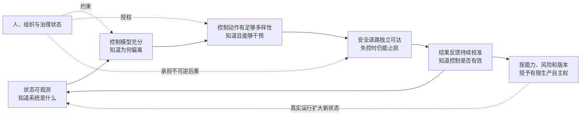

# 模式图：从详尽监控到可授予的生产自主权

> 状态：门禁 A 后的模式提炼。来源事实、用户判断与 AI 推断分别标注；本页仍是候选模式，不等于用户已经确认的文章主张。

## 一、中心关系



这张图的关键不是五个模块，而是五项缺一不可的控制条件：

```text
生产控制能力
  ≈ 状态可观测性
  × 控制模型充分性
  × 控制动作必要多样性
  × 安全退路可信度
  × 结果反馈与校准能力
```

这里的乘法是架构判据，不是已经获得标定系数的数学公式。任何一项接近零，其他部分再强也不能把 Agent 稳定转化为生产工具。

## 二、模式卡

### 模式 1：详尽监控的产物不是更多记录，而是面向控制目标的动态系统镜像

- **可反驳表述**：若监控数据不能在干预时限内重建“当前状态、偏差来源、剩余不确定性和可达恢复路径”，增加日志、trace 或指标不会显著提高控制品质。
- **来源事实**：Kalman 区分外部输入输出与内部状态；Conant–Ashby 说明有效调节器需要包含与调节目的相适配的系统模型；Ledger 案例显示显式执行状态优于让模型从长历史中自行猜测。
- **用户连接**：用户将详尽监控定义为驾驭智能体的认识基础，并要求先列清智能体系统内容，再推导监控维度。
- **AI 推断**：监控系统的核心交付物应从 `Telemetry` 改为带版本、不确定性和有效期的 `Dynamic System Mirror`；原始事件只是其证据来源。
- **最强反例**：在稳定分布、单步骤、结果立即可验证的任务中，端到端输入输出控制可能无需显式状态镜像也能可靠运行。
- **成立边界**：任务越长、外部状态越多、结果越延迟、系统越会自我修改，动态镜像越必要；它追求控制充分性，不追求复制所有微观状态。
- **缺失证据**：尚未通过真实任务消融证明哪些状态是最小充分集，以及镜像对静默失败率和恢复时长的净改善。
- **置信度**：高。

### 模式 2：可观测性只决定认识上限，控制动作决定行动上限

- **可反驳表述**：一个状态完全可见、但没有及时且有效干预通道的 Agent 系统，仍然不可控；“监控到了”不能算“风险被控制”。
- **来源事实**：Kalman 将可观测性与可控性定义为不同系统属性；Ashby 的必要多样性说明控制器响应种类不足时，残余扰动无法被进一步压缩。
- **用户连接**：用户确认“详尽监控是唯一可靠的认识基础，但完整控制还需要足够的干预手段”。
- **AI 推断**：每个监控到的关键偏差必须映射到 `ControlAuthorityMatrix`：拒绝、缩权、限速、暂停、隔离、切换、恢复、补偿、接管或终止；只有告警没有动作的维度仍是控制缺口。
- **最强反例**：监控信号本身可能改变人的行为，或通过威慑间接降低风险，不一定总要自动执行控制动作。
- **成立边界**：高风险和短干预窗口要求机器可执行控制；低风险、长窗口场景可由人工闭环，但仍要验证责任人和响应时限。
- **缺失证据**：尚未测量 18 类 MVP 故障中每类扰动所需的最小控制动作集合，以及人工通道能够覆盖的真实容量。
- **置信度**：高。

### 模式 3：智能体生产系统的被控对象是整个社会技术闭环，而不是模型节点

- **可反驳表述**：只监控 Agent 的提示、推理和工具调用，无法稳定控制由目标设定、权限、外部系统、人类审批、组织激励和延迟结果共同产生的系统级失败。
- **来源事实**：STAMP 将复杂事故解释为分层控制结构中的安全约束失效；NASA 报告指出人机职责、信息更新路径和双方世界模型不一致会产生新型危险；JRC 研究显示形式上的人在环未必纠正 AI 偏差。
- **用户连接**：用户确认监控边界覆盖“Agent—工具—环境—人—组织”。
- **AI 推断**：Agent 是任务环境的下层控制器；人类控制面控制的是下层“Agent—工具—环境”闭环，而业务与治理层又约束人类控制面。这是嵌套控制，不是单层 Agent 监控。
- **最强反例**：无工具、无持续状态、无外部副作用的单次内容生成，没有必要建设完整社会技术控制结构。
- **成立边界**：自主性、持续时间、主体数量、权限和外部副作用越高，系统边界必须越宽；低风险任务可以压缩控制面。
- **缺失证据**：缺少真实编码 Agent 事故样本来量化模型级监控与全闭环监控的增量收益。
- **置信度**：高。

### 模式 4：生产自主权应按能力挣得，而不是按 Agent 身份一次授予

- **可反驳表述**：是否允许 Agent 自主进入生产，应按具体能力的可观测性、可控性、作用范围和安全退路逐项授予，而不能因为“这个 Agent 已通过评测”就获得通用写权限。
- **来源事实**：CXI 将模型输出降级为动作提议，用精确 manifest 和一次性 lease 绑定授权；NASA Runtime Assurance 允许低可信高性能功能运行，但要求监控器、切换器和安全替代通道承担安全保证。
- **用户连接**：用户确认无独立、可验证且不依赖 Agent 配合的安全 fallback 时，高风险能力不得自主进入生产。
- **AI 推断**：自主权对象应是版本化的 `Capability × Risk × Scope × Duration`，例如允许“向测试租户发一张上限 10 元的券”，而不是粗粒度允许“调用券平台”。
- **最强反例**：对大量低风险、可逆、可立即验证的操作逐项签发能力，会制造比错误本身更高的摩擦成本。
- **成立边界**：低风险动作可用默认许可和事后抽样；跨系统写入、资金、权限、发布、部署和数据迁移需要精确授权与限时 lease。
- **缺失证据**：尚未得到真实团队中权限粒度与交付吞吐、误杀率、逃逸率之间的曲线。
- **置信度**：中高。

### 模式 5：安全 fallback 是自主运行的前置条件，不是事故后的恢复选项

- **可反驳表述**：对于可能产生不可逆或快速扩散影响的能力，如果系统不能在 Agent 失灵时独立切换到已验证的安全状态，就不应允许该能力自主运行。
- **来源事实**：NASA 的 Simplex/RTA 结构依赖高保障监控器、切换器和较弱但安全的替代通道；反馈延迟超过干预窗口时，正确告警也无法阻止损失扩散。
- **用户连接**：用户明确同意这一生产底线。
- **AI 推断**：`SafeFallbackContract` 至少要保存触发条件、独立依赖、切换时限、安全状态、保持时间和演练证据。只写“必要时人工介入”不构成 fallback。
- **最强反例**：某些现实任务不存在无损安全状态；立即停止可能造成比继续运行更大的危险。
- **成立边界**：fallback 不必保持完整业务能力，可以是只读、冻结新增影响、限制作用域、稳定旧版本或人工接管；不存在绝对安全状态时，必须选择可证明损失更小的受控状态。
- **缺失证据**：不同软件能力的安全状态如何定义、切换成本如何度量，以及人工接管能否在窗口内真正生效，均需演练。
- **置信度**：高。

### 模式 6：行动必须被事前授权与事后现实验证夹住，恢复则跨越两个状态空间

- **可反驳表述**：对外部副作用，只有事前许可会把假成功当完成，只有事后监控会放任不可逆损失；代码回滚也不能代替外部世界的隔离、对账与补偿。
- **来源事实**：CXI 证明精确执行授权和任务正确性是两个问题；LangGraph 明确检查点恢复可能重跑节点，且不能撤销外部副作用；退款补券推演中，接口成功与代码回滚都无法证明或恢复真实券状态。
- **用户连接**：用户最初提出“回滚还是补偿”，并接受控制策略应由真实状态、可逆性和恢复可达性决定。
- **AI 推断**：高风险行动需要 `ActionManifest → ExecutionLease → ActionReceipt → Independent Outcome Read`；恢复需要同时管理内部回滚与外部隔离/补偿。
- **最强反例**：单一事务边界内、完全幂等且即时可复算的操作，可以把前后两个控制门合并。
- **成立边界**：第三方 API、消息系统、资金、通知、权限、公开发布和部署等跨边界动作必须采用双门控制。
- **缺失证据**：目前依赖工程推演，仍需真实事故与 A/B/C 对照证明双门控制的安全收益高于时延和基础设施成本。
- **置信度**：中高。

### 模式 7：控制独立性比监控器数量重要，人类监督本身也是动态状态

- **可反驳表述**：共享模型、摘要、数据源和评价标准的多个 Judge 不能形成独立保障；同样，缺少能力、时间、独立证据和否决权的人类审批也不是有效控制。
- **来源事实**：LLM 评估器可能支持自己先前的选择；OpenAI 监控实践承认监控召回、串谋和控制评估仍有限；JRC 研究中形式化人工监督未阻止通用 AI 的歧视建议。
- **用户连接**：用户要求综合数据、Agent 判断与人类经验，但目标是形成真实控制，而不是增加审批按钮。
- **AI 推断**：证据强度应按独立故障域计算；`OversightCapacityState` 应记录监督者角色、负载、新鲜证据、否决能力和响应窗口。
- **最强反例**：确定性、可复算的客观断言不需要多个独立 Judge；单一高水平专家也可能比多来源弱判断更可靠。
- **成立边界**：开放判断、复杂代码、价值取舍和缺少外部真值时最重要；可确定性验证的事实优先使用单一可复算检查器。
- **缺失证据**：不同模型、数据源和人类之间的错误相关性，以及人工监督的净增益与疲劳曲线仍未标定。
- **置信度**：中高。

### 模式 8：监控“详尽度”应按闭环语义衡量，且与数据量不是单调关系

- **可反驳表述**：关键系统内容如果没有形成“观测—估计—偏差—动作—恢复—结果校准”闭环，就算全量留存也不算详尽；超过控制需要的采集还可能因时延、噪声、隐私和注意力成本降低控制品质。
- **来源事实**：思维链监控虽通常优于只看行动，但仍不完美且存在 monitorability tax；OpenTelemetry 等可观测体系需要采样与保留政策；大量不可查询日志不能形成及时反馈。
- **用户连接**：用户强调的详尽监控旨在精细控制，而非数据囤积。
- **AI 推断**：高风险因果账本必须完整保留；中低风险遥测按风险、可逆性和稀有度分层采样。监控预算本身进入控制面，被 `TelemetryPolicy` 管理。
- **最强反例**：低频、高损失、事前无法识别的事故可能只在全量历史中留下线索，过早采样会丢失未知风险证据。
- **成立边界**：不可逆、高权限、关键状态转移和控制决定必须无损留证；高容量低风险信号可采样，但要保留提升采样级别的触发机制。
- **缺失证据**：真实任务中的“观测成本—静默失败—隐私暴露—控制时延”联合曲线尚未知。
- **置信度**：高。

## 三、跨模式的条件反转与成本转移

| 常见做法 | 条件反转 | 被转移而非消失的成本 |
|---|---|---|
| 记录越多越安全 | 超过干预所需信息后，更多记录可能拖慢判断并扩大隐私面 | 从故障风险转移为延迟、噪声、存储和隐私风险 |
| 多加几个 Judge | 同源 Judge 只增加表面票数，不增加故障独立性 | 从模型错误转移为虚假置信 |
| 高风险交给人审批 | 人若过载、缺证据或无否决权，审批会为偏差背书 | 从自动化风险转移为组织责任和注意力债务 |
| 有回滚就可大胆执行 | 外部世界不可逆时，回滚只改变未来代码路径 | 从技术故障转移为财务、用户与信誉损失 |
| 监控到异常就算控制有效 | 没有及时、不可绕过的动作通道，告警只是旁观 | 从系统责任转移为值班人员响应压力 |
| Agent 能力强即可放生产 | 能力越强、权限越大，失控后的扰动种类和扩散速度也越大 | 从交付效率转移为尾部损失与恢复复杂度 |

## 四、模式评分与收敛

评分范围 1–5：证据强度、解释力、可行动性和新颖度越高越好；边界清晰度越高越好。

| 模式 | 证据 | 解释力 | 可行动性 | 新颖度 | 边界清晰 | 合计 / 25 |
|---|---:|---:|---:|---:|---:|---:|
| 1. 动态系统镜像 | 4 | 5 | 5 | 4 | 4 | 22 |
| 2. 认识上限与行动上限分离 | 5 | 5 | 5 | 4 | 5 | 24 |
| 3. 社会技术嵌套控制 | 4 | 5 | 4 | 4 | 4 | 21 |
| 4. 按能力授予自主权 | 3 | 5 | 5 | 5 | 4 | 22 |
| 5. fallback 是自主前提 | 4 | 5 | 5 | 5 | 4 | 23 |
| 6. 行动双门与双状态恢复 | 4 | 5 | 5 | 4 | 5 | 23 |
| 7. 独立故障域与监督状态 | 4 | 4 | 4 | 4 | 4 | 20 |
| 8. 语义详尽而非数据全量 | 4 | 5 | 5 | 4 | 4 | 22 |

### 收敛结果

- **中心模式**：模式 4 + 模式 5——生产自主权不是由模型能力一次授予，而是由每项能力的可观测、可干预和可安全降级能力逐项挣得。
- **认识基础**：模式 1 + 模式 2——详尽监控构造控制器所需的动态系统镜像，但不能替代行动通道。
- **系统边界**：模式 3 + 模式 7——真正的被控对象是包含人和组织在内的嵌套社会技术闭环。
- **工程闭环**：模式 6 + 模式 8——行动前后受控、内部与现实恢复分离，并以风险相称的因果证据校准结果。

## 五、最强反方与不可回避的缺口

### 最强反方

这套控制面可能把高效的自主工具变成昂贵、迟缓、过度保守的审批机器。关键状态可能本来就不可观测；系统模型会过时；监控器、fallback 和人类可能共享故障；对每项能力做精细授权、外部验证与恢复演练会吞噬生产力。最后系统可能只是更擅长阻止工作，并没有证明更擅长完成工作。

### 当前回应

回应不能是“安全更重要”，而必须是可测的：采用基线、仅观测、闭环控制三组实验，同时报告静默失败、真实损失、误杀、时延、人工、基础设施和隐私成本。只要安全收益没有超过生产损耗，模式就不能被采纳。

### 缺失证据

1. 没有真实代码仓库和业务调用链证明 12 类内容是最小或充分本体；
2. 没有真实基线证明控制闭环能达到 MVP 暂定阈值；
3. 没有证明安全 fallback 在真实故障和高负载下能够独立生效；
4. 没有测得人类监督能力、观测预算和控制粒度的容量边界；
5. 没有长期数据证明系统模型和控制律在 Agent、工具与组织变化后仍能保持有效。

## 六、提交门禁 B 的候选主张

> 智能体能不能成为生产工具，不取决于它有多聪明，而取决于人类能否围绕每项能力建立一条完整控制闭环：在干预窗口内重建足以决策的系统状态，拥有覆盖关键扰动的控制动作，并在 Agent 失灵时切换到独立、可验证的安全退路。详尽监控是这条闭环唯一可靠的认识基础；没有它，控制是盲目的。但监控只有进入可执行、可恢复、可校准的反馈回路，才会转化为生产自主权。

这条候选主张尚待用户在门禁 B 确认，不能直接写入读者版文章。
