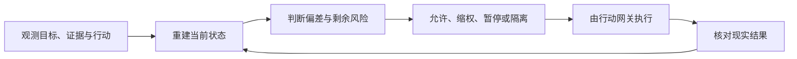

# Agent 接入生产后，真正缺的不是日志，而是一面可控制的系统镜像

Agent 正在从“给人建议的工具”变成“直接改变系统的行动者”。它不只生成代码和文本，还会调用接口、修改数据、触发部署、发送消息，甚至影响资金与权限。

多数团队仍沿用普通软件的观测方式来管理它：记录 token、延迟、错误率、调用链和模型评分。这些数据能说明一次调用发生了什么，却很难回答生产控制真正关心的问题——Agent 为什么采取这个行动，它依据的事实是否仍然有效，外部世界是否已经改变，以及出错后还有没有来得及生效的退路。

当 Agent 可以自主行动时，事件记录不再等于系统状态。日志即使完整，人类仍可能不知道自己正在控制什么。

本文的判断是：详尽监控不应被理解为收集更多数据，而应被设计成一面面向控制的动态系统镜像。它持续连接目标、证据、行动、权限、现实结果和恢复路径，是人类对 Agent 实施精细控制的认识基础。没有这面镜像，权限、Judge、回滚和人工审批都可能在控制一个已经过时或从未真实存在的世界。

## “看见事件”和“认识状态”是两件事

日志告诉我们已经发生了哪些事件。控制需要知道的却是：系统现在处于什么状态，正在偏离什么，还有哪些动作可以把它带回安全范围。

这两类信息并不等价。

一次工具调用返回 `success`，只能证明某个接口接受了请求。它不能证明第三方已经完成处理，也不能证明异步任务没有重复执行，更不能证明 Agent 的目标判断本身正确。

假设一个 Agent 负责为退款超时用户补发优惠券。它查询订单、判断资格、调用发券接口。第一次请求超时，于是 Agent 再试一次。两次请求都被第三方处理，最终用户收到两张券。

这是一个用于解释机制的假设场景，不是真实事故复盘。日志可能完整记录两次请求、一次超时和两个返回值，但它仍回答不了：第一次调用是否已经改变外部世界，第二次行动是否还被允许，异常发生后谁能立即冻结发券能力。

完整事件，不等于完整状态。

## 动态系统镜像到底要重建什么

一面面向控制的动态镜像，不需要保存 Agent 的每个 token。它需要持续回答会改变控制决定的问题：

| 控制问题 | 发券场景中的状态 |
|---|---|
| 当前目标是什么 | 为指定退款单完成一次补偿，而不是“调用一次发券接口” |
| 判断依据是什么 | 退款时间、用户资格、历史补偿记录，以及各自的来源和有效期 |
| 准备改变什么 | 为指定用户新增一张有金额上限的券 |
| 当前是否有资格行动 | 任务、对象、额度、策略版本和时间窗口是否仍然匹配 |
| 现实实际发生了什么 | 券平台最终入账数量，而不是接口是否返回成功 |
| 出错后还有什么退路 | 冻结发券能力、对账、撤销或补偿、转入人工流程 |

这些状态必须被连接起来，而不是散落在不同日志和仪表盘里。控制器需要知道某个判断来自哪份数据、数据何时读取、环境之后是否变化，以及一项权限依赖哪些仍然有效的证据。

这正是“镜像”的含义：它不是复制系统的全部细节，而是重建与当前控制目标有关的状态。

[Kalman 对可观测性与可控性的区分](https://doi.org/10.1137/0301010)来自线性动态系统，并不直接给出 Agent 监控方案；但它提供了一条可靠边界：能看到输入输出，不代表掌握了足以控制系统的内部状态。[Conant 与 Ashby](https://doi.org/10.1080/00207727008920220)则进一步说明，在给定假设下，有效调节器需要一个与调节目标相适配的系统模型。

映射到 Agent 系统，这意味着监控不能从“我们能采集什么”出发，而要从“我们准备做什么控制决定”反推需要认识哪些状态。

## Agent 改变哪部分现实，监控就必须抵达哪里

软件团队习惯把工具回执当成完成证据，因为传统调用大多有相对明确的接口边界。Agent 把多个工具和系统串起来后，这种假设变得危险。

`git push` 成功，不代表正确版本已经安全运行；数据库更新返回成功，不代表下游副本已经一致；发布接口返回成功，也不代表目标用户看到的是正确内容。

工具回执描述的是动作，真实结果描述的是世界。

如果 Agent 改变了账务状态，监控就必须连接最终账本；如果它改变了权限，监控就必须读取最终权限状态；如果它发布了内容，监控就必须验证公开位置、对象和可见结果。

否则，系统会在最关键的地方形成一个闭环幻觉：Agent 根据自己的计划行动，再根据工具返回值证明自己已经成功。整个过程内部一致，却没有和现实发生校准。

## 监控只有进入控制回路才有价值

详尽监控是认识基础，不是完整控制。

系统即使准确发现 Agent 正在重复发券，如果只能向一个过载的值班群发送告警，而发券凭证仍然有效，损失就会继续扩大。

完整闭环需要把状态认识连接到能够真正生效的动作：

这条链上任何一段断开，控制都会变成假象。

状态镜像过期，控制器依据的就是旧世界；告警没有撤权和隔离通道，系统只能旁观失控；“暂停”只改变数据库里的一个字段，却没有真正阻止调用，仪表盘虽然变绿，权限仍在生效。

所以，监控项是否有价值，不能只看它记录了多少信息。更重要的是它能否改变一个控制决定，这个决定能否通过不可绕过的动作生效，最后又能否由现实结果验证。

## 真正的被控对象，不只是模型节点

重复发券可能来自模型误判，也可能来自第三方重试、缓存延迟、凭证没有真正撤销、审批队列过载，或者业务目标鼓励团队绕开门禁。

如果监控只盯着模型输入输出，系统会把大量关键扰动留在视野之外。

真正需要重建的是“Agent—工具—环境—人—组织”组成的社会技术系统。Agent 在任务环境中选择行动，工具负责执行，外部环境产生真实结果，人和组织又决定权限、目标、响应时间和否决权。

[Leveson 的 STAMP 系统安全理论](https://direct.mit.edu/books/oa-monograph/2908/Engineering-a-Safer-WorldSystems-Thinking-Applied)并不研究 LLM，但它揭示了复杂事故的一类共同机制：安全约束可能没有被发出、执行得太晚、作用对象错误，或者控制器依据了过期的系统模型。

这也是为什么增加几个 Judge 并不自然得到可靠控制。如果 Judge 与 Agent 使用相同模型、相同上下文和相同错误数据，它们可能只是用不同措辞重复同一个盲点。

证据不仅要多，还要有来源、时间、版本和相对独立的故障路径。

## 控制面一旦失明，自主权就必须收缩

生产自主权不应是 Agent 获得一次后永久保留的等级。它更像一组持续续期的运行资格：关键状态仍然可见，控制动作仍然可达，安全退路仍然可用，这项能力才可以继续自主运行。

如果退款资格数据已经过期，自动发券就应暂停；如果无法确认撤权命令真正生效，就应在更外层冻结凭证；如果对账链路中断，对应能力就只能降为只读或转人工。

这里不需要整个系统一刀切停机。哪个关键状态不可见，就收缩依赖该状态的能力；哪个控制动作不可达，就撤掉需要它兜底的资格。

因此，真正被授权的不是“这个 Agent”，而是在指定任务、对象、范围、版本和时间窗口内执行的一项具体能力。

模型能力决定 Agent 会做什么，控制覆盖决定系统此刻允许它自主做什么。

## 高风险能力必须有一条独立退路

当 Agent 本身失灵时，系统还需要一条不依赖它继续正确工作的安全通道。

在发券场景里，第一步不是要求 Agent 自己重新分析，而是从独立位置冻结新增发券，阻止影响继续扩大。之后再对账，确认哪些券已经入账，最后决定撤销还是补偿。

安全退路、回滚和补偿是三件事。安全退路先停止扩散，回滚恢复内部版本，补偿处理已经进入现实、无法简单撤销的副作用。

[NASA 关于自主系统运行时保障的研究](https://ntrs.nasa.gov/api/citations/20180006312/downloads/20180006312.pdf)提供了一种可借鉴的结构：高性能但不完全可信的功能可以运行，监控、切换和替代安全通道则由更可信、相对独立的机制承担。替代通道不需要和主功能一样强，只需要把系统带到更安全的状态。

对软件 Agent，这可能是撤销生产凭证、切换只读、保持旧版本、隔离消息消费者，或者进入经过演练的人工流程。

没有独立且可验证的退路，高风险能力就不应自主进入生产。

## “详尽”必须由控制价值约束

详尽监控最容易走向另一个极端：保存全部过程、增加更多字段、建设更多仪表盘，再把每个未知都交给人工审批。

这样的系统可能很少出错，也可能根本无法工作。它会带来时延、噪声、存储、隐私和审批疲劳，最后把 Agent 的自动化收益全部转化为组织成本。

判断一个监控项是否值得建设，可以连续追问三次：它会改变哪个控制决定？这个决定通过什么动作真正生效？最终用什么现实结果证明动作有效？

如果一个字段不改变任何决定，它大概率只是记录；如果一个告警没有对应动作，它只是通知；如果一个动作没有现实验证，它只是控制器的自我声明。

第一个控制面也不需要覆盖所有 Agent。可以选择一项带真实副作用、结果能够核验的高风险能力，比较现有流程、只增加观测的流程和形成完整闭环的流程。只有当静默失败和真实损失下降，而且收益大于误杀、时延、人工与基础设施成本，这面镜像才创造了生产价值。

## 人类要驾驭的是一个持续变化的系统

Agent 系统之所以难以驾驭，不只是因为模型输出存在不确定性。目标会变化，证据会过期，工具会重试，权限会漂移，外部环境也会在 Agent 行动之后继续变化。

普通日志擅长保存这些变化留下的事件，却不会自动告诉我们：系统现在是什么，正在偏离什么，我们还能做什么。

一面面向控制的动态镜像，要持续回答的正是这三个问题。

它不保证 Agent 永远正确，也不试图替 Agent 决定每一步。它让人类能够在现实还来得及改变时，看见足以判断的状态，调用足以生效的动作，并用真实结果校准下一次控制。

详尽监控的价值，不是让我们看见更多 Agent 活动。

而是让我们终于知道，自己是否仍然有能力驾驭它。
