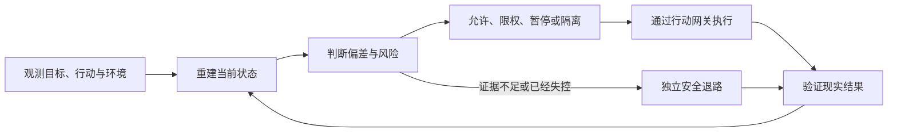

# Agent 会做，不等于它有资格做：生产自主权必须一项项挣得

假设一个 Agent 负责处理退款超时用户。

它识别订单、判断资格、调用接口，为用户补发一张 10 元优惠券。代码通过测试，接口也返回成功，一切看起来都很正常。

几分钟后，对账系统发现：同一用户收到了两张券。原因是第三方平台在超时后重放了一次请求。

这时，回滚代码已经不够了。券已经进入用户账户，现实世界被改变了。

这个例子指出了 Agent 进入生产前最重要的问题：不是“它会不会做”，而是“它做错时，我们还能不能及时停下来”。

如果系统不能发现偏差、阻止扩散并回到安全状态，那么这个 Agent 只是拥有能力，还没有取得生产资格。

## 能力是模型的，资格是系统授予的

一个模型会写代码，只能证明它能生成代码。一个 Agent 能调用发券接口，只能证明它拥有工具。

这些都不能证明：当它理解错目标、使用了过期信息、误判工具回执，或者遇到第三方的异常行为时，整个系统仍然在人类可以驾驭的范围内。

普通软件主要沿着预先写好的逻辑运行。Agent 却会自己解释目标、选择路径、组合工具，并改变外部环境。能力越强，它改变现实的速度越快，错误扩散的范围也可能越大。

因此，生产自主权不应该是贴在 Agent 身上的永久等级。

它应该是控制系统针对某项能力、在特定条件下授予的一次运行资格。条件失效，资格就收回。

## 监控的目的，不是记录一切

团队谈到 Agent 监控时，往往先想到 token、延迟、错误率和调用链。

这些数据有用，但它们只能告诉你“发生了什么”，不一定能告诉你“现在还能不能控制”。

真正服务于控制的状态还包括：

- Agent 接受了什么目标和约束；
- 它依据了哪些来源，哪些判断仍是假设；
- 它准备改变什么对象，影响范围有多大；
- 外部世界是否已经变化，当前证据是否过期；
- 一旦判断错误，还有没有来得及生效的恢复路径。

控制理论早已区分输入输出、内部状态、可观测性和可控性。[Kalman](https://doi.org/10.1137/0301010) 对线性动态系统的研究表明，看到输入输出，不等于掌握系统的全部状态；能看见状态，也不等于能把系统带向目标。[Conant 与 Ashby](https://doi.org/10.1080/00207727008920220) 则指出，在给定假设下，一个既成功又简洁的调节器，需要包含与调节目的相适配的系统模型。

映射到 Agent 系统，监控真正要生产的不是更大的数据湖，而是一面持续更新的“系统镜像”：目标是什么，系统现在在哪里，证据有多可靠，下一步会造成什么，以及出错后还有哪些退路。

如果全量 trace 回答不了这些问题，它只是一份昂贵的事故档案。

## 看见之后，还必须能干预

监控到错误，不等于控制住错误。

系统可以准确发现 Agent 正在重复发券，但如果它只能向值班群发送告警，而发券凭证仍在 Agent 手里，损失就会继续扩大。

完整的控制回路至少包含五步：

这条回路里，有三处最容易断掉。

第一，工具返回 `success`，不代表现实已经成功。状态必须带上来源、时间和不确定性。

第二，控制决定必须真的改变执行权限。只有告警，没有限速、撤权、暂停、隔离或接管能力，系统仍然不可控。

第三，现实结果必须回来校准系统镜像。否则控制器会越来越精确地控制一个已经过时的世界。

[Ashby 的必要多样性定律](https://ashby.info/Ashby-Introduction-to-Cybernetics.pdf)也提醒我们：面对多种重要扰动，控制器不能只有“允许”和“拒绝”两种响应。它还需要缩权、限速、暂停、隔离、只读、恢复、补偿、转人工和终止。

一个风险即使被看见，却没有能在干预窗口内生效的动作，它仍然是一个控制缺口。

## 不要授权一个 Agent，要授权一次具体行动

“这个 Agent 可以操作生产数据库”，范围太大。

更合理的授权是：“在未来 10 分钟内，只允许它为这批灰度租户更新有快照的指定字段，最多修改 100 条记录。”

同样，不是允许“使用券平台”，而是允许“为这张满足资格条件的退款单，发放一张不超过 10 元的补偿券”；不是允许“执行 git push”，而是允许“把这个已验证的 commit 推到指定分支”。

自主权的最小单位应该是：

`具体能力 × 风险等级 × 作用范围 × 有效时间`

2026 年的预印本 [Context-to-Execution Integrity](https://arxiv.org/abs/2607.06000) 提供了一种值得借鉴、但仍待更多生产验证的结构：模型只提出行动，真正执行前，再把目标、基础状态、精确效果、权限主体、策略版本和有效期固化，签发一次性的执行资格。

这不意味着每个动作都要进入重型审批。只读、可逆、影响局部且能立即验证的操作，可以默认允许。越接近资金、权限、部署、跨系统写入和公开发布，授权边界才越需要精确。

## 高风险自主权，需要一条不依赖 Agent 的退路

现在回到开头的重复发券。

事故发生后，系统要做三件不同的事：

- 先隔离发券能力，阻止影响继续扩大；
- 再回滚代码或运行状态，修复内部系统；
- 最后对账和补偿，处理已经发生的现实副作用。

这三件事不能混为一谈。回滚代码，无法自动收回已经进入用户账户的券。

更关键的是，隔离能力不能依赖这个 Agent 继续正确工作。如果必须先请求 Agent 自己撤掉自己的权限，那么所谓控制面仍然建立在被控对象保持清醒之上。

[NASA 对智能自主系统的安全研究](https://ntrs.nasa.gov/api/citations/20180006312/downloads/20180006312.pdf)给出了一条直接思路：高性能但不完全可信的功能可以运行，安全保障则由更可信的监控器、切换器和替代通道承担。替代通道不需要同样强，只需要把系统带入更安全的状态。

对软件 Agent 来说，这条退路可能是撤销生产写权限、冻结新增影响、切换只读、保持旧版本、隔离消息消费者，或者转入经过演练的人工流程。

没有这种独立、可验证、能及时生效的退路，高风险能力就不应自主进入生产。它仍然可以在沙箱、只读模式或人工逐次控制下工作。

## 控制面失明，自主权就要收缩

控制面本身也会出错。

遥测可能丢事件，状态镜像可能停留在几分钟前，Judge 可能和 Agent 共享同一种盲点，“暂停”状态也可能没有真正撤掉凭证。最危险的情况是：仪表盘仍然全绿，系统其实已经失去控制能力。

因此，一项能力能获得多大自主权，不能超过控制面对它的可验证覆盖程度。

退款资格数据过期，就暂停自动发券；撤权命令无法确认生效，就在更外层冻结凭证；安全退路的健康检查失败，就把对应能力降为只读或转人工。

这里不需要把整个系统一刀切停机。哪个关键状态不可见，就收缩依赖该状态的能力；哪个控制动作不可达，就撤掉需要这个动作兜底的资格。

自主权不是一次审批后的永久资产。它必须随着证据的新鲜度和控制能力动态变化。

## 人在环，也必须是控制系统的一部分

“关键步骤由人工审批”听起来很安全，实际上还远远不够。

审批者能否看懂证据？是否有足够时间？是否拥有否决权？触发隔离后，谁确认新增影响已经停止？如果一个人连续审批数小时，只能看到 Agent 自己生成的摘要，也无权冻结执行，那么他不是可靠控制器，只是在自动化偏差上盖了一枚人工印章。

[Leveson 的 STAMP 系统安全理论](https://direct.mit.edu/books/oa-monograph/2908/Engineering-a-Safer-WorldSystems-Thinking-Applied)把复杂事故理解为分层控制结构中的安全约束失效：动作可能没有发出，也可能太晚、对象错误或停止过早；控制器可能使用了过期模型，执行层也可能没有遵循命令。

所以，真正需要控制的从来不只是模型，而是“Agent—工具—环境—人—组织”组成的整个系统。

## 怎样证明控制面没有吞掉生产力

控制面也可能走向另一个极端：采集更多字段，增加更多 Judge，把每个未知都变成人工审批。

这样的系统或许很少犯错，也可能根本无法工作。

第一个控制面不应以“上线了多少模块”验收，而应以控制净收益验收。可以选择一项带外部副作用的高风险能力，固定 Agent、模型、提示、工具、任务和故障种子，然后比较三组：

1. 现有 Agent 工作流；
2. 增加系统镜像，但只告警、不干预；
3. 让同样的观测进入完整控制闭环。

第二组优于第一组，只能证明“看见”有价值。第三组继续优于第二组，才能证明监控真正变成了控制。

评价也不能只看拦截数量。还要同时报告静默失败、真实损失、干预时延、恢复净效果，以及误杀率、任务时延、人工时间、基础设施成本和隐私暴露。

如果安全收益不足，或者生产损耗过高，这套控制面就没有通过。

## 技术负责人应该重新定义“生产准入”

模型能力决定 Agent 能做什么，控制系统决定它被允许自主做什么。

技术负责人真正要批准的，不应是“这个 Agent 可以上线”，而应是更具体的事实：

- 这项能力的关键状态能够被重建；
- 偏差出现时，有不可绕过的控制动作；
- Agent 失灵时，有独立安全退路；
- 外部副作用能够被真实验证；
- 控制收益大于它制造的生产损耗。

生产自主权不应默认获得，也不该永久保留。

它必须按能力被证明、被限制，并在证据失效时被收回。
