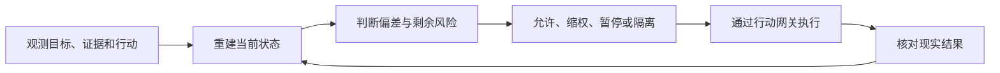

# 你不是缺日志，而是不知道 Agent 正在改变什么

一个 Agent 接到任务：为退款超时的用户补发一张 10 元优惠券。

它查询订单，判断用户符合条件，调用发券接口。接口返回 `success`，任务结束。

几分钟后，对账系统发现，同一个用户收到了两张券。第三方平台在响应超时后重放了一次请求，而 Agent 把第一次超时理解成“没有成功”，于是又发了一次。

日志其实都在：两次请求、一次超时、两次成功入账，没有一条丢失。

可事故发生时，团队仍然回答不了几个最基本的问题：Agent 当时相信什么？它依据的数据是否仍然有效？第一次请求究竟有没有改变外部世界？它为什么还有资格再发一次？发现异常后，谁能立即关掉发券能力？

这就是许多 Agent 系统的真实困境：我们记录了大量事件，却没有重建系统当前是什么。

## 详尽监控，不等于收集所有数据

日志是一串已经发生的事件。控制需要的却是另一种东西：在任意时刻，都能重建一份足够可靠的当前状态，据此判断 Agent 能不能继续行动。

这份状态至少要回答六个问题：

| 控制问题 | 发券场景中的具体答案 |
|---|---|
| Agent 正在完成什么目标 | 为退款超时订单补偿一张券 |
| 它依据什么事实 | 退款时间、用户资格、历史补偿记录 |
| 这些事实是否仍然有效 | 数据来源、读取时间、版本和有效期 |
| 它准备改变什么 | 为指定用户新增一张 10 元券 |
| 外部世界实际发生了什么 | 券平台最终入账数量，而不是接口是否返回 `success` |
| 出错后怎样停止和恢复 | 冻结发券资格、对账、撤销或补偿、转人工 |

这才是“详尽”的含义：不是每个 token 都保存，而是控制所需的关键状态不能缺席。

我更愿意把它称为智能体系统的动态镜像。它把目标、证据、行动、权限、外部结果和退路连在一起，让人和系统都能看到：Agent 现在处于什么状态，下一步可能改变什么，以及还有没有机会干预。

如果全量 trace 不能回答这些问题，它只是一份更昂贵的事故档案。

## 为什么工具返回成功，仍然不代表任务成功

在传统接口监控里，`200 OK` 往往意味着一次调用成功。

在 Agent 系统里，它最多证明服务端接受了请求。真实世界可能稍后才发生变化，也可能因为重试、异步消费或第三方状态漂移，产生与返回值不同的结果。

发券场景中，真正重要的不是“请求成功过几次”，而是“这个退款单最终对应几张有效券”。

因此，动态镜像不能只记录工具回执，还要连接现实结果：券平台的最终账本、退款单与券号的对应关系，以及对账结果何时才算稳定。

这条原则可以直接迁移到其他生产动作：

- `git push` 成功，不代表正确版本已经安全运行；
- 数据库更新返回成功，不代表所有下游副本已经一致；
- 发布接口返回成功，不代表目标用户看到的是正确内容；
- 邮件发送成功，不代表收件人、附件和权限边界都正确。

Agent 改变了哪一部分现实，监控就必须抵达那一部分现实。

## 看清状态之后，控制才有可能发生

监控本身不会阻止第二张券发出。

它的价值是让控制器能够比较“系统现在在哪里”和“系统允许在哪里”，然后选择来得及生效的动作。

这条闭环里，任何一段断开，控制都会变成假象。

如果状态镜像停留在几分钟前，判断依据就是旧世界；如果系统只会发告警，却不能撤掉发券凭证，错误仍会继续；如果“暂停”只改了数据库里的一个字段，却没有真的阻止调用，仪表盘虽然变绿，控制并没有生效。

所以，详尽监控不是完整解法，但它是精细控制不可替代的认识基础。没有它，系统只能盲目干预；只有它而没有行动通道，系统只能清醒地看着事故发生。

## 真正的监控对象，不只是 Agent

重复发券可能来自模型误判，也可能来自第三方重试、缓存延迟、权限配置、人工审批过载，或者业务目标本身鼓励团队绕过门禁。

因此，只盯着模型输入输出是不够的。需要被重建的是整个“Agent—工具—环境—人—组织”系统。

Agent 是这个系统里的行动者，但不是唯一变量。工具是否真的执行、外部状态是否改变、审批者能否看懂证据、谁拥有冻结权限，都会决定最后结果。

这也是为什么增加几个 Judge 不能自然得到可靠控制。如果 Judge 与 Agent 使用同一种模型、同一份上下文和同一批错误数据，它们可能只是用不同措辞重复同一种盲点。

可靠证据不仅要多，还要有来源、时间、版本和相对独立的故障路径。

## 一旦看不清，自主权就应该收缩

生产自主权不应该是 Agent 获得一次后永久保留的等级。

它更像一张持续续期的通行证：系统能看清关键状态，控制动作能够生效，安全退路仍然可用，这项能力才可以继续自主运行。

如果退款资格数据过期，就暂停自动发券；如果无法确认撤权命令生效，就在更外层冻结凭证；如果对账链路中断，就把对应能力降为只读或转人工。

这里不需要整个系统一刀切停机。哪个状态不可见，就收缩依赖它的能力；哪个退路失效，就撤掉需要这条退路兜底的资格。

因此，真正被授权的不是“这个 Agent”，而是一项边界明确的行动：在指定任务、对象、金额、版本和时间窗口内，执行一次可以验证的改变。

模型能力决定 Agent 会做什么，动态镜像决定系统此刻是否有足够证据允许它去做。

## 高风险能力必须有一条独立退路

现在回到重复发券事故。

系统首先要做的不是回滚代码，而是停止新增影响：冻结发券能力或撤掉相关凭证。然后才是对账，确认哪些券已经进入用户账户，再决定撤销还是补偿。

这条安全退路不能依赖出错的 Agent 继续正确工作。如果必须请求它自己关闭自己的权限，控制仍然建立在被控对象保持清醒之上。

[NASA 关于自主系统运行时保障的研究](https://ntrs.nasa.gov/api/citations/20180006312/downloads/20180006312.pdf)提供了一种清晰结构：高性能但不完全可信的功能可以运行，但监控、切换和替代安全通道由更可信、相对独立的机制承担。替代通道不必同样强，只需要把系统带到更安全的状态。

对软件 Agent，这可能意味着切换只读、保留旧版本、隔离消息消费者、冻结资金动作，或者进入经过演练的人工流程。

没有独立且可验证的退路，高风险能力就不应自主进入生产。

## 详尽监控怎样避免变成新的负担

“详尽”很容易被误解为采集更多字段、保存所有过程、增加更多仪表盘和审批。

这样做会制造新的问题：时延、噪声、存储成本、隐私风险和人工疲劳。最后，控制面可能非常擅长阻止 Agent，却没有证明自己能帮助团队更稳定地完成任务。

判断一个监控项是否值得保留，可以问三个问题：

1. 它改变哪个控制决定？
2. 这个决定能通过什么动作真正生效？
3. 最终如何验证这个动作改善了现实结果？

如果一个字段不会改变任何决定，它大概率只是记录；如果一个告警没有对应的控制动作，它只是通知；如果一个动作没有现实结果验证，它只是自我安慰。

第一个控制面也不需要覆盖所有 Agent。选择一项具有真实副作用的高风险能力，比较现有流程、只增加观测的流程，以及形成完整控制闭环的流程。只有当静默失败和真实损失下降，并且收益大于误杀、时延、人工与基础设施成本，它才算生产工具，而不是新的流程负担。

## 人类要驾驭的，是一个持续变化的系统

智能体系统之所以难以驾驭，不只是因为模型会产生不确定输出，而是因为目标、上下文、权限、工具和外部环境都在变化。任何一次局部变化，都可能沿着行动链放大成现实副作用。

人类不可能靠阅读更多日志来跟上这种变化。

真正需要建设的是一面面向控制的动态镜像：它不追求记录一切，而是在现实还来得及改变时，持续回答三个问题——系统现在是什么，正在偏离什么，我们还能做什么。

能回答这三个问题，监控才不只是“看见 Agent”。

它开始让人类有可能驾驭 Agent。

---

本文对“状态认识”和“控制能力”的区分，受到 [Kalman 可观测性与可控性](https://doi.org/10.1137/0301010)、[Conant–Ashby 良好调节器定理](https://doi.org/10.1080/00207727008920220)、[Ashby 必要多样性](https://ashby.info/Ashby-Introduction-to-Cybernetics.pdf)以及 [Leveson 的 STAMP 系统安全理论](https://direct.mit.edu/books/oa-monograph/2908/Engineering-a-Safer-WorldSystems-Thinking-Applied)启发。它们并不直接研究 LLM Agent；本文将这些原则映射到智能体生产系统，属于工程推论。
