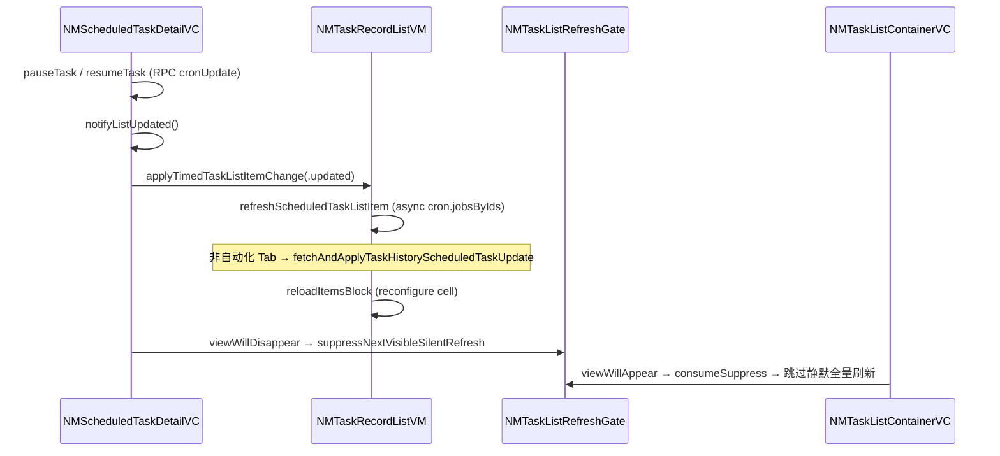

# 排查任务：定时任务详情暂停/启用后非自动化 Tab 列表卡片状态未刷新

**创建日期**：2026-06-10
**存放路径**：`Plans/Bug排查/2026-06-10-定时任务列表状态未刷新.md`
**状态**：进行中
**优先级**：P1（功能体验问题，不影响核心链路）

## 现象描述

在【定时任务管理】中，于**非「自动化」Tab**（全部 / 主龙虾 / 其他龙虾）进入定时任务详情页，执行**暂停**或**启用**后返回列表，对应卡片上的状态标签（执行中 / 已暂停）**未立即更新**，需下拉刷新或重新进入才变。

**最小复现路径（待实机确认）**：

1. 网关已连接，进入任务页 → 切换到「全部」或「主龙虾」或「其他龙虾」
2. 点击一条定时任务卡片 → 进入详情
3. 点击底部「暂停」或「启用」→ Toast 成功
4. 立即返回列表 → 观察该卡片状态角标

**对比基线**：「自动化」Tab 同操作后状态是否正常更新？

## 已知信息

| 项 | 内容 |
|---|---|
| 环境 | iOS Claw 客户端，Gateway 需已连接 |
| 影响范围 | `tabMode ∈ { .all, .mainClaw, .otherClaw }`；自动化 Tab 可能正常 |
| 最近变更 | `NMTaskRecordListVM+TimedTask.swift` 增量同步、`NMTaskListRefreshGate` 静默刷新抑制 |
| 历史材料 | 知识库 `Plans/Bug排查/` 无同类记录；`Contexts/` 无定时任务相关 |

## AI 输出要求

1. 按「现象 → 可能原因列表 → 排查步骤（带命令/操作）→ 验证方法」输出。
2. 不要猜测未经证实的根因。
3. 最后给出是否建议继续调试或升级。

## 代码链路（已定位）



**关键文件**：

| 文件 | 职责 |
|------|------|
| `NMScheduledTaskDetailViewController.swift` | 暂停/启用 → `notifyListUpdated()`；pop 时抑制静默刷新 |
| `NMScheduledTaskDetailListVM.swift` | `pauseTask`/`resumeTask` 更新详情侧 `jobEnabled`、`cronJobStatusOverride` |
| `NMTaskRecordListVM+TimedTask.swift` | `applyTimedTaskListItemChange` → 非自动化 Tab 异步 `cron.jobsByIds` 增量同步 |
| `NMScheduledTaskCellVM.swift` | `status`：有 `cronJob` 走 `fromCronJobListEntry`；否则走 `timedTaskStatus(jobEnabled)` |
| `NMTaskListRefreshGate` + `NMTaskListContainerViewController` | pop 详情后跳过 `viewWillAppear` 静默刷新 |

## 可能原因（待验证，按优先级）

| # | 假设 | 依据 |
|---|------|------|
| H1 | **乐观更新缺失 + 异步竞态**：详情只改详情页 `conversation` 副本；列表依赖异步 `cron.jobsByIds`，用户快速 pop 时增量未完成 | `notifyListUpdated` 不直接改列表 CellVM；`fetchAndApplyTaskHistoryScheduledTaskUpdate` 为 async Task |
| H2 | **静默刷新被 Gate 抑制**：pop 触发 `suppressNextVisibleSilentRefresh`，`viewWillAppear` 不兜底；H1 未完成则 UI 不变 | `NMScheduledTaskDetailViewController:39-43`、`NMTaskListContainerViewController:41-42` |
| H3 | **`reloadIndexPaths` 为空**：`jobId` 匹配失败，增量同步未触发 cell 刷新 | `fetchAndApplyTaskHistoryScheduledTaskUpdate` 要求 `conversation.jobId == normalizedJobId` |
| H4 | **有 `cronJob` 时状态源不一致**：同步后清 `cronJobStatusOverride`，依赖服务端 `displayJobStatus`/`enabled`；服务端延迟则状态不变 | `syncScheduledTaskConversation` 将 override 置 nil |
| H5 | **`loadTask?.cancel()` 取消 pending 更新**：其他列表操作取消进行中的增量同步 | `refreshScheduledTaskListItem` 开头 `loadTask?.cancel()` |
| H6 | **`reconfigureItemsAtIndexPaths` 未刷新可见 cell**（低概率） | 非自动化 Tab 用 `reconfigurePartialMessages` 而非 `reloadItemsAtIndexPaths` |

## 排查步骤（勾选进度）

- [ ] 1. 复现并记录最小复现路径（含自动化 Tab 对比）
- [ ] 2. 加临时日志验证 H1–H3（见下方断点/日志点）
- [ ] 3. 缩小范围（非自动化 Tab vs 自动化 Tab；有/无 `cronJob` 补全）
- [ ] 4. 提出假设并逐一验证
- [ ] 5. 修复并回归验证（全部 / 主龙虾 / 其他龙虾 / 自动化 + 跨 Tab 广播）
- [ ] 6. 结论写入 Contexts/

## 假设与验证

| 假设 | 验证方法 | 结果 |
|------|----------|------|
| H1 异步竞态 | 详情暂停后**不立即 pop**，等 2s 再返回，状态是否更新 | 待验证 |
| H2 Gate 抑制兜底 | 暂停后立即 pop，下拉刷新是否恢复；或临时注释 Gate 看是否修复 | 待验证 |
| H3 jobId 匹配失败 | 在 `fetchAndApplyTaskHistoryScheduledTaskUpdate` 打日志：`normalizedJobId`、`reloadIndexPaths.count` | 待验证 |
| H4 服务端 jobStatus 延迟 | 对比 `cron.jobsByIds` 返回的 `enabled`/`displayJobStatus` 与 UI | 待验证 |
| H5 loadTask 被取消 | 日志 `loadTask` cancel 时机与 `refreshScheduledTaskListItem` 调用栈 | 待验证 |

## 建议断点 / 日志点

```swift
// NMScheduledTaskDetailViewController.handlePause — notifyListUpdated 前
// NMTaskRecordListVM+TimedTask.fetchAndApplyTaskHistoryScheduledTaskUpdate
//   - normalizedJobId
//   - reloadIndexPaths.count
//   - job.enabled / job.displayJobStatus
// NMTaskListRefreshGate.consumeSuppressVisibleSilentRefresh — 是否 return true
```

**第一条执行指令**：

> 在「全部」Tab 复现：进入详情 → 暂停 → **立刻返回** vs **等 2 秒再返回**，对比卡片状态。
> - 若「等 2 秒」正常 → 优先 H1（补列表侧乐观更新，或 pop 前 await 增量同步）
> - 若两种都不变 → 优先 H3（查 `jobId` 匹配与 `reloadIndexPaths`）

## 修复方向（验证后择一，勿提前改）

1. **乐观更新（推荐）**：`applyTimedTaskListItemChange(.updated)` 时，非自动化 Tab 先同步 `jobEnabled` / `cronJobStatusOverride` 到匹配 CellVM 并 `reloadItemsBlock`，再异步 `cron.jobsByIds` 校准
2. **有条件取消 Gate 抑制**：详情有 pause/resume 变更时，pop 不 suppress 静默刷新
3. **await 增量同步**：`notifyListUpdated` 改为 await `fetchAndApplyTaskHistoryScheduledTaskUpdate` 完成后再允许返回（体验略差）
4. **H3 修复**：统一 `jobId` 解析为 `resolvedCronJobId` 做列表匹配

## 我的拍板点

- [ ] 确认边界：仅修非自动化 Tab 列表刷新，不动自动化 Tab 既有逻辑
- [ ] 最终方案需我确认后再执行

## 相关材料

- **代码位置**：
  - `Claw/Features/Conversation/NMScheduledTaskDetailViewController.swift`
  - `Claw/Features/Conversation/MainList/view/NMTaskRecordListVM+TimedTask.swift`
  - `Claw/Features/Conversation/MainList/view/NMScheduledTaskCellVM.swift`
  - `Claw/Features/Conversation/MainList/view/NMScheduledTaskDetailListVM.swift`
  - `Claw/Features/Conversation/NMTaskListContainerViewController.swift`
- **Contexts**：暂无
- **历史 Plans**：`2026-06-10-API超时排查.md`（格式参考）

## 续做提示

> 新会话：`@Skills/resume_assistant.md 续做，plan文件名=Bug排查/2026-06-10-定时任务列表状态未刷新.md，当前进度=步骤1复现中`

## 后续链接

- [[定时任务管理]]

## 结论

**是否建议继续调试**：是。链路已定位，H1+H2 组合概率最高，可用「立即返回 vs 延迟返回」快速二分。
