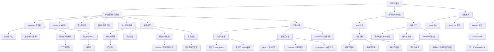

# 学习 Epic：智能体开发（工作流：learning-loop）

**创建日期**：2026-07-08  
**存放路径**：`Plans/Epic/2026-07-08-智能体开发.md`  
**状态**：进行中  
**workflow**：`learning-loop`

> 本 Epic 根据用户提供的智能体操作系统图，从目标输入开始，逐步学习单智能体操作系统，再进入工具、记忆、安全、世界模型与多智能体协作。每一轮具体学习事实写入 `Plans/学习循环/`。

---

## 一、学习目标

| 项 | 内容 |
|----|------|
| 学习主题 | 智能体开发 |
| 为什么学 | 理解智能体从“接收目标”到“规划、行动、验证、记忆、协作”的完整工程结构 |
| 最终能做什么 | 能独立设计并实现一个小型智能体：有目标循环、工具调用、安全约束、记忆、验证和多角色协作 |
| 明确不学 | 第一阶段不追具体框架 API，不追模型榜单，不直接做复杂产品 |
| 结束条件 | 用户明确说「这个旅程学完了」 |

---

## 二、子 Plan 索引

| 阶段 | stage key | 路径 | status |
|------|-----------|------|--------|
| 学习主题确认 | topic-intake | `Plans/学习循环/2026-07-09-学习主题-智能体开发-03-世界模型.md` | 已采纳 |
| AI 准备资料 | material-prepare | `Plans/学习循环/2026-07-09-学习资料-智能体开发-03-世界模型.md` | 已采纳 |
| 用户学习与答疑 | study | `Plans/学习循环/2026-07-09-学习答疑-智能体开发-03-世界模型.md` | 已采纳 |
| 实践任务 | practice | `Plans/学习循环/2026-07-09-学习实践-智能体开发-03-世界模型.md` | 已采纳 |
| AI 验证 | verify | `Plans/学习循环/2026-07-09-学习验证-智能体开发-03-世界模型.md` | 已通过 |
| 学习复盘 | retro | `Plans/学习循环/2026-07-11-学习复盘-智能体开发-03-世界模型.md` | 已采纳 |
| 学习记录与知识图谱增量 | record | `Plans/学习循环/2026-07-11-学习记录-智能体开发-03-世界模型.md` | 已采纳 |

> 说明：`plans.*` 和上表只表示当前活动循环入口，会随着下一轮学习切换；历史学习记录必须保留在「循环索引」和「知识图谱来源索引」，不能只依赖 `plans.*`。

---

## 三、循环索引（历史不可覆盖）

| 轮次 | 学习地图节点 | 状态 | 本轮主题 | 子 Plan 链路 | 学习记录 | 图谱增量 |
|------|--------------|------|----------|--------------|----------|----------|
| 01 | L0 总览与目标循环 | ✅ 已完成 | 用户目标如何进入智能体 | topic-intake: `Plans/学习循环/2026-07-08-学习主题-智能体开发-01-总览与目标循环.md`<br>material-prepare: `Plans/学习循环/2026-07-08-学习资料-智能体开发-01-总览与目标循环.md`<br>study: `Plans/学习循环/2026-07-08-学习答疑-智能体开发-01-总览与目标循环.md`<br>practice: `Plans/学习循环/2026-07-09-学习实践-智能体开发-01-总览与目标循环.md`<br>verify: `Plans/学习循环/2026-07-09-学习验证-智能体开发-01-总览与目标循环.md`<br>retro: `Plans/学习循环/2026-07-09-学习复盘-智能体开发-01-总览与目标循环.md`<br>record: `Plans/学习循环/2026-07-09-学习记录-智能体开发-01-总览与目标循环.md` | `Plans/学习循环/2026-07-09-学习记录-智能体开发-01-总览与目标循环.md` | 目标循环；State；Reflection；Memory；Context Pack；World Model；Observation |
| 02 | L1 System 2 慢思考 | ✅ 已完成 | 规划、反思、内在模拟 | topic-intake: `Plans/学习循环/2026-07-09-学习主题-智能体开发-02-System2慢思考.md`<br>material-prepare: `Plans/学习循环/2026-07-09-学习资料-智能体开发-02-System2慢思考.md`<br>study: `Plans/学习循环/2026-07-09-学习答疑-智能体开发-02-System2慢思考.md`<br>practice: `Plans/学习循环/2026-07-09-学习实践-智能体开发-02-System2慢思考.md`<br>verify: `Plans/学习循环/2026-07-09-学习验证-智能体开发-02-System2慢思考.md`<br>retro: `Plans/学习循环/2026-07-09-学习复盘-智能体开发-02-System2慢思考.md`<br>record: `Plans/学习循环/2026-07-09-学习记录-智能体开发-02-System2慢思考.md` | `Plans/学习循环/2026-07-09-学习记录-智能体开发-02-System2慢思考.md` | System 2；读取上下文；可执行计划；行动前风险预测；System 1 任务包；工作区风险 |
| 03 | L2 世界模型 | ✅ 已完成 | 行动后果预测与内在试错 | topic-intake: `Plans/学习循环/2026-07-09-学习主题-智能体开发-03-世界模型.md`<br>material-prepare: `Plans/学习循环/2026-07-09-学习资料-智能体开发-03-世界模型.md`<br>study: `Plans/学习循环/2026-07-09-学习答疑-智能体开发-03-世界模型.md`<br>practice: `Plans/学习循环/2026-07-09-学习实践-智能体开发-03-世界模型.md`<br>verify: `Plans/学习循环/2026-07-09-学习验证-智能体开发-03-世界模型.md`<br>retro: `Plans/学习循环/2026-07-11-学习复盘-智能体开发-03-世界模型.md`<br>record: `Plans/学习循环/2026-07-11-学习记录-智能体开发-03-世界模型.md` | `Plans/学习循环/2026-07-11-学习记录-智能体开发-03-世界模型.md` | 世界模型；行动前预测；内在试错；候选行动比较；工具反馈 |
| 04 | L3-L6 双系统架构构建 | ✅ 已完成 | build-first：Python + DeepSeek API 构建完整 Agent | practice: `Plans/学习循环/2026-07-11-构建实践-智能体开发-04-双系统架构.md` | `Plans/学习循环/2026-07-11-构建实践-智能体开发-04-双系统架构.md` | System 1/2 分离；工具注册表；安全审核/审批/审计；四种记忆；世界模型预测→计划调整；function calling 原理 |
| 05 | L7 自我纠错与经验提炼 | ✅ 已完成 | 双信号触发、蒸馏三输出、合并去重 | `Plans/学习循环/2026-07-13-学习-智能体开发-05-自我纠错.md`（概念回补，代码已在 04 完成） | `Plans/学习循环/2026-07-13-学习-智能体开发-05-自我纠错.md` | 双信号触发；蒸馏三输出（facts/patterns/corrections）；corrections 独立存储；consolidate 阈值；信噪比 |
| 06 | L8 A2A 多智能体协作 | ✅ 已完成 | 消息总线、薄壳角色、Reviewer 独立性 | `Plans/学习循环/2026-07-13-学习-智能体开发-06-多智能体.md`（概念回补，代码已在 R1 完成） | `Plans/学习循环/2026-07-13-学习-智能体开发-06-多智能体.md` | 消息总线（留痕/解耦/可观测）；薄壳角色+能力层复用；Reviewer 独立性；决策 3-C；事后纠错 vs 事前预测 |
| 07 | L9 综合实践 | ✅ 已完成 | Predictor 独立角色 + Team 经验蒸馏 | `Plans/学习循环/2026-07-13-学习-智能体开发-07-综合实践.md` | `Plans/学习循环/2026-07-13-学习-智能体开发-07-综合实践.md` | Predictor 独立角色；事前+事后双重保障；Team 经验蒸馏（was_revised 硬信号）；单/多智能体完全对等 |
| 08 | R3 生产化 Agent Runtime | 进行中 | Orchestrator 已迁移 LangGraph；后续完善 eval/trace 与声明式定义 | `Plans/学习循环/2026-07-17-学习-智能体开发-08-R3生产化.md` | R3.1/R3.4 已验证 | 生产化 runtime；声明式 agent；eval/trace harness |

---

## 四、WBS 看板（学习循环 1–8，v2 理论+实践融合）

| # | 切片 | 归属 stage | Skill | 验收 |
|---|------|------------|-------|------|
| 1 | 确认学习主题与完成门槛 | topic-intake | workflow-router | 明确主题、范围和本轮完成门槛 |
| 2 | AI 准备核心概念（3 分钟能懂，不填卡） | material-prepare | material-prep-assistant | 概念精简到 3~5 个核心问题 |
| 3 | 用户理解概念 + 答疑 | study | material-prep-assistant | 用户能用自己的话解释核心概念 |
| 4a | 设计决策：用户做架构/方案选择 | design | feature-dev-assistant | 用户对关键问题给出设计方案（AI 出题，用户决策） |
| 4b | 编码实现：按设计方案写代码 | code | feature-dev-assistant | 代码跑通，体现用户的设计决策 |
| 5 | 验证：概念理解 + 代码运行 + 设计审视 | verify | test-generator | 概念正确、代码可运行、设计方案合理 |
| 6 | 学习复盘 | retro | report-assistant | 形成已掌握/未掌握/设计决策回顾 |
| 7 | 学习记录与知识图谱增量 | record | material-prep-assistant | 学习记录含概念+代码+设计决策 |

```
[x] 1. 确认学习主题与完成门槛
[x] 2. AI 准备核心概念
[x] 3. 用户理解概念 + 答疑
[x] 4a. 设计决策
[x] 4b. 编码实现
[x] 5. 验证
[x] 6. 学习复盘
[x] 7. 学习记录与知识图谱增量
```

---

## 五、学习地图

| 层级 | 主题 | 状态 | 关联循环 plan |
|------|------|------|---------------|
| L0 | 总览与目标循环：用户目标如何进入智能体 | ✅ 已完成 | `Plans/学习循环/2026-07-09-学习记录-智能体开发-01-总览与目标循环.md` |
| L1 | System 2 慢思考：规划、反思、内在模拟 | ✅ 已完成 | `Plans/学习循环/2026-07-09-学习记录-智能体开发-02-System2慢思考.md` |
| L2 | 世界模型：行动后果预测与内在试错 | ✅ 已完成 | `Plans/学习循环/2026-07-11-学习记录-智能体开发-03-世界模型.md` |
| L3 | System 1 快行动：工具调用 → **agent/system1.py + tools/** | ✅ 已完成 | `Plans/学习循环/2026-07-11-构建实践-智能体开发-04-双系统架构.md` |
| L4 | 统一行动空间：工具注册表 → **agent/tools/registry.py** | ✅ 已完成 | 同上（与 L3 合并构建） |
| L5 | 安全宪法层 → **agent/safety.py** | ✅ 已完成 | 同上 |
| L6 | 结构化终身记忆 → **agent/memory.py** | ✅ 已完成 | 同上 |
| L7 | 自我纠错与经验提炼 → **agent/self_improve.py** | ✅ 已完成 | `Plans/学习循环/2026-07-13-学习-智能体开发-05-自我纠错.md` |
| L8 | A2A 多智能体协作：规划者/执行者/评审者 | ✅ 已完成 | `Plans/学习循环/2026-07-13-学习-智能体开发-06-多智能体.md` |
| L9 | 综合实践 → **已提前到 L3 开始，持续迭代** | ✅ 已完成 | `Plans/学习循环/2026-07-13-学习-智能体开发-07-综合实践.md` |
| R3 | 生产化 Agent Runtime：框架 runtime、声明式定义、eval/trace harness | 进行中 | `Plans/学习循环/2026-07-17-学习-智能体开发-08-R3生产化.md` |

---

## 六、知识图谱来源索引

| 来源记录 | 覆盖节点 | 状态 | 知识地图用途 |
|----------|----------|------|--------------|
| `Plans/学习循环/2026-07-09-学习记录-智能体开发-01-总览与目标循环.md` | L0 总览与目标循环 | ✅ 已归档 | 生成目标循环、状态、反思、记忆、Context Pack、世界模型等节点 |
| `Plans/学习循环/2026-07-09-学习记录-智能体开发-02-System2慢思考.md` | L1 System 2 慢思考 | ✅ 已归档 | 生成读取上下文、可执行计划、行动前风险预测、System 1 任务包、工作区风险等节点 |
| `Plans/学习循环/2026-07-11-学习记录-智能体开发-03-世界模型.md` | L2 世界模型 | ✅ 已归档 | 生成行动前预测、内在试错、候选行动比较、工具反馈、记忆输入、规避动作正向表达等节点 |
| `Plans/学习循环/2026-07-13-学习-智能体开发-05-自我纠错.md` | L7 自我纠错与经验提炼 | ✅ 已归档 | 生成双信号触发、蒸馏三输出、corrections 独立存储、consolidate 阈值、信噪比等节点 |
| `Plans/学习循环/2026-07-13-学习-智能体开发-06-多智能体.md` | L8 A2A 多智能体协作 | ✅ 已归档 | 生成消息总线、薄壳角色、Reviewer 独立性、决策 3-C、事后纠错 vs 事前预测等节点 |
| `Plans/学习循环/2026-07-13-学习-智能体开发-07-综合实践.md` | L9 综合实践 | ✅ 已归档 | 生成 Predictor 独立角色、事前+事后双重保障、Team 经验蒸馏、单/多智能体对等等节点 |

---

## 七、知识图谱（滚动摘要）



| 概念 | 我自己的解释 | 关联实践 | 掌握度 |
|------|--------------|----------|--------|
| 智能体 | 能围绕目标自主规划、调用工具、观察反馈、修正行为的系统 | 待实践 | 生疏 |
| 目标循环 | 用户目标进入系统后，经过规划、执行、反馈、反思和记忆形成闭环 | 人员列表需求分析 → 框架设计 context pack | 初步掌握 |
| State 状态 | 当前目标、阶段、完成事实、阻塞、下一步的快照 | 人员列表需求分析完成，下一步框架设计 | 初步掌握 |
| Reflection 反思 | 根据观察和验收标准判断推进、返工或调整计划 | 需求 case 逻辑闭合 → 进入框架设计 | 初步掌握 |
| Memory 记忆 | 可复用经验沉淀，不等于聊天历史 | 需求 case、公共原则、框架设计原则 | 初步掌握 |
| Context Pack | 给下一轮 LLM/Planner 的结构化输入约束 | 人员列表框架设计输入 | 初步掌握 |
| 世界模型 | 行动前预测后果，不等于安全约束 | 删除/设计/调用前的后果预判 | 初步掌握 |
| 行动前预测 | 世界模型的核心能力，从记忆输入推演多种方案的后果 | 项目多智能体场景预测卡 | 初步掌握 |
| 内在试错 | 在行动前让方案在脑内失败，降低真实试错成本 | 项目上下文注入/空项目/删除智能体预测 | 初步掌握 |
| 候选行动比较 | 世界模型为多种策略各自预测后果，交给 System 2 选择 | 空项目策略 A vs B | 初步掌握 |
| 工具反馈 | 行动后的真实观察，是事实而非预测 | 和世界模型对比理解 | 初步掌握 |
| 规避动作正向表达 | 规避要写"必须做 Y"而非只写"禁止 X" | 验证校正：必须注入项目上下文 | 初步掌握 |
| 记忆驱动下一轮 | 上一轮沉淀的 case、原则、约束会作为下一轮 LLM/Planner 的输入约束 | 人员列表需求 case + 公共原则 + 框架设计原则 | 初步掌握 |
| 双过程认知 | 慢思考负责规划与模拟，快行动负责执行与响应 | agent/system2.py + system1.py 双系统分离 | 已编码验证 |
| System 2 慢思考 | 读取上下文，生成可执行计划，行动前预测风险，并约束 System 1 不跑偏 | agent/system2.py: plan() + reflect() + adjust_plan() | 已编码验证 |
| 行动前风险预测 | 在执行前模拟可能出错的地方，包括工作区、架构分层、状态遗漏和测试盲区 | agent/world_model.py: predict() + has_high_risk() | 已编码验证 |
| System 1 任务包 | System 2 交给执行层的合同，必须写清输入、输出、禁止项和反馈格式 | agent/system1.py: execute(step, context) | 已编码验证 |
| 双信号触发 | 软信号（LLM 判断 has_lesson）+ 硬信号（replan 无条件触发），硬信号兜底软信号 | orchestrator.py:103-111 双信号判定 | 已理解验证 |
| 蒸馏三输出 | distill() 产出 facts/patterns/corrections，分别存入语义/程序/纠正记忆 | self_improve.py distill() → memory 三种 add | 已理解验证 |
| corrections 独立存储 | 纠正记忆 ≠ 语义记忆：渲染为"别踩"格式约束力更强，且不被 consolidate 吞掉 | memory.py:96-102 + to_context() 独立渲染 | 已理解验证 |
| consolidate 阈值 | 语义记忆攒够阈值才合并，平衡 LLM 调用成本与去重收益 | self_improve.py CONSOLIDATE_THRESHOLD=20 | 已理解验证 |
| 信噪比 | 不蒸馏顺利任务，避免正确但无用的 fact 稀释真正有价值的教训 | orchestrator.py _has_lesson 门控 | 已理解验证 |
| 消息总线 | Agent 间靠消息沟通而非函数调用，全程留痕/解耦/可观测 | a2a.py MessageBus | 已理解验证 |
| 薄壳角色 | 角色只管身份+通信（~20 行），本事在能力层，单/多智能体共用 | roles/*.py 每个约 20 行 | 已理解验证 |
| Reviewer 独立性 | 没参与规划执行的第三方审查，比自己反思更客观 | reviewer.py review() vs orchestrator reflect() | 已理解验证 |
| 决策 3-C | Reviewer 只给 suggestion，Planner 自主决定微调或重规划 | planner.py revise_plan() | 已理解验证 |
| 事后纠错 vs 事前预测 | Team 用 Reviewer 打回循环替代 Orchestrator 的世界模型预测 | team.py 无 world_model 调用 | 已理解验证 |
| Predictor 独立角色 | 事前第三方风险预测，和 Reviewer 事后第三方对称 | roles/predictor.py 薄壳调 world_model | 已编码验证 |
| 事前+事后双重保障 | Predictor 审计划 + Reviewer 审执行，一前一后 | team.py 四角色协作流 | 已编码验证 |
| Team 经验蒸馏 | was_revised 硬信号（Reviewer 打回过），和 Orchestrator 的 replan 对等 | team.py _save_memory() | 已编码验证 |
| 单/多智能体完全对等 | 规划、预测、执行、审查、记忆、蒸馏全覆盖，区别只是组装方式 | orchestrator.py vs team.py | 已编码验证 |

---

## 八、整体实践地图

| 实践项目 | 覆盖能力 | 文件 | 当前状态 |
|----------|----------|------|----------|
| **通用小助手 Agent（能力层 + 编排层）** | 完整 Agent OS | `agent/` | ✅ 已实测通过 |
| **能力层** `capabilities/`（无身份，只有本事，单/多智能体共用一份） | — | `agent/capabilities/` | ✅ |
| └ `act.py` 执行 | L3 单步执行 + 工具调用（经安全层）· **全系统唯一执行器** | `agent/capabilities/act.py` | ✅ |
| └ `planning.py` 规划 | L1 拆解 + 风险调整 + 反馈重规划（tweak/replan） | `agent/capabilities/planning.py` | ✅ |
| └ `reviewing.py` 评审 | L1 中途反思（has_lesson）+ 终局评审（accept/revise） | `agent/capabilities/reviewing.py` | ✅ |
| **编排层·单智能体** `Orchestrator` | L0 一个脑子顺序调能力：目标→规划→预测→执行→反思→记忆沉淀 | `agent/orchestrator.py` | ✅ |
| **编排层·多智能体** `Team`（A2A） | L8 拆给四个有身份+信箱的独立 Agent 调同一份能力 | `agent/team.py` | ✅ |
| └ `a2a.py` 消息协议 | L8 Message + MessageBus 全程留痕 | `agent/a2a.py` | ✅ |
| └ `roles/planner.py` 规划者 | L8 薄壳：身份+通信，干活调 `planning`；首次计划发 Predictor 审风险 | `agent/roles/planner.py` | ✅ |
| └ `roles/predictor.py` 预测者 | L9 薄壳：身份+通信，干活调 `world_model`；独立第三方风险预测 | `agent/roles/predictor.py` | ✅ |
| └ `roles/executor.py` 执行者 | L8 薄壳：身份+通信，干活调 `act`（不再自带工具循环） | `agent/roles/executor.py` | ✅ |
| └ `roles/reviewer.py` 评审者 | L8 薄壳：身份+通信，干活调 `reviewing`；第三方视角打回 | `agent/roles/reviewer.py` | ✅ |
| **共享基础设施** | — | — | — |
| └ `world_model.py` 世界模型 | L2 行动前预测 + 风险筛选 | `agent/world_model.py` | ✅ |
| └ `self_improve.py` 自我提升 | L7 经验蒸馏（facts/patterns/corrections）+ 语义去重合并 | `agent/self_improve.py` | ✅ |
| └ `tools/` 统一行动空间 | L4 工具注册表 + 文件操作 + Shell 执行 | `agent/tools/` | ✅ |
| └ `safety.py` 安全宪法层 | L5 审核/审批/拒绝 + 审计日志 | `agent/safety.py` | ✅ |
| └ `memory.py` 结构化记忆 | L6 工作/情景/语义/程序 + 纠正记忆 + 持久化 | `agent/memory.py` | ✅ |
| └ `main.py` CLI 入口 | 参数解析 + REPL 交互 | `agent/main.py` | ✅ |
| └ `llm.py` LLM 封装 | DeepSeek API 统一调用 | `agent/llm.py` | ✅ |

---

## 八·五、遗留重构

> 区分两类"最佳实践"：**① 架构最佳实践**（分层、消重复）与学习同向，**不拖延、随时做**——手写一遍干净分层本身就是最该练的东西；**② 交付最佳实践**（用现成 harness/框架/md 声明式）会把内部藏起来，**留到全部概念学完、runtime 手写练透之后**再做，否则学不到被抽象掉的那一层。

| # | 遗留项 | 现状（为什么这样） | 目标 | 触发时机 | 状态 |
|---|--------|--------------------|------|----------|------|
| R1 | 单/多智能体两套平行实现（架构级重复） | L8 决策 1 选 A（零复用），"执行"能力被写两遍：`system1.execute`↔`Executor._execute_step`、`system2.plan`↔`Planner`、`system2.reflect`↔`Reviewer` | 抽出**能力层**（`capabilities/act·planning·reviewing`，无身份只有本事）+ **编排层**（`Orchestrator` 单脑顺序调 / `Team` 拆成有身份+信箱的独立 Agent 调）；角色壳只管"身份 + A2A 通信" | 属①，已提前做 | ✅ 2026-07-12 |
| R2 | `system1`/`system2` 的存废 | 曾为单智能体专属"手/脑" | 并入能力层，单/多智能体共用同一份 `act`/`planning`/`reviewing`，删除 `system1.py`/`system2.py` | 随 R1 | ✅ 2026-07-12 |
| R3 | 手写 runtime → 生产化（harness + md 声明式） | 现全部手写循环/工具/记忆/安全，为"看见机制"；非生产最佳实践 | 站到现成 harness（Claude Agent SDK / LangGraph / Tool Runner）上，用 md 声明式定义 agent（如本仓 `Skills/*.md`），不再从零手搓 goal loop | 属②，**全部概念（≤L9）学完、runtime 手写练透后**再做 | 进行中：用户要求提前执行 R3.4，`Orchestrator` 已迁移到 LangGraph；继续完成 eval/trace 与声明式定义 |

**重构原则**：能力层写一份 → 单/多智能体只是同一套能力的两种"组装方式"（一个脑子顺序跑 vs 拆给几个独立 Agent 跑），这才是单/多智能体唯一该有的区别。

---

## 九、阶段性总结

| 日期 | 我已经学会 | 仍然卡住 | 下一步 |
|------|------------|----------|--------|
| 2026-07-08 | 已建立学习地图，进入第一轮“总览与目标循环” | 待用户学习与答疑 | 完成第一课概念问答，然后进入实践 |
| 2026-07-09 | 已理解 Agent 不是工具调用本身，核心需要状态、反思、记忆 | 待完成最小目标循环模拟器 | 写出 state / reflection / memory 的最小实践 |
| 2026-07-09 | 已完成最小目标循环实践并通过 AI 验证 | 待复盘沉淀本轮核心原则 | 复盘：memory → context pack → 下一轮规划 |
| 2026-07-09 | 已完成本轮学习复盘 | 待写入学习记录和知识图谱增量 | 记录 L0 核心原则，准备进入 L1 System 2 慢思考 |
| 2026-07-09 | L0 学习记录和知识图谱增量已完成 | 下一轮未开始 | 进入 L1：System 2 慢思考 |
| 2026-07-09 | 已进入 L1：System 2 慢思考 | 等待用户复述规划、反思、内在模拟 | 用人员列表框架设计回答 3 个问题 |
| 2026-07-09 | 已通过 System 2 三问复述 | 待完成 System 2 计划卡实践 | 补全人员列表框架设计计划卡 |
| 2026-07-09 | 已提交 System 2 计划卡第一版 | 验证发现状态流、数据结构、API 契约、风险预测过粗 | 按验证反馈重写 5 个片段 |
| 2026-07-09 | 验证阶段按 partial 收口 | 待复盘 System 2 的掌握点和未掌握点 | 用一句话总结 System 2 的职责 |
| 2026-07-09 | L1 System 2 学习记录和知识图谱增量已完成 | 下一轮未开始 | 等待用户选择下一轮学习主题 |
| 2026-07-09 | 已进入 L2：世界模型 | 等待用户复述世界模型、工具反馈、记忆的区别 | 用人员列表框架设计回答 3 个问题 |
| 2026-07-09 | 已通过世界模型三问复述 | 待完成行动前预测卡 | 写 3 条人员列表框架设计行动前预测 |
| 2026-07-09 | 已提交世界模型行动前预测卡 | 待完成 AI 验证收口 | 复盘项目上下文注入、空项目策略、最后一个智能体保护 |
| 2026-07-11 | L2 世界模型已完成（复盘 + 记录 + 知识图谱增量） | 下一轮未开始 | 等待用户选择下一轮学习主题（L3 System 1 快行动） |
| 2026-07-11 | **转向 build-first：构建通用小助手 Agent** | 概念学习太表面，零代码实践 | 用 Python + DeepSeek API 构建真实 Agent，每个概念通过编码验证 |
| 2026-07-11 | 完成完整双系统架构重构：system2(规划+反思) / system1(执行) / world_model(预测) / safety(审核) / memory(四种记忆) / tools/(注册表+文件+Shell) / llm(API封装)，共 8 个模块一一对应架构图，实测通过 | L7 自我纠错、L8 多智能体协作 未实现 | 下一步可选：L7 经验提炼（从 episodic → semantic 自动沉淀）或 L8 多智能体协作 |
| 2026-07-12 | 完成 L7 自我纠错（双信号触发蒸馏 + 纠正独立存储 + 语义去重合并）；完成 L8 多智能体协作（a2a 消息协议 + Planner/Executor/Reviewer 三独立角色 + team 协调者），导入通过 | 追问中厘清：单/多智能体是两套平行实现（架构级重复），system1 与 Executor 职责重叠 | 记录遗留重构 R1/R2（见八·五），学完全部概念后按能力层/编排层统一重构；下一步 L9 |
| 2026-07-12 | **提前完成 R1+R2 架构重构**：抽出能力层 `capabilities/`（act·planning·reviewing 无身份纯能力）+ 编排层（Orchestrator 单脑顺序调 / Team 三独立 Agent 调）；角色薄壳化只管身份+A2A 通信；删除 `system1.py`/`system2.py`，消除单/多智能体平行重复，导入通过 | 厘清两类最佳实践：架构类（分层）与学习同向随时做，交付类（harness+md）藏内部留到最后（记为 R3） | 下一步 L9（最后一个概念），之后再做 R3 生产化 |
| 2026-07-13 | **L7 自我纠错概念回补完成**：双信号触发（铁证兜底口供）、蒸馏三输出（facts/patterns/corrections 分三种记忆）、consolidate 阈值（成本+质量平衡）、corrections 独立存储（渲染+安全）、信噪比（不蒸馏顺利任务） | 下一步 L8 补课或 L9 综合实践 | 补完 L8 多智能体概念或直接进 L9 |
| 2026-07-13 | **L8 多智能体概念回补完成**：消息总线三层收益（留痕/解耦/可观测）、薄壳角色+能力层复用、Reviewer 独立第三方视角、决策 3-C（只提建议不越权）、用户主动发现 Team 缺世界模型预测 | L0-L8 全部完成，只剩 L9 综合实践和 R3 生产化 | 进 L9 综合实践 |
| 2026-07-13 | **L9 综合实践完成**：(1) 新增 Predictor 独立角色（用户自主发现 Team 缺世界模型预测，用"自己不能审自己"原则选 C）；(2) 给 Team 补经验蒸馏（was_revised 硬信号，和 Orchestrator 对等）。单/多智能体现在完全对等：规划、预测、执行、审查、记忆、蒸馏全覆盖 | **L0-L9 全部完成**，只剩 R3 生产化 | 用户确认旅程结束或进 R3 |
| 2026-07-17 | **进入 R3 生产化 Agent Runtime**：从手写 runtime 过渡到框架 runtime、声明式 agent、eval/trace harness | 待用户选择第一刀：A Orchestrator / B Team / C eval+trace | 回答 R3 设计选择题 |
| 2026-07-17 | **R3 最小 runtime adapter 已通过验证**：不引入外部依赖，为 `Orchestrator` 落地运行 ID、事件、结果、失败收口；能力层与 Team 保持不动 | R3 仍在进行，下一步扩展 trace 持久化或 eval harness | 已通过重规划 trace 与失败收口的离线测试 |
| 2026-07-17 | **R3 后续路线已确认**：自建最小 adapter 仅作为学习对照；完成 trace/eval 与声明式 Agent 学习后，必须接入第三方 Agent runtime | 待完成 R3.2 trace/eval 与 R3.3 声明式定义 | 进入 R3.4 时按已验证契约选择并迁移到第三方 runtime |
| 2026-07-17 | **用户调整 R3 顺序并完成 R3.4**：提前接入 `langgraph==1.2.9`，以 StateGraph 接管 Orchestrator 主调度；节点覆盖记忆、规划、预测、执行、反思、沉淀，验证重规划回环、checkpoint 与失败收口 | R3.2 trace/eval 与 R3.3 声明式定义待继续 | 在 LangGraph 上继续学习持久化、评估和声明式定义 |

---

## 十、用户确认

- [x] 继续下一轮学习
- [ ] 生成阶段总结
- [ ] 生成知识图谱
- [ ] 用户确认整个学习旅程结束

---

## 续做

```text
/resume plan=Plans/Epic/2026-07-08-智能体开发.md 进度=R3.1/R3.4 已通过（Orchestrator 已迁移 LangGraph）；下一步 R3.2 trace/eval 或 R3.3 声明式定义
```
