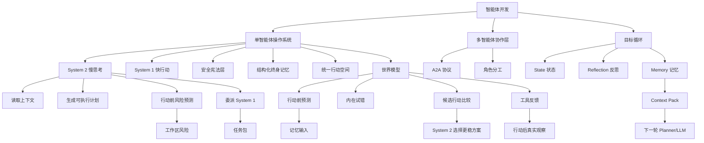

# 学习 Epic：智能体开发（工作流：learning-loop）

**创建日期**：2026-07-08  
**存放路径**：`Plans/Epic/2026-07-08-智能体开发.md`  
**状态**：进行中  
**workflow**：`learning-loop`

> 本 Epic 根据用户提供的智能体操作系统图，从目标输入开始，逐步学习单智能体操作系统，再进入工具、记忆、安全、世界模型与多智能体协作。每一轮具体学习事实写入 `Plans/学习循环/`。

---

## 一、学习目标

| 项 | 内容 |
|----|------|
| 学习主题 | 智能体开发 |
| 为什么学 | 理解智能体从“接收目标”到“规划、行动、验证、记忆、协作”的完整工程结构 |
| 最终能做什么 | 能独立设计并实现一个小型智能体：有目标循环、工具调用、安全约束、记忆、验证和多角色协作 |
| 明确不学 | 第一阶段不追具体框架 API，不追模型榜单，不直接做复杂产品 |
| 结束条件 | 用户明确说「这个旅程学完了」 |

---

## 二、子 Plan 索引

| 阶段 | stage key | 路径 | status |
|------|-----------|------|--------|
| 学习主题确认 | topic-intake | `Plans/学习循环/2026-07-09-学习主题-智能体开发-03-世界模型.md` | 已采纳 |
| AI 准备资料 | material-prepare | `Plans/学习循环/2026-07-09-学习资料-智能体开发-03-世界模型.md` | 已采纳 |
| 用户学习与答疑 | study | `Plans/学习循环/2026-07-09-学习答疑-智能体开发-03-世界模型.md` | 已采纳 |
| 实践任务 | practice | `Plans/学习循环/2026-07-09-学习实践-智能体开发-03-世界模型.md` | 已采纳 |
| AI 验证 | verify | `Plans/学习循环/2026-07-09-学习验证-智能体开发-03-世界模型.md` | 已通过 |
| 学习复盘 | retro | `Plans/学习循环/2026-07-11-学习复盘-智能体开发-03-世界模型.md` | 已采纳 |
| 学习记录与知识图谱增量 | record | `Plans/学习循环/2026-07-11-学习记录-智能体开发-03-世界模型.md` | 已采纳 |

> 说明：`plans.*` 和上表只表示当前活动循环入口，会随着下一轮学习切换；历史学习记录必须保留在「循环索引」和「知识图谱来源索引」，不能只依赖 `plans.*`。

---

## 三、循环索引（历史不可覆盖）

| 轮次 | 学习地图节点 | 状态 | 本轮主题 | 子 Plan 链路 | 学习记录 | 图谱增量 |
|------|--------------|------|----------|--------------|----------|----------|
| 01 | L0 总览与目标循环 | ✅ 已完成 | 用户目标如何进入智能体 | topic-intake: `Plans/学习循环/2026-07-08-学习主题-智能体开发-01-总览与目标循环.md`<br>material-prepare: `Plans/学习循环/2026-07-08-学习资料-智能体开发-01-总览与目标循环.md`<br>study: `Plans/学习循环/2026-07-08-学习答疑-智能体开发-01-总览与目标循环.md`<br>practice: `Plans/学习循环/2026-07-09-学习实践-智能体开发-01-总览与目标循环.md`<br>verify: `Plans/学习循环/2026-07-09-学习验证-智能体开发-01-总览与目标循环.md`<br>retro: `Plans/学习循环/2026-07-09-学习复盘-智能体开发-01-总览与目标循环.md`<br>record: `Plans/学习循环/2026-07-09-学习记录-智能体开发-01-总览与目标循环.md` | `Plans/学习循环/2026-07-09-学习记录-智能体开发-01-总览与目标循环.md` | 目标循环；State；Reflection；Memory；Context Pack；World Model；Observation |
| 02 | L1 System 2 慢思考 | ✅ 已完成 | 规划、反思、内在模拟 | topic-intake: `Plans/学习循环/2026-07-09-学习主题-智能体开发-02-System2慢思考.md`<br>material-prepare: `Plans/学习循环/2026-07-09-学习资料-智能体开发-02-System2慢思考.md`<br>study: `Plans/学习循环/2026-07-09-学习答疑-智能体开发-02-System2慢思考.md`<br>practice: `Plans/学习循环/2026-07-09-学习实践-智能体开发-02-System2慢思考.md`<br>verify: `Plans/学习循环/2026-07-09-学习验证-智能体开发-02-System2慢思考.md`<br>retro: `Plans/学习循环/2026-07-09-学习复盘-智能体开发-02-System2慢思考.md`<br>record: `Plans/学习循环/2026-07-09-学习记录-智能体开发-02-System2慢思考.md` | `Plans/学习循环/2026-07-09-学习记录-智能体开发-02-System2慢思考.md` | System 2；读取上下文；可执行计划；行动前风险预测；System 1 任务包；工作区风险 |
| 03 | L2 世界模型 | ✅ 已完成 | 行动后果预测与内在试错 | topic-intake: `Plans/学习循环/2026-07-09-学习主题-智能体开发-03-世界模型.md`<br>material-prepare: `Plans/学习循环/2026-07-09-学习资料-智能体开发-03-世界模型.md`<br>study: `Plans/学习循环/2026-07-09-学习答疑-智能体开发-03-世界模型.md`<br>practice: `Plans/学习循环/2026-07-09-学习实践-智能体开发-03-世界模型.md`<br>verify: `Plans/学习循环/2026-07-09-学习验证-智能体开发-03-世界模型.md`<br>retro: `Plans/学习循环/2026-07-11-学习复盘-智能体开发-03-世界模型.md`<br>record: `Plans/学习循环/2026-07-11-学习记录-智能体开发-03-世界模型.md` | `Plans/学习循环/2026-07-11-学习记录-智能体开发-03-世界模型.md` | 世界模型；行动前预测；内在试错；候选行动比较；工具反馈 |
| 04 | L3-L6 双系统架构构建 | ✅ 已完成 | build-first：Python + DeepSeek API 构建完整 Agent | practice: `Plans/学习循环/2026-07-11-构建实践-智能体开发-04-双系统架构.md` | `Plans/学习循环/2026-07-11-构建实践-智能体开发-04-双系统架构.md` | System 1/2 分离；工具注册表；安全审核/审批/审计；四种记忆；世界模型预测→计划调整；function calling 原理 |

---

## 四、WBS 看板（学习循环 1–7）

| # | 切片 | 归属 stage | Skill | 验收 |
|---|------|------------|-------|------|
| 1 | 确认学习主题与完成门槛 | topic-intake | workflow-router | 明确主题、范围和本轮完成门槛 |
| 2 | AI 准备资料与最小概念树 | material-prepare | material-prep-assistant | 资料可直接学习，概念树可解释 |
| 3 | 用户学习与答疑 | study | material-prep-assistant | 用户完成学习并提出/解决关键问题 |
| 4 | 实践任务 | practice | feature-dev-assistant | 产生可检查的实践产物 |
| 5 | AI 验证 | verify | test-generator | 验证清单有结论，问题可追踪 |
| 6 | 学习复盘 | retro | report-assistant | 形成已掌握/未掌握/下一步 |
| 7 | 学习记录与知识图谱增量 | record | material-prep-assistant | 学习记录和知识图谱摘要已更新，用户确认是否进入下一轮 |

```
[x] 1. 确认学习主题与完成门槛
[x] 2. AI 准备资料与最小概念树
[x] 3. 用户学习与答疑
[x] 4. 实践任务
[x] 5. AI 验证
[x] 6. 学习复盘
[x] 7. 学习记录与知识图谱增量
```

---

## 五、学习地图

| 层级 | 主题 | 状态 | 关联循环 plan |
|------|------|------|---------------|
| L0 | 总览与目标循环：用户目标如何进入智能体 | ✅ 已完成 | `Plans/学习循环/2026-07-09-学习记录-智能体开发-01-总览与目标循环.md` |
| L1 | System 2 慢思考：规划、反思、内在模拟 | ✅ 已完成 | `Plans/学习循环/2026-07-09-学习记录-智能体开发-02-System2慢思考.md` |
| L2 | 世界模型：行动后果预测与内在试错 | ✅ 已完成 | `Plans/学习循环/2026-07-11-学习记录-智能体开发-03-世界模型.md` |
| L3 | System 1 快行动：工具调用 → **agent/system1.py + tools/** | ✅ 已完成 | `Plans/学习循环/2026-07-11-构建实践-智能体开发-04-双系统架构.md` |
| L4 | 统一行动空间：工具注册表 → **agent/tools/registry.py** | ✅ 已完成 | 同上（与 L3 合并构建） |
| L5 | 安全宪法层 → **agent/safety.py** | ✅ 已完成 | 同上 |
| L6 | 结构化终身记忆 → **agent/memory.py** | ✅ 已完成 | 同上 |
| L7 | 自我纠错与经验提炼：从反馈到知识图谱 | ⬜ | — |
| L8 | A2A 多智能体协作：规划者/执行者/评审者 | ⬜ | — |
| L9 | 综合实践 → **已提前到 L3 开始，持续迭代** | 🔨 进行中 | — |

---

## 六、知识图谱来源索引

| 来源记录 | 覆盖节点 | 状态 | 知识地图用途 |
|----------|----------|------|--------------|
| `Plans/学习循环/2026-07-09-学习记录-智能体开发-01-总览与目标循环.md` | L0 总览与目标循环 | ✅ 已归档 | 生成目标循环、状态、反思、记忆、Context Pack、世界模型等节点 |
| `Plans/学习循环/2026-07-09-学习记录-智能体开发-02-System2慢思考.md` | L1 System 2 慢思考 | ✅ 已归档 | 生成读取上下文、可执行计划、行动前风险预测、System 1 任务包、工作区风险等节点 |
| `Plans/学习循环/2026-07-11-学习记录-智能体开发-03-世界模型.md` | L2 世界模型 | ✅ 已归档 | 生成行动前预测、内在试错、候选行动比较、工具反馈、记忆输入、规避动作正向表达等节点 |

---

## 七、知识图谱（滚动摘要）



| 概念 | 我自己的解释 | 关联实践 | 掌握度 |
|------|--------------|----------|--------|
| 智能体 | 能围绕目标自主规划、调用工具、观察反馈、修正行为的系统 | 待实践 | 生疏 |
| 目标循环 | 用户目标进入系统后，经过规划、执行、反馈、反思和记忆形成闭环 | 人员列表需求分析 → 框架设计 context pack | 初步掌握 |
| State 状态 | 当前目标、阶段、完成事实、阻塞、下一步的快照 | 人员列表需求分析完成，下一步框架设计 | 初步掌握 |
| Reflection 反思 | 根据观察和验收标准判断推进、返工或调整计划 | 需求 case 逻辑闭合 → 进入框架设计 | 初步掌握 |
| Memory 记忆 | 可复用经验沉淀，不等于聊天历史 | 需求 case、公共原则、框架设计原则 | 初步掌握 |
| Context Pack | 给下一轮 LLM/Planner 的结构化输入约束 | 人员列表框架设计输入 | 初步掌握 |
| 世界模型 | 行动前预测后果，不等于安全约束 | 删除/设计/调用前的后果预判 | 初步掌握 |
| 行动前预测 | 世界模型的核心能力，从记忆输入推演多种方案的后果 | 项目多智能体场景预测卡 | 初步掌握 |
| 内在试错 | 在行动前让方案在脑内失败，降低真实试错成本 | 项目上下文注入/空项目/删除智能体预测 | 初步掌握 |
| 候选行动比较 | 世界模型为多种策略各自预测后果，交给 System 2 选择 | 空项目策略 A vs B | 初步掌握 |
| 工具反馈 | 行动后的真实观察，是事实而非预测 | 和世界模型对比理解 | 初步掌握 |
| 规避动作正向表达 | 规避要写"必须做 Y"而非只写"禁止 X" | 验证校正：必须注入项目上下文 | 初步掌握 |
| 记忆驱动下一轮 | 上一轮沉淀的 case、原则、约束会作为下一轮 LLM/Planner 的输入约束 | 人员列表需求 case + 公共原则 + 框架设计原则 | 初步掌握 |
| 双过程认知 | 慢思考负责规划与模拟，快行动负责执行与响应 | agent/system2.py + system1.py 双系统分离 | 已编码验证 |
| System 2 慢思考 | 读取上下文，生成可执行计划，行动前预测风险，并约束 System 1 不跑偏 | agent/system2.py: plan() + reflect() + adjust_plan() | 已编码验证 |
| 行动前风险预测 | 在执行前模拟可能出错的地方，包括工作区、架构分层、状态遗漏和测试盲区 | agent/world_model.py: predict() + has_high_risk() | 已编码验证 |
| System 1 任务包 | System 2 交给执行层的合同，必须写清输入、输出、禁止项和反馈格式 | agent/system1.py: execute(step, context) | 已编码验证 |

---

## 八、整体实践地图

| 实践项目 | 覆盖能力 | 文件 | 当前状态 |
|----------|----------|------|----------|
| **通用小助手 Agent（双系统架构）** | 完整 Agent OS | `agent/` | ✅ 已实测通过 |
| └ `main.py` 目标循环 | L0 用户目标 → 规划 → 预测 → 执行 → 反思 → 记忆沉淀 | `agent/main.py` | ✅ |
| └ `system2.py` 慢思考 | L1 规划 + 反思 + 计划调整 | `agent/system2.py` | ✅ |
| └ `world_model.py` 世界模型 | L2 行动前预测 + 风险筛选 | `agent/world_model.py` | ✅ |
| └ `system1.py` 快行动 | L3 单步执行 + 工具调用（经安全层） | `agent/system1.py` | ✅ |
| └ `tools/` 统一行动空间 | L4 工具注册表 + 文件操作 + Shell 执行 | `agent/tools/` | ✅ |
| └ `safety.py` 安全宪法层 | L5 审核/审批/拒绝 + 审计日志 | `agent/safety.py` | ✅ |
| └ `memory.py` 结构化记忆 | L6 工作/情景/语义/程序记忆 + 持久化 | `agent/memory.py` | ✅ |
| └ `llm.py` LLM 封装 | DeepSeek API 统一调用 | `agent/llm.py` | ✅ |
| └ 多智能体协作 | L8 Planner / Executor / Reviewer | 待添加 | ⬜ |

---

## 九、阶段性总结

| 日期 | 我已经学会 | 仍然卡住 | 下一步 |
|------|------------|----------|--------|
| 2026-07-08 | 已建立学习地图，进入第一轮“总览与目标循环” | 待用户学习与答疑 | 完成第一课概念问答，然后进入实践 |
| 2026-07-09 | 已理解 Agent 不是工具调用本身，核心需要状态、反思、记忆 | 待完成最小目标循环模拟器 | 写出 state / reflection / memory 的最小实践 |
| 2026-07-09 | 已完成最小目标循环实践并通过 AI 验证 | 待复盘沉淀本轮核心原则 | 复盘：memory → context pack → 下一轮规划 |
| 2026-07-09 | 已完成本轮学习复盘 | 待写入学习记录和知识图谱增量 | 记录 L0 核心原则，准备进入 L1 System 2 慢思考 |
| 2026-07-09 | L0 学习记录和知识图谱增量已完成 | 下一轮未开始 | 进入 L1：System 2 慢思考 |
| 2026-07-09 | 已进入 L1：System 2 慢思考 | 等待用户复述规划、反思、内在模拟 | 用人员列表框架设计回答 3 个问题 |
| 2026-07-09 | 已通过 System 2 三问复述 | 待完成 System 2 计划卡实践 | 补全人员列表框架设计计划卡 |
| 2026-07-09 | 已提交 System 2 计划卡第一版 | 验证发现状态流、数据结构、API 契约、风险预测过粗 | 按验证反馈重写 5 个片段 |
| 2026-07-09 | 验证阶段按 partial 收口 | 待复盘 System 2 的掌握点和未掌握点 | 用一句话总结 System 2 的职责 |
| 2026-07-09 | L1 System 2 学习记录和知识图谱增量已完成 | 下一轮未开始 | 等待用户选择下一轮学习主题 |
| 2026-07-09 | 已进入 L2：世界模型 | 等待用户复述世界模型、工具反馈、记忆的区别 | 用人员列表框架设计回答 3 个问题 |
| 2026-07-09 | 已通过世界模型三问复述 | 待完成行动前预测卡 | 写 3 条人员列表框架设计行动前预测 |
| 2026-07-09 | 已提交世界模型行动前预测卡 | 待完成 AI 验证收口 | 复盘项目上下文注入、空项目策略、最后一个智能体保护 |
| 2026-07-11 | L2 世界模型已完成（复盘 + 记录 + 知识图谱增量） | 下一轮未开始 | 等待用户选择下一轮学习主题（L3 System 1 快行动） |
| 2026-07-11 | **转向 build-first：构建通用小助手 Agent** | 概念学习太表面，零代码实践 | 用 Python + DeepSeek API 构建真实 Agent，每个概念通过编码验证 |
| 2026-07-11 | 完成完整双系统架构重构：system2(规划+反思) / system1(执行) / world_model(预测) / safety(审核) / memory(四种记忆) / tools/(注册表+文件+Shell) / llm(API封装)，共 8 个模块一一对应架构图，实测通过 | L7 自我纠错、L8 多智能体协作 未实现 | 下一步可选：L7 经验提炼（从 episodic → semantic 自动沉淀）或 L8 多智能体协作 |

---

## 十、用户确认

- [x] 继续下一轮学习
- [ ] 生成阶段总结
- [ ] 生成知识图谱
- [ ] 用户确认整个学习旅程结束

---

## 续做

```text
/resume plan=Plans/Epic/2026-07-08-智能体开发.md 进度=双系统架构已完成实测（L3-L6），下一步 L7 自我纠错或 L8 多智能体
```
