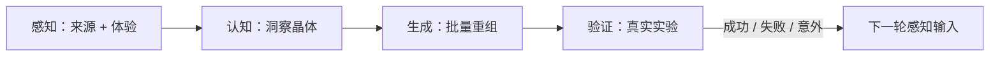

# 创意孵化 Epic：创意探索（工作流：creative-incubation）

**创建日期**：2026-08-08
**存放路径**：`Plans/Epic/2026-08-08-创意探索.md`
**周期**：30 天
**状态**：进行中

> 一个 Epic 只代表一轮完整孵化。完成验证后，如需继续，新建下一轮 Epic，并在 `previous_cycle` 与「反馈入口」中引用本轮，保证历史证据不被覆盖。

---

## 一、本轮探索契约

| 项 | 内容 |
|----|------|
| 为什么启动本轮 | 用持续系统弥补生活体验与新鲜输入不足，把架构能力、深度思考和哲学优势转化为可验证的副业方向 |
| 可发挥的个人优势 | 顶级架构能力 / 深度思考 / 哲学抽象 / AI 工作流设计 |
| 本轮最多投入 | 每周投入与预算待用户确认 |
| 明确不做 | 不开发完整 App、不追逐泛流量、不用点赞替代真实需求或付费信号 |
| 成功定义 | 至少完成 1 个真实世界实验，并基于证据决定继续 / 转向 / 停止 |

## 二、子 Plan 索引

| 层 | stage key | 路径 | 状态 |
|----|-----------|------|------|
| 感知层：数字感官与创意觅食 | perception | `Plans/创意孵化/2026-08-08-创意探索-感知层.md` | ✅ 已采纳 |
| 认知层：哲学发酵与洞察晶体 | cognition | `Plans/创意孵化/2026-08-08-创意探索-认知层.md` | 🟡 进行中 |
| 生成层：大规模创意重组 | generation | — | ⬜ |
| 验证层：最小实验与反馈回流 | validation | — | ⬜ |

## 三、WBS 看板（四层闭环）

| # | 周 | 切片 | 最小验收 |
|---|----|------|----------|
| 1 | 第 1 周 | 感知 | ≥2 个觅食域，信息卡保留来源；生活体验为推荐增强项、非门禁 |
| 2 | 第 2 周 | 认知 | ≥3 个洞察晶体，每个有证据和反例/边界 |
| 3 | 第 3 周 | 生成 | ≥10 个创意，其中 ≥3 个可高度自动化，确认 2 个候选 |
| 4 | 第 4 周 | 验证 | 对 1 个候选完成真实世界实验，形成反馈回流决定 |

```text
[x] 1. 感知：建立数字感官并完成创意觅食
[ ] 2. 认知：完成清修并提炼洞察晶体
[ ] 3. 生成：批量重组并确认两个候选
[ ] 4. 验证：推出最小实验并回收真实证据
```

## 四、30 天启动路线图

| 周 | 重点动作 | 周末可见产物 |
|----|----------|--------------|
| 1 | 选 2 个核心域；接入 1–2 个核心来源；建立信息卡模板；安排陌生体验 | 感知层 Plan |
| 2 | 运行采集；完成一次深度思考清修；提炼至少 3 个洞察晶体 | 认知层 Plan |
| 3 | 以 2–3 个晶体生成至少 10 个方向；选出最兴奋的 2 个 | 生成层 Plan |
| 4 | 为两个候选画最小实验，实际推出其中 1 个 | 验证层 Plan + 真实信号 |

## 五、反馈增强回路



## 六、本轮仪表盘

| 指标 | 目标 | 实际 |
|------|------|------|
| 觅食域 | ≥2 | 2 |
| 生活纹理体验 | 建议 ≥1（非门禁） | 0（信号缺口已记录） |
| 洞察晶体 | ≥3 | 0 |
| 创意方向 | ≥10 | 0 |
| AI 高自动化方向 | ≥3 | 0 |
| 入选候选 | 2 | 0 |
| 真实世界实验 | ≥1 | 0 |

## 七、反馈入口

| 来自哪一轮 | 继续验证的信号 | 已证伪假设 | 下一轮要调整的来源/问题 |
|------------|----------------|------------|--------------------------|
| 首轮 | — | — | 从技术前沿、人文社科、商业创作和生活纹理中选定两个核心域 |

## 八、用户确认

- [ ] 本轮四层闭环完成
- [ ] 基于证据继续当前方向
- [ ] 转向新假设
- [ ] 停止该方向
- [ ] 创建下一轮 `creative-incubation` Epic

## 续做

```text
/resume plan=Plans/Epic/2026-08-08-创意探索.md 进度=感知层草案已生成，等待确认投入约束与体验任务
```

## 反馈（skill_run）

```yaml
skill_run:
  skill: change-impact-analysis
  plan: Plans/Epic/2026-08-08-创意探索.md
  date: 2026-08-08
  contexts_used:
    - path: Contexts/决策/Skill反馈协议.md
      utility: high
      reason: "按协议将当前命名变更反馈记录在 Epic，避免污染未完成的感知层门禁。"
  contexts_missing: []
  contexts_stale: []
  outcome_status: pass
  revisit_needed: false
```
