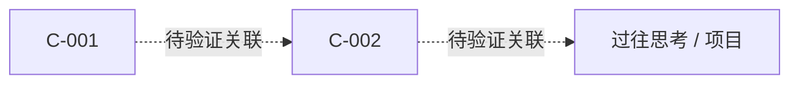

# 感知层：数字感官与创意觅食：创意探索

**创建日期**：2026-08-08
**存放路径**：`Plans/创意孵化/2026-08-08-创意探索-感知层.md`
**阶段**：`perception`
**推荐 Skill**：`creative-incubation-assistant`

> 只填写当前阶段要求的章节。生活体验是推荐增强项而非门禁；未执行时记录信号缺口，不把摘要冒充体验。满足感知信息契约并经用户确认后，可把 `status` 改为 `已采纳`。

---

## 一、创意觅食疆域

| 域 | 为什么值得探索 | 与个人优势/副业的关系 | 本轮排除项 |
|----|----------------|----------------------|------------|
| D1：AI 原生工作流的产品化 | AI Agent 正从“能生成答案”进入“能编排任务”，但可靠性、上下文、验证和人工判断仍是高摩擦区 | 可把架构能力转成工作流诊断、设计、模板、顾问服务或小工具；适合先服务化验证，再决定是否产品化 | 不追通用聊天壳、不做模型军备竞赛、不先开发完整平台 |
| D2：40+ 技术人的第二曲线与意义重构 | 长寿社会正在打破“学习—工作—退休”的单线模型，真实用户同时面临身份、收入、精力和意义冲突 | 哲学抽象与系统设计可转成职业困惑分析、转型实验设计、知识产品或决策辅助服务 | 不做心理治疗、不承诺职业结果、不用成功学替代现实约束 |

## 二、自动采集与体验任务

| 类型 | 来源/任务 | 获取方式 | 频率/时间盒 | 状态 |
|------|-----------|----------|-------------|------|
| D1 官方工程源 | [GitHub Blog：AI agents](https://github.blog/tag/ai-agents/) | 先每周手动浏览；确认阅读价值后再接 RSS/页面监控 | 每周 20 分钟 | ⬜ |
| D1 新产品与失败讨论 | [Show HN](https://news.ycombinator.com/show) + [Indie Hackers Stories](https://www.indiehackers.com/stories) | 手动抽样，保留作者原帖和评论，不只读成功标题 | 每周各 30 分钟 | ✅ 已形成 F-003/F-004 |
| D2 研究源 | [Stanford Center on Longevity](https://longevity.stanford.edu/) + [Longevity, Learning and the Future of Work](https://longevity.stanford.edu/century-summit-vi-longevity-learning-and-the-future-of-work-report/) | 每周手动浏览；高价值栏目再接页面监控 | 每周 30 分钟 | ✅ 已形成 F-001/F-002 |
| 生活纹理 | 在 `r/careerguidance`、`r/40something` 等社区连续阅读 10 篇 40+ 转型一手叙事，摘录原话、现实约束和失败路径；不发言、不诊断 | 用户亲自观察，AI 只负责事后聚类 | 45 分钟，一次 | 🟡 10 篇已预选，待亲自阅读 |

### 生活纹理体验执行卡（45 分钟）

> 这一步必须由用户亲自阅读和感受，AI 不把二手摘要冒充生活体验。无需发言、注册服务或诊断他人。

| 时间 | 动作 | 最小产出 |
|------|------|----------|
| 0–5 分钟 | 打开 `r/careerguidance`、`r/40something`，只筛选 40+ 转型、倦怠、重新开始相关的一手叙事 | 选出 10 篇 |
| 5–35 分钟 | 连续阅读，不先归纳；每篇只摘“触发点、现实约束、已尝试办法、最担心失去什么” | 10 行观察 |
| 35–45 分钟 | 标记最意外的 3 条，不做解决方案 | 3 个意外点 + 1 个开放问题 |

| # | 叙事链接/标题 | 触发点 | 现实约束 | 已尝试办法 | 最担心失去什么 | 最意外之处 |
|---|---------------|--------|----------|------------|----------------|------------|
| 1 | [Starting over at 40yo?](https://www.reddit.com/r/careerguidance/comments/1ual2eb/starting_over_at_40yo/) | 【】 | 【】 | 【】 | 【】 | 【】 |
| 2 | [What’s the best career change after 40 without going back to college?](https://www.reddit.com/r/careeradvice/comments/1sfg7mp/whats_the_best_career_change_after_40_without/) | 【】 | 【】 | 【】 | 【】 | 【】 |
| 3 | [How many of you have made a career change after 40?](https://www.reddit.com/r/careerguidance/comments/1bnvl2b/how_many_of_you_have_made_a_career_change_after_40/) | 【】 | 【】 | 【】 | 【】 | 【】 |
| 4 | [Is changing careers at 40 realistic without going back to college?](https://www.reddit.com/r/careerguidance/comments/1rqrxzf/is_changing_careers_at_40_realistic_without_going/) | 【】 | 【】 | 【】 | 【】 | 【】 |
| 5 | [Starting completely over at 40?](https://www.reddit.com/r/careerguidance/comments/1k9y0ma/) | 【】 | 【】 | 【】 | 【】 | 【】 |
| 6 | [What career change after 40 gave you the biggest return?](https://www.reddit.com/r/careerguidance/comments/1vhmk7y/what_career_change_after_40_gave_you_the_biggest/) | 【】 | 【】 | 【】 | 【】 | 【】 |
| 7 | [People who successfully changed careers in their 30s, 40s, or later, how did you do it?](https://www.reddit.com/r/findapath/comments/1twdfrg/people_who_successfully_changed_careers_in_their/) | 【】 | 【】 | 【】 | 【】 | 【】 |
| 8 | [People in their 40s who changed their life direction: what finally made you do it?](https://www.reddit.com/r/findapath/comments/1ruffxf/people_in_their_40s_who_changed_their_life/) | 【】 | 【】 | 【】 | 【】 | 【】 |
| 9 | [How do people actually switch careers in their 30s or 40s?](https://www.reddit.com/r/careerguidance/comments/1rndqh5/how_do_people_actually_switch_careers_in_their/) | 【】 | 【】 | 【】 | 【】 | 【】 |
| 10 | [40F looking for a career change and transformation](https://www.reddit.com/r/findapath/comments/1l95yen/) | 【】 | 【】 | 【】 | 【】 | 【】 |

完成后只需把 10 行粗糙记录交给 AI；AI 再负责聚类共同约束、矛盾信号和可进入认知层的问题，不替用户修改原始观察。

### 自动化管道

| 环节 | 输入 | 处理 | 输出 | 手动降级路径 |
|------|------|------|------|--------------|
| 采集 | 上述官方页面、作者原帖和社区观察 | 首周人工采样；确认信噪比后再决定 Inoreader / Feedly / 页面监控 | 带 URL、作者、日期的原始条目 | 每周固定时段打开来源清单 |
| 初筛 | 原始条目 | 按本 Plan 的信息卡契约调用 LLM；事实、推断、用户洞察分栏 | 可回溯的精饲料 | 直接在本 Plan 填写 F-xxx 行 |
| 入库 | 精饲料 | 首轮写入当前 Plan；连续两周稳定后再评估 Make / Zapier / 自建脚本 | Obsidian 本轮证据 | 手动复制，不声称自动化已部署 |

## 三、AI 初筛契约

每条信息卡必须包含：原始来源、3 句核心摘要、3–5 个反直觉观点、标签、一个原文未回答的开放问题，并区分事实与推断。

```text
你是创意觅食分析师。只依据给定原文输出：
1. 三句核心摘要；
2. 3–5 个反直觉观点，并标记“原文事实 / 合理推断”；
3. 2–5 个跨域标签；
4. 一个原文没有回答、但值得真实验证的开放问题；
5. 原始 URL、作者/组织和发布日期。
禁止补造数字、用户反馈或因果关系；信息不足时明确写“不知道”。
```

## 四、本轮精饲料

| ID | 原始来源 | 3 句摘要 | 反直觉观点 | 标签 | 开放问题 |
|----|----------|----------|------------|------|----------|
| F-001 | [Stanford Center on Longevity：About](https://longevity.stanford.edu/about/) | 该中心把长寿视为需要重新设计教育、工作与家庭制度的系统问题。更长寿命意味着人生阶段不再只能线性推进。研究、技术、行为与公共政策需要共同参与。 | **原文事实**：长寿不是单纯养老议题，而是整个人生结构的设计议题。**推断**：40 岁的转型需求可能不是“换一份工作”，而是需要低风险的多轮身份实验。 | #长寿社会 #中年转型 #人生架构 | 40+ 技术人愿意为什么样的“转型实验设计”投入时间或付费？ |
| F-002 | [Stanford：Longevity, Learning and the Future of Work](https://longevity.stanford.edu/century-summit-vi-longevity-learning-and-the-future-of-work-report/) | 报告指出教育、工作、退休仍受 20 世纪单线人生模型约束。更长工作周期要求学习与工作在成年期多次循环。目的感、生产力与连接需要贯穿一生。 | **原文事实**：未来不是一次教育支持一生职业。**推断**：副业可以被设计成第二曲线的实验基础设施，而不是单纯额外收入。 | #终身学习 #未来工作 #第二曲线 | 能否把“创意探索”产品化为一套可重复、可证伪的中年转型实验？ |
| F-003 | [Indie Hackers Stories](https://www.indiehackers.com/stories) | 案例库展示独立创作者如何从服务、内容、开源或小工具进入生意。很多路径包含失败、转向和先获得分发再产品化。收入标题很醒目，但过程材料更适合提取验证动作。 | **原文事实**：成功路径高度多样。**推断**：架构师的最优起点可能是产品化服务，而不是 SaaS。 | #独立开发 #产品化服务 #验证优先 | 哪类架构/工作流服务能在不开发平台的前提下获得第一次真实付费？ |
| F-004 | [Show HN](https://news.ycombinator.com/show) | Show HN 让制造者直接展示新产品并接受技术用户反馈。评论经常暴露定价、可信度、可维护性和真实用途问题。它比二手趋势榜更接近产品与用户首次碰撞。 | **原文事实**：公开演示会迅速得到质疑与替代方案。**推断**：创意评估应系统收集反对意见，而不只是记录点赞。 | #产品发现 #反证 #真实反馈 | 如果先发布“问题诊断 + 手工交付”而非软件，技术社区会提出哪些最强反对意见？ |

## 五、深度思考清修

| 项 | 记录 |
|----|------|
| 计划时间盒 | 建议 2 小时；实际【】 |
| 被挑战的第一性原理 | 【】 |
| 跨域映射 | 【A 领域模式】→【B 领域问题】 |
| 共同的人性需求/弱点 | 【】 |

## 六、洞察晶体

| ID | 一句话命题 | 来源证据 | 反例/适用边界 | 关联旧思考 | 可验证问题 |
|----|------------|----------|---------------|------------|------------|
| C-001 | 【】 | 【】 | 【】 | 【】 | 【】 |
| C-002 | 【】 | 【】 | 【】 | 【】 | 【】 |
| C-003 | 【】 | 【】 | 【】 | 【】 | 【】 |

## 七、孪生知识网络



| 起点 | 关联节点 | 关系类型 | 为什么不是表面相似 | 后续验证 |
|------|----------|----------|--------------------|----------|
| 【】 | 【】 | 类比 / 张力 / 因果假设 | 【】 | 【】 |

## 八、创意生成批次

> 以 2–3 个洞察晶体为组合种子，至少生成 10 个方向；其中至少 3 个为 AI 高自动化方向。

| # | 痛点与目标人群 | 架构/深思优势如何参与 | 自动化程度与人工判断 | MVP 形态 | 首个验证动作 |
|---|----------------|----------------------|----------------------|----------|--------------|
| I-01 | 【】 | 【】 | 【】 | 【】 | 【】 |
| I-02 | 【】 | 【】 | 【】 | 【】 | 【】 |
| I-03 | 【】 | 【】 | 【】 | 【】 | 【】 |
| I-04 | 【】 | 【】 | 【】 | 【】 | 【】 |
| I-05 | 【】 | 【】 | 【】 | 【】 | 【】 |
| I-06 | 【】 | 【】 | 【】 | 【】 | 【】 |
| I-07 | 【】 | 【】 | 【】 | 【】 | 【】 |
| I-08 | 【】 | 【】 | 【】 | 【】 | 【】 |
| I-09 | 【】 | 【】 | 【】 | 【】 | 【】 |
| I-10 | 【】 | 【】 | 【】 | 【】 | 【】 |

## 九、候选评分与选择

| 创意 | 个人兴奋度 | 优势匹配 | 问题强度 | 验证成本（低分更贵） | 可自动化 | 总结 | 用户选择 |
|------|------------|----------|----------|----------------------|----------|------|----------|
| 【候选 A】 | /5 | /5 | /5 | /5 | /5 | 【】 | ⬜ |
| 【候选 B】 | /5 | /5 | /5 | /5 | /5 | 【】 | ⬜ |

## 十、MVP 假设

| 候选 | 目标人群 | 可证伪痛点假设 | 极简形态 | 最小承诺/付费信号 |
|------|----------|----------------|----------|-------------------|
| A | 【】 | 【】 | 【服务拼装 / 内容探针 / 脚本 / 表单】 | 【】 |
| B | 【】 | 【】 | 【】 | 【】 |

## 十一、最小实验设计

| 项 | 内容 |
|----|------|
| 本次验证候选 | A / B【】 |
| 可证伪假设 | 我认为【目标人群】会因为【痛点】而做出【行动】 |
| 最小动作 | 【发布 / 邀请访谈 / 开放预约 / 收取意向金 / 交付服务】 |
| 主指标 | 【】 |
| 成功阈值 | 【】 |
| 停止/转向阈值 | 【】 |
| 时间盒与预算上限 | 【】 |

## 十二、真实世界证据

| 日期 | 触达对象/渠道 | 观察到的行为或原话 | 强/弱信号 | 证据链接 |
|------|---------------|--------------------|-----------|----------|
| 【】 | 【】 | 【】 | 【报名/私信/付费=强；点赞=弱】 | 【】 |

## 十三、反馈回流

| 决定 | 证据 | 下一轮来源调整 | 洞察修订/新开放问题 |
|------|------|----------------|---------------------|
| 继续 / 转向 / 停止 | 【】 | 【】 | 【】 |

## 十四、用户确认

- [x] 用户确认并采纳当前感知方案（2026-08-08）
- [ ] 用户确认继续 / 转向 / 停止
- [ ] 如继续，创建下一轮 Epic 并将本节写入其「反馈入口」

> 本次“采纳”确认的是两个觅食域、4 张信息卡和当前信息契约。10 篇叙事尚未留下用户观察，作为非阻塞信号缺口保留，不把体验方案冒充已完成的真实体验。

## 续做

```text
/resume plan=Plans/创意孵化/2026-08-08-创意探索-感知层.md 进度=感知层已采纳；生活纹理体验作为非阻塞增强项保留，下一步进入认知层
```

## 变更影响结论

- 变更：生活体验由感知层硬完成条件降级为推荐增强项。
- 理由：工作流目标是持续发现创意；主观体验无法可靠机械判定，硬门禁只会把探索变成形式化证明。
- 保留：未执行体验时必须明确记录“缺少生活纹理信号”，且不得把摘要写成亲身体验。
- 不变：认知层仍需 3 个带证据和反例的洞察晶体；验证层仍需真实世界实验，不能用点赞或想象替代现实信号。

## 反馈（skill_run）

```yaml
skill_run:
  skill: change-impact-analysis
  workflow_stage: perception
  plan: Plans/创意孵化/2026-08-08-创意探索-感知层.md
  date: 2026-08-08
  contexts_used:
    - path: Contexts/决策/Skill反馈协议.md
      utility: high
      reason: "按协议记录门禁语义调整、保留约束和影响范围。"
  contexts_missing: []
  contexts_stale: []
  outcome_status: pass
  revisit_needed: false
```

## 反馈（skill_run）

```yaml
skill_run:
  skill: resume-assistant
  workflow_stage: perception
  plan: Plans/创意孵化/2026-08-08-创意探索-感知层.md
  date: 2026-08-08
  contexts_used:
    - path: Contexts/决策/Skill反馈协议.md
      utility: high
      reason: "按协议记录本次恢复点、已同步事实和仍待用户完成的真实体验。"
  contexts_missing: []
  contexts_stale: []
  outcome_status: partial
  friction: "真实生活纹理观察必须由用户亲自完成，AI 只能准备执行卡并在事后聚类。"
  revisit_needed: false
```

## 反馈（skill_run）

```yaml
skill_run:
  skill: creative-incubation-assistant
  workflow_stage: perception
  plan: Plans/创意孵化/2026-08-08-创意探索-感知层.md
  date: 2026-08-08
  contexts_used:
    - path: Contexts/决策/Skill反馈协议.md
      utility: high
      reason: "感知层按用户确认后的新契约收口，并保留未完成生活体验的信号缺口。"
  contexts_missing: []
  contexts_stale: []
  outcome_status: pass
  revisit_needed: false
```
