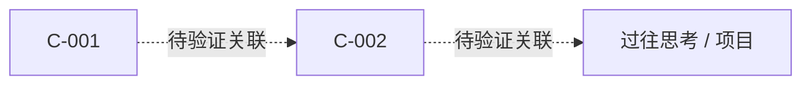

# 认知层：哲学发酵与洞察晶体：创意探索

**创建日期**：2026-08-08
**存放路径**：`Plans/创意孵化/2026-08-08-创意探索-认知层.md`
**阶段**：`cognition`
**推荐 Skill**：`creative-incubation-assistant`

> 只填写当前阶段要求的章节。满足数量与证据契约、经用户确认后，才把 `status` 改为 `已采纳` 并追加 `skill_run`。

---

## 一、创意觅食疆域

| 域 | 为什么值得探索 | 与个人优势/副业的关系 | 本轮排除项 |
|----|----------------|----------------------|------------|
| D1【】 | 【】 | 【】 | 【】 |
| D2【】 | 【】 | 【】 | 【】 |

## 二、自动采集与体验任务

| 类型 | 来源/任务 | 获取方式 | 频率/时间盒 | 状态 |
|------|-----------|----------|-------------|------|
| 一手信息源 | 【RSS / 官方博客 / 论文 / 社群】 | 【自动 / 手动】 | 【】 | ⬜ |
| 生活纹理（推荐，非门禁） | 【陌生社群 / 纪录片 / 传记 / 产品体验】 | 亲自体验 | 【】 | ⬜ / 未执行（不阻塞） |

### 自动化管道

| 环节 | 输入 | 处理 | 输出 | 手动降级路径 |
|------|------|------|------|--------------|
| 采集 | 【】 | 【Inoreader / Feedly / Alerts / 自建】 | 原始条目 | 【】 |
| 初筛 | 原始条目 | LLM 信息卡提示词 | 精饲料 | 【】 |
| 入库 | 精饲料 | 【Make / Zapier / 脚本】 | 【Obsidian / Notion / Logseq】 | 【】 |

## 三、AI 初筛契约

每条信息卡必须包含：原始来源、3 句核心摘要、3–5 个反直觉观点、标签、一个原文未回答的开放问题，并区分事实与推断。

## 四、本轮精饲料

| ID | 原始来源 | 3 句摘要 | 反直觉观点 | 标签 | 开放问题 |
|----|----------|----------|------------|------|----------|
| F-001 | 【】 | 【】 | 【】 | 【】 | 【】 |

## 五、深度思考清修

| 项 | 记录 |
|----|------|
| 计划时间盒 | 建议 2 小时；实际【】 |
| 被挑战的第一性原理 | 【】 |
| 跨域映射 | 【A 领域模式】→【B 领域问题】 |
| 共同的人性需求/弱点 | 【】 |

## 六、洞察晶体

| ID | 一句话命题 | 来源证据 | 反例/适用边界 | 关联旧思考 | 可验证问题 |
|----|------------|----------|---------------|------------|------------|
| C-001 | 【】 | 【】 | 【】 | 【】 | 【】 |
| C-002 | 【】 | 【】 | 【】 | 【】 | 【】 |
| C-003 | 【】 | 【】 | 【】 | 【】 | 【】 |

## 七、孪生知识网络



| 起点 | 关联节点 | 关系类型 | 为什么不是表面相似 | 后续验证 |
|------|----------|----------|--------------------|----------|
| 【】 | 【】 | 类比 / 张力 / 因果假设 | 【】 | 【】 |

## 八、创意生成批次

> 以 2–3 个洞察晶体为组合种子，至少生成 10 个方向；其中至少 3 个为 AI 高自动化方向。

| # | 痛点与目标人群 | 架构/深思优势如何参与 | 自动化程度与人工判断 | MVP 形态 | 首个验证动作 |
|---|----------------|----------------------|----------------------|----------|--------------|
| I-01 | 【】 | 【】 | 【】 | 【】 | 【】 |
| I-02 | 【】 | 【】 | 【】 | 【】 | 【】 |
| I-03 | 【】 | 【】 | 【】 | 【】 | 【】 |
| I-04 | 【】 | 【】 | 【】 | 【】 | 【】 |
| I-05 | 【】 | 【】 | 【】 | 【】 | 【】 |
| I-06 | 【】 | 【】 | 【】 | 【】 | 【】 |
| I-07 | 【】 | 【】 | 【】 | 【】 | 【】 |
| I-08 | 【】 | 【】 | 【】 | 【】 | 【】 |
| I-09 | 【】 | 【】 | 【】 | 【】 | 【】 |
| I-10 | 【】 | 【】 | 【】 | 【】 | 【】 |

## 九、候选评分与选择

| 创意 | 个人兴奋度 | 优势匹配 | 问题强度 | 验证成本（低分更贵） | 可自动化 | 总结 | 用户选择 |
|------|------------|----------|----------|----------------------|----------|------|----------|
| 【候选 A】 | /5 | /5 | /5 | /5 | /5 | 【】 | ⬜ |
| 【候选 B】 | /5 | /5 | /5 | /5 | /5 | 【】 | ⬜ |

## 十、MVP 假设

| 候选 | 目标人群 | 可证伪痛点假设 | 极简形态 | 最小承诺/付费信号 |
|------|----------|----------------|----------|-------------------|
| A | 【】 | 【】 | 【服务拼装 / 内容探针 / 脚本 / 表单】 | 【】 |
| B | 【】 | 【】 | 【】 | 【】 |

## 十一、最小实验设计

| 项 | 内容 |
|----|------|
| 本次验证候选 | A / B【】 |
| 可证伪假设 | 我认为【目标人群】会因为【痛点】而做出【行动】 |
| 最小动作 | 【发布 / 邀请访谈 / 开放预约 / 收取意向金 / 交付服务】 |
| 主指标 | 【】 |
| 成功阈值 | 【】 |
| 停止/转向阈值 | 【】 |
| 时间盒与预算上限 | 【】 |

## 十二、真实世界证据

| 日期 | 触达对象/渠道 | 观察到的行为或原话 | 强/弱信号 | 证据链接 |
|------|---------------|--------------------|-----------|----------|
| 【】 | 【】 | 【】 | 【报名/私信/付费=强；点赞=弱】 | 【】 |

## 十三、反馈回流

| 决定 | 证据 | 下一轮来源调整 | 洞察修订/新开放问题 |
|------|------|----------------|---------------------|
| 继续 / 转向 / 停止 | 【】 | 【】 | 【】 |

## 十四、用户确认

- [ ] 用户确认本阶段事实与结论
- [ ] 用户确认继续 / 转向 / 停止
- [ ] 如继续，创建下一轮 Epic 并将本节写入其「反馈入口」

## 续做

```text
/resume plan=Plans/创意孵化/2026-08-08-创意探索-认知层.md 进度=【当前完成情况 / 下一步实验】
```
