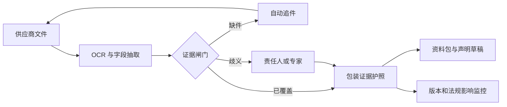

# PackProof：食品包装证据护照

> **一句话讲清楚：** 给销往欧盟或北爱尔兰的中小食品品牌一个包装文件管家——它把供应商声明、材料规格和检测报告整理成可追溯的“证据护照”，按包装类型收费；BPA 与 PFAS 新规则集中生效，使这件事从“以后整理”变成“现在要能拿出来”。

**五分钟读完：** 下面先帮你看懂这门生意，再判断它是否值得关注。完整法规来源、测算和边界放在文末附录。公开桌面证据不等于客户验证，也不承诺收益。

## 1. 先看懂：这是个什么生意？

**说明性场景（不是客户案例）：** 一家小型酱料品牌准备把新瓶装产品卖到欧盟。质量负责人手里有瓶身、瓶盖、密封垫、油墨和涂层供应商发来的几十份 PDF，但他很难迅速回答：哪份文件对应当前包装版本？是否提到 BPA 或 PFAS？换过材料后旧报告还能不能用？

PackProof 不做检测，也不宣布“合规”。它让用户上传这些文件，自动抽取材料、供应商、日期、测试和声明字段，再把结果归到某一种包装上。缺少什么会被列出来；需要交给零售商、进口商或主管机关时，可以导出一份带原文出处和版本记录的资料包。

**最小可售单元：** 一个“包装类型证据护照”，例如某款玻璃瓶 + 瓶盖 + 密封垫的组合，而不是一份泛泛的法规报告。

## 2. 为什么偏偏是现在？

- **2026-07-20：** 欧盟 BPA 食品接触材料规则的首个关键过渡期限到达。英国食品标准局提醒面向欧盟或北爱尔兰市场的企业检查供应链、材料和支持文件。[官方指引](https://www.gov.uk/government/publications/bpa-in-food-contact-materials-eu-rules-and-uk-implications/bpa-in-food-contact-materials-eu-rules-and-uk-implications)
- **2026-08-03：** 欧盟委员会在包装和包装废弃物条例（PPWR）普遍适用前九天发布新版 FAQ，说明企业仍在需要统一解释。[官方 FAQ](https://environment.ec.europa.eu/publications/faq-packaging-and-packaging-waste-regulation-ppwr_en)
- **2026-08-12：** PPWR 将普遍适用，并对食品接触包装中的 PFAS 设置浓度上限，同时要求相关技术文件与符合性声明。[法规原文](https://eur-lex.europa.eu/legal-content/EN/TXT/?uri=CELEX%3A32025R0040)

单独看，每条法规都可以交给专家解释；合在一起，它们制造了一个更日常的付费理由：**企业必须知道“每个在售包装的证据在哪里、是否过期、缺什么”。**

## 3. 谁会付钱，为什么会付？

**唯一付费客户（AI 推断）：** 已经在欧盟或北爱尔兰销售、约有 10–100 个活跃包装组合、但没有企业级法规系统的独立食品品牌或进口商。真正只有一两款商品的微型商家，紧迫性和预算都可能不够。

最强的购买时刻不是“学习新法规”，而是新品上市、供应商换材料、零售商索件或主管机关要求文件。此时继续用邮箱 + Excel + 共享盘的成本，会从“麻烦”变成“上市延误或无法及时举证”。

客户购买的也不是 AI：他买的是四个结果——文件不丢、版本对得上、缺件有人追、需要时能快速导出。受益者通常是质量/运营人员，付款者是承担上市和监管风险的企业。

## 4. 它具体怎么运转？

1. 用户为一个包装组合建档，上传供应商声明、材料规格和检测报告。
2. 系统抽取材料、组件、供应商、日期、测试方法与 BPA/PFAS 相关字段，并把每个字段链接回原文件页码。
3. 规则引擎只给三种状态：证据已覆盖、明确缺件、需要人工判断。它不输出“自动合规认证”。
4. 用户追齐文件后，由责任人审核并导出证据索引、支持文件包和符合性声明草稿；文件或包装变化会生成新版本。

**完成定义：** 包装身份、组件、供应商、原始证据、版本和审核人都能追溯，才可标为“资料完整”。**资料完整不等于法律合规。**

## 5. 怎么赚钱，能自动到什么程度？

**建议定价假设：** €79/月，管理不超过 50 个包装类型。假设每客户每月 OCR、存储、通知、支付和一般支持共 €14–34，则软件层月贡献毛利约 €45–65；这不是市场报价，也没有扣除研发、获客、税务和专业规则维护。

复购来自包装换版、供应商文件更新、新品上市和法规变化。如果客户只在一次审计前使用，随后不再登录，订阅就不成立。

- **可自动化：** 文档去重、OCR、字段抽取、缺件提醒、版本差异、法规变化后的影响清单和导出目录。
- **必须人工：** 判断责任主体、过渡条款、检测方法是否适用，处理矛盾证据并签署声明。
- **自动化上限：** 如果超过 30% 的护照每月都需要半小时以上专家判断，€79 的软件会退化成低毛利代运营。

## 6. 最大问题与最终判断

**结论：有条件值得继续关注。** 新鲜的不是“合规 SaaS”这个大词，而是 2026 年 7–8 月形成的具体文件断层：规则节点集中出现，而证据仍以不同供应商的 PDF 传递。只要产品守住“整理证据，不替人担责”的窄边界，就有机会成为可复用的软件，而不是法规咨询项目。

它最可能死在三件事上：

1. 用户把“资料完整”误当成“已经合规”，责任边界无法维持；
2. 供应商文件差异太大，抽取与规则无法模板化，人工成本吞掉毛利；
3. 需求只是一次性整理，90 天留存不足以支撑订阅。

**角色设定不参与入口筛选。** 这个方向因法规节点和文件义务入选，不是因为你的职业。选定后，系统架构能力可以迁移到证据图谱、规则版本、审计链和异常熔断；食品接触材料判断、欧盟法规审核与检测方法判断必须外包或与专业人员合作。

---

## 事实与推演附录

> HTML 中本节默认折叠；Markdown 中保留完整研究，供复核而非承担主叙事。

### A. 行业坐标与商业系统

- **主行业：** 包装食品 / 食品接触材料。
- **商业模式：** 微型软件订阅 + 按包装类型导出的合规数据包。
- **价值链位置：** 包装供应商、检测实验室与自有品牌食品制造商/进口商之间的证据整理层。
- **新鲜信号：** BPA 首个期限刚到；PPWR 三天后普遍适用；欧盟委员会六天前发布新版 FAQ。
- **唯一付费客户：** 已在 EU/NI 销售、拥有多个包装组合但没有企业级法规系统的独立食品品牌或进口商。
- **受益者与付款者：** 质量/运营人员直接受益，企业付款并承担上市与监管风险。
- **机会形态与商业系统：** 文件接收 → 结构化抽取 → 缺件/歧义分流 → 人工审核 → 资料包导出 → 持续版本监控。

### B. 市场证据与事实来源

| 日期 | 一手来源 | 可直接复核的事实 | AI 推断 | 证据局限 |
|---|---|---|---|---|
| 2026-07-20 | [英国食品标准局 BPA 指引](https://www.gov.uk/government/publications/bpa-in-food-contact-materials-eu-rules-and-uk-implications/bpa-in-food-contact-materials-eu-rules-and-uk-implications) | 首个 BPA 过渡期限到达；EU/NI 相关企业应审查材料、供应链和支持文件 | BPA 与 PFAS 可共用一套证据底座 | 未证明客户会为某款软件付费 |
| 2026-08-03 | [欧盟委员会 PPWR FAQ](https://environment.ec.europa.eu/publications/faq-packaging-and-packaging-waste-regulation-ppwr_en) | 新版 FAQ 的发布日期为 8 月 3 日 | 临近适用日仍存在解释和落地需求 | FAQ 需求不等于软件需求 |
| 2026-08-12 | [PPWR Article 5、15、16、39 与 Annex VII/VIII](https://eur-lex.europa.eu/legal-content/EN/TXT/?uri=CELEX%3A32025R0040) | 食品接触包装 PFAS 有上限；制造商需做符合性评估、技术文件与 EU 符合性声明；供应商需提供必要文件 | 这些义务可映射成软件字段和工作流 | 责任主体与例外需逐案判断 |
| 现行 | [BPA Regulation Article 8](https://eur-lex.europa.eu/legal-content/EN/TXT/?uri=CELEX%3A32024R3190) | 相关食品接触材料需附书面符合性声明，并保留支持文件供主管机关索取 | 文件与包装版本的对应关系本身可成为软件产品 | 不证明中小企业的预算 |

**事实：** PPWR 对食品接触包装中的 PFAS 设置 25 ppb 单项目标 PFAS、250 ppb 目标 PFAS 总和、50 ppm 含聚合物 PFAS 的相应上限，适用时还受法规条件与检测口径约束；一次性包装的相关技术文件通常保存 5 年，重复使用包装通常保存 10 年。

**AI 推断：** 文件主要散落在邮箱、共享盘和供应商 PDF；按包装类型比按食品 SKU 计费更合理；10–100 个活跃包装组合可能是最早可服务的区间。

**建议定价假设：** €79/月、最多 50 个包装类型；€199/月、最多 250 个包装类型。不是市场报价。

**未知：** 实际采购决策人、可接受价格、现有系统、供应商回复速度、成员国执法节奏、真实抽取准确率与客户留存。

**不得编造：** 当前没有真实客户、成交、节省金额或平台强制索件案例；软件不能自动判定合规。

### C. 收入与单位经济

| 收入项 | 建议定价假设 | 可变成本 | 毛利逻辑 | 回款与复购 |
|---|---:|---:|---|---|
| 基础订阅 | €79/月，≤50 个包装类型 | €14–34/月 | 规则与抽取管线复用；月贡献毛利假设 €45–65 | 月/年预付；包装和文件变化驱动复购 |
| 扩展订阅 | €199/月，≤250 个包装类型 | 处理量、成员权限与支持增加 | 成本不应与包装数同比增长 | 面向多品牌或进口商 |
| 专家复核转介 | 5%–10% 平台费 | 支付、纠纷和服务管理 | 专家独立担责，软件不冒充法律意见 | 只在高风险例外时触发 |

最大单位经济风险不是云成本，而是非标准人工解释。如果大多数客户都需要持续专家陪同，应改为高价专业服务，或停止这个 SaaS 假设。

### D. 运营与自动化系统



异常熔断：低置信度字段不进入“已覆盖”；矛盾声明冻结导出；原文件变化使旧结论失效；规则更新只标“需复核”；没有原始文件时不得靠聊天回答生成绿色状态。

### E. 30 / 90 天演进路线

- **0–30 天：** 只覆盖 EU/NI 一次性食品接触包装；只做 BPA、PFAS/总氟、供应商、材料与版本字段；导出索引和声明草稿，不发“合规证书”。
- **31–90 天：** 增加包装组件拆分、证据反向引用、供应商免注册上传、法规批量影响分析与独立专家转介。
- **可沉淀资产：** 材料—证据—法规条款规则库、供应商文件抽取模板、包装与文件版本关系图、真实缺件频率和异常审核模式。

### F. 风险、合规与停止条件

- **最大风险：** 责任误导、规则解释错误、垃圾进垃圾出、微型企业责任例外、高人工侵蚀、商业秘密与跨境数据责任。
- **合规边界：** 只版本化官方来源；字段保留原文、页码、文件散列和审核状态；声明只生成草稿；矛盾证据必须转人工。
- **停止条件：** 前 100 个真实文件的核心字段可靠抽取率低于 60%；超过 30% 护照每月需半小时以上专家判断；50 个付费客户阶段 90 天留存低于 50%；责任边界无法在产品和合同中维持。
- **未知项：** 上述阈值均为运营假设，不是行业基准。

---

## 反馈（skill_run）

```yaml
skill_run:
  skill: creative-capture-assistant
  workflow_stage: single-idea
  plan: "Plans/创意捕捉/2026-08-09-副业创意-PackProof食品包装证据护照.md"
  date: 2026-08-09
  contexts_used:
    - path: "Contexts/决策/Skill反馈协议.md"
      utility: high
      reason: "按仓库协议记录单创意研究的来源使用与完成状态。"
    - path: "Contexts/规范/炫酷建站规范.md"
      utility: high
      reason: "用于落实单栏叙事、折叠附录与三宽度浏览器门禁。"
    - path: "Contexts/规范/html模版/samples/A-single-scroll.html"
      utility: high
      reason: "用于实现五分钟主文优先的单栏阅读骨架。"
  contexts_missing: []
  contexts_stale: []
  outcome_status: pass
```
