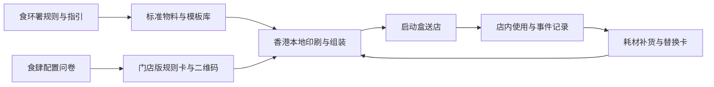

# PawReady：狗友善食肆运营盒

> **一句话讲清楚：** 向香港获准容许狗只进入的独立食肆，出售一套把政府规则转成店内动作的实体运营盒——入口展示、座位提示、员工口袋卡、狗只专用清理用品和二维码须知一次配齐；先收开店套件费，再赚耗材补充费。

**五分钟读完：** 这不是宠物餐厅咨询，也不是替食肆申请牌照。它卖的是一套标准化、可补货的店内用品。完整来源、成本假设和合规边界放在文末附录；公开桌面证据不等于客户验证，也不承诺收益。

## 1. 先看懂：这是个什么生意？

**说明性场景（不是客户案例）：** 一家茶餐厅刚获准让顾客带狗入内。政府给了牌照条件和指定 A3 标示，但真正开门后，店员仍要现场判断：狗绳是否超过 1.5 米、哪些桌可以坐、狗只弄污地面谁负责、清理工具放在哪里、如何提醒顾客不要把狗放上餐桌。

店主当然可以自己去文具店、宠物店和网店分别采购，再从几十条官方指引里整理话术。PawReady 把这些零碎动作变成一箱到店即用的物料：官方 A3 标示的透明展示架、双语店内规则卡、狗友善桌位标识、1.5 米牵引带检查卡、员工处置流程卡、分类清理标签，以及手套、排泄袋和尿垫等首批耗材。二维码页面负责展示本店规则、预约提示与事件记录。

**最小可售单元：** 一间获准食肆的一套启动盒。官方标示仍由食环署提供，PawReady 只提供展示载体和补充物料，绝不仿制官方标示。

## 2. 为什么偏偏是现在？

- **2026-07-09：** 香港新安排正式生效，首批超过 940 间食肆获准让顾客带狗进入；政府还派出 90 人专队逐店讲解要求。[香港政府新闻](https://www.news.gov.hk/eng/2026/07/20260709/20260709_163549_294.html)
- **实施头两周：** 食环署进行了约 14,000 次巡查，发出 70 次口头警告并收到 65 宗投诉；警告主要涉及入口标示不清和狗只未被妥善约束。同期有 31 间食肆退出，主要原因是顾客接受度不足。[香港电台](https://news.rthk.hk/rthk/en/component/k2/1863560-20260725.htm)
- **官方操作要求非常具体：** 指引涉及增加清洁频率、狗只专用垃圾桶、清理排泄物、员工培训、桌位距离、繁忙时段管理和事件报告；这些都需要落成用品与流程，而不是只读一份文件。[食环署经营者指引](https://www.fehd.gov.hk/english/licensing/dog_restaurants/guide_restaurant.html)

这三个信号共同说明：市场不是“准备开放”，而是已经营业并出现早期摩擦。**赚钱点不是解释政策，而是把重复摩擦预先装进一个盒子。**

## 3. 谁会付钱，为什么会付？

**唯一付费客户（AI 推断）：** 首批获准食肆中，缺少集团采购与营运团队、但希望把狗友善时段做成差异化卖点的独立餐厅、咖啡店和茶饮店。大型连锁通常有自己的采购系统；只挂牌但没有宠物客流的店，也不会持续补货。

购买触发有三个：刚拿到许可准备营业；被口头提醒后要迅速整改；决定推出狗友善桌位或时段，却发现员工执行不一致。店主付的钱不是“合规保证”，而是少跑几家店、少做几版提示牌、少让员工临场发明规则。

替代方案很强：政府指引免费，手套、尿垫和排泄袋也很容易买到。因此 PawReady 必须靠“尺寸统一、双语话术、店内摆放逻辑、补货方便”取胜；如果只是把普通宠物用品加价装箱，它没有成立理由。

## 4. 它具体怎么运转？

1. 食肆在线选择面积、狗友善桌数、开放时段、是否提供预包装狗粮，以及由顾客还是员工处理排泄物。
2. 系统按选择生成双语店内规则、员工口袋卡、二维码须知和物料清单；所有模板明确区分法定要求、牌照条件与建议做法。
3. 香港本地印刷与履约伙伴组装启动盒，放入展示架、桌位标识、分类标签和首批清理耗材后送店。
4. 店主扫码启用二维码页面，员工可查看处置步骤并记录事故；消耗品按实际使用量一键补货。
5. 官方指引更新时，只更新受影响的数字模板和替换卡，不要求整箱报废。

**完成定义：** 店员能在一分钟内找到入口展示、入店检查、桌位安排、弄污清理和异常上报的明确动作。PawReady 不申请许可、不安装承重牵引装置、不出售清洁化学品，也不声称用了套件就一定合规。

## 5. 怎么赚钱，能自动到什么程度？

**建议定价假设：** 启动盒 HK$1,480；假设印刷、展示架、标签、首批耗材、组装和香港配送合计 HK$450–650，单盒贡献毛利约 HK$830–1,030。补充包假设 HK$298/月，货品与履约成本 HK$120–180，贡献毛利约 HK$118–178。全部是模型假设，不是供应商报价。

复购来自手套、尿垫、排泄袋、规则卡损耗和新桌位增加。二维码页面不单独卖昂贵软件，只承担配置、补货与版本更新，避免又变成低使用率 SaaS。

- **可自动化：** 配置问卷、双语模板合成、二维码页面、付款、补货提醒、库存阈值和版本更新。
- **必须人工：** 首批物料选品、印刷验收、组装配送、粤语文案复核、客诉和异常退换。
- **自动化上限：** 如果每家店都要求重新设计物料或现场培训，这门生意会退化成低毛利广告制作与咨询。

## 6. 最大问题与最终判断

**结论：有条件值得继续关注。** 它的稀缺点不是某个宠物用品，而是一个只有一个月历史的新经营场景：约千家餐厅同时学习同一套动作，政府资料完整，但用品、话术和补货仍是碎片化的。用标准盒承接这段“制度刚落地、行业还没形成默认做法”的窗口，比再造一个宠物 App 更接近真实交易。

它最可能死在三件事上：

1. 首批市场只有约 940 家，而且 31 家已退出；可服务市场可能太小。
2. 店主发现普通网购用品足够，拒绝为标准化和双语模板支付溢价。
3. 产品暗示“官方认可”或“保证合规”，造成商标、责任和信任风险。

**角色设定不参与入口筛选。** 这个机会因香港餐饮政策刚落地和实体运营摩擦入选。选定后，你的架构能力可用于配置规则、SKU、补货与版本系统；但香港餐饮渠道、粤语文案、宠物行为、食物业责任和本地履约必须交给当地合作方，不能把它改写成远程咨询服务。

---

## 事实与推演附录

> HTML 中本节默认折叠；Markdown 中保留完整研究，供复核而非承担主叙事。

### A. 行业坐标与商业系统

- **主行业：** 香港餐饮运营 / 宠物友好消费。
- **商业模式：** 标准化实体启动盒 + 耗材补充订阅 + 轻量二维码工具。
- **价值链位置：** 位于食环署规则、餐厅采购、宠物用品供应商与香港本地印刷/配送之间。
- **新鲜信号：** 新安排于 7 月 9 日落地；头两周已出现高频巡查、口头警告、投诉和退出者。
- **受益者与付款者：** 店员和带狗顾客直接受益，获准食肆经营者付款并承担运营责任。
- **最小可售单元：** 一间食肆的一套启动盒。
- **机会形态与商业系统：** 规则拆解 → 门店配置 → 模板生成 → 本地组装配送 → 店内使用 → 耗材补货 → 规则更新。

### B. 市场证据与事实来源

| 日期 | 一手来源 | 可直接复核的事实 | AI 推断 | 证据局限 |
|---|---|---|---|---|
| 2026-06-12 | [食环署公布抽签结果](https://www.fehd.gov.hk/english/news/details/20260612_12451.html) | 申请期收到 2,205 宗申请；核实后 1,616 宗参与 1,000 个名额抽签；官方提供指定 A3 标示 | 同批门店会产生相似的开店物料需求 | 申请热度不等于付费意愿 |
| 2026-07-09 | [香港政府：新安排实施](https://www.news.gov.hk/eng/2026/07/20260709/20260709_163549_294.html) | 首批超过 940 间食肆获准；90 人专队逐店解释要求 | 首月是形成默认运营用品的窗口 | 政府已免费提供说明与标示 |
| 2026-07-25 | [香港电台：实施两周](https://news.rthk.hk/rthk/en/component/k2/1863560-20260725.htm) | 约 14,000 次巡查、70 次口头警告、65 宗投诉、31 间退出；主要警告涉及标示不清和狗只约束 | 运营动作尚未标准化，可能愿意购买现成套件 | 整体合规被官方评价为可接受，问题可能快速消退 |
| 2026-06—07 | [食环署经营者指引](https://www.fehd.gov.hk/english/licensing/dog_restaurants/guide_restaurant.html) | 指引涉及预约、清洁、狗只专用垃圾桶、排泄物处理、培训、用品分色、桌位和事故报告 | 可将分散要求映射为物料与二维码流程 | 部分内容只是建议做法，不是法定义务 |
| 2026-07-10 | [美联社现场报道](https://apnews.com/article/dogs-hong-kong-restaurants-f46cc17094828405ed80aa57a0776441) | 一家受访茶楼称为准备投入超过 HK$10,000，购置空气净化器、分隔区、宠物车和清洁用品 | 至少部分经营者愿为场景改造花钱 | 单店案例不能外推整个市场 |

**事实：**

- 狗只必须由成年人以不超过 1.5 米的牵引带稳妥牵引，或稳妥系于固定在地面或墙上的附着物；即使在宠物车或载具中也仍需遵守牵引要求。[食环署常见问题](https://www.fehd.gov.hk/english/licensing/dog_restaurants/faq.html)
- 食肆不得烹煮或准备狗粮，只可提供或销售无需加工的预包装干粮、真空包装或罐装狗粮。
- 官方 A3 标示由食环署提供并须在入口显眼展示；第三方不得伪造或替代。
- 指引建议将处理狗只相关物品的清洁工具与一般餐饮工具分开，可用不同颜色或明确标签识别。

**AI 推断：**

- 独立食肆比集团连锁更可能需要外部标准化套件。
- 店主会为双语模板、一次配齐和补货便利支付 HK$1,480。
- 清理耗材的月度补货能够形成持续收入。

**建议定价假设：** 启动盒 HK$1,480；补充包 HK$298/月；二维码页面随盒提供。不是市场报价。

**未知：** 真实耗材消耗量、餐厅现有供应商、第二阶段开放时间和名额、店主对第三方模板的信任、配送退货率与客户获取成本。

**不得编造：** 本文没有声称已有供应商、客户、订单、官方合作、合规认证或真实毛利。

### C. 收入与单位经济

| 收入项 | 建议定价假设 | 可变成本 | 毛利逻辑 | 回款与复购 |
|---|---:|---:|---|---|
| 启动盒 | HK$1,480/店 | HK$450–650 | 标准印刷、物料组合与配置模板复用；贡献毛利假设 HK$830–1,030 | 下单预付；新获准门店或新增区域触发 |
| 清理补充包 | HK$298/月 | HK$120–180 | 手套、尿垫、排泄袋与标签按统一 SKU 补货 | 月付或按需；实际使用量驱动 |
| 替换物料包 | HK$180–380/次 | HK$60–160 | 规则更新、损坏或新增桌位时替换 | 按次回款，非固定订阅 |
| 二维码工具 | 含在启动盒内 | 托管与通知成本低 | 用于降低补货和版本更新摩擦，不单独承担营收 | 维持客户入口 |

上述毛利未扣除获客、样品、退换货、香港仓储、税费、支付手续费、文案审核和创始人工时。

### D. 运营与自动化系统



**人工责任：** 供应商筛选、印刷质量、粤语表达、门店资料审核、仓储配送、产品安全和客诉。

**异常熔断：**

- 未获正式许可的食肆不得使用“获准食肆”措辞。
- 官方标示只装入展示架，不扫描、重印或修改。
- 涉及法律判断的配置必须链接回官方原文，不由二维码工具自行下结论。
- 不提供承重牵引装置安装；固定装置须由合资格本地施工方按场地评估。
- 不在首版销售消毒剂、狗粮或接触食品的器具，避免额外产品责任。

### E. 30 / 90 天演进路线

- **0–30 天：** 只服务已经获准的独立食肆；只做入口展示载体、双语规则卡、桌位标识、员工卡、分类标签和基础清理耗材；香港本地按单组装。
- **31–90 天：** 根据门店类型形成咖啡店、茶餐厅和酒吧三个固定 SKU；增加按实际消耗的一键补货、二维码事件记录和官方规则更新替换卡。
- **可沉淀资产：** 场景化物料模板、门店配置规则、SKU 消耗数据、不同店型的补货节奏、香港本地印刷/履约网络和稳定的获准食肆名单。

### F. 风险、合规与停止条件

- **最大风险：** 市场过小、政府免费资料足够、普通用品价格透明、第二阶段延后、餐厅退出、物料被误认为官方、清洁或牵引用品造成责任事故。
- **合规边界：** 不替代官方标示，不保证合规，不提供法律意见，不销售未经核验的化学品或食品，不采集顾客敏感信息。
- **停止条件：**
  1. 每获得一个付费食肆的获客成本超过 HK$500，而启动盒贡献毛利低于 HK$800；
  2. 购买启动盒的餐厅在 90 天内补充包购买率低于 20%；
  3. 超过 30% 订单要求非标准设计或到店培训；
  4. 退货与质量投诉超过订单数 5%；
  5. 第二阶段没有新增足够食肆，而首批可触达市场已接近饱和。
- **未知项：** 所有价格、成本和停止阈值都是商业模型假设，不是行业基准。

---

## 反馈（skill_run）

```yaml
skill_run:
  skill: creative-capture-assistant
  workflow_stage: single-idea
  plan: "Plans/创意捕捉/2026-08-09-副业创意-PawReady狗友善食肆运营盒.md"
  date: 2026-08-09
  contexts_used:
    - path: "Contexts/决策/Skill反馈协议.md"
      utility: high
      reason: "按协议记录本次单创意研究的事实边界与完成状态。"
    - path: "Contexts/规范/炫酷建站规范.md"
      utility: high
      reason: "用于落实五分钟单栏正文、折叠证据附录与三宽度浏览器门禁。"
    - path: "Contexts/规范/html模版/samples/A-single-scroll.html"
      utility: high
      reason: "用于呈现新政策到实体运营套件的一条清晰叙事线。"
  contexts_missing: []
  contexts_stale: []
  outcome_status: pass
```
