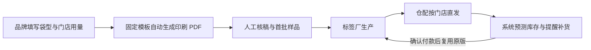

# SealFlow：外卖封签自动补给

> **一句话讲清楚：** 向中国内地有 3–30 家门店的区域餐饮品牌，按月出售带门店品牌、拆启留痕、无法复原的外卖封签；新规刚把“封口后无法复原”变成明确义务，商家付钱买的是持续不断货的合适封签，而不是一份咨询报告。

**五分钟读完：** 这是一门小型 B2B 耗材生意。网页收集门店资料并自动生成印刷文件，标签厂按单生产，仓配方直接发货，系统根据用量提醒补货。公开事实只能证明窗口存在，不能证明商户一定购买；价格、成本和销量都在附录中标成假设。

## 1. 这到底卖什么？

**说明性场景，不是真实客户案例：** 一家有 8 个门店的米粉品牌，每店每天约有 80 单外卖。过去店员用袋口打结或普通透明胶带封袋；现在，门店需要确保餐食封口开启后无法复原。老板临时在网店买通用封签，随后遇到三个小麻烦：尺寸不适合自家纸袋、不同门店各自采购容易断货、普通封签除了“已封口”没有品牌识别。

SealFlow 提供的不是包装设计项目，而是一个固定商品：店主选择袋型、封签尺寸、门店数量和月订单区间，系统自动生成带品牌名称、拆封警示和可选售后二维码的印刷稿；合作标签厂生产后，由仓配方按门店分箱发出。以后只需按预测用量自动补货。

**最小可售单元：** 一个品牌、至少 3 家门店、一个月的定制防拆封签。首版不卖打印机，不接食品包装袋，不承诺“用了就合规”。

## 2. 为什么是现在？

- **全国规则刚进入执行期。** 市场监管总局第 123 号令于 2026 年 6 月 1 日施行，第二十七条要求网络餐饮经营者对餐食包装、封口，并保证封口开启后无法复原。[市场监管总局原文](https://www.samr.gov.cn/zw/zfxxgk/fdzdgknr/fgs/art/2026/art_d04d512f5ad8470eb61a652c0061dc3a.html)
- **地方正在把抽象条款翻译成门店动作。** 无锡市市场监管局 7 月 10 日明确提醒商家“出餐必封签”“一餐一封签”，并说明袋口打结不能替代；汕尾则要求所有线上餐饮商家使用专用食安封签，不能用普通胶带、订书钉或绳索代替。[无锡市市场监管局](https://www.wuxi.gov.cn/doc/2026/07/10/4803054.shtml) · [汕尾市市场监管局](https://www.shanwei.gov.cn/swscjdglj/zwdt/gzdt/content/post_1253018.html)
- **平台侧的检查力度也在升级。** 市场监管总局 6 月的实施报道提到，平台正在加强实地资质审核和过程管控；违规商户可能面临警示、限流、暂停服务或关店等平台措施。[市场监管总局实施报道](https://www.samr.gov.cn/spjys/sjdt/gzdt/art/2026/art_d0a91459127c4df091a08830220cb2b2.html)

机会不在“发明封签”，封签早就存在；机会在于：**大量门店从偶尔采购，切换到每一单都要消耗、不能断货的日常用品。**

## 3. 谁会付钱？

**唯一付费客户（AI 推断）：** 位于中国内地、拥有 3–30 家门店、外卖订单占比较高、还没有集团包装采购团队的区域餐饮品牌。比如地方米粉、盖饭、轻食、烘焙和茶饮连锁。单体小店往往只看最低价，大型连锁有成熟供应商；中间这批小连锁既有稳定消耗量，又常缺少统一采购。

真正的购买理由只有三个：门店不能断货；每家店收到的规格必须一致；老板希望把原本纯成本的封签顺手变成品牌触点。售后二维码只能链接品牌自有的订单反馈或客服页面，是否允许引导站外交易必须遵守所在平台规则。

替代方案很强：通用封签便宜、平台或地方也可能提供免费物料、现有包装袋本身也可能做到不可复原。因此 SealFlow 只有在“多门店分发 + 自动补货 + 小批量定制”明显省事时才成立，不能靠法规恐吓加价。

## 4. 它怎样自动运转？

1. 品牌在网页上传名称与标志，选择纸袋、塑料袋或餐盒的封口位置，填写每店日均外卖单量；系统只提供经过实物验证的固定尺寸。
2. 模板引擎自动生成印刷 PDF 和门店分箱清单。订单涉及的城市规则只显示官方原文链接，不由系统作法律判断。
3. 标签厂按批生产，仓配方按门店发货；店员消耗封签，无需安装软件或额外扫码操作。
4. 系统用“日均订单 × 营业天数 × 安全余量”估算下一次补货日，提前提醒付款；确认后自动复用上次版式并下发生产单。
5. 品牌更换标志、袋型或门店时才进入人工复核，普通补货尽量不经手。

**自动化的边界：** 首次选材、样品拉力与粘性测试、印刷验收、售后和规则更新必须由人处理。任何一家客户都要单独设计、反复改稿，这门生意就会退化成广告制作公司。

## 5. 钱从哪里来？

建议把复杂度藏在订阅价格里，而不是分别收设计费、软件费和仓储费。

| 商品 | 建议定价假设 | 假设成本 | 贡献毛利假设 |
|---|---:|---:|---:|
| 三店起订月包：每店 3,000 枚定制封签 | ¥399 / 店 / 月 | ¥150–210 / 店 | ¥189–249 / 店 |
| 首次制版与样品 | ¥299 / 品牌 | ¥80–150 / 品牌 | ¥149–219 / 品牌 |
| 临时加急补货 | 正常单价 + ¥80 / 单 | 取决于快递与排产 | 不作为核心收入 |

以上全部是**建议定价假设**，不是标签厂报价，也没有包含获客、退换货、税费、支付手续费和创始人工时。以 8 店品牌为说明性计算：月收入为 `8 × ¥399 = ¥3,192`；若每店成本 ¥180，月贡献毛利约 `8 × (¥399 - ¥180) = ¥1,752`。这不是收益承诺。

自动化潜力来自复购：第一单需要审核，之后版式、数量、门店地址和生产指令都能复用。真正可积累的资产不是网页，而是不同袋型的封签规格库、各店用量曲线、稳定印厂和低差错分箱流程。

## 6. 最大问题与最终判断

**结论：值得作为“低人力、实体复购”的国内副业样本继续观察，但不是暴利项目。** 它有明确的近期触发器、明确的消耗动作和明确付款人；与咨询相比，交付更标准，与纯软件相比，商户不需要学习新系统。它更像一台慢慢滚起来的小型耗材机器。

它最可能死在三件事上：通用封签价格低到定制价值无法覆盖；平台免费发放封签；不同城市对“不可复原封口”的执行口径不同，产品误把地方要求说成全国统一要求。

因此产品的底线是：只说“防拆封签和补给服务”，不说“官方指定”；只引用规则，不给法律结论；先限定固定尺寸与固定版式，不承接无限设计。若无法保持标准化，自动化和利润会一起消失。

**角色设定不参与入口筛选。** 这个机会因为国内网络餐饮规则刚落地、实体耗材转为高频消耗而入选。选定后，你的系统能力可以用在规格配置、印前生成、补货预测和异常熔断；材料测试、食品接触合规、印刷和仓配应交给专业供应商，不能把生意改写成你的个人咨询。

---

## 事实与推演附录

> HTML 中本节默认折叠；Markdown 中保留完整研究，供复核而非承担主叙事。

### A. 行业坐标与商业系统

- **主行业：** 中国内地网络餐饮 / 包装耗材。
- **商业模式：** 定制实体耗材订阅 + 自动印前生成 + 第三方生产和分箱履约。
- **价值链位置：** 位于监管要求、餐饮品牌总部、标签印刷厂与门店采购之间。
- **新鲜信号：** 全国规则于 2026-06-01 生效；无锡于 2026-07-10 继续发布“一餐一封签”执行提醒；二季度平台与监管执法仍在强化。
- **唯一付款者：** 3–30 店区域餐饮品牌的老板或运营负责人。消费者、骑手和门店员工受益但不付款。
- **最小可售单元：** 一个品牌、至少 3 家店、每店 3,000 枚/月的固定规格封签。
- **价值链：** 规则与袋型收集 → 固定模板配置 → 自动印前 → 标签厂生产 → 分店直发 → 用量预测 → 自动补货。

### B. 公开证据与边界

| 日期 | 来源 | 可直接复核的事实 | AI 推断 | 证据局限 |
|---|---|---|---|---|
| 2026-02-26 / 06-01 生效 | [市场监管总局第 123 号令](https://www.samr.gov.cn/zw/zfxxgk/fdzdgknr/fgs/art/2026/art_d04d512f5ad8470eb61a652c0061dc3a.html) | 第二十七条要求使用符合食品安全标准的容器、餐具和包装材料，对餐食包装、封口，且开启后无法复原 | 可带来持续的防拆封口耗材需求 | 国家条款没有规定必须购买某种第三方贴纸；一体式防拆包装也可能满足要求 |
| 2026-06-08 | [汕尾市市场监管局](https://www.shanwei.gov.cn/swscjdglj/zwdt/gzdt/content/post_1253018.html) | 当地要求线上餐饮商家 100% 使用专用食安封签，禁止普通胶带、订书钉、绳索替代 | 在地方执行明确的城市，采购紧迫性更强 | 这是地方执行口径，不能外推为全国统一的“专用贴纸强制令” |
| 2026-07-10 | [无锡市市场监管局](https://www.wuxi.gov.cn/doc/2026/07/10/4803054.shtml) | 当地提醒“出餐必封签”“一餐一封签”，说明袋口打结不可替代，骑手可拒收异常餐食 | 每单消耗会把封签变为可预测复购物料 | 未公布当地商户采购量、供应方式或付费意愿 |
| 2026-06-08 | [市场监管总局实施报道](https://www.samr.gov.cn/spjys/sjdt/gzdt/art/2026/art_d0a91459127c4df091a08830220cb2b2.html) | 平台正在加强资质实地核查和过程管控；总局介绍平台可对违规商户警示、限流、暂停服务或关店 | 小连锁会更在意统一操作和留痕 | 主要压力不只针对封签，也包含证照、门店真实性和后厨管理 |
| 2026-07 | [市场监管总局二季度发布会](https://www.samr.gov.cn/xw/xwfbt/art/2026/art_6e5847170ffb49d98bdeaa58db168515.html) | 总局通报已对 7 家电商平台“幽灵外卖”系列案作出行政处罚，并将继续整治无堂食外卖 | 平台审查不会在规则发布后立即减弱 | 执法通报不能直接证明第三方封签订阅有市场 |
| 2026-04-08 | [广州市 2026 餐饮检查计划](https://scjgj.gz.gov.cn/ztzl/bhzx/zcwj/content/post_10761256.html) | 无堂食、集约式厨房和连锁总部/门店是重点对象；日管控、周排查、月调度为重点检查内容 | 未来可延伸到门店证据用品，但不应放入首版 | 与封签采购不是同一需求，故不用于支撑首版收入 |

**事实：** 全国层面的明确义务是“封口开启后无法复原”；汕尾、无锡等地公开材料把它进一步落成专用封签或“一餐一封签”。平台和地方执行存在差异。

**AI 推断：** 3–30 店区域连锁会为小批量定制、门店分发和不断货补给付费；封签还能作为品牌识别触点。

**建议定价假设：** ¥399 / 店 / 月，含 3,000 枚定制封签和普通配送；首次制版与样品 ¥299 / 品牌。

**未知：** 真实印刷报价、不同材质的最低起订量、外卖平台免费物料覆盖率、门店每单封签用量、客户可接受价格、退货率、食品接触材料适用标准、不同城市的检查口径。

**不得编造：** 本文没有声称已有客户、订单、供应商、专利、平台合作、官方认证或实际毛利。

### C. 单位经济与现金流

| 项目 | 建议假设 | 计算方式 | 主要不确定性 |
|---|---:|---|---|
| 月包收入 | ¥399 / 店 | 每店每月预付 | 商户是否愿意接受订阅而非临时网购 |
| 封签生产 | ¥100–150 / 3,000 枚 | 材质、尺寸、颜色和起订量共同决定 | 未取得供应商报价 |
| 分箱与配送 | ¥35–50 / 店 | 小包裹普通快递 | 偏远地区、加急与退换货 |
| 支付与系统 | ¥5–10 / 店 | 支付费率、页面与通知摊销 | 订单规模小会放大固定成本 |
| 贡献毛利 | ¥189–249 / 店 / 月 | 399 减上述可变成本 | 未扣获客、税费、样品与人工 |
| 三店最小月单 | ¥1,197 | 3 × 399 | 规模太小时售后成本可能吞掉利润 |

**说明性计算：** 一个 8 店品牌月收入 ¥3,192；按每店可变成本 ¥180，月贡献毛利约 ¥1,752。若每月新增 2 个同规模品牌且都持续复购，收入会形成累积；但本文没有数据支持该新增速度或留存率。

### D. 运营与自动化系统



**可自动化：** 配置问卷、固定模板排版、印刷 PDF、报价、付款、订单拆分、门店地址簿、用量预测、补货提醒和复用生产单。

**必须人工：** 首批材质选择、实物粘性/撕毁测试、印刷审核、异常改稿、供应商质检、退换货、投诉与规则变化复核。

**异常熔断：** 城市规则不明确时只描述产品性能；用户上传涉嫌侵权标志时暂停生产；尺寸未经过样品验证时不进入大货；食品直接接触场景转交具备资质的包装供应商；二维码内容涉嫌绕过平台交易时拒绝上线。

### E. 30 / 90 天演进路线

- **0–30 天版本：** 只保留 3 种常见尺寸、2 种材质和单色/双色固定模板；只做品牌名、拆封警示和可选售后二维码；生产与发货全部由第三方完成。
- **31–90 天版本：** 按真实订单形成袋型—尺寸规则库；增加多门店分箱、补货日预测、批次追踪和版本锁定，避免旧稿误印。
- **不进入首版：** 法规咨询、日周月台账、全套包装袋、打印硬件、私域代运营、食品检测或门店培训。
- **可沉淀资产：** 规格适配数据库、印前模板、门店用量历史、印厂质量记录、退换货原因和区域规则链接库。

### F. 风险、合规与停止条件

- **最大风险：** 免费封签和低价通货、订单量不足、供应商色差/粘性不稳、不同袋材粘贴失败、地方口径差异、商标侵权、二维码违反平台规则、把产品营销成官方认证。
- **合规边界：** 不保证合规，不冒用“官方指定”，不替商户判断适用规则；材料和胶黏剂需由供应商提供相应质量与适用证明；涉及食品直接接触时必须重新确认适用标准。
- **停止条件（经营假设，不是行业标准）：**
  1. 连续三个结算月中，每店贡献毛利低于 ¥150；
  2. 超过 30% 的订单需要固定模板之外的人工设计；
  3. 90 天内订阅客户次月续购率低于 40%；
  4. 因粘性、撕裂或印刷质量导致的退换货超过订单数 5%；
  5. 目标城市由平台或政府稳定免费供应封签，客户不再需要第三方补给。

### G. 角色后置适配

- **可迁移能力：** 规则建模、配置系统、自动印前、库存预测、供应商接口和异常流程。
- **能力缺口：** 标签材料、胶黏剂、印刷工艺、食品相关产品标准、餐饮渠道、供应商质量与仓配。
- **适合外包：** 视觉模板、材料测试、印刷、质检抽样、分箱仓配和财税。
- **不能外包的判断：** SKU 是否保持标准化、何时拒绝定制、是否越过“卖耗材”边界变成合规承诺。

---

## 反馈（skill_run）

```yaml
skill_run:
  skill: creative-capture-assistant
  workflow_stage: single-idea
  plan: "Plans/创意捕捉/2026-08-09-副业创意-SealFlow外卖封签自动补给.md"
  date: 2026-08-09
  contexts_used:
    - path: "Contexts/决策/Skill反馈协议.md"
      utility: high
      reason: "按协议记录本次单创意研究的事实边界、推演假设与完成状态。"
    - path: "Contexts/规范/炫酷建站规范.md"
      utility: high
      reason: "用于落实五分钟单栏正文、折叠事实附录与三宽度浏览器门禁。"
    - path: "Contexts/规范/html模版/samples/A-single-scroll.html"
      utility: high
      reason: "用于把规则触发、耗材交易、自动补货和风险收敛成一条纵向叙事线。"
  contexts_missing: []
  contexts_stale: []
  outcome_status: pass
```
