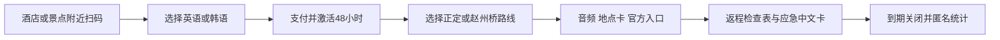

# Stone48：石家庄多语种自助夜游包

> **一句话讲清楚：** 把正定古城与赵州桥夜游做成外国游客付费解锁的 48 小时手机网页，提供多语种音频、可复制目的地、官方入口和返程检查表；游客按份付费，因为石家庄入境游正在增长，赵州桥又刚增加夜游新场景。

**先划边界：** 这不是景区门票，也不是官方“通行证”；不代订交通、住宿或组合行程。公开数据只证明入境和夜游条件正在变化，不证明外国游客一定愿意购买。

## 1. 先看懂：卖的是“今晚敢自己走”，不是一篇攻略

外国自由行游客到了石家庄，真正麻烦的往往不是不知道赵州桥，而是零碎的小决定：把哪个中文地址交给司机、哪个入口是官方的、表演结束后怎样确认返程、古建名称如何听懂、遇到问题该展示哪句中文。普通攻略介绍景点，却很少把这些动作放进一条可执行的夜游流程。

**说明性示例：** 一名经正定机场入境的韩国游客住在正定。傍晚打开酒店前台二维码，支付后选择韩语，先听正定古城的短音频；第二天去赵州桥夜游，点击复制中文目的地，入场前查看当天由人工核验的开放提醒，散场时按“确认车辆—核对酒店地址—保存 12367”逐项完成返程。网页在 48 小时后失效。

产品不追求百科全书。首版只做英语、韩语两种语言和两条路线，每个点位用两三分钟讲解，并把位置、时间、支付、返程和求助动作放在音频旁边。

**最小可售单元：** 一个设备可使用 48 小时的数字夜游激活码。

## 2. 为什么偏偏是现在？

第一，国家移民管理局当前政策覆盖 55 个国家的 240 小时过境免签，石家庄正定机场列在适用入境口岸中。符合条件的外国旅客可在规定区域停留不超过 10 天。这扩大了“落地后自己安排短途行程”的潜在人群，但官方没有公布其中有多少人会在石家庄游玩。

第二，石家庄入境游已经出现可见增长。石家庄市体育局 2026 年 6 月发布的信息称，石家庄“五一”入境游增幅为 263%，进入全国入境游增幅前十；河北省文旅厅公布的入境游十大目的地包括正定古城，并披露正定机场已稳定运营至首尔、釜山、清州、曼谷和香港等航线。这些数据说明客流方向正在形成，但不能当作付费用户数。

第三，赵州桥夜游于 2026 年 7 月 10 日启幕，增加打铁花、实景演绎、雅乐、民谣和露营食肆。旧攻略因此更容易过时，也让“当晚到底看什么、何时返程”的动态信息变得更有价值。

## 3. 谁付钱，为什么愿意付？

**唯一付费客户：** 不跟团、停留一到三天、主要使用英语或韩语的外国游客。酒店、民宿和咖啡店只是二维码分销渠道，按成交获得分成，不是主付费方。

购买触发发生在入住后准备出门、或景区讲解服务与自己的语言不匹配时。替代方案很多：免费地图、翻译软件、短视频、酒店前台和旅行平台攻略。Stone48 只有在“打开即可执行”上明显更省心——信息少而准确、中文地址可直接展示、音频不依赖下载 App、返程动作紧跟路线——才可能值 39 元。

英语与韩语只是产品选择，不代表官方客源语言排名。选择韩语的依据是正定机场存在多条韩国航线；真实语言占比仍是未知项。若后续扩充语言，应依据实际激活与渠道反馈，而不是一次生成十种机器翻译。

## 4. 一份夜游包怎样自动交付？



用户不用注册账号，只需订单号与设备凭证。每张路线卡同时显示自制音频、可复制的中文地名、官方信息链接、最后核验时间和“今天可能变化”的提示。网络不稳定时，可提前把音频与文字缓存到设备；紧急电话和住宿地址由用户自己保存，不上传护照。

系统可以每天监测官方页面是否发生变化，但不能让 AI 自动发布新时间。涉及营业时间、演出安排、交通和票务的变化必须人工复核后上线。完成定义是游客成功激活、播放内容并打开返程卡，而不是承诺其一定进入景区或赶上演出。

## 5. 怎么赚钱，能自动到什么程度？

**建议定价假设：** 每个 48 小时激活码 39 元；其中渠道分成 10 元，支付、托管与平均客服摊销 4 元，翻译复核和内容维护摊销 5 元，单份贡献约 20 元。若一个月售出 300 份，月贡献约 6000 元。这只是算式，不是客流或收入预测。

可自动化的部分包括支付、激活、语言切换、音频播放、离线缓存、到期关闭、渠道码结算、匿名使用统计，以及对官方页面变更的提醒。内容可一次制作、多次销售，也可以把更新后的路线同步给全部渠道。

必须人工负责翻译母语复核、历史事实审校、官方时间确认、合作渠道维护和退款争议。若每份订单平均需要超过 10 分钟真人答疑，或大量用户把产品误认为人工导游，所谓自动化数字商品就不成立。

## 6. 最大问题与最终判断

**最终判断：值得继续关注。** 它资本轻、地域差异明显、交付可以高度自动化，且石家庄的入境政策、韩国航线、正定目的地认定和赵州桥新夜游形成了罕见的同期信号。真正难点不是生成音频，而是在游客入住或准备出门的那一刻，让二维码出现在可信位置。

最可能失败的三个原因是：免费翻译与攻略已经够用；酒店不愿摆放二维码；动态信息更新不及时导致信任崩塌。若有人执行，停止条件应设为：90 天内无法建立 10 个可持续分销点；购买页到成功播放的完成率低于 90%；退款率超过 8%；人工支持超过每份 10 分钟；单份实际贡献低于 15 元。

你的自动化能力适合支付、激活、内容版本和渠道结算；外语母语审校、地方史审核及现场动线核验必须外包。角色只影响执行方式，不把数字商品改成旅游咨询。

---

## 事实与推演附录

### A. 行业坐标与商业系统

- **主行业：** 石家庄入境旅游数字内容。
- **商业模式：** 48 小时自助夜游数字包直售，渠道按成交分成。
- **价值链位置：** 游客入住或到达景区之后、决定自行出游之前。
- **新鲜信号：** 240 小时过境免签覆盖正定机场；2026 年“五一”入境游增幅 263%；赵州桥 7 月新增夜游。
- **受益者与付款者：** 外国自由行游客既使用也付款；酒店仅分销。
- **最小可售单元：** 一个 48 小时设备激活码。
- **角色政策：** 用户职业未进入行业筛选，只用于选定后的自动化适配。

### B. 市场证据与事实来源

| 日期 | 来源 | 可直接复核的事实 | AI 推断 | 证据局限 |
|---|---|---|---|---|
| 当前政策 | [国家移民管理局](https://www.nia.gov.cn/n897453/c1751080/content.html) | 55 国适用 240 小时过境免签；河北适用口岸包括石家庄正定机场 | 短停留自由行会增加对自助内容的需求 | 未公布在石家庄实际停留和游玩人数 |
| 2026-06-17 | [石家庄市体育局](https://tyj.sjz.gov.cn/columns/39c54cc2-9526-4862-88d9-34618bdabb57/202606/17/7594f272-0bcc-4e7f-9ff1-803c869a545d.html) | “五一”石家庄入境游增幅 263%，进入全国增幅前十 | 入境客流可能支持小额多语种商品 | 增幅基数和游客绝对量未披露 |
| 2026-06-08 | [河北省文化和旅游厅](https://whly.hebei.gov.cn/c/2026-06-08/585350.html) | 正定古城入选河北入境游十大目的地；正定机场稳定运营韩国、泰国和香港等航线 | 英语、韩语首发比盲目做十种语言更合理 | 航线不等于游客语言占比 |
| 2026-07-03 | [石家庄市文旅局](https://wglj.sjz.gov.cn/columns/4bccb071-c987-46a8-9718-77801cb4eb16/202607/08/844c54dd-3fb3-4add-8668-9634a3fa3800.html) | 赵州桥夜景夜游于 7 月 10 日启幕，包含打铁花、演绎、雅乐和食肆 | 新场景提高动态夜游信息价值 | 未披露夜游客流和外国游客占比 |

### C. 收入与单位经济

| 收入项 | 建议定价假设 | 可变成本与摊销 | 单份贡献 | 复购 |
|---|---:|---:|---:|---|
| 48 小时激活码 | 39 元 | 渠道 10 元 + 技术客服 4 元 + 内容复核 5 元 | 20 元 | 同一游客通常不复购；依靠持续新客 |
| 月售 300 份 | 11700 元 | 5700 元 | 6000 元 | 算术示例，不是销量预测 |

### D. 运营与自动化系统

- **内容资产：** 自制音频、双语地点卡、官方链接、中文展示句、返程和求助卡、核验时间。
- **自动节点：** 支付、激活、缓存、到期、渠道归因、分成、匿名统计、页面变更提醒。
- **人工节点：** 母语复核、历史审校、现场动线、时间确认、渠道关系和争议。
- **熔断规则：** 官方时间无法确认时标“待核实”并隐藏具体场次；不得由 AI 猜测；紧急情况直接指向 110、120 或 12367。

### E. 30 / 90 天演进路线

- **0—30 天：** 只做正定与赵州桥、英语与韩语；所有历史和交通信息建立来源与最后核验日期。
- **31—90 天：** 增加渠道二维码、离线缓存、匿名漏斗和自动结算；是否增加语言只看实际使用。
- **可沉淀资产：** 经过母语和地方史审核的短音频、场景化中文卡、可信分销点和更新记录。

### F. 风险、合规与停止条件

- **最大风险：** 分销位置不足，而不是网页开发失败。
- **经营边界：** 只销售数字信息内容；不组合销售门票、住宿和交通，不以旅行社或人工导游名义履约。
- **版权与隐私：** 音频、文字和视觉必须原创或获许可；不采集护照，不默认上传精确位置。
- **停止条件：** 90 天少于 10 个稳定分销点；激活到播放完成率低于 90%；退款率高于 8%；人工支持超过 10 分钟／份；单份贡献低于 15 元。
- **未知项：** 外国自由行绝对人数、语言结构、支付成功率、酒店分销意愿、夜游季节性。

## 反馈（skill_run）

```yaml
skill_run:
  skill: creative-capture-assistant
  workflow_stage: single-idea
  plan: Plans/创意捕捉/2026-08-09-副业创意-Stone48石家庄多语种自助夜游包.md
  date: 2026-08-09
  contexts_used:
    - path: Contexts/决策/Skill反馈协议.md
      utility: high
      reason: "把石家庄入境政策、客流增长和新夜游场景合成为一个非咨询、可自动交付的地域数字商品，并用附录隔离事实、推断和定价。"
  contexts_missing: []
  contexts_stale: []
```
