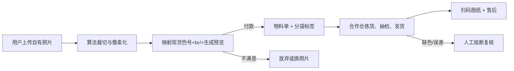

# 一图一包：成人拼豆按图配料包

> **一句话讲清楚：** 成年拼豆玩家上传一张自己的照片，系统自动生成像素图纸和准确色号清单，第三方按颜色分袋后寄出“一幅作品刚好够用”的材料包；值得现在关注，是因为成年玩家需求正在升温，而 2026 年 7 月的新监管公告又把成人产品与儿童玩具的边界说得更清楚了。

**五分钟读完：** 这是一个“软件完成定制、供应链完成发货”的小型商品生意，不是咨询服务。公开资料只能证明趋势与约束，不能证明这款具体产品一定有人买，也不构成收益承诺。

## 1. 先看懂：这是个什么生意？

假设一位已有底板、镊子和合规加热工具的成年玩家，想把自己的猫、毕业照或旅行照做成拼豆作品。她现在通常要先找软件转像素图，再逐个核对色号，最后购买多个整袋豆子；常用色可能缺货，不常用色又会剩下一堆。新华网转载的实地报道恰好记录了这种摩擦：受访玩家认为，自购色号繁多容易浪费，热门色号经常缺货，还需要额外收纳空间。[来源：新华网转北京青年报，2026-02-25](https://www.news.cn/fashion/20260225/241777a19d884756b8a1769c4475db02/c.html)

“一图一包”不卖全套入门工具，而是卖一次项目的**精确补给**：用户上传自己拥有权利的照片，网页先免费显示低清像素预览；付款后，系统锁定尺寸和配色，生成可缩放图纸，并把所需色号、数量与少量备损豆交给合作仓分袋发货。

**最小可售单元：** 一张照片对应的一份数字图纸，加一包按色分装的实体拼豆。用户买的不是“更多豆子”，而是少采购、少核对、少剩料地完成一幅私人作品。

## 2. 为什么偏偏是现在？

第一，需求端正在从儿童玩具扩展为成年人的手作消费。2026 年 5 月 12 日，新华网把拼豆描述为年轻人的“指尖消费新宠”，将其吸引力归因于低门槛、沉浸创作、解压和社交分享。[来源：新华网江苏频道](https://js.news.cn/20260512/76540f5f62394ca8947ff3d12eb4d7a6/c.html) 另一篇 2 月的实地报道记录了图纸分享、个性化创作、热门色号缺货，以及玩家对照片和礼物题材的使用场景。[来源：新华网转北京青年报](https://www.news.cn/fashion/20260225/241777a19d884756b8a1769c4475db02/c.html)

第二，监管边界刚刚发生变化。市场监管总局 2026 年 7 月 17 日发布公告，分别规定面向 14 岁以下和 14 岁以上人群的拼豆产品要求；其中，面向 14 岁以上人群的产品不得把用于熨烫织物的家用电熨斗作为加热部件，营销也不得误导或暗示儿童使用。[来源：市场监管总局 2026 年第 25 号公告](https://www.samr.gov.cn/zw/zfxxgk/fdzdgknr/zljds/art/2026/art_05ab9131f0ce42b19fd477a89f941580.html)

这两件事叠加，制造出一个比“再开一家拼豆店”更窄的新机会：**只服务已有工具的成年玩家，只卖个性化项目补充包，主动避开儿童营销和加热电器搭售。**

## 3. 谁会付钱，为什么会付？

- **唯一付费客户：** 18 岁以上、已经玩过拼豆并拥有基础工具，但没有全色库存的居家玩家。不是儿童家长，也不是第一次入门者。
- **购买触发：** 她看到一张很想亲手做出来的私人照片，却发现转图、配色、逐色采购太麻烦，或者只想做一件礼物，不愿为一幅作品囤一柜材料。
- **今天的替代方案：** 买通用套装、按图逐色下单，或去线下店按小时消费。前两种便宜但费时间、会剩料；线下店省采购却受地点和营业时间限制。

这门生意的付费理由不是豆子稀缺，而是**把一次私人创作的准备工作压缩成一次上传和一次收货**。真正的竞争对手不是另一袋塑料豆，而是用户觉得“太麻烦，改天再做”。

说明性示例：用户上传一张自己拍摄的宠物照片，选择 72×72 格版本，网页展示 24 色预览和预计制作时长。她付款后收到 24 个编号小袋、8% 备损豆和一个可在手机上逐格放大的图纸链接。这个场景用于说明产品，不代表已有成交案例。

## 4. 它具体怎么运转？

1. **上传与确权：** 用户上传自己的照片，勾选拥有使用权；系统自动清除照片元数据，并对明显的影视、动漫和名人图像进入人工复核队列。
2. **自动转图：** 算法裁切主体、像素化，并把颜色限制到仓库实际有货的色号；用户只能在两个固定尺寸中选择，避免无限定制。
3. **生成物料单：** 系统计算每个色号的颗数，加建议 8% 备损，生成分袋标签、拣货单和手机图纸。
4. **第三方履约：** 合作仓按色称重或计数、抽检、封袋和发货；订单不含电熨斗、底板或镊子，只面向已有工具的成年玩家。
5. **交付与复购：** 用户扫码打开图纸，按格完成作品；系统在合理周期后推荐“同尺寸下一张”，而不是订阅式强迫补货。

**完成定义：** 用户收到可完成一幅指定尺寸作品的分色材料和数字图纸。它不提供儿童玩具、不承诺像照片级还原、不销售未经授权的 IP 图案，也不提供自动熨烫成品。

## 5. 怎么赚钱，能自动到什么程度？

正文采用一个保守可算的**建议定价假设**：72×72 格、最多 24 色的一图一包售价 **89 元**。假设豆材 10 元、分袋与标签 10 元、仓配操作 8 元、运费 8 元、支付与售后准备金 7 元，单包可变成本约 43 元，单包贡献约 46 元。以上数字没有供应商报价支撑，只是用于判断结构是否可能成立；真正成本仍是未知项。

复购来自“下一张照片”，不是豆子消耗速度。免费预览页还能自然承担获客：用户先看到自己的照片变成像素稿，满意后才购买材料包；允许分享带水印预览，可让成品与礼物场景继续带来新上传。

- **可自动化：** 图像裁切、色号映射、物料单、标签、支付、订单下发、物流通知、图纸交付与补发判定。
- **必须人工：** 首批色差校准、供应商质检、疑似侵权图片复核、缺色替代确认、严重错配和安全投诉。
- **自动化上限：** 如果每单都要人工修图超过 5 分钟，或合作仓无法稳定按色分袋，这就会退化成低毛利手工作坊，不值得做。

## 6. 最大问题与最终判断

**最终判断：有条件值得。** 它抓住了一个已经出现的真实摩擦——色号多、缺货、剩料和转图麻烦——又能把软件生成与实体履约串成一笔直接交易。但它不是“上传照片就躺赚”：色差、合规和拣货精度任何一个失控，都会让礼物型订单迅速变成退款。

三个最可能的失败点是：照片转成有限色后不像本人；小袋分装的仓储成本高于豆子本身；消费者或平台仍将产品认定为面向儿童，导致宣传、认证或质量责任判断与原设想不同。尤其要强调，**“明确面向 18 岁以上”不等于自动获得任何认证豁免**，产品分类、材料安全、标签和进货查验仍需由合格专业人士按实际商品确认。

建议停止条件：连续 100 个付费订单中，因“还原不像”退款超过 12%；平均每单人工处理超过 8 分钟；错色、少豆或破袋导致的补发率超过 5%；或者在合规评估后必须增加的认证与质检成本，使 89 元售价下单包贡献低于 25 元。任一条件持续两个批次，就停止扩量。

你的架构与自动化能力适合设计图片处理、订单状态机和异常熔断，但它是在机会选定之后才成为优势；你欠缺的是塑料材料质检、色彩管理、消费品标签和小件分装供应链，这些应外包给检测、合规与仓配专业方，不能把机会改写成咨询服务。

---

## 事实与推演附录

> HTML 中本节默认折叠；Markdown 中保留完整研究，供复核而非承担主叙事。

### A. 行业坐标与商业系统

- **主行业：** 中国内地成人手作 / 拼豆材料。
- **商业模式：** 个性化实体配料包 + 自动图纸生成 + 第三方履约。
- **价值链位置：** 处于品牌豆材或工厂与成年终端玩家之间，负责“私人图片 → 可生产图纸 → 精确物料单 → 分袋订单”的转换。
- **新鲜信号：** 2026 年年轻人拼豆消费继续升温；2026 年 7 月监管公告明确按使用年龄划分要求。
- **受益者与付款者是否相同：** 相同，均为成年居家玩家；礼物场景中使用者可能是收礼人。
- **最小可售单元：** 一份照片像素图纸 + 对应一次项目的分色拼豆包。
- **机会形态与商业系统：** 产品交易，不是咨询；前端软件标准化定制，后端合作仓分装履约。
- **角色设定：** 不参与入口筛选，仅用于后置执行适配。

### B. 市场证据与事实来源

| 日期 | 来源 | 可直接复核的事实 | AI 推断 | 证据局限 |
|------|------|------------------|---------|----------|
| 2026-07-17 | [市场监管总局公告](https://www.samr.gov.cn/zw/zfxxgk/fdzdgknr/zljds/art/2026/art_05ab9131f0ce42b19fd477a89f941580.html) | 公告分别规定面向 14 岁以下和 14 岁以上人群的拼豆产品要求；成人类产品不得搭配用于熨烫织物的电熨斗，营销不得误导儿童使用。 | 明确做 18+ 补充包、取消加热电器与儿童营销，可能缩小合规复杂度。 | 公告没有判断本文具体商品属于哪类，也没有给出任何豁免结论。 |
| 2026-05-12 | [新华网江苏频道](https://js.news.cn/20260512/76540f5f62394ca8947ff3d12eb4d7a6/c.html) | 报道称拼豆因低门槛、解压、沉浸创作和社交分享成为年轻人的消费选择。 | 成年人愿意为个性化项目准备环节付费。 | 趋势报道，没有样本量、转化率或客单价。 |
| 2026-02-25 | [新华网转北京青年报](https://www.news.cn/fashion/20260225/241777a19d884756b8a1769c4475db02/c.html) | 报道记录图纸分享、全色采购、热门色号缺货、剩料与收纳问题；受访者还提到结婚照、生日礼物等题材。 | “按一幅作品精确配料”能减少准备成本和剩料。 | 个案与门店观察不能代表全国需求；文中平台销售数据未在本文作为市场规模使用。 |
| 2026-04-08 | [新华网财经聚焦](https://www.bj.news.cn/20260408/0859d0f4d3c74255872ed901bb2bf266/c.html) | 报道提醒，商家未经授权将动漫等形象用于拼豆制作并对外销售，可能构成侵权。 | 只接收用户自有照片、对疑似 IP 图像复核，是必要的产品边界。 | 这是新闻采访中的法律风险说明，不替代针对具体业务的法律意见。 |

**事实与推演分层：** “拼豆受年轻人关注”“玩家遇到色号、剩料和收纳问题”“2026 年 7 月出现新公告”属于公开事实；“按图配料包会形成稳定购买”“免费预览能获得低成本流量”属于 AI 推断；89 元售价和所有成本属于建议定价假设；真实转化率、仓配报价、材料检测成本、商品分类与平台准入要求均未知。

### C. 收入与单位经济

| 收入项 | 建议定价假设 | 可变成本假设 | 毛利逻辑 | 回款与复购 |
|--------|--------------|--------------|----------|------------|
| 72×72 格个性化项目包 | 89 元 / 包 | 43 元 / 包 | 软件处理成本可复用，主要成本来自分袋、仓配、材料与售后 | 下单即回款；下一张私人照片形成复购 |
| 96×96 格大项目包 | 139 元 / 包 | 预计 68 元 / 包 | 豆量增加，但图像处理与支付成本变化不大 | 适合纪念日或多人照片；需求未知 |
| 仅数字图纸 | 19 元 / 份 | 支付与存储接近零，仍有客服与侵权复核成本 | 为已有全色库存的资深玩家提供低价选择 | 可与实体包互相转化 |

单位经济的关键不是豆子进价，而是“分 20 多种颜色并保持准确”要花多少钱。若仓配只能按人工逐单处理，实体包的贡献空间很可能被吃光。因此，供应方需要固定色号库、标准小袋、自动标签和按重量校准后的计数规则；这些都尚未取得真实报价。

### D. 运营与自动化系统



**自动化资产：** 照片主体裁切、有限色量化、色号映射、相似度预警、豆数清单、袋签、订单 API、物流回传、扫码图纸、工单分类。随着订单积累，可沉淀“哪些照片在什么尺寸下容易失真”“哪些色号常缺货”“每个仓的称量误差”等运营数据。

**人工责任边界：** 合作仓对分装准确和批次可追溯负责；经营者对供应商审核、进货查验、商品标签、平台材料、消费者告知与召回机制负责；算法只给预览和物料建议，不能替经营者承担产品质量责任。

**异常熔断：** 低相似度不开放付款；缺一项关键色号就暂停该尺寸；疑似儿童用途、名人、动漫或商业 IP 图片进入人工复核；同批次投诉集中时暂停发货并锁定批次。

### E. 30 / 90 天演进路线

- **0–30 天：** 只设计 18+ 补充包定义、两个尺寸和 24 个稳定色号；确认商品分类、材料标准、标签、供应商证据和平台准入；拿到两家分装仓的真实报价。此路线是参考，不要求用户现在实验。
- **31–90 天：** 在合规可行的前提下，把色号扩到 48 个，接入订单下发和物流回传；用真实订单校准色差、缺豆率、补发率与每单人工分钟数。
- **可沉淀资产：** 私有色号映射表、照片适配规则、尺寸—颜色—耗时模型、仓配误差数据、合规证据包和授权图案库。

### F. 风险、合规与停止条件

- **最大风险：** 有流量但没有人愿为“省准备时间”付出足够溢价；实体分装成本高于软件所创造的价值。
- **产品安全：** 不搭售家用电熨斗不等于无产品责任。豆材、标签、警示、适用年龄、进货查验、平台核验和实际商品分类均需按现行法律标准确认。
- **知识产权：** 默认只允许用户自有照片；商业 IP 图案必须取得许可。用户勾选声明不能完全消除经营者风险。
- **隐私：** 原图应加密传输、限时删除、默认不用于训练；人脸与未成年人照片需更严格的保存、展示和客服权限。
- **质量：** 要记录豆材品牌、批次、色号、称量规则和抽检结果，以便补发或召回；“颜色相近”必须在付款前预览说明。
- **停止条件：** 100 单中还原不符退款 >12%；平均人工 >8 分钟/单；错色、少豆或破袋补发 >5%；贡献 <25 元/单；合规评估认为无法以当前商品定义上架。任一条件持续两个批次即停止扩量。
- **未知项：** 真实材料与仓配报价、平台类目和保证金、检测项目与费用、免费预览转付费率、可接受色差、复购周期。

### G. 角色后置适配

- **可迁移能力：** 系统架构、图像处理流程、订单状态机、异常熔断、供应商数据接口与指标看板。
- **能力缺口：** 消费品质量合规、塑料材料检测、色彩管理、包装标签、小件分装和退换货运营。
- **可外包项：** 法规与商品分类评估、材料检测、仓内分装、抽检和发货；核心保留图像到物料单的规则与订单数据。

## 反馈（skill_run）

```yaml
skill_run:
  skill: creative-capture-assistant
  workflow_stage: single-idea
  plan: Plans/创意捕捉/2026-08-09-副业创意-一图一包成人拼豆配料包.md
  date: 2026-08-09
  contexts_used:
    - path: Contexts/决策/Skill反馈协议.md
      utility: high
      reason: "每次只深挖一个有公开市场证据的副业创意，并用五分钟正文与事实附录分离理解和审计。"
  contexts_missing: []
  contexts_stale: []
```
