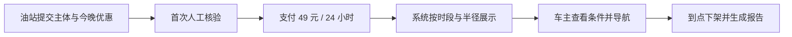

# 夜油榜：石家庄夜间加油优惠实时地图

> **一句话讲清楚：** 做一张只服务石家庄夜间车主的优惠地图，免费告诉车主附近哪家合法加油站今晚有什么活动、何时截止、多久前核验；向油站出售明确标注的 24 小时置顶卡，而不是向车主卖会员。

**五分钟读完：** 这不是卖油、代领消费券或做加油返利 App。它是一个极窄的本地数据与广告产品。事实证明石家庄 2026 年仍在推动 18:00 至次日 8:00 错峰加油，6 月政府补贴曾覆盖 9 个区并发布到第三批站点；但补贴已于 6 月 30 日结束。以下收入、成本和转化率都是推演，不是已有业绩。

## 1. 先看懂：这是个什么生意？

晚上 9 点，一名车主准备加油。地图软件能告诉他附近有五座油站，却未必能同时回答：今晚降多少、是否只限会员、要不要先领券、活动几点结束、这条信息是什么时候确认的。他要在地图、油企小程序、微信群和短视频之间来回找，最后可能直接去最近的一家。

“夜油榜”只解决这一刻。网页按距离列出今晚有效的油站卡片：油品、优惠条件、适用时段、来源链接、最后核验时间和一键导航。站点可提交自己的夜间活动，系统到点自动下架；车主凭加油小票匿名报告“已核实”或“与页面不符”。付费站卡必须写明“推广”，不能伪装成客观最低价。

**最小可售单元：一张在指定半径内展示 24 小时的推广油站卡，建议价格 49 元。** 车主端免费；平台不经手油款、不发行优惠券、不承诺油品质量，也不把未经时间戳核验的价格写成“实时最低价”。

## 2. 为什么偏偏是现在？

第一，政策制造了一个明确的夜间交易时段。石家庄市商务局、市生态环境局 2026 年 4 月发布通知：自 5 月 1 日至 9 月底，在确保安全前提下，将相关夜间作业安排在每日 18:00 至次日 8:00，并鼓励加油站出台夜间优惠，引导公众错峰加油。[石家庄市商务局，2026-04-29](https://swj.sjz.gov.cn/columns/2e4c92d3-ca9d-43ae-933b-c48ba711c8f7/202604/29/61a2e07e-8c82-4c91-8e8e-7f915f1deb6e.html)

第二，车主已被一次集中补贴教育过。2026 年 6 月 5 日至 30 日，石家庄夜间加油补贴为满 200 元减 20 元，核销时段是 00:00—08:00、18:00—24:00，参与站点覆盖长安、裕华、桥西等 9 个区。[石家庄本地宝，来源标注为石家庄商务，2026-06-10](https://sjz.bendibao.com/live/202666/82112.shtm) 商务局索引在 6 月 25 日又发布了“第三批”参与站名单，说明名单会增补，而不是一次固定不变。[石家庄市商务局索引，2026-06-25](https://swj.sjz.gov.cn/columns/4a8e9a0d-79f3-4ee2-ad90-8a70f38d4701/index.html)

第三，这不是第一次出现夜间迁移。石家庄市政府 2025 年报道，5 至 9 月错峰优惠已延续多年，多名油站员工称政策实施后夜间车辆明显增加。[石家庄市政府，2025-06-01](https://www.sjz.gov.cn/columns/8e2f0b12-4574-4ced-b339-bcb378d54b2d/202506/01/7995f6ec-8495-403c-9779-453fd3a4a800.html)

**AI 推断：** 集中补贴结束后，季节性夜间窗口仍在，但信息从统一活动重新碎裂为各站自己的折扣、会员日和临时促销。这个“已养成关注、却失去统一入口”的阶段，正适合一张只管今晚的地图。

## 3. 谁付钱，凭什么不直接用地图软件？

**唯一付费客户是有合法经营资质、希望增加夜间到站量的石家庄加油站。** 尤其是缺少全国性 App 流量的本地或独立站。它们不是为“上地图”付费，而是为一个可测量的夜间入口付费：卡片展示多少次、多少人点击导航、多少张小票标记来自该入口。

替代方案很强：高德、百度、团油、油企小程序、本地生活号都能解决部分问题。夜油榜只有同时做到四件事才有存在价值：只显示当晚有效条件；每条优惠带来源与核验时间；推广结果明确标注；页面按距离、可用时段和可信度排序，而不是按谁付钱最多排序。

油站的购买触发也必须具体：今晚新上了限时折扣、周边新客少、政府活动结束后需要续接流量，才买一张 24 小时推广卡。如果站方不能看到导航点击与到店报码，这笔钱会迅速被归类为无效广告。

## 4. 一笔订单如何自动完成？

油站先提交营业执照主体、门店位置、活动原图、适用油品、门槛、开始与结束时间。平台完成人工首审后，系统生成带“推广”标签的卡片；规则引擎检查时间冲突、缺失条件和过期日期，支付成功后自动发布。车主打开定位即可浏览，不要求注册；点击导航时记录匿名事件。活动到点自动下架，站方收到展示与导航报告。



完成定义是：卡片在承诺时段和地域内正确展示，优惠条件、来源和失效时间完整，点击可导航，过期自动消失，站方收到可复核报告。平台不得替油站证明油品质量，不得抓取受限制的地图数据，不得用虚构原价制造折扣，也不得出售车主轨迹。出现“页面与现场不符”报告后自动降权，连续两次有效投诉则暂停该站自助发布。

## 5. 怎么赚钱，自动化上限在哪里？

**建议先只卖 49 元 / 24 小时推广卡。** 假设支付与云资源 3 元、渠道分成 10 元、核验及退款准备 6 元，单张贡献约 30 元。若一个月售出 300 个付费卡日，贡献约 9,000 元；这只是 49 × 300 − 可变成本的算术情景，不是销量预测，也未扣除开发、税费和创始人时间。

可自动化的部分包括自助提交、时间与字段校验、定时发布下架、地理半径匹配、推广标识、点击归因、账单与报表。首轮主体核验、虚假折扣争议、现场信息不一致、广告与地图合规审查仍需人工。内容采集必须依赖油站主动提交、官方公开活动和用户自愿报告，不能靠未经许可的批量抓取。

自动化上限很清楚：若每张卡都要电话追问优惠细节，或每次投诉都要人工跑到现场，49 元无法覆盖服务成本。这个产品能成立的前提，是把“何时有效、谁发布、证据在哪、何时下架”做成结构化字段，而不是经营一个人工维护的优惠公众号。

## 6. 最大问题与最终判断

**最终判断：有条件值得关注。** 新鲜点不在“油价查询”，而在政策把一个原本全天分散的需求压进夜间窗口，集中补贴又让车主学会在这个时段找优惠；政府券结束后，谁来组织分散的油站活动，出现了短暂空位。最小产品只有一张网页、油站自助后台和自动过期规则，技术上可以低人力运行。

最大风险是已有平台顺手补上这个功能，或者油站发现导航点击不能转化为真实加油。其次是价格变化快，错误信息一次就会损害信任。还有广告法、个人信息、地图服务授权、成品油经营主体等边界，必须在收费前由本地律师和相关专业人员核对。

停止条件：上线 90 天后付费油站少于 10 家；30 天内重复购买率低于 30%；推广卡的导航点击率低于 3%；有效“现场不符”投诉超过卡片的 5%；单卡人工核验超过 6 分钟；实际贡献低于 25 元。满足其中两项，就停止继续开发。

这个机会不是由用户的程序员或架构师身份筛出来的。创意选定后，系统设计能力可以用于时间规则、审计证据和自动下架；真正缺口是油站渠道、广告合规、地图授权与现场核验，应通过本地油站合作方和专业法律意见补齐，而不是把产品改造成咨询服务。

---

## 事实与推演附录

> HTML 中本节默认折叠；Markdown 中保留完整研究，供复核而非承担主叙事。

### A. 行业坐标与商业系统

- 主行业：成品油零售附近的数据发现与本地广告。
- 商业模式：免费车主工具 + 油站按日购买明确标注的推广卡。
- 价值链位置：车主决定“今晚去哪加”与实际导航到站之间。
- 受益者与付款者：车主免费受益；合法油站为夜间可测曝光付费。
- 最小可售单元：一张 49 元、展示 24 小时的油站推广卡。
- 系统资产：带来源、版本和时间戳的优惠记录；站点主体；导航点击；错误报告；自动失效日志。
- 不做范围：不卖油、不收油款、不发券、不比较油品质量、不承诺全网最低价。

### B. 市场证据与事实来源

| 日期 | 来源 | 可直接复核的事实 | AI 推断 | 局限 |
|------|------|------------------|---------|------|
| 2026-04-29 | [石家庄市商务局、市生态环境局通知](https://swj.sjz.gov.cn/columns/2e4c92d3-ca9d-43ae-933b-c48ba711c8f7/202604/29/61a2e07e-8c82-4c91-8e8e-7f915f1deb6e.html) | 2026-05-01 至 9 月底，夜间时段为 18:00 至次日 8:00；鼓励出台夜间优惠 | 政策把需求压缩成可运营的夜间入口 | 未提供车流、客单或站点数量 |
| 2026-06-10 | [石家庄本地宝，标注来源“石家庄商务”](https://sjz.bendibao.com/live/202666/82112.shtm) | 6 月补贴满 200 减 20，覆盖 9 区；活动 6 月 30 日结束 | 补贴教育了用户，结束后优惠信息重新碎片化 | 二手整理页；无领券与核销总量 |
| 2026-06-25 | [石家庄市商务局活动索引](https://swj.sjz.gov.cn/columns/4a8e9a0d-79f3-4ee2-ad90-8a70f38d4701/index.html) | 发布“参加夜间加油补贴活动加油站名单（第三批）” | 名单有增补，静态文章容易过时 | 索引不披露各批具体数量 |
| 2025-06-01 | [石家庄市政府](https://www.sjz.gov.cn/columns/8e2f0b12-4574-4ced-b339-bcb378d54b2d/202506/01/7995f6ec-8495-403c-9779-453fd3a4a800.html) | 夜间政策延续多年；多名站点员工称夜间车辆明显增加 | 需求迁移可能跨年复现 | 员工口述，不是统一交通统计 |

明确分类：政策时段、补贴规则、覆盖区域、第三批名单和 2025 年报道是来源事实；“补贴结束后出现统一入口空位”是 AI 推断；49 元定价、成本、销量情景与停止阈值全部是建议假设。当前各油站优惠、真实车流、付费意愿、现有平台夜间筛选能力均未知，不能写成已验证。

### C. 收入与单位经济

| 收入项 | 建议定价 | 可变成本假设 | 单位贡献 | 回款与复购 |
|--------|----------|--------------|----------|------------|
| 24 小时推广油站卡 | 49 元 / 卡日 | 支付云资源 3 + 渠道 10 + 核验退款准备 6 = 19 元 | 约 30 元 | 发布前支付；靠油站按活动日复购 |

300 个卡日 / 月对应约 9,000 元贡献，未扣税费、开发与固定成本。若必须向地图、流量平台或线下渠道额外付费，贡献会显著下降。不得将满 200 减 20 的政府补贴算成平台收入。

### D. 运营与自动化系统

结构化字段：主体、站点、坐标、油品、优惠门槛、适用人群、开始/结束时间、原始证据、最后核验、推广标识、投诉状态。自动规则：缺字段不发布；过期自动下架；投诉触发降权；异常主体暂停；只保留履约必要的匿名点击数据。人工职责：首次主体审查、争议复核、合规审查和渠道维护。

### E. 30 / 90 天演进路线

- 0–30 天：做公开只读地图、一个油站自助提交表和自动下架；只录有来源、能标注有效期的信息。
- 31–90 天：加入 49 元推广卡、导航点击报告、用户匿名纠错与站点信誉分；不开发支付返利或钱包。
- 可沉淀资产：站点主体库、优惠时间序列、错误率、夜间点击热区和复购记录。

### F. 风险、合规与停止条件

- 竞争：地图、加油平台、油企自有 App 可以快速复制；差异必须是本地、当晚、带核验时间和自动过期。
- 合规：仅收录合法经营主体；推广卡清晰标注广告；原价、折扣与适用条件必须真实完整；经授权使用地图底图与导航；位置数据最小化并明确保存期限；不宣传油品质量结论。正式收费前请专业人员核对广告法、个人信息保护、地图服务许可、电商与成品油零售相关要求。
- 停止条件：90 天付费站少于 10；30 天复购低于 30%；导航点击率低于 3%；有效错误投诉高于 5%；人工核验超过 6 分钟 / 卡；贡献低于 25 元 / 卡。两项命中即停。
- 未知项：各站当前活动、站方获客成本、导航点击到加油的归因方式、地图授权成本、油站自助发布意愿和用户对陌生入口的信任。

## 反馈（skill_run）

```yaml
skill_run:
  skill: creative-capture-assistant
  workflow_stage: single-idea
  plan: Plans/创意捕捉/2026-08-09-副业创意-夜油榜石家庄夜间加油优惠地图.md
  date: 2026-08-09
  contexts_used:
    - path: Contexts/决策/Skill反馈协议.md
      utility: high
      reason: "用五分钟正文承载机会判断，用附录区分事实、推断、建议与未知项。"
    - path: Contexts/规范/炫酷建站规范.md
      utility: high
      reason: "据此生成同名自渲染 HTML，并执行 Mermaid、渐进增强、数字动画和多宽度浏览器门禁。"
  contexts_missing: []
  contexts_stale: []
  outcome_status: pass
  revisit_needed: false
```
