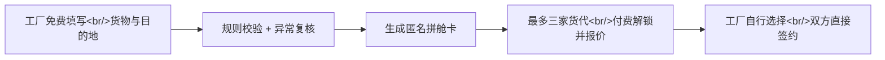

# 拼舱卡：石家庄班列标准询价单

> **一句话讲清楚：** 免费帮石家庄周边有零担出口货物的小工厂生成一张可直接报价的“拼舱卡”，再把经过核验的询盘按次卖给服务石家庄国际陆港的货代；最近班列线路、县域集货仓和多品名拼箱同时扩张，过去不值得处理的小货量正在变成可交易线索。

**五分钟读完：** 这不是货代公司，也不替客户报关或运输；它是一门“合格询盘交易”生意。公开资料只能证明拼箱能力和本地货源入口正在形成，不能证明货代已经愿意为线索付费，也不承诺收益。

## 1. 先看懂：这是个什么生意？

很多小工厂第一次询问中欧班列拼箱时，只会发一句“有一批货去欧洲，多少钱”。货代还要来回追问货名、件数、体积、重量、目的地、是否带电、期望发车日期和贸易条款。工厂觉得报价慢，货代又怕收到无法成交的泛询盘。**拼舱卡做的，就是把这段反复问答先变成一份统一、可比较的询价资料。**

说明性示例：某石家庄周边五金厂有 1.8 立方米普通配件要发往华沙。负责人打开网页，依次填写提货地、货名、包装、体积、毛重、目的站和时间，上传外包装照片并确认“不含已知危险品”。系统检查字段后生成一张隐去联系方式的拼舱卡，同时推给最多三家已核验货代。货代付费解锁后提交报价和有效期，工厂自己选择，并直接与货代签约。

**最小可售单元：一条资料完整、联系方式真实、尚在报价期内的拼箱询盘，供一家货代解锁一次。** 平台交付的是可报价机会，不是一定成交的订单。

## 2. 为什么偏偏是现在？

第一，拼小货的基础能力刚补上。2025 年 1 月，石家庄国际陆港开通京津冀首个中欧班列多品名集拼业务，把不同货主、不同品名的零散货物装入同一集装箱，官方明确说它针对中小微企业货量少、单独发运成本高的问题。[石家庄市政府，2025-01-16](https://www.sjz.gov.cn/columns/8e2f0b12-4574-4ced-b339-bcb378d54b2d/202501/16/1f3fb5aa-f746-49d6-b173-e60c07dc266e.html)

第二，货源入口正从陆港下沉到县域。2026 年 2 月，石家庄一家纺织企业公开描述了真实痛点：出口货物有时装不满一箱，过去要送到陆港等待拼箱，品类混杂导致手续麻烦；前置跨境仓让同产业货物能够就近集货。到 2026 年 7 月，公开报道显示已有 30 多个跨境集货仓进入县域产业集群，面向全省 107 个特色产业集群延伸订舱、报关和发运服务。[石家庄市政府，2026-02-09](https://www.sjz.gov.cn/columns/839b1981-330e-4901-aba5-6c392154ce03/202602/09/cbf8959c-64e3-4758-a780-fb0945367e25.html) [石家庄市政府，2026-07-27](https://www.sjz.gov.cn/columns/839b1981-330e-4901-aba5-6c392154ce03/202607/27/b7881621-36a3-405e-8573-1ef2836860e6.html)

第三，可报价的线路面扩大了。2026 年上半年石家庄国际陆港开行 814 列，同比增长 42.06%；7 月又开出至比利时列日的第 20 条国际线路，公开时效约 20 天。[石家庄市政府，2026-07-06](https://www.sjz.gov.cn/columns/839b1981-330e-4901-aba5-6c392154ce03/202607/06/88cd5e8b-d5f1-4706-91a3-356aa5a771c9.html)

这些事实共同说明“有小货可拼、有入口收货、有线路可报”的条件变强了。**AI 推断：** 新缺口可能不再是运输能力本身，而是如何让分散小工厂的需求以货代愿意处理的格式出现。

## 3. 谁会付钱，为什么会付？

**唯一付费客户是服务石家庄国际陆港、希望获得本地出口货源的持证国际货运代理或订舱服务商。** 工厂免费，因为让供给端先填好资料比向双方同时收费更容易启动。

购买触发是：货代的销售需要持续找货，却收到太多“问一下价格”的低质量消息。只要一条拼舱卡已经完成手机号验证、字段校验、重复询盘过滤，并限定三家解锁，它就可能比微信群里抢线索更省销售时间。货代付的不是独家承诺，而是“比陌生名单更接近报价”的优先接触权。

替代方案并不弱：熟人转介绍、产业群微信群、集货仓直接服务、阿里巴巴国际物流等平台都能获得询价。因此产品不能只做一张表。它必须把**石家庄县域货源、陆港可服务线路、拼箱字段完整度和最多三家比价**绑定在一起。最大威胁恰恰是官方集货仓已经提供一站式服务，工厂可能根本不需要第三方入口；这是目前无法从公开资料消除的未知。

## 4. 它具体怎么运转？

流程只保留五步：工厂提交货物资料；系统验证联系方式、必填字段和重复内容；人工只复核异常、疑似危险品与明显失实项；合格卡片进入货代池，最多三家付费解锁；货代在约定时间内给出报价范围、包含项目和有效期，工厂自行联系、选择并签约。



完成定义也要窄：货代按时拿到真实联系方式和足以作初步报价的资料，工厂收到格式可比较的回复，即完成一次交付。平台**不保证最低价、不判定海关编码、不接受运费、不代签运输合同、不承运货物，也不为通关、时效和货损兜底。** 涉及危险品、制裁敏感目的地或资料冲突时，卡片直接暂停，由专业人员处理。

## 5. 怎么赚钱，能自动到什么程度？

**建议定价假设：每家货代解锁一条合格询盘 59 元，最多三家，总收入上限 177 元。** 假设每条完全解锁的询盘需要 45 元渠道或推荐成本、7 元支付与云服务、25 元人工复核和退款准备金，单条贡献约 100 元。每月 100 条完全解锁，对应约 1 万元贡献；这只是算术情景，不是需求预测。复购取决于货代能否持续收到真实、可报且不过度重复的货源。

可自动化的部分包括表单追问、体积重量校验、照片和手机号收集、重复线索识别、联系方式遮罩、货代支付解锁、报价倒计时、提醒、发票和渠道归因。系统可以提示“疑似带电或液体，请补充资料”，但不能替专业人员做危险品或合规结论。

必须人工的部分是货代资质初审、异常货物复核、虚假线索退款、争议处理和本地渠道关系。**自动化上限：若平均每条询盘人工处理超过 12 分钟，或者大量工厂必须靠电话代填，59 元的按次解锁模式就会被服务成本吃掉。**

## 6. 最大问题与最终判断

**最终判断：有条件值得关注。** 它利用的是石家庄刚形成的“县域集货—多品名拼箱—国际班列”网络，最小产品只是结构化线索，资产轻、可自动化；但目前只有运输能力和企业痛点证据，没有货代购买线索的公开证据。

最可能失败的三件事：第一，集货仓或现有货代已经把询盘入口包圆，平台拿不到工厂；第二，货代认为同一线索卖给三家价值太低，解锁率不足；第三，货物属性太复杂，系统无法低成本筛掉无法承运或无法准确报价的询盘。

停止条件应提前写死：运行 90 天后付费货代仍少于 8 家；合格询盘被至少一家解锁的比例低于 30%；货代 24 小时内响应率低于 70%；退款或争议率高于 10%；单条人工处理超过 12 分钟，或完全解锁后的实际贡献低于 60 元。达到其中两个，就不再扩张。

这个机会不是因为用户是架构师才被选中；角色只影响执行。可迁移能力是把询价字段、状态和异常边界设计清楚，适合搭自动化系统。缺口是国际物流实务、危险品识别和本地货代关系，应找一名从业者按次复核或合作，而不是把产品改写成咨询服务。

---

## 事实与推演附录

> HTML 中本节默认折叠；Markdown 中保留完整研究，供复核而非承担主叙事。

### A. 行业坐标与商业系统

- 主行业：国际铁路拼箱 / 国际货运代理获客。
- 商业模式：合格询盘按次解锁，最多三家货代购买同一条。
- 价值链位置：小工厂提出出口需求之后、货代初步报价之前。
- 新鲜信号：多品名集拼落地、县域跨境集货仓扩张、班列量与线路同时增长。
- 受益者与付款者是否相同：不同；工厂获得免费比价，货代为获客线索付费。
- 最小可售单元：一条经联系方式与字段核验、仍在有效期内的拼箱询盘。
- 机会形态与商业系统：数据采集工具 + 线索交易市场，不承接运输履约。

### B. 市场证据与事实来源

| 日期 | 一手来源 | 可直接复核的事实 | AI 推断 | 证据局限 |
|------|----------|------------------|---------|----------|
| 2025-01-16 | [石家庄市政府：首个多品名集拼业务](https://www.sjz.gov.cn/columns/8e2f0b12-4574-4ced-b339-bcb378d54b2d/202501/16/1f3fb5aa-f746-49d6-b173-e60c07dc266e.html) | 不同货主、不同品名可拼入同一集装箱，面向货量少的中小微企业 | 小批量询价数量可能增加 | 没有公开询价量或付费获客数据 |
| 2026-02-09 | [石家庄市政府：跨境仓前置陆港服务](https://www.sjz.gov.cn/columns/839b1981-330e-4901-aba5-6c392154ce03/202602/09/cbf8959c-64e3-4758-a780-fb0945367e25.html) | 真实纺织企业称过去拼箱等待长、混杂品类手续麻烦；报道时跨境仓共 31 家 | 标准资料可减少报价前反复沟通 | 单一企业引语不能代表全部工厂 |
| 2026-07-27 | [石家庄市政府：上半年 814 列](https://www.sjz.gov.cn/columns/839b1981-330e-4901-aba5-6c392154ce03/202607/27/b7881621-36a3-405e-8573-1ef2836860e6.html) | 上半年 814 列、同比增 42.06%、超 8 万标箱；30 多个集货仓进入县域 | 本地货源连接节点密度上升 | 运行规模不能证明第三方平台能获客 |
| 2026-07-06 | [石家庄市政府：第 20 条国际线路](https://www.sjz.gov.cn/columns/839b1981-330e-4901-aba5-6c392154ce03/202607/06/88cd5e8b-d5f1-4706-91a3-356aa5a771c9.html) | 至列日线路约 20 天，为陆港第 20 条国际线路 | 更多目的地可能带来更多报价组合 | 公布时效不是每票货的履约承诺 |
| 持续存在 | [阿里巴巴国际物流](https://supplier.alibaba.com/supplier/gjwl.html) | 已提供海运拼箱、空运、中欧班列等国际物流入口 | 本地产品必须靠货源结构和响应速度差异化 | 页面能力不代表本地使用率 |

事实分类：上述日期、开行量、仓数、线路与企业引语来自来源；“会增加可售询盘”“货代愿意按次付费”均为 AI 推断。59 元价格、成本和 90 天阈值均为建议假设。货代实际获客成本、成交率、线路报价接口和工厂填表意愿均未知。

### C. 收入与单位经济

| 收入项 | 建议定价假设 | 可变成本 | 毛利逻辑 | 回款与复购 |
|--------|--------------|----------|----------|------------|
| 合格询盘解锁 | 59 元 / 家，最多三家 | 渠道 45 元 + 支付云服务 7 元 + 复核退款准备 25 元 / 完全解锁询盘 | 177 - 77 = 约 100 元贡献 | 货代预付解锁；复购由线索真实性、响应速度和成交质量驱动 |

敏感项：如果平均只卖给一家，总收入 59 元，按上述成本结构会亏损；因此关键指标不是提交量，而是合格线索的多家解锁率。可改为货代月度点数包，但在没有真实复购证据前不应先做订阅。

### D. 运营与自动化系统

完整链路：产业渠道二维码获客 → 动态询价表 → 手机验证 → 字段与重复校验 → 风险词拦截 → 人工异常复核 → 匿名卡进入货代池 → 支付解锁 → 结构化报价 → 双方直接签约 → 结果与退款记录。

自动化节点：根据货类动态追问、单位换算、照片完整度检查、敏感词提醒、线索去重、权限与支付、响应计时、消息通知、渠道统计。人工责任：确认货代主体信息；对带电、液体、粉末、化学品、品牌授权等高风险描述只做暂停和转交；处理虚假线索、骚扰和退款。可沉淀资产是本地货类字段库、线路询价模板、货代响应记录和县域渠道转化数据，不是客户货物本身。

### E. 30 / 90 天演进路线

- 0–30 天：只覆盖普通非危险品、一个目的地区域和少量已核验货代；形成统一字段、匿名卡、支付解锁、报价回复和退款规则。
- 31–90 天：按货类增加动态追问，接入县域产业渠道二维码，建立货代响应排名与重复询盘识别；仍不承接运输订单。
- 可沉淀资产：高完成率询价字段、货类异常规则、货代服务半径、渠道来源和匿名化报价区间。

### F. 风险、合规与停止条件

- 最大风险：官方集货仓和成熟物流平台直接覆盖需求，平台没有独立流量；其次是线索真实性和货代绕开平台。
- 合规边界：明确自己是信息撮合而非承运人或报关代理；收集企业联系人、电话和货物照片需明示用途、授权范围与保存期限；不得公开敏感联系方式；危险品、出口管制、制裁、知识产权和海关编码交由具备能力的专业方判断。正式上线前应让律师核对合同、隐私与平台责任条款。
- 停止条件：90 天少于 8 家付费货代；解锁率低于 30%；24 小时报价响应低于 70%；争议退款高于 10%；人工超过 12 分钟 / 条；完全解锁贡献低于 60 元。满足两项停止扩张。
- 未知项：货代可接受的线索价格、平均成交周期、各县产业渠道成本、危险品误判率、现有集货仓是否允许外部平台合作。

## 反馈（skill_run）

```yaml
skill_run:
  skill: creative-capture-assistant
  workflow_stage: single-idea
  plan: Plans/创意捕捉/2026-08-09-副业创意-拼舱卡石家庄班列询盘交易.md
  date: 2026-08-09
  contexts_used:
    - path: Contexts/决策/Skill反馈协议.md
      utility: high
      reason: "用五分钟正文承载理解和判断，用事实附录承载研究完整度与可复核性。"
    - path: Contexts/规范/炫酷建站规范.md
      utility: high
      reason: "据此生成自渲染 HTML，并执行 Mermaid、渐进增强、数字动画与多宽度浏览器门禁。"
  contexts_missing: []
  contexts_stale: []
  outcome_status: pass
  friction: "地方政府页面可由搜索与终端访问，但网页抓取器直接打开时偶发超时。"
  revisit_needed: false
```
