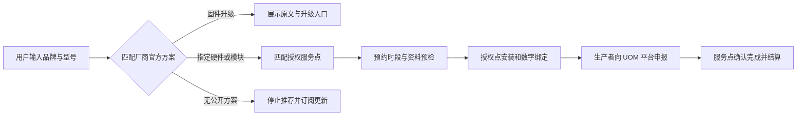

# 无人机电子车牌升级预约站

> **一句话先讲明白：** 做一个“查型号—看官方方案—约授权网点”的网站，帮助旧无人机用户完成运行识别（RID）升级；你不改飞机、不卖来路不明的通用模块，只向厂商指定或授权的服务点收取有效预约佣金。

**RID 是什么？** 可以把它理解成无人机飞行时主动发送的“电子车牌”：包括身份、位置、速度和运行状态等信息。2026 年 5 月 1 日起，相关国家标准实施；旧机能否通过固件、硬件或加装指定模块满足要求，必须以生产者公布的方案为准。

## 1. 这门生意到底在卖什么

它不是无人机维修店，而是一个垂直预约平台。用户输入品牌、型号、序列号前几位和所在城市，系统只给出四种明确结果：

1. 有厂商官方固件升级方案——跳转升级说明或预约协助；
2. 有厂商官方硬件／运行识别模块方案——展示指定型号与授权服务点，直接预约；
3. 厂商尚未公布方案——订阅官方更新，不推荐替代配件；
4. 无法确认或不应继续飞行——停止给建议，转人工核验。

一个典型场景：航拍师手里有两台 2024 年购买的旧机，看过新闻却不知道自己的型号要不要升级。他搜到“无人机电子车牌升级预约站”，两分钟查到厂商原始公告，选定本市授权点和时段，上传登记标志照片供预约预检。到店后由服务点完成实体安装、数字绑定与后续申报。平台只负责信息归一、预约、提醒和进度追踪。

**最小可销售单元**不是会员，也不是咨询报告，而是“一笔完成到店并由服务点确认的官方升级预约”。

## 2. 为什么是现在，而不是两年前

这是一段由规则切换形成的短窗口。民航局明确：2026 年 5 月 1 日起，不具备运行识别发送功能的无人机不应运行；对旧机，能靠固件实现的，生产者应公布固件升级方案，不能靠固件实现的，应公布硬件升级方案。对符合适用条件的旧机加装模块，也要求由生产者指定模块生产者和型号、公布服务方案并指导用户。

升级动作又不只是“装个盒子”。民航局要求同时完成实体安装和数字绑定，保存航空器实名登记标志与模块序列号同框照片，并由生产者向民用无人驾驶航空器综合管理平台报送信息，原则上在 48 小时内完成。这一串跨网页、跨主体的动作，正好产生“我该去哪里、带什么、做到哪一步”的信息摩擦。

需求池也不是凭空假设。截至 2026 年 3 月底，国内实名登记无人机已超过 380 万架、运营主体超过 43 万家；2025 年全年飞行时长 4530 万小时，同比增长接近 70%。这里不能直接推出有多少旧机需要改造，但足以说明：只要一小部分存量机型进入官方升级名单，型号检索和本地预约就会形成真实流量。

## 3. 谁付钱，为什么愿意付

**唯一主付费方：厂商指定或授权的升级服务点。** 用户免费查询和预约；服务点在“用户到店、完成官方流程”后支付建议 **49 元／单** 的成交服务费。这个价格是商业假设，不是行业报价。

服务点愿意付费的前提很朴素：它们有安装与绑定能力，却未必擅长让分散的旧机主看到官方方案、判断型号、准备资料并按时到店。平台把无效来电变成结构化预约，减少“型号不支持、材料没带、到店才发现不是授权方案”的浪费。

第一批供给不应是全国无人机维修铺，而是能提供三项证据的网点：厂商授权或指定证明、对应机型／模块清单、可执行的标准流程。无法核验授权关系的商家不收录。平台也不以“包过备案”为卖点，因为最终申报主体和系统规则不由平台控制。

## 4. 它怎样在后台自动运转



可自动化的部分包括：抓取并人工复核厂商公告、型号别名归一、规则分类、城市网点匹配、预约日历、短信／微信提醒、照片 OCR 预检、超时提醒、成交对账，以及为每个型号生成可被搜索引擎收录的解释页。

必须保留人工或合作方负责的部分包括：确认公告仍有效、核验网点授权、处理序列号争议、航空器实体安装、数字绑定、安全检查和向 UOM 平台申报。除非未来获得公开或正式授权的接口，平台不能宣称“自动查到官方备案结果”。

首版甚至不需要 App：一个响应式网站、型号数据库、服务点后台和预约通知即可。重点不是代码量，而是“每一条结论都能回到厂商原文”的证据链。

## 5. 怎么赚钱，以及能自动到什么程度

先只做一条收入线：完成预约抽佣。假设每单收服务点 49 元，支付、通知、退款准备金与客服摊销合计 15 元，则单笔贡献约 34 元。若一个月完成 300 单，月贡献约 1.02 万元；这只是算式，不是销量预测。

获客内容可以高度自动化：为“品牌 + 型号 + RID 升级”“城市 + 无人机运行识别服务点”等组合生成结构化页面；当官方公告变动时，系统标记受影响页面，人工复核后批量更新。预约、提醒、资料清单和对账也可自动执行。

但最关键的供应关系不能全自动。前期必须有人逐个核对厂商方案和授权点，明确谁承担安装、绑定、申报与售后责任。理想状态不是“无人值守赚钱”，而是把人工压缩到异常单、公告变更和合作方审核，日常订单由系统流转。

后续可以增加企业机队批量预约，但不建议一开始同时做培训、保险、飞行审批和配件商城；范围一大，就会从清晰的预约撮合变成高风险的无人机综合服务平台。

## 6. 最大风险与最终判断

最大的风险不是技术，而是**窗口期与授权**。标准为部分加装模块的旧机设置了 36 个月过渡安排，随着旧机淘汰和新机原生合规，升级需求会自然衰减。这个项目更像三年左右的事件型交易机会，而不是永续 SaaS。厂商也可能自行把预约功能做进官网，直接压缩中间平台价值。

第二个风险是错误匹配的安全与合规后果。平台必须坚持“官方方案优先、无方案就停止推荐”，不能用所谓通用模块补空白，不能替生产者承诺申报成功，也不能把转载文章当成方案依据。

**停止条件：** 公开收集 60 天后，若仍不足 50 个有明确官方方案的存量机型、少于 20 个可核验授权点，或服务点普遍不愿为完成订单支付至少 30 元，则不值得继续；上线后若超过 25% 查询需人工判断、无效／退款预约超过 8%，也说明自动撮合模型不成立。

**最终判断：有条件值得。** 它足够新、事实基础清楚、交易对象明确，也能发挥你的系统建模和自动化能力；但只有在拿到真实授权供给后才是一门生意。最有价值的资产不是网页，而是“官方方案—适用型号—授权网点—申报状态”的持续可信数据库。

---

## 附录 A｜事实、推演与未知项

| 类型 | 内容 | 证据或说明 |
|---|---|---|
| 已确认事实 | GB 46750—2025 于 2026-05-01 实施，运行识别包含身份、位置、速度、状态等信息 | 中国民航局政策解读 |
| 已确认事实 | 旧机应按生产者方案走固件升级、硬件升级或指定模块路径 | 中国民航局政策解读、模块要求 |
| 已确认事实 | 加装模块包含实体安装和数字绑定；生产者原则上应在 48 小时内向 UOM 平台报送 | 中国民航局模块要求 |
| 已确认事实 | 截至 2026 年 3 月底，实名登记无人机超过 380 万架，运营主体超过 43 万家 | 中国民航局 2026-05-27 发布 |
| 商业推演 | 用户会搜索型号方案，并愿意从统一入口预约授权点 | 尚需用真实搜索和预约转化验证 |
| 价格假设 | 49 元／完成订单，单笔变动成本 15 元 | 本文测算，非市场报价 |
| 关键未知 | 各厂商公布方案的速度、授权点密度、是否开放状态接口 | 不得在未确认前写成事实 |

## 附录 B｜首版数据结构

每个型号至少保存：品牌、标准型号、市场别名、出厂区间、官方方案类型、适用条件、官方原文链接、发布日期、指定模块型号、授权服务点、所需材料、最后复核时间、当前状态。每次页面展示都附“原文”和“最后核验日期”。

## 附录 C｜90 天参考路线

- **第 1—15 天：** 只整理 3 个主流品牌的官方公告与型号，不开放交易。
- **第 16—30 天：** 联系可证明授权关系的服务点，统一可预约机型、价格和责任边界。
- **第 31—60 天：** 上线型号查询、城市匹配、预约与提醒；无官方方案的查询只收订阅。
- **第 61—90 天：** 只看完成订单、人工介入率、无效率和服务点续费意愿，再决定继续或关停。

## 附录 D｜事实来源

1. [中国民航局：《民用无人驾驶航空器系统运行识别规范》解读](https://www.caac.gov.cn/XXGK/XXGK/ZCJD/202601/t20260120_229793.html)
2. [中国民航局：既有民用无人驾驶航空器加装运行识别模块的具体要求（PDF）](https://www.caac.gov.cn/PHONE/XXGK_17/XXGK/TZTG/202603/P020260306730349409250.pdf)
3. [中国民航局：截至 2026 年 3 月底实名登记无人机超过 380 万架](https://www.caac.gov.cn/PHONE/XWZX/MHYW/202605/t20260527_230925.html)
4. [中国民航局：新修订《中华人民共和国民用航空法》自 2026-07-01 起施行](https://www.caac.gov.cn/PHONE/XWZX/MHYW/202512/t20251227_229595.html)

## 附录 E｜适配你的地方与必须外借的能力

你适合做型号规则、证据链、异常流程、预约系统和自动化内容页；这些属于架构与数据治理问题。你不应自己补齐航空器改装、适航安全判断和厂商授权关系，必须与生产者或授权服务点合作，并让对方承担实体服务和申报责任。

## 附录 F｜决策卡

- **新鲜度：** 9/10——来自 2026 年新标准切换，不是老赛道换名字。
- **自动化潜力：** 7/10——查询、匹配、预约、提醒、对账可自动化；授权核验和实体升级不可自动化。
- **启动难度：** 7/10——开发不难，可靠供给与厂商关系难。
- **长期性：** 4/10——核心需求会随存量旧机减少，必须接受窗口型生意属性。
- **合规敏感度：** 9/10——错误推荐可能导致不能飞行，证据链必须优先于转化率。

## 附录 G｜工作流反馈

```yaml
skill_run:
  skill: creative-capture-assistant
  workflow_stage: single-idea
  plan: Plans/创意捕捉/2026-08-09-副业创意-无人机电子车牌升级预约站.md
  date: 2026-08-09
  idea_id: SIDE-010
  region: 中国内地
  selected_industry: 民用无人机售后与运行识别升级
  selected_business_model: 官方升级预约撮合 + 按完成订单抽佣
  evidence_strength: high
  contexts_used:
    - path: Contexts/决策/Skill反馈协议.md
      utility: high
      reason: "以2026年民航新规和官方存量规模为双重事实信号，形成一个非咨询、可自动撮合且边界明确的窗口型交易机会。"
  contexts_missing: []
  contexts_stale: []
  output:
    markdown: Plans/创意捕捉/2026-08-09-副业创意-无人机电子车牌升级预约站.md
    html: Plans/创意捕捉/2026-08-09-副业创意-无人机电子车牌升级预约站.html
```
