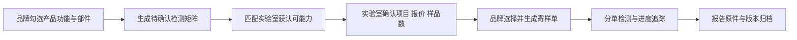

# 智纺送检：智能服装检测路由站

> **一句话讲清楚：** 给做加热服、监测服、发光服等产品的小品牌一个“填功能—出送检清单—匹配实验室—寄样追踪”的入口；品牌按每次检测订单付服务费，因为我国首个智能纺织综合基础标准刚在 2026 年 7 月 1 日实施。

**五分钟读完：** 这是检测交易路由，不是认证机构，也不是合规咨询。公开标准与产品新闻只证明市场正在形成，不能证明已有订单或收益。

## 1. 先看懂：卖的不是检测，而是“一次送对”

智能服装不是普通衣服加块芯片。加热背心可能同时涉及面料、皮肤接触、电源、温升和耐洗；监测服还可能涉及传感器、电磁兼容与数据通信。一家小品牌如果只熟悉传统纺织送检，很容易遇到三件事：不知道应列哪些项目、一个实验室无法覆盖全部能力、样品和报告分散在不同联系人手里。

**说明性示例：** 一个工作室准备上线带可拆卸电池的加热马甲。它在“智纺送检”勾选加热、锂电供电、可拆卸电子部件、可洗涤，系统生成一份待确认的检测项目矩阵，列出能覆盖纺织理化、热安全和电气项目的实验室组合、报价与寄样数量。品牌选择方案并寄出样品，平台追踪各子订单，最后把报告和样品流向放回同一个项目档案。

**最小可售单元：** 一笔完成实验室确认并生成寄样单的检测路由订单。实际检测费由品牌直接支付给实验室，平台另收交易服务费。

## 2. 为什么偏偏是现在？

第一，GB/T 46755—2025《智能纺织产品通用技术要求》于 2026 年 7 月 1 日实施。市场监管总局称它是我国首次面向智能纺织领域的综合性基础标准，覆盖理化性能、电源、热、机械、电气、电磁兼容、电磁辐射、耐用性、使用说明和包装。它把原本分散的测试语言放进同一个框架。

第二，供给端已经出现具体产品，而不只是概念。2026 年 5 月，红豆集团发布并上市 AI 防摔服；4 月举办的北京智能服装服饰产业大会则同时讨论柔性电子、心电监测、功能服装和该国家标准。它们不能证明市场规模，却说明“纺织企业开始做电子产品”已经发生。

第三，CNAS 官网提供获认可实验室及其能力范围的查询入口，截至当前页面显示实验室及相关机构 22264 家。数量多不代表都能检测智能服装，反而说明交易的关键不是列出机构名称，而是把“产品功能—检测项目—获认可能力—样品要求”准确匹配起来。

## 3. 谁会付钱，为什么会付？

**唯一付费客户：** 首次把电子、加热、传感或通信功能做进服装和家纺的中小品牌、设计工作室与代工厂。大型品牌通常已有质量部门和实验室合作，不是第一批客户。

购买发生在产品准备打样送检、材料或电池发生变化、检测报告被渠道要求补充时。客户今天的替代办法是逐家询价，让某一家实验室销售人员帮忙解释；这不一定更差，甚至可能免费。平台只有在能同时给出多实验室能力匹配、统一寄样和跨报告归档时，才值得收费。

标准本身是**推荐性国家标准**，不是所有产品都被强制要求按它检测。因此付费理由不能写成“否则不能销售”，而应是降低重复寄样、漏项和跨机构沟通成本，并为渠道、采购方或品牌内部质量要求留下可追溯证据。

## 4. 一笔订单怎样运转？



平台先把产品拆成纺织本体、供电、发热／传感、通信、可拆卸部件和洗护方式，再用规则库生成“候选项目”，但必须由实验室最终确认。确认后系统生成一个或多个子订单、寄样标签和时间线；报告回来后，只归档原件、项目、版本与适用样品，不替实验室改写结论。

完成定义是：实验室接受委托、品牌完成寄样、每个子订单有可追踪状态。平台不出具检测报告，不冒用 CNAS 标识，不承诺产品“通过认证”，也不替品牌判断医疗器械属性。

## 5. 怎么赚钱，能自动到什么程度？

**建议定价假设：** 品牌为每个检测路由项目支付 399 元服务费，实际检测、快递与补样费用另付。若支付、通知、项目存储和平均人工异常处理摊销 110 元，单笔贡献约 289 元；每月完成 30 单约为 8670 元贡献。这只是结构测算，不是收入预测。

可自动化的是功能问卷、规则初筛、实验室能力检索、询报价模板、寄样标签、进度提醒、报告版本归档和材料变更后的复检提醒。可复购的时刻不是每月固定续费，而是品牌换电池、面料、控制器、结构或推出新型号。

实验室能力审核、项目最终确认、异常样品、报告争议和合作关系必须由人处理。自动化上限也很清楚：如果超过 30% 的订单需要从头人工设计检测方案，它就会退化成低毛利咨询，平台模式不成立。

## 6. 最大问题与最终判断

**最终判断：有条件值得，适合做成窄交易入口，但不适合先花钱开发大平台。** 新标准、真实新品和大量检测供给构成了可信机会窗口；最稀缺的资产是经实验室确认的“功能—项目—能力—样品数”映射，而不是一个漂亮的询价页面。

它最可能因三件事失败：推荐性标准无法制造足够紧迫性；综合实验室直接提供免费打包服务；订单频率太低，无法覆盖逐单审核成本。停止条件是：可核验能力的合作实验室少于 8 家；完整订单平均人工处理超过 90 分钟；完成 30 笔订单后，品牌付费率低于 20% 或实际单笔贡献低于 150 元。

你的架构和自动化能力适合建设规则库、订单状态机与证据链，但纺织检测、电气安全和实验室认可能力判断必须外借给合格实验室。这个适配发生在机会选定之后，不把它改写成顾问服务。

---

## 事实与推演附录

### A. 行业坐标与商业系统

- **主行业：** 智能纺织产品检测与第三方实验室交易。
- **商业模式：** 按项目收取检测路由交易服务费。
- **价值链位置：** 品牌提出检测需求之后、实验室正式接受委托之前。
- **新鲜信号：** 首个综合性基础标准于 2026-07-01 实施；2026 年已有智能防摔服上市和智能服装产业会议。
- **受益者与付款者：** 均为中小智能纺织品牌或代工厂。
- **最小可售单元：** 一笔由实验室确认、生成寄样单的检测路由订单。
- **角色政策：** 用户角色未参与行业筛选，只用于选定后的执行适配。

### B. 市场证据与事实来源

| 日期 | 来源 | 可直接复核的事实 | AI 推断 | 局限 |
|---|---|---|---|---|
| 2026-07-01 | [全国标准信息公共服务平台](https://std.samr.gov.cn/gb/search/gbDetailedCNF?id=4507EFE13CB6CB6AE06397BE0A0A601F) | GB/T 46755—2025 为推荐性、现行国家标准，实施日为 2026-07-01 | 标准会增加小品牌对跨领域检测项目的询问 | 推荐性标准不等于强制购买检测 |
| 2026-01-20 | [市场监管总局标准解读](https://www.samr.gov.cn/bzjss/bzjd/art/2026/art_2a24d5ca898546d9aa93fbe0d3e49d92.html) | 这是我国首个智能纺织综合基础标准，覆盖理化、电源、热、机械、电气、电磁与耐用性 | 多能力域会产生项目匹配和分单需求 | 官方未披露检测订单数量 |
| 2026-05-22 | [中新网江苏](https://www.js.chinanews.com.cn/news/2026/0522/233738.html) | 红豆集团发布的 AI 防摔服已有旗舰版、舒适版上市 | 新功能服装正从原型走向商品 | 单个新品不能代表行业规模 |
| 2026-04-28 | [中国纺织工业联合会](https://www.cntac.org.cn/zixun/hangye/202604/t20260428_4410380.html) | 产业大会覆盖柔性电子、心电监测、智能材料及 GB/T 46755 解读 | 研发主体与检测需求可能增加 | 会议参与不等于商业需求 |
| 当前页面 | [CNAS 在线服务](https://www.cnas.org.cn/fzlm/zxfw/index.html) | 页面显示实验室及相关机构 22264 家，并提供获认可机构查询 | 可用能力目录建设实验室匹配数据库 | 总数覆盖所有领域，不是智能纺织实验室数量 |

### C. 收入与单位经济

| 项目 | 建议定价假设 | 可变成本假设 | 单笔贡献 | 说明 |
|---|---:|---:|---:|---|
| 检测路由订单 | 399 元 | 110 元 | 289 元 | 实际检测费、物流费由品牌另付 |
| 月度 30 单 | 11970 元 | 3300 元 | 8670 元 | 算术示例，不是销量或收益承诺 |

复购由新型号、物料清单变化、关键部件替换和渠道补充检测触发；不假设固定月度订阅。

### D. 运营与自动化系统

- **数据资产：** 产品功能词典、检测项目映射、实验室获认可能力、报价有效期、样品数量、周期与报告版本。
- **自动节点：** 问卷、初筛、能力检索、询价、寄样、提醒、状态同步、归档、复检提示。
- **人工节点：** 实验室准入、项目确认、复杂产品边界、异常样品、报告争议。
- **熔断规则：** 未获实验室确认不生成正式送检单；无法核验能力范围不推荐；涉及医疗器械属性立即转专业机构。

### E. 30 / 90 天演进路线

- **0—30 天：** 只收录加热服、发光服和带传感器服装三个类型；建立公开标准索引与实验室能力档案，不声称覆盖所有产品。
- **31—90 天：** 增加结构化询报价、寄样分单、报告版本与物料变更提醒；只依据真实订单决定是否扩展智能家纺。
- **可沉淀资产：** 经实验室确认的项目映射、历史周期和报价，而不是品牌隐私数据或报告内容再销售。

### F. 风险、合规与停止条件

- **最大风险：** 推荐性标准带来的购买紧迫性不足，实验室免费方案替代平台。
- **合规边界：** 不出具报告、不使用或暗示 CNAS 认可、不保证通过、不把普通产品判断为医疗器械或非医疗器械。
- **停止条件：** 合作实验室少于 8 家；平均人工处理超过 90 分钟；30 单后付费率低于 20%；单笔贡献低于 150 元。
- **未知项：** 有多少中小品牌会主动采用该推荐性标准、单个产品真实检测费用、实验室是否愿意开放结构化报价。

## 反馈（skill_run）

```yaml
skill_run:
  skill: creative-capture-assistant
  workflow_stage: single-idea
  plan: Plans/创意捕捉/2026-08-09-副业创意-智纺送检智能服装检测路由站.md
  date: 2026-08-09
  contexts_used:
    - path: Contexts/决策/Skill反馈协议.md
      utility: high
      reason: "用五分钟正文承载检测交易机会的理解和判断，用事实附录区分推荐性标准、市场信号、AI推断与定价假设。"
  contexts_missing: []
  contexts_stale: []
```
