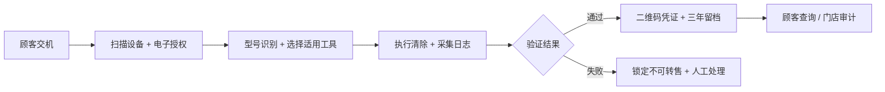

# 清机凭证：旧手机清除留痕系统

> **一句话讲清楚：** 给回收后还要转卖旧手机的中小门店，提供一套“插入手机—取得授权—调用合规清除工具—验证结果—保存三年记录—给顾客二维码凭证”的软件，按处理台数收费；现在值得看，是因为相关强制性国家标准将在 2027 年 1 月 1 日实施。

**五分钟读完：** 这不是帮消费者远程删照片，也不是卖二手手机，而是把回收门店每台设备都要完成的清除与留痕流程做成工具。公开证据只能证明规则和痛点存在，不能证明这款产品已经获得认证、客户或收入。

## 1. 先看懂：这是个什么生意？

一位顾客把旧手机卖给街边回收店。店员恢复出厂设置，收下手机，再给顾客一张普通回收单。但顾客仍担心照片、聊天记录和账号能否被恢复；门店也说不清用了什么方法、是否验证过、记录保存在哪里。

“清机凭证”把这个过程变成一条固定流水线：店员将手机连接电脑，扫描序列号，系统让顾客电子签署清除授权；随后调用已经确认适用的厂商功能或第三方清除工具，完成后执行验证步骤，失败就禁止进入转售状态；成功则生成一份带二维码的清除记录，顾客和门店都能查询。

**最小可售单元：一台设备的一次清除流程记录。** 产品交付的是“谁在何时对哪台设备使用了什么清除方式、验证结果如何”的可追溯证据，不是官方认证证书，也不能仅靠生成一张 PDF 就证明数据真的不可恢复。

## 2. 为什么偏偏是现在？

第一，规则已经给出倒计时。中央网信办介绍，《数据安全技术 电子产品信息清除技术要求》强制性国家标准已于 2025 年 12 月获批，将于 **2027 年 1 月 1 日**实施。它覆盖手机、平板、电脑、智能穿戴和办公设备，也适用于第三方清除功能开发者与二手电子产品回收经营者。[来源：中国网信网](https://www.cac.gov.cn/2025-12/13/c_1767269722255235.htm)

第二，要求不是“恢复出厂设置”这么简单。公开答记者问明确：回收经营者转售前要使用符合要求的功能或工具，验证清除效果；未清除的数据产品不得再销售或运输出境；清除操作和验证结果要建立档案，保存不少于 **3 年**。主管部门还将指导第三方机构建设检测工具和查询服务。[来源：中国网信网](https://www.cac.gov.cn/2025-12/13/c_1767269722255235.htm)

第三，设备正在更快进入流通。商务部披露，2026 年上半年消费品以旧换新惠及超过 **1.5 亿人次**；这个数字覆盖多种消费品，不能当成旧手机数量，但说明回收链路正在扩张。[来源：商务部，2026-07-20](https://www.mofcom.gov.cn/syxwfb/art/2026/art_1c94a6ce3d564c8aaac6b583b5adccfe.html) 同时，全国标准信息平台在 2026 年 6—7 月公示的回收利用术语修订中，新增“信息清除”“文件记录”和“可追溯”等定义。[来源：全国标准信息公共服务平台](https://std.samr.gov.cn/gb/search/gbDetailed?id=506DAEB387743FE0E06397BE0A0A459C)

这意味着，2026 年剩余时间不是追热点，而是回收商建立工具和流程的准备窗口。

## 3. 谁会付钱，为什么会付？

- **唯一付费客户：** 每月回收并转卖几十到几百台手机，但没有自研数据安全系统的中小二手手机回收商或区域连锁门店。
- **购买触发：** 门店发现“店员口头保证 + 恢复出厂设置 + Excel 登记”无法稳定满足验证、查询和三年留档要求，也无法向顾客证明处理过程。
- **当前替代方案：** 使用手机自带重置功能，再人工截图、填表和保存文件；或者采购大型平台的整套回收系统。前者易漏、难查，后者对小门店可能太重。

隐私顾虑并非假设。国家发展改革委网站 2025 年转载的调研称，只有约 10% 的废旧手机进入专业二手闲置平台等新型渠道，超过 54.2% 的手机因回收价格、隐私泄露担忧等原因被长期留在家中；报道还记录了用户即使格式化多次仍担心数据恢复。[来源：国家发展改革委](https://www.ndrc.gov.cn/fggz/hjyzy/zyzhlyhxhjj/202506/t20250611_1398381.html) 这些数据较旧且来自行业调研，不能证明门店一定会购买本产品，但证明“可信清除”同时影响消费者交机和商家合规。

## 4. 它具体怎么运转？

1. **登记与授权：** 扫描设备序列号或 IMEI，记录型号、门店、操作员和时间；顾客确认清除范围并电子签名。系统只记录设备和流程字段，不读取顾客照片、通讯录或聊天内容。
2. **选择清除方式：** 根据型号和存储介质，从已经完成适配的厂商功能或第三方工具中选择方法；未知型号、锁机或损坏设备直接转人工，不能假装“清除成功”。
3. **执行与验证：** 调用清除工具，记录工具版本、步骤、返回结果和异常；重启后按适配规则检查用户数据、账号状态和清除结果。验证失败时锁定“不可转售”。
4. **出证与留档：** 成功后生成门店版操作记录和顾客版二维码凭证，记录加密保存至少三年；顾客只能查询状态与基本设备信息，看不到内部敏感字段。
5. **审计与导出：** 门店按日期、操作员、型号或失败原因查询，并导出待处理设备和操作记录。

**完成定义：** 一台受支持设备完成授权、使用指定清除方式、通过验证并形成可追溯记录。产品不承诺破解锁机，不处理涉密设备，不替门店承担数据安全责任，也不把自己的二维码冒充政府或认证机构证书。

## 5. 怎么赚钱，能自动到什么程度？

正文采用一个**建议定价假设**：每个门店 **299 元/月，含 100 台设备记录**，超出后每台 2 元。假设云存储、短信、签名和基础运维合计 45 元/月，渠道与售后准备金 60 元/月，单门店月度贡献约 194 元。以上均未取得真实供应商报价或客户验证，只用于判断订阅结构。

门店不是因为“多一张证书”续费，而是每收一台手机都要走同一流程，记录量自然复购。设备适配库、失败原因库和门店审计数据会形成产品资产；但任何旧用户内容都不应成为训练数据。

- **可自动化：** 设备识别、授权模板、工具调用、日志采集、验证规则、二维码、三年归档、失败告警、计费和记录导出。
- **必须人工：** 新型号适配、锁机与硬件损坏判断、物理销毁、异常复核、工具认证、监管沟通和事故处置。
- **自动化上限：** 如果主流设备仍需店员逐步截图填表，或每台平均人工超过 3 分钟，这个软件就没有足够价值。

## 6. 最大问题与最终判断

**最终判断：值得关注，但技术门槛高于普通小程序。** 购买理由来自强制标准和重复业务动作，付费者、交付物和复购都很清楚；而且标准公开信息直接提到第三方检测工具与查询服务，说明机会形态不是凭空想象。真正难点是“清除与验证必须真的可靠”，不能靠漂亮界面包装。

三个最大风险：一是实践指南和产品目录尚未完全公布，最终接口、认证和证据格式仍可能变化；二是 Android 型号、iPhone、锁机、损坏机和不同存储介质差异巨大，适配范围可能远小于想象；三是手机厂商、大型回收平台或现有数据擦除企业可能直接覆盖中小门店。

建议停止条件：产品只能覆盖目标门店不足 70% 的可转售设备；单台平均人工超过 3 分钟；清除失败误判率超过 0.5%；单台合规工具授权和云服务成本超过 5 元；或者正式配套规则明确要求只能使用指定系统，而本产品无法进入目录。任一条件持续两个版本周期，就停止扩型号。

你的系统架构能力适合设备状态机、工具适配层、日志证据链和失败熔断；欠缺的是移动设备取证、存储介质清除、强制标准测试和安全认证。核心清除引擎、实验室验证与法律判断必须由专业机构承担，不能因为你擅长软件就低估安全责任，也不能把这个产品机会改写成咨询业务。

---

## 事实与推演附录

> HTML 中本节默认折叠；Markdown 保留完整研究，用于复核而非补齐主线。

### A. 行业坐标与商业系统

- **主行业：** 中国内地二手电子产品回收 / 数据清除。
- **商业模式：** 按设备计费的软件工具 + 清除记录托管。
- **价值链位置：** 位于回收门店与厂商/第三方清除工具之间，负责编排授权、设备识别、工具调用、结果验证、留档和顾客查询。
- **新鲜信号：** 强制性国家标准将在 2027 年 1 月 1 日实施；2026 年 6—7 月相关回收术语标准修订增加清除、记录和追溯概念；2026 年上半年以旧换新继续扩张。
- **受益者与付款者：** 门店付款并降低操作与审计成本；消费者获得可查询记录；两者不同。
- **最小可售单元：** 一台设备的一次清除与验证记录。
- **机会形态：** B2B 软件产品，不是咨询、代运营或上门清机服务。
- **角色政策：** 用户角色未参与入口筛选，只参与选定后的执行适配。

### B. 市场证据与事实来源

| 日期 | 来源 | 可直接复核的事实 | AI 推断 | 证据局限 |
|------|------|------------------|---------|----------|
| 2025-12-13 | [中国网信网答记者问](https://www.cac.gov.cn/2025-12/13/c_1767269722255235.htm) | 标准于 2025-12-02 获批，2027-01-01 实施；覆盖手机、平板、电脑、穿戴和办公设备；适用主体包括第三方清除开发者与回收经营者。 | 2026 年是中小回收商建立工具与流程的采购准备期。 | 配套实践指南、产品目录和具体认证方式仍未知。 |
| 2025-12-13 | [中国网信网答记者问](https://www.cac.gov.cn/2025-12/13/c_1767269722255235.htm) | 回收经营者须取得授权、使用符合要求的工具、转售前验证清除效果，并保存清除与验证档案不少于 3 年；主管部门将指导第三方机构建设检测工具和查询服务。 | “执行 + 验证 + 留档 + 查询”可以成为独立软件产品。 | 公开问答没有说明第三方产品如何进入目录或获得认可。 |
| 2026-07-20 | [商务部](https://www.mofcom.gov.cn/syxwfb/art/2026/art_1c94a6ce3d564c8aaac6b583b5adccfe.html) | 2026 年以来消费品以旧换新惠及超过 1.5 亿人次，并促进资源回收利用。 | 回收经营主体处理的设备与记录量可能继续增加。 | 数字覆盖多类消费品，不等于旧手机数量。 |
| 2026-06-15 至 07-15 | [全国标准信息公共服务平台](https://std.samr.gov.cn/gb/search/gbDetailed?id=506DAEB387743FE0E06397BE0A0A459C) | 《废弃电器电子产品回收利用 术语》修订公示新增信息清除、信息销毁、文件记录和可追溯等定义。 | 回收行业的记录语言和可追溯要求正在趋于标准化。 | 这是推荐性术语标准修订项目，不等同于已经生效的操作规则。 |
| 2025-06-11 | [国家发展改革委网站转载光明日报调研](https://www.ndrc.gov.cn/fggz/hjyzy/zyzhlyhxhjj/202506/t20250611_1398381.html) | 引用行业数据称约 10% 废旧手机进入专业新型回收渠道，超过 54.2% 因多种原因留存在家庭；报道记录用户对格式化后数据恢复的担忧。 | 可查询的清除记录有助于门店建立信任。 | 数据较旧、统计口径未展开，隐私只是多项原因之一，不能用于估算购买转化。 |

**分类审计：** 实施日期、适用对象、验证与三年留档要求属于公开事实；“中小门店将采购独立 SaaS”“二维码能提高回收转化”属于 AI 推断；299 元价格与成本属于建议定价假设；标准号、实践指南、产品目录、认证方式、真实适配成本和客户预算在本次研究中仍属未知或未确认。

### C. 收入与单位经济

| 收入项 | 建议定价假设 | 可变成本假设 | 毛利逻辑 | 回款与复购 |
|--------|--------------|--------------|----------|------------|
| 单店基础版 | 299 元/月，含 100 台 | 云存储、短信、签名、运维与售后约 105 元/月 | 重复流程软件化；核心成本是适配与技术支持 | 月付；设备持续进入门店即产生复购 |
| 超额设备记录 | 2 元/台 | 存储、查询与工具调用成本未知 | 处理量越高，单位软件成本可能下降 | 月末按量结算 |
| 区域连锁版 | 价格未知 | 多门店权限、审计和私有部署成本未知 | 集中查看操作员、门店和失败记录 | 年付可能性尚未验证 |

订阅毛利不能只按云成本计算。设备适配、合规工具授权、实验室验证、安全事故准备和客服都可能成为主要成本；如果必须为每款设备购买昂贵授权，299 元假设可能完全不成立。

### D. 运营与自动化系统



**建议系统边界：**

- 设备接入端：读取型号、序列号、系统版本与工具返回状态，不抓取旧用户内容。
- 适配层：把不同厂商或合规工具封装为统一的“可执行 / 不支持 / 需人工”状态。
- 证据层：对授权、工具版本、操作步骤、验证结果和时间戳形成防篡改记录；二维码仅用于查询，不宣称官方认证。
- 保留层：记录加密、分权访问、到期销毁；备份与恢复也要有审计。
- 熔断层：锁机、未知型号、工具报错、验证失败、日志缺失或时间异常，一律不可生成成功凭证。

**人工责任边界：** 门店对用户授权、设备来源和实际操作负责；清除工具提供方对技术能力和版本说明负责；系统经营者对编排、日志、查询与数据保护负责；实验室或认证机构对检测结论负责。任何一方都不能用“系统显示绿色”替代真实清除。

### E. 30 / 90 天演进路线

- **0–30 天：** 只做标准映射和证据字段模型；等待并跟踪实践指南与产品目录；选择一种受支持的 Android 路径和一种 iPhone 官方路径，明确“不支持”条件。此路线仅供参考，不要求用户现在实验。
- **31–90 天：** 在取得清除工具合作与安全测试条件后，完成门店端、授权、日志、失败熔断、二维码查询和记录导出；禁止在未验证前对外宣称“符合国标”。
- **可沉淀资产：** 设备—系统—工具适配矩阵、失败原因库、门店操作数据、证据字段规范、合规版本历史和匿名化运维指标。

### F. 风险、合规与停止条件

- **最大风险：** 产品只做了留痕，却没有能力证明清除工具和验证过程可靠，形成“伪合规”。
- **标准变化：** 实践指南、产品目录、检测和认证方式尚待明确，产品必须版本化管理规则，不能抢先承诺。
- **个人信息：** 设备序列号、顾客签名、交易记录本身也是敏感经营数据；需要最小化收集、加密、访问控制、日志和到期删除。
- **工具责任：** 不自行破解账号、不绕过激活锁、不读取旧用户内容；损坏设备按标准要求可能需要物理销毁，不能强行软件处理。
- **凭证措辞：** 只能写“门店操作记录”或“清除流程凭证”，取得相应资质前不得写成“国家认证”“官方证明”。
- **停止条件：** 设备覆盖率 <70%；平均人工 >3 分钟/台；清除失败误判 >0.5%；单台工具与服务成本 >5 元；无法进入要求的产品目录；安全测试发现记录或查询系统可能泄露旧用户信息。
- **未知项：** 强制国标编号、配套指南发布时间、目录准入、测试机构、厂商接口授权、门店真实预算、清除工具单台成本、不同设备验证方法。

### G. 角色后置适配

- **可迁移能力：** 状态机、适配器架构、证据链、权限系统、异常熔断、设备队列和多租户 SaaS。
- **能力缺口：** 移动设备取证、闪存清除原理、厂商工具授权、强制标准测试、渗透测试和数据安全法律责任。
- **必须外包或合作：** 清除引擎、实验室验证、标准合规判断、认证申请、渗透测试与事故响应；核心可保留流程编排、记录查询和门店体验。

## 反馈（skill_run）

```yaml
skill_run:
  skill: creative-capture-assistant
  workflow_stage: single-idea
  plan: Plans/创意捕捉/2026-08-09-副业创意-清机凭证旧手机清除留痕系统.md
  date: 2026-08-09
  contexts_used:
    - path: Contexts/决策/Skill反馈协议.md
      utility: high
      reason: "每次只深挖一个有公开市场证据的副业创意，并用五分钟正文与事实附录分离理解和审计。"
  contexts_missing: []
  contexts_stale: []
```
