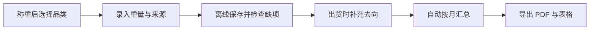

# 秤账通：石家庄回收站电子台账

> **一句话讲清楚：** 给石家庄仍用纸本、微信或表格记账的小型废品回收站，卖一套每年 399 元的手机电子台账，因为当地条例已经要求记录品类、数量、来源和去向，而新版回收站行业标准又刚在 2026 年 7 月 1 日实施。

**五分钟读完：** 这是一个窄功能软件，不是回收平台，也不是环保咨询。公开政策只能证明记录要求与行业变化真实存在，不能证明有多少石家庄站点会购买；定价和销量均为建议测算。

## 1. 先看懂：卖的是“称完就有账”，不是一套大型 ERP

小型废品回收站每天发生的动作很朴素：纸箱、废铁、塑料进站，称重、付款、分堆，攒够后再卖给下游。最容易丢失的恰好是管理需要的四类信息——收了什么、多少、从哪里来、最后去了哪里。纸本可以记重量，却很难按月份重新汇总；微信群能留照片，却无法自动形成结构化台账。

**说明性示例：** 一家社区回收点收进 86 公斤废纸箱。老板在手机上点“废纸箱”，输入 86 公斤，选择来源“居民零散交售”，可选拍下秤面；三天后出货时选择下游收货方。月底系统自动汇总当月各品类数量、来源类型和去向，生成可打印的 PDF 与可编辑表格，并标出缺少去向的记录。

首版只做普通再生资源进出记录，不处理危险废物、报废汽车、财税申报和政府审批。**最小可售单元**是一家固定回收站使用一年的台账账号。

## 2. 为什么偏偏是现在？

第一，石家庄的记录要求已经写进地方条例。《石家庄市再生资源回收利用管理条例》自 2025 年 6 月 28 日施行，要求建立回收台账，并定期上报再生资源的种类、数量、来源和去向；未定期上报、责令改正后仍不改的，罚款 500 至 2000 元。这里的机会不是“制造焦虑”，而是把已经存在的重复工作变简单。

第二，新版行业标准刚进入实施期。商务部于 2026 年 1 月公布《再生资源回收站点建设管理规范》等标准；福建省商务厅发布的解读明确，新版标准于 7 月 1 日实施，设施清单包含计量器具和信息采集设备。推荐性行业标准不等于每一项都直接触发行政处罚，但它正在抬高站点规范化经营的参照线。

第三，石家庄市政府 2026 年 4 月披露，全市再生资源回收网点覆盖率达到 93%。这个比例说明回收网络已经广泛存在，但不等于可销售站点数量，更没有披露其中多少仍在手工记账。

## 3. 谁会付钱，为什么会付？

**唯一付费客户**是石家庄市域内、通常由一至五人经营、没有专用业务系统的固定再生资源回收站。连锁回收企业、分拣中心和大型拆解厂往往已有更完整的软件，不是首要客户。

购买触发不是“想数字化”，而是老板第一次被要求补齐一段时间的品类、数量、来源或去向，发现纸本和聊天记录无法快速汇总。它的替代方案是纸质账本、Excel、通用进销存或全国性回收 SaaS。秤账通只有做到三点才值得付费：一分钟内记完一笔；断网也能先保存；导出的字段能按当地实际要求调整。

市面上已经有面向回收预约、派单、称重和财务的综合系统，因此这不是空白市场。机会在于做成“只管台账与月报”的小工具，以更低学习成本服务不需要大系统的小站点。

## 4. 一笔废品怎样变成可上报的月度账？



首次使用时，站点只需预设常收品类、常见来源类型和下游收货方。以后每笔记录用手机完成，系统自动生成编号、时间和修改痕迹；照片是可选证据，不强迫收集居民身份证。月底生成汇总包，老板确认后自行打印或通过主管部门认可的方式提交。

完成定义是“生成字段完整、可追溯修改的月度记录包”，不是保证监管部门一定接收。由于石家庄公开条例没有指定统一电子模板或上报接口，首版不能宣称一键直报政府；模板变化必须人工确认后更新。

## 5. 怎么赚钱，能自动到什么程度？

**建议定价假设：** 每个站点 399 元／年。按每年渠道分成 80 元、云存储与支付 25 元、平均客服和维护摊销 60 元计算，单站年贡献约 234 元；若有 300 个付费站点，年贡献约 7.02 万元。这是算术示例，不是石家庄站点数量或收入预测。

自动化部分包括在线支付、开通续费、品类模板、离线同步、缺项提醒、月度汇总、PDF／表格导出、自动备份、渠道归因和续费提醒。可通过电子秤销售维修商、打包机维修商或下游废料大户的专属二维码分销，按年自动结算佣金。

人工仍要负责当地字段核对、首次模板配置、异常数据恢复、客户支持和渠道关系。若每个站点每年平均需要超过一小时人工服务，或者不同区县都要求完全不同的格式，399 元低价订阅就难以成立。

## 6. 最大问题与最终判断

**最终判断：有条件值得关注。** 它拥有清晰的付费主体、重复记录场景和年度订阅逻辑；地方条例、新行业标准与现有回收网络共同提供了石家庄限定性。相比做回收撮合平台，它不需要组织运力，也不碰废品价格波动，自动化上限更高。

最可能失败的原因有三个：小站点认为纸本已经够用；主管部门的实际报送频率和格式不统一；全国性回收软件用更低价格覆盖同一功能。停止条件应设为：付费站点月活低于 60%；记录缺项率持续高于 5%；年度续费率低于 45%；每站年人工服务超过一小时；实际单站贡献低于 180 元。

你的系统架构与自动化能力适合离线同步、多租户、模板版本和渠道结算；再生资源分类、当地报送口径与线下渠道销售需要外包或合作。角色只影响实现方式，没有把这个软件机会改写成咨询业务。

---

## 事实与推演附录

### A. 行业坐标与商业系统

- **主行业：** 再生资源回收数字化；小微经营工具。
- **商业模式：** 单固定站点年度 SaaS 订阅，渠道按续费分成。
- **价值链位置：** 废品称重之后、月度汇总或定期上报之前。
- **新鲜信号：** 新版回收站行业标准于 2026 年 7 月 1 日实施；石家庄已有台账与定期上报义务。
- **受益者与付款者：** 固定回收站经营者既使用也付款。
- **最小可售单元：** 一个站点一年的台账账号。
- **角色政策：** 用户职业未进入行业筛选，只用于选定后的技术与外包适配。

### B. 市场证据与事实来源

| 日期 | 来源 | 可直接复核的事实 | AI 推断 | 证据局限 |
|---|---|---|---|---|
| 2025-06-28 起施行 | [石家庄市人民政府｜再生资源回收利用管理条例](https://www.sjz.gov.cn/columns/8e2f0b12-4574-4ced-b339-bcb378d54b2d/202506/03/46812e04-542a-41b7-b2e4-83085a638303.html) | 要求建立台账，定期上报种类、数量、来源、去向；逾期不改罚 500—2000 元 | 低成本电子台账可能降低整理负担 | 未公开统一报送频率、模板与接口 |
| 2026-01-12 | [商务部公告 2026 年第 5 号](https://www.mofcom.gov.cn/zcfb/blgg/art/2026/art_5de06e6c36dc4d7c8de64743d7cac255.html) | 商务部审核公布新版《再生资源回收站点建设管理规范》等 11 项标准 | 站点规范化工具进入新的销售窗口 | 公告正文未展开全部标准条款 |
| 2026-07-01 起实施 | [福建省商务厅｜新版标准解读](https://swt.fj.gov.cn/xxgk/jgzn/jgcs/ltyfzc/zszyhs/202603/t20260331_7117422.htm) | 标准设施清单包括分类存储、计量器具、信息采集设备和消杀工具 | 手机台账可以成为轻量信息采集环节 | 推荐性标准不等于每项直接处罚；解读不是石家庄执行细则 |
| 2026-04-01 | [石家庄市人民政府｜“无废城市”进展](https://www.sjz.gov.cn/columns/839b1981-330e-4901-aba5-6c392154ce03/202604/01/68ad8315-3f59-484b-ab7b-db140393aa08.html) | 全市再生资源回收网点覆盖率达到 93% | 广泛网络可能形成足够窄工具用户 | 覆盖率不是站点数，也未披露手工记账比例 |
| 2025-12-29 | [国家发改委、财政部｜2026 年“两新”政策](https://zfxxgk.ndrc.gov.cn/web/iteminfo.jsp?id=20582) | 明确完善交投点、中转站、分拣中心三级体系，引导“互联网＋回收”企业拓展品类 | 回收网络数字化仍在政策推动期 | 国家政策不直接证明本产品的购买需求 |

### C. 事实、定价、未知与单位经济

| 类型 | 内容 |
|---|---|
| 公开事实 | 石家庄存在台账与定期上报要求；新版行业标准已实施；本地回收网点覆盖率为 93% |
| AI 推断 | 小型固定站点可能需要比综合 ERP 更简单的台账工具 |
| 建议定价假设 | 399 元／站点／年；渠道 80 元，技术支付 25 元，客服维护摊销 60 元，年贡献约 234 元 |
| 规模算式 | 300 个付费站点 × 234 元 = 年贡献 7.02 万元，不是销量预测 |
| 关键未知 | 可售固定站点数、手工记账比例、实际报送频率和模板、支付意愿、续费率、竞争价格 |

### D. 运营与自动化系统

- **数据资产：** 品类模板、来源类型、下游去向、每笔进出记录、修改日志、月度汇总。
- **自动节点：** 支付开通、离线同步、字段校验、汇总导出、备份、渠道归因、分成和续费提醒。
- **人工节点：** 当地口径核验、模板升级、异常恢复、客户支持、线下渠道关系。
- **熔断规则：** 无法确认报送格式时只导出通用台账，不宣称“政府认可”；危险废物和报废汽车不进入产品范围。
- **竞争边界：** 不做居民预约、回收员派单、废品行情、运输调度和财税申报。

### E. 30 / 90 天演进路线

- **0—30 天：** 固定普通再生资源分类；完成进出记录、离线缓存、缺项检查与通用月报。
- **31—90 天：** 增加多模板版本、修改留痕、渠道二维码、自动续费与备份恢复。
- **可沉淀资产：** 石家庄实际可用的品类与字段模板、低学习成本交互、渠道关系和版本变更记录。

### F. 风险、合规与停止条件

- **最大风险：** 纸本替代意愿低，而不是软件开发难。
- **经营边界：** 软件只帮助记录与导出，不提供法律意见，不保证报送通过，不代替经营备案。
- **数据边界：** 默认只记录来源类型，不强制采集居民姓名、身份证和精确住址；敏感数据最小化、加密和可导出删除。
- **停止条件：** 月活低于 60%；缺项率高于 5%；续费率低于 45%；每站年服务超过一小时；单站年贡献低于 180 元。
- **能力适配：** 用户可负责系统架构、自动化和数据可靠性；分类口径、合规复核与地推渠道需外包或合作。

## 反馈（skill_run）

```yaml
skill_run:
  skill: creative-capture-assistant
  workflow_stage: single-idea
  plan: Plans/创意捕捉/2026-08-09-副业创意-秤账通石家庄回收站电子台账.md
  date: 2026-08-09
  contexts_used:
    - path: Contexts/决策/Skill反馈协议.md
      utility: high
      reason: "确保单创意 plan 的执行反馈采用可聚合、可通过门禁的结构。"
    - path: Contexts/规范/炫酷建站规范.md
      utility: high
      reason: "用单栏骨架、折叠附录和三档浏览器验证生成可独立阅读的网页。"
  contexts_missing: []
  contexts_stale: []
  outcome_status: pass
```
