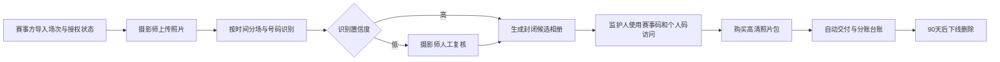

# 赛号相册：青少年赛事照片自动找图与售卖

> **一句话讲清楚：** 与青少年篮球、足球、手球等赛事的摄影师合作，把几千张照片按队伍、场次和球衣号码自动归类，让家长用赛事码找到自己孩子的照片并付费下载；今年赛事供给正在增加，而号码识别和在线售图技术已经可以直接采购，不必从零训练 AI。

**五分钟读完：** 这不是办赛、摄影培训或家长社群，而是一层夹在摄影师与陪赛家庭之间的数字交易工具。赛事方和摄影师提供照片，家长是唯一付款者；平台负责找图、预览水印、收款、交付和分账。公开资料只能证明赛事与技术条件存在，不能证明家长购买率，所有价格与转化率均为假设。

## 1. 这是个什么生意？

**说明性场景，不是真实客户案例：** 一场 U12 篮球赛有 20 支队伍、几百名孩子和 5 位摄影师。比赛结束后，摄影师上传 6,000 张照片到公开相册。家长要在大量陌生孩子的照片里不停翻页；摄影师也很难逐一认人、加水印、收款和发原图，最后照片常常只变成主办方公众号里的九宫格。

“赛号相册”把照片先按比赛时间和场次切分，再用光学字符识别（OCR，即从画面中读取数字）识别球衣背号或号码布。家长输入主办方发放的赛事码、队伍和号码，只能查看候选照片；确认是自己的孩子后，可购买无水印高清包。识别不确定的照片进入人工复核，而不是自动公开。

**最小可售单元：** 一个孩子在一场赛事中的高清照片包。首版只服务有清晰号码的篮球、足球、手球、排球和田径，不做人脸识别，不接学校日常相册。

## 2. 为什么偏偏是现在？

- **2026-07-03：青少年赛事被明确纳入“赛事+旅行”。** 体育总局与文旅部公布暑期全国青少年赛事活动目录，列出 20 项全国赛事，覆盖田径、击剑、铁人三项、游泳、跆拳道、篮球、手球、棒球、排球和足球等项目，并鼓励丰富赛事文旅产品。[国家体育总局](https://www.sport.gov.cn/jjs/n5039/c29748367/content.html)
- **2026-07-20：地方赛事供给也在扩张。** 京张体育文化旅游带发布 243 项重点赛事活动；此前广西二季度目录已有 202 项赛事。它们不是青少年赛事的完整市场规模，但说明赛事正被持续当成消费场景组织。[京张赛事目录](https://www.sport.gov.cn/n20001280/n20001265/n20067533/c29781128/content.html) · [广西赛事目录](https://www.sport.gov.cn/n14471/n14491/n14528/c29531961/content.html)
- **技术与交易组件已经现成。** 国内运动相册产品已支持按号码、时间和 GPS 找图，以及单张、批量套餐、自动分账等付费下载能力。[谱时运动相册文档](https://help.photoplus.cn/docs/1920753)

这三件事共同改变了起步成本：不必证明 AI 能不能认号码，也不必自己办比赛；真正可切入的是**非马拉松青少年赛事的私密找图与交易流程**。

## 3. 谁会付钱？

**唯一付费客户（AI 推断）：** 陪孩子跨城或跨区参加正式比赛、希望留下比赛瞬间的家长或监护人。摄影师和主办方是供给合作方，通过分账获益，不向他们收固定软件费。

付费触发发生在比赛刚结束、家庭荣誉感最强的时候：孩子第一次上场、进球、获奖或与队友拥抱，但家长自己没有拍到清晰照片。产品卖的不是“云相册”，而是把本来找不到的专业照片送到正确家庭面前。

替代方案包括公开直播相册、微信群发网盘、通用号码找图平台和家长自己拍摄。通用平台已经证明技术和售图成立，因此赛号相册不能把“AI 找图”当护城河；它必须靠未成年人专属授权、封闭访问、队伍与场次结构、赛事方分账和到期删除形成差异。

## 4. 它怎样运转？

1. 主办方与摄影师创建赛事，导入场次、队伍、号码区间和监护人授权状态；每位参赛家庭获得赛事码和个人访问码。
2. 摄影师上传照片，系统按拍摄时间切分场次，再识别球衣号码；低置信度照片进入摄影师复核，不进入公开搜索。
3. 家长使用“赛事码 + 个人访问码 + 队伍/号码”进入封闭相册，只看到候选缩略图，并自行确认孩子身份。
4. 家长购买照片包后，系统自动去除预览水印、交付原图，并按预设比例向摄影师、赛事方和平台记账分账。
5. 赛事结束 90 天后默认下线并删除原图与索引；监护人可随时发起删除或纠错请求。

**完成定义：** 家长不公开上传人脸、不翻阅整场相册，就能在两分钟内找到候选照片并完成购买。首版不做面部识别、不公开参赛名单、不向未成年人营销、不无限期保存照片。

## 5. 怎么赚钱，能自动到什么程度？

**建议定价假设：** 每位参赛者的赛事照片包 ¥39，包含最多 8 张高清图；摄影师分得 65%，赛事方分得 10%，平台收入 25%。假设存储、号码识别、支付和交付的可变成本为每个成交包 ¥2–5，则平台每包贡献毛利约 ¥4.75–7.75。以上不是市场报价。

说明性计算：一场 300 人赛事若有 20% 的家庭购买，成交 60 包，交易额 ¥2,340；平台收入 ¥585，扣除假设可变成本 ¥120–300 后，贡献毛利约 ¥285–465。单场收入不高，只有同一套流程能连续处理多场赛事才成立。

- **可自动化：** 上传、时间分场、号码识别、水印、候选相册、付款、原图交付、分账台账和到期删除。
- **必须人工：** 赛事签约、摄影师质量、监护人授权、号码误识别、投诉删除、内容安全与异常退款。
- **自动化上限：** 如果每场比赛都要人工认人、逐张修图或逐个家庭加微信，平台会退化成低效率摄影工作室。

## 6. 最大问题与最终判断

**结论：有条件值得关注。** 它不是技术创新，而是一个新垂类交易入口：赛事数量增加、家长参与被强化、现成技术可采购，但青少年团队项目仍缺少以“监护人授权 + 非人脸找图 + 自动售图”为中心的标准产品。它比泛体育内容号更接近一笔真实交易，也可以高度自动履约。

三个最大问题是：监护人授权与未成年人照片保护成本可能高于收入；球衣号码会重复、遮挡或变化，误匹配会破坏信任；现有通用相册平台随时可以补齐同样功能。真正的门槛不在模型，而在合法获得赛事供给、形成隐私安全流程和积累赛事模板。

**角色设定不参与入口筛选。** 这个方向因青少年赛事供给和影像交易条件变化而入选。选定后，你的系统能力可以用于场次数据模型、权限、识别队列、分账和自动删除；体育渠道、摄影质量、未成年人授权文本、支付分账与内容审核必须由专业合作方承担，不能把产品改写成咨询服务。

---

## 事实与推演附录

> HTML 中本节默认折叠；Markdown 中保留完整研究，供复核而非承担主叙事。

### A. 行业坐标与商业系统

- **主行业：** 中国内地青少年体育赛事 / 影像交易。
- **商业模式：** 数字照片交易平台 + OCR 号码索引 + 自动水印交付 + 收入分账。
- **价值链位置：** 位于赛事主办方、摄影师、参赛家庭和现有云相册/识别服务之间。
- **新鲜信号：** 7 月发布全国暑期青少年赛事目录；京张 7 月集中发布 243 项重点赛事；运动相册供应商今年已把号码检索和付费套餐做成标准能力。
- **受益者与付款者：** 家长付款并直接受益；摄影师和赛事方通过分账受益；未成年人是被记录者，不是营销对象。
- **最小可售单元：** ¥39/人的单场赛事照片包（建议定价假设）。
- **机会形态：** 赛事供给合作 → 照片上传 → 非生物特征索引 → 封闭访问 → 家长购买 → 自动交付与分账 → 到期删除。

### B. 市场证据与事实来源

| 日期 | 来源 | 可直接复核的事实 | AI 推断 | 证据局限 |
|---|---|---|---|---|
| 2026-07-03 | [体育总局、文旅部青少年赛事目录](https://www.sport.gov.cn/jjs/n5039/c29748367/content.html) | 目录列出 20 项暑期全国青少年赛事，覆盖多种运动和多个城市；鼓励丰富赛事文旅产品 | 跨城参赛家庭增加，会产生纪念影像需求 | 目录没有公布参赛人数、摄影服务或照片付费率 |
| 2026-07-20 | [京张体育文化旅游带](https://www.sport.gov.cn/n20001280/n20001265/n20067533/c29781128/content.html) | 发布 243 项重点赛事，活动从 6 月延续到 10 月 | 地方赛事供给正在持续组织化 | 243 项并非全部青少年赛事，也不等于可接入客户 |
| 2026 年二季度 | [广西体育赛事目录](https://www.sport.gov.cn/n14471/n14491/n14528/c29531961/content.html) | 广西发布 202 项赛事并配套消费券和消费活动 | 赛事被当作消费入口经营，商业合作空间增加 | 不能证明赛事照片是优先消费品 |
| 2026 年 | [国家体育总局社体中心预算](https://www.sport.gov.cn/stzx/n5434/c29559403/part/29559413.pdf) | 青少年体育推广项目目标包括 64 次比赛活动、20,050 人参加和 22 次直转播 | 仅中央单一机构就存在可重复影像供给 | 预算目标不是完成结果，也不能代表全国市场 |
| 2026-06 更新文档 | [谱时运动相册](https://help.photoplus.cn/docs/1920753) | 产品支持号码、时间、GPS、人脸四种找图方式，以及单张/批量售卖和分账 | 首版可采购基础设施，减少模型与支付开发 | 通用供应商是潜在上游，也是直接竞争者 |
| 当前可访问 | [赛客赛事平台](https://www.geexek.com/) | 首页提供按号码牌/姓名查找赛事照片的入口 | 中国用户已经接触过“号码找图”交互 | 网站未公开照片成交量、家长客单价或青少年项目占比 |
| 现行法律 | [《个人信息保护法》](https://www.npc.gov.cn/WZWSREL25wYy9jMi9jMzA4MzQvMjAyMTA4L3QyMDIxMDgyMF8zMTMwODguaHRtbD9yZWY9aW1i) | 不满 14 周岁未成年人的个人信息属于敏感个人信息；处理时应取得父母或其他监护人同意并制定专门规则 | 隐私流程可以形成差异化，但也增加成本 | 是否合规取决于具体流程、角色和授权，不由本文下法律结论 |

**事实：** 2026 年官方在增加并推广赛事消费场景；号码找图、付费套餐和分账已有可采购产品；未满 14 周岁个人信息有更严格的处理要求。

**AI 推断：** 青少年团队赛事家长愿意为“自己的孩子被专业拍到”购买照片；赛事方愿意用零固定费的分账模式接入；号码、队伍和场次足以在首版替代人脸识别。

**建议定价假设：** ¥39/赛事照片包，最多 8 张；摄影师 65%、赛事方 10%、平台 25%。

**未知：** 家长真实购买率、每位运动员可用照片数、OCR 准确率、赛事授权成本、摄影师供给、支付分账资质、主办方已有相册合同、未成年人授权的可接受流程和纠纷率。

**不得编造：** 本文没有声称已有赛事、摄影师、家长订单、平台接口、授权范本、法律审查结论或真实收入。

### C. 收入与单位经济

| 项目 | 建议假设 | 计算 | 主要不确定性 |
|---|---:|---|---|
| 家长照片包 | ¥39/人/场 | 最多 8 张高清图 | 家长是否愿为数字照片付费 |
| 摄影师分账 | 65% = ¥25.35 | 成交后结算 | 优秀摄影师可能要求更高比例或保底 |
| 赛事方分账 | 10% = ¥3.90 | 作为授权与分发激励 | 学校、协会和政府赛事未必允许商业分账 |
| 平台收入 | 25% = ¥9.75 | 每成交包 | 不是净利润 |
| 平台可变成本 | ¥2–5/包 | 识别、存储、支付、带宽和交付 | 未取得供应商报价 |
| 平台贡献毛利 | ¥4.75–7.75/包 | 平台收入减可变成本 | 未扣获客、退款、人工、税费与法务 |

**说明性单场：** 300 名参赛者、20% 家庭购买，则 60 包 × ¥39 = ¥2,340 交易额；平台收入 ¥585；扣除 ¥120–300 假设可变成本后，贡献毛利约 ¥285–465。任何参赛人数和转化率都不是已验证数据。

### D. 运营与自动化系统



**可自动化：** 上传、EXIF 时间读取、赛程切片、OCR、水印、候选匹配、支付、下载、结算台账、删除提醒和删除执行。

**人工责任：** 主办方与摄影师签约、确认授权链、拍摄质量、误匹配复核、敏感画面筛除、监护人请求、退款、举报和安全事件响应。

**异常熔断：** 未取得赛事与监护人授权不发布；低置信度不自动匹配；不允许通过公开姓名搜索；不做人脸模板；涉及受伤、走光、羞辱或医疗处置的画面自动拦截并人工判断；删除请求优先于商业保存。

### E. 30 / 90 天演进路线

- **0–30 天版本：** 只支持篮球、足球、手球和排球；只按赛事码、队伍、号码和时间找图；购买后人工抽查交付；使用现成相册、OCR、存储和支付服务。
- **31–90 天版本：** 增加赛程导入、摄影师移动上传、重复号码消歧、自动水印、套餐、分账台账、授权状态和 90 天删除任务。
- **不进入首版：** 人脸识别、学校日常相册、公开搜索、社交评论、未成年人账号、直播、实体相框和赛事报名。
- **可沉淀资产：** 不同运动的号码区域模型、赛事数据模板、摄影师质量记录、家长购买行为的匿名统计、授权与删除流程、主办方渠道。

### F. 风险、合规与停止条件

- **最大风险：** 未成年人隐私、授权链不完整、误匹配、照片质量不足、通用平台复制、主办方已有独家合同、家长认为赛事照片应免费。
- **合规边界：** 本文不是法律意见；实施前需由专业律师审查个人信息角色、监护人同意、专门处理规则、影响评估、数据保存、跨境、委托处理、支付分账和消费者权益流程。
- **停止条件（经营假设，不是行业标准）：**
  1. 连续 10 场赛事中，家庭购买率低于 10%；
  2. 每个成交包的人工复核超过 5 分钟；
  3. 每场有效照片覆盖不到 40% 的参赛者；
  4. 误匹配投诉超过购买订单的 1%；
  5. 单场授权与运营成本高于平台预计收入的 70%；
  6. 无法建立可审计的监护人授权、删除和安全事件机制。
- **未知项：** 真实转化、赛事合同、摄影版权、各地学校与协会政策、供应商数据处理方式、支付合规和保险需求。

### G. 角色后置适配

- **可迁移能力：** 数据模型、权限系统、识别任务队列、支付状态机、自动删除、审计日志与供应商编排。
- **能力缺口：** 体育赛事渠道、运动摄影、未成年人保护、版权合同、支付分账、内容审核和客服。
- **适合外包：** OCR/相册基础设施、对象存储、支付、授权文本法律审查、摄影与一线赛事运营。
- **不能外包的判断：** 是否有权处理照片、哪些照片绝不发布、识别结果何时必须人工复核、何时删除数据。

---

## 反馈（skill_run）

```yaml
skill_run:
  skill: creative-capture-assistant
  workflow_stage: single-idea
  plan: "Plans/创意捕捉/2026-08-09-副业创意-赛号相册青少年赛事照片交易.md"
  date: 2026-08-09
  contexts_used:
    - path: "Contexts/决策/Skill反馈协议.md"
      utility: high
      reason: "按协议记录本次单创意研究的事实、推演、定价假设与未知边界。"
    - path: "Contexts/规范/炫酷建站规范.md"
      utility: high
      reason: "用于落实五分钟单栏正文、折叠事实附录与三宽度浏览器门禁。"
    - path: "Contexts/规范/html模版/samples/A-single-scroll.html"
      utility: high
      reason: "用于把赛事供给、照片交易、隐私边界和收益结构组织成一条清晰叙事线。"
  contexts_missing: []
  contexts_stale: []
  outcome_status: pass
```
