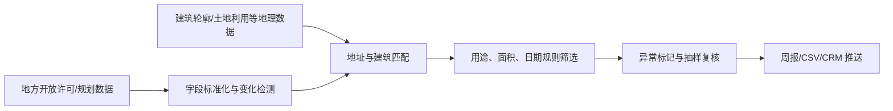

# RoofLead 250：欧盟新屋顶光伏线索周报

> **一句话讲清楚：** 把分散在地方许可公示和欧洲开放地理数据里的“新建公共及非住宅屋顶”筛成销售线索，每周卖给区域商业光伏安装商，按地区收订阅费。

**五分钟读完：** 这不是替客户判定某栋楼是否必须装光伏，也不是做一家光伏咨询公司；它卖的是一份有原始证据、能直接进入销售漏斗的新项目名单。公开桌面证据不等于客户验证，也不承诺收益。

## 1. 先看懂：这是个什么生意？

一个只做某个城市群的商业屋顶光伏安装商，通常知道“新楼、翻修、扩建”是好线索，却未必有专职数据团队。销售人员只能轮流查看市政许可网页、规划公示和地图，再把地址复制进表格；等他发现项目，承包商或能源方案可能已经定了。

RoofLead 250 把这件事变成一封每周到达的线索周报：每条记录含项目名称、许可日期与状态、用途、地址和坐标、建筑轮廓、公开面积字段、原文链接，以及“数据完整度/匹配置信度”。客户可以一键导入 CRM，自行调查业主、总包方和项目阶段。

**说明性示例：** 某地区本周出现一座公开面积为 3,200 平方米的新仓库。系统把许可记录与建筑轮廓匹配后标为“高置信候选”，但不会写成“法律强制安装”或“屋顶一定可承重”。安装商买到的是更早发现项目的机会，不是成交保证。

**最小可售单元：** 一个指定地区、一个月的周更线索订阅；交付该地区数据源中所有满足已公开筛选规则的候选，而非承诺固定条数。

## 2. 为什么偏偏是现在？

**2026 年 12 月 31 日：新建屋顶进入明确时间窗。** 欧盟委员会列出的修订版《建筑能源性能指令》实施时间表显示，到该日期，新建公共建筑和面积超过 250 平方米的新建非住宅建筑，应在“技术适用、经济和功能可行”的前提下部署太阳能；成员国还要制定本国标准和例外。因此这不是“每栋楼一刀切”，却会让安装商更重视这类项目的早期线索。[欧盟委员会：Solar energy in buildings](https://energy.ec.europa.eu/topics/energy-efficiency/energy-performance-buildings/energy-performance-buildings-directive/solar-energy-buildings_en)

**2026 年 7 月 1 日：欧洲地理数据入口刚完成一次整合。** 欧盟数据门户宣布，原 INSPIRE Geoportal 退役，其地理空间数据可在 European Data Portal 统一搜索，并新增地理过滤、地图查看和高价值数据入口。这降低了寻找建筑轮廓、土地利用等公共数据的摩擦，但不代表各地施工许可已经统一开放。[European Data Portal：INSPIRE datasets move](https://data.europa.eu/en/news-events/news/inspire-datasets-move-european-data-portal)

**同月：数据版本开始更容易比较。** 门户的 2026 年 7 月通讯称，新版本管理功能支持访问、下载并比较数据集历史版本，这对“本周新增了哪些建筑或记录”的变化检测更有用。[European Data Portal：July 2026 newsletter](https://data.europa.eu/en/newsletter-july-2026)

三件事共同制造了付费理由：法规时间窗提高了新屋顶的销售价值，开放地理数据改善了机器筛选条件，而地方许可仍然分散——“拼接和筛选”本身就是可售产品。

## 3. 谁会付钱，为什么会付？

- **唯一付费客户：** 在一个欧盟地区经营、有销售团队但没有自建数据团队的商业屋顶光伏安装商。
- **购买触发：** 进入新城市、销售管道变薄，或希望在项目采购太阳能方案之前接触业主和总包方。
- **客户买到的结果：** 少看一批无关公示，优先跟进“新建 + 公共/非住宅 + 面积阈值相关 + 原文可复核”的候选。
- **替代方案：** 人工浏览地方网站、Google Maps、行业人脉，或购买覆盖面很广的建筑项目数据库。RoofLead 250 不争“全欧洲最全”，而争“一个地区更新快、筛选窄、证据链清楚”。

它成立的前提不是客户不会搜索，而是销售人员每周重复搜索的时间和漏单成本，高于一份本地化周报的订阅费。这个前提仍需用真实客户访谈和付费测试验证。

## 4. 它具体怎么运转？



1. **只接入授权明确的数据源。** 优先使用开放 API、可下载登记册或许可明确的公开数据，不绕过验证码，不抓取禁止自动访问的网站。
2. **统一字段。** 把不同城市的许可编号、日期、状态、地址、项目用途和面积映射成同一结构，并保留原文与抓取时间。
3. **做空间匹配。** 用坐标或地址关联建筑轮廓、土地用途等数据；匹配不唯一时降置信度，不让 AI 猜一个答案。
4. **按公开规则筛选。** 找出新建公共及非住宅项目，并用公开面积字段做候选分层；缺面积的记录可单列“待核验”，不能伪造面积。
5. **自动交付、允许纠错。** 每周发送网页版摘要与 CSV，记录客户对“过期、误配、不相关”的反馈，反哺下次过滤。

**完成定义：** 每条线索能回到原始许可记录，关键字段注明来源或未知，系统可解释为什么入选。**不做：** 不判断法律义务、屋顶承重、并网条件、项目真实预算，也不自动收集未公开的个人联系方式。

## 5. 怎么赚钱，能自动到什么程度？

**建议定价假设：** 每地区每月 **€199**，含周更网页、CSV 和一次 CRM 导入格式；不按成交抽佣。复购来自“持续的新记录和状态变化”，而不是一次性报告。

按单个活跃订阅估算：云服务、地理编码与存储 **€25/月**，抽样质检与异常处理预留 **€30/月**，渠道佣金和支持预留 **€40/月**，贡献毛利约 **€104/月**。若有 50 个地区订阅，算术上约为 **€5,200/月贡献毛利**；这只是单位经济演算，不是销量预测，也未计创始人开发时间、税费和固定成本。

- **可自动化：** 定时下载、增量比对、字段映射、地址标准化、空间关联、规则筛选、周报生成、邮件/CRM 推送和反馈归档。
- **必须人工：** 首次确认数据许可、处理地址冲突、抽样查错、解释来源边界、客户支持，以及与当地数据提供方沟通。
- **自动化上限：** 如果每条线索平均需要人工处理超过 2 分钟，或每个新地区都要长期手工抄网页，这就不再是可扩展数据订阅，而是低毛利外包。

## 6. 最大问题与最终判断

**结论：有条件值得关注。** 它的亮点不是“追光伏热点”，而是把一个明确的项目时间窗与刚改善的地理数据入口，变成安装商可直接消费的窄线索流。最值得先验证的是数据，不是写软件。

最可能让它失败的三个原因：第一，目标地区许可数据不开放、字段太差或自动访问许可不清；第二，公开记录出现得太晚，线索对销售已失去时效；第三，误配和过期率太高，客户连续两周找不到值得跟进的项目。

**停止条件：** 90 天内少于 15 个付费地区订阅；任一地区每月少于 20 条可复核候选；客户抽检的错误/过期率超过 15%；人工质检超过 2 分钟/条；单订阅贡献毛利低于 €80/月；或发现数据许可、GDPR 与联系人使用存在无法消除的风险，立即停掉该地区。

你的系统架构与自动化能力适合做字段模型、增量管道、置信度和熔断机制；缺口是当地建筑许可语义、光伏销售流程、数据许可与隐私判断。前两项可找当地安装商共创，合规审查应交给所在国专业人士。这里的角色只决定你如何执行，不决定机会是否入选，也不会把它改写成咨询服务。

---

## 事实与推演附录

> HTML 中本节默认折叠；Markdown 中保留完整研究，供复核而非承担主叙事。

### A. 行业坐标与商业系统

- **主行业：** 建筑科技 / 分布式能源 / 商业数据服务。
- **商业模式：** B2B 区域数据订阅；后续可加 CRM 连接费，不以撮合佣金为主。
- **价值链位置：** 建设项目被公开之后、安装商正式获客之前的“线索发现与筛选层”。
- **新鲜信号：** 2026 年底的新建建筑太阳能时间窗与 2026 年 7 月地理数据入口整合相邻发生。
- **受益者与付款者是否相同：** 付款者和直接受益者均为光伏安装商；建筑业主可能间接受益，但不作为首个客户。
- **最小可售单元：** 一地区 × 一个月 × 周更线索流。
- **机会形态与商业系统：** 原始开放数据 → 标准化 → 空间匹配 → 候选筛选 → 证据化交付 → 反馈修正。

### B. 市场证据与事实来源

| 日期 | 一手来源 | 可直接复核的事实 | AI 推断 | 证据局限 |
|------|----------|------------------|---------|----------|
| 2026-12-31 | [欧盟委员会：建筑太阳能时间表](https://energy.ec.europa.eu/topics/energy-efficiency/energy-performance-buildings/energy-performance-buildings-directive/solar-energy-buildings_en) | 时间表列出新建公共建筑及超过 250㎡ 的新建非住宅建筑，并明确技术适用、经济与功能可行等条件 | 这些项目对商业光伏安装商的获客优先级上升 | 各国标准、例外和落地节奏不同；不能据此判断单栋建筑义务 |
| 2026-07-01 | [European Data Portal：INSPIRE 数据迁移](https://data.europa.eu/en/news-events/news/inspire-datasets-move-european-data-portal) | INSPIRE Geoportal 退役，相关地理空间数据改由统一门户搜索，提供地理过滤与地图查看 | 获取建筑轮廓等公共数据的搜索摩擦下降 | 施工许可仍由地方产生，并非全部进入该门户 |
| 2026-07 | [European Data Portal：7 月通讯](https://data.europa.eu/en/newsletter-july-2026) | 新数据集版本功能可访问、下载和比较历史版本 | 可用于构建增量变化检测 | 是否适用于具体地区和具体建筑数据集需逐一验证 |
| 2024-05-08 | [EUR-Lex：Directive (EU) 2024/1275](https://eur-lex.europa.eu/eli/dir/2024/1275) | 指令正式文本包含建筑太阳能相关条款与分阶段日期 | 可以据此设计候选筛选维度 | 产品不能代替成员国法律解释或项目合规判断 |

- “客户愿付 €199”“每月可产生足够线索”“早期线索能提高成交率”均为待验证假设，不是一手事实。
- 本轮没有找到覆盖全欧、字段统一、许可清晰的建筑许可总库，因此产品必须按地区上线。

### C. 收入与单位经济

| 收入项 | 建议定价假设 | 可变成本 | 毛利逻辑 | 回款与复购 |
|--------|--------------|----------|----------|------------|
| 单地区基础订阅 | €199/月 | €95/月 | 自动化处理同一地区数据，可复用于多个非竞争客户；若客户要求独家则另定价 | 月付；靠新记录和状态变化续订 |
| CRM 格式适配 | 首次 €99 | 约 €30 人工 | 固定字段映射，后续复用 | 一次性，不计入核心复购 |

敏感性：基础订阅只有在贡献毛利不低于 €80、人工不超过 2 分钟/条时才值得继续。50 个订阅的 €5,200 是 `50 × (€199 - €95)` 的算术结果，不代表市场容量。

### D. 运营与自动化系统

**最小数据模型：** `source_record`（原始记录）→ `project`（规范化项目）→ `building_match`（空间匹配）→ `candidate`（筛选结果）→ `delivery`（客户交付）→ `feedback`（纠错）。所有派生字段都保存规则版本和证据链接。

**熔断：** 来源条款改变、连续下载失败、字段结构突变、地址匹配大面积失真或客户报告隐私问题时，自动暂停该地区交付并显示“数据维护中”，不能用旧数据悄悄补位。

**可沉淀资产：** 地方字段映射表、建筑用途词典、地址解析规则、数据许可台账、误配样本库和地区质量评分。真正的护城河是这些可追溯规则，不是把网页抓下来。

### E. 30 / 90 天演进路线

- **0–30 天：** 只选一个许可清晰、可下载数据的地区；手工核验 100 条历史记录；做一份真实样例周报；向 20 家当地商业光伏安装商展示，并只接受付费试订，不以点赞代替需求。
- **31–90 天：** 接入第二个同语种地区；增加增量检测和客户纠错；达到 15 个付费订阅后再做 CRM 自动推送，否则停在半自动验证阶段或关闭。
- **可沉淀资产：** 地区接入清单、许可审查模板、统一字段 Schema、置信度规则和客户反馈标签。

### F. 风险、合规与停止条件

- **最大风险：** 地方许可数据碎片化导致人工成本失控，或公开时间晚于商业获客窗口。
- **合规边界：** 只处理授权允许的数据；保存来源、许可与删除记录；不推断私人联系方式；涉及个人数据时按 GDPR 的合法基础、最小化与保存期限逐地区审查。
- **停止条件：** 90 天付费订阅 <15；候选 <20 条/地区/月；错误或过期率 >15%；人工 >2 分钟/条；贡献毛利 <€80/月；数据许可或隐私风险无法消除。
- **未知项：** 哪些地区同时具备可自动使用的许可数据、足够的项目密度和愿付费的安装商；这是第一优先级验证对象。

## 反馈（skill_run）

```yaml
skill_run:
  skill: creative-capture-assistant
  workflow_stage: single-idea
  plan: Plans/创意捕捉/2026-08-10-副业创意-RoofLead250欧盟新屋顶光伏线索周报.md
  date: 2026-08-10
  contexts_used:
    - path: Contexts/决策/Skill反馈协议.md
      utility: high
      reason: "按 plan 末尾的 skill_run 协议记录本次事实核验与执行反馈。"
    - path: Contexts/规范/炫酷建站规范.md
      utility: high
      reason: "约束 HTML 的自渲染、响应式布局、Mermaid、数字动画与浏览器验收。"
  contexts_missing: []
  contexts_stale: []
  outcome_status: pass
  revisit_needed: false
```
