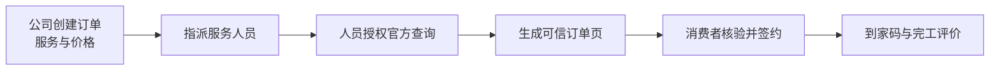

# 信派单：把一次家政派单，变成一张消费者敢点“确认”的页面

> 一句话：给还在用微信、表格接单的中小家政公司，自动生成“人、服务、价格、授权、合同、到家核验”都在同一页的可信订单页；公司按月付费，官方平台继续负责信用信息。

## 01｜先看结论：卖的不是信用报告，而是可信成交工具

家政交易最常见的卡点不是“找不到保洁员”，而是消费者在付款前连续追问：**谁来、查得到吗、有没有保险、到底多少钱、出了问题找谁？** 小公司通常把营业执照、阿姨照片、报价和保险截图分散发在微信里，消费者仍然无法判断这些材料是否属于同一个人、同一笔订单。

“信派单”把每笔订单生成一个手机页面：展示公司身份、服务人员、服务内容、明码价格、电子合同、到家核验码，并引导服务人员授权消费者前往商务部“家政信用查”核验。它不复制官方敏感信息，不给服务人员打分，也不出售征信；它出售的是**把官方核验嵌入真实订单的流程能力**。

最小可售产品不是 App，而是一家家政公司的月度工作台：录入订单、指派人员、发起授权、生成消费者页面、记录签约与完工。首个付费对象是拥有约 10—50 名活跃服务人员、每天用微信派单、没有自研系统的本地家政公司。

## 02｜为什么现在值得看：政策正在把“查信用”推入订单流程

这不是凭空想象。商务部等 9 部门在 2026 年 7 月印发的措施中，明确要求完善家政信用核查、修订示范合同、发展数字化家政、保护隐私，并推动依据从业经历、技能证书和用户评价等因素分级、明码标价。商务部随后介绍，“家政信用查”已归集 **2 万多家企业、900 多万名服务员**的信用信息；更关键的是，官方描述了一个目标流程：消费者下单、企业派单、服务员接单并授权查询、结果直接发送给消费者，并提出通过标准化第三方平台帮助中小企业接入。

这给出了一个真实缝隙：国家平台提供权威查询，但中小公司仍缺少把“授权查询、报价、合同、保险、到家确认”串成一笔订单的轻量工具。上海公开答复也显示，当地平台注册机构 2,268 家、从业人员 22.21 万人，而且多数机构规模小、盈利能力弱、人员流动性大——它们更可能购买廉价订阅，而不是定制开发。

这里的商业判断是 AI 推断：**政策并不等于客户一定付费**。真正的付费理由必须是降低客服反复解释、减少爽约争议、提升付款转化，而不是“满足政策”四个字。

## 03｜产品长什么样：一笔订单只给消费者一个入口



消费者页面只保留五个决策区：①哪家公司负责；②哪位服务人员上门及官方核验入口；③具体做什么、不做什么；④总价、加价条件和退款规则；⑤合同、到家码、投诉入口。保险、培训等标签只有在凭证有效时才亮起，过期自动隐藏。

公司端自动完成模板报价、人员授权提醒、凭证到期提醒、页面生成、签约记录、到家验证码、完工评价和月度订单报告。人工只处理身份材料不一致、投诉、保险理赔、官方接口审批和敏感信息请求。

隐私边界是产品核心：不抓取、不缓存健康、违法犯罪、行踪等官方原始记录；默认只保存“谁在何时同意了哪一次查询”、官方链接或二维码、核验完成状态，以及法律允许情况下的校验引用。任何需要保存敏感信息的功能，都必须经过单独同意、必要性评估和法律审查。

## 04｜怎么赚钱：先收订阅费，不碰交易资金

首版定价假设：**399 元/月/公司**，包含 20 名活跃人员和每月 200 张订单页；短信、电子签名、保险或获批接口产生的费用按实际用量另计。399 元不是行业事实，而是用来测试付费意愿的价格锚点。

一笔示意账：每客户月收入 399 元，云资源、通知和基础客服按 80 元估算，月贡献毛利约 319 元；若获客成本 800 元，静态回收期约 2.5 个月。以上全是测算假设，不是收益承诺，真正决定生意是否成立的是续费率和每单客服耗时。

不建议首期抽取家政交易佣金：它会把产品拖入支付、退款、责任认定和资金结算。也不建议向消费者收费，因为核验官方信用信息本身已有公共入口。赚钱点是让企业用更低成本完成可信成交和留痕。

## 05｜如何从 0 到第一笔钱：先不用官方 API

第 1—10 天，只做可点击网页原型和三种服务模板：日常保洁、小时工、陪诊/陪护类服务。找 10 家仍用微信派单的本地家政公司，观察它们真实发送给客户的材料，确认一张页面能否替代至少三次解释。不要索取客户的敏感资料，只用虚构订单演示。

第 11—30 天，选择一家愿意合作的公司，用官方现有二维码或深链完成授权核验，不以接口获批为前提。收费可以从 199 元的单月试用开始，但必须在试用前约定：如果页面不能减少客服沟通或带来更快确认，不续费。

第 31—90 天，再根据真实订单接入电子签名、保险凭证校验和地方合同模板；只有取得正式授权后，才申请或调用官方标准化第三方接口。开发者的架构能力适合设计授权状态机、证据有效期、多租户隔离和审计日志；家政渠道销售、隐私法律审查和保险理赔流程应找外部专业人员补齐。

## 06｜值不值得做：用五个数字快速否决

这个方向值得继续研究，但目前仍是“有政策信号、有流程缺口、没有付费验证”的创意。满足以下任一条件就停止或重做：服务人员授权完成率低于 70%；付费公司 60 天留存低于 70%；平均每单人工支持超过 10 分钟；获客成本回收期超过 4 个月；发生一次未经授权的敏感信息暴露。

最关键的问题只有一个：**家政公司是否愿意每月付 399 元，换取更少解释、更快签约和可追溯的订单证据？** 如果答案是否定的，就不要把它包装成“大平台”；如果答案是肯定的，它可以从一个城市的轻量 SaaS 开始，再向保险、电子合同和行业软件渠道扩张。

---

## 附录 A｜事实证据与来源

- [商务部等9部门关于促进家政服务消费扩容升级若干措施的通知（2026-07-20）](https://www.mofcom.gov.cn/zwgk/zcfb/art/2026/art_4f7753bfa9db4f51ba867282ebd3ad2c.html)：信用核查、示范合同、数字化、隐私保护、分级和明码标价。
- [商务部专题新闻发布会（2026）](https://www.mofcom.gov.cn/xwfbzt/2026/swbzkcjjzfwygzlztxwfbh/index.html)：2万多家企业、900多万名服务员；订单—派单—授权—查询结果的流程；标准化第三方平台支持中小企业。
- [商务部家政服务信用信息平台公告](https://fwmytj-jz.mofcom.gov.cn/jzjc/notice)：官方桌面端和移动端入口。
- [许昌市商务局消费者使用指南（2026-07-03）](https://swj.xuchang.gov.cn/tzgg/20260703/816ddce2-3780-4892-88f2-545dc296e2b7.html)：扫码服务员信用证书并经本人授权后查看详情。
- [上海市商务委答复（2026-06-15）](https://sww.sh.gov.cn/xxgkjytablqk/20260615/95f8af6a35e1473cbb184732f10fee0d.html)：本地机构、人员规模及小微机构经营现实。
- [济南市商务局答复（2026）](https://jnbusiness.jinan.gov.cn/col/col117355/art/2026/art_3939686eb6ee40ed8794ea484963fdc0.html)：139家企业、近5.5万名从业人员进入官方平台，强调信用和明码标价。
- [《个人信息保护法》](https://www.npc.gov.cn/WZWSREL25wYy9jMi9jMzA4MzQvMjAyMTA4L3QyMDIxMDgyMF8zMTMwODguaHRtbD9yZWY9aW1i)：敏感个人信息、特定目的、充分必要和单独同意。
- [市场监管总局《明码标价和禁止价格欺诈规定》](https://www.samr.gov.cn/cms_files/filemanager/samr/www/samrnew/samrgkml/nsjg/fgs/202204/W020220426552839095096.pdf)：服务项目、服务内容、价格或计价方法应清楚标示。

## 附录 B｜证据、推断、假设的边界

- **已证实事实**：官方信用平台存在；政策推动授权核验进入订单流程；中小企业可通过标准化第三方平台获得支持；服务需要明码标价并保护个人信息。
- **AI 推断**：微信派单的小公司愿意为“可信订单页”付费；统一页面能降低解释成本并提高成交。
- **定价假设**：399 元/月、80 元月成本、800 元获客成本、2.5 个月回收期。
- **关键未知**：官方第三方接口申请条件、地方合同差异、保险凭证核验方式、消费者实际打开率、企业续费率。

## 附录 C｜最小数据模型

- 企业：主体、门店、联系人、套餐状态。
- 服务人员：内部编号、公开姓名/照片、凭证有效期；不默认保存官方敏感详情。
- 授权：订单、授权人、用途、时间、状态、撤回记录。
- 订单：服务项、边界、价格、加价条件、人员、合同、到家码、评价。
- 证据：来源、有效期、校验状态、最小化引用、审计日志。

## 附录 D｜风险清单

- 把“授权状态”错误宣传成“信用良好”。
- 员工上传截图后长期留存敏感信息。
- 凭证过期但页面仍显示“有保险”。
- 未获授权却暗示与商务部平台直连。
- 家政公司把工具用于歧视性筛选或公开传播个人信息。

## 附录 E｜下一次调研问题

1. 家政公司每单要向消费者解释几次身份、价格和保险？
2. 哪类订单最容易因“不信任”取消？
3. 服务人员完成一次授权需要多少步骤？
4. 地方平台是否已有可申请的标准接口或合作清单？
5. 399 元/月相当于公司挽回多少笔订单？

## 附录 F｜创意评分

- 新鲜度：8/10——不是家政撮合平台，而是把公共信用能力嵌入订单成交。
- 事实强度：9/10——国家政策、官方平台、地方落地和隐私法规均有一手来源。
- 自动化潜力：8/10——页面、提醒、签约、核验状态和报告可自动化。
- 副业可进入性：7/10——首版轻，但渠道销售与合规门槛真实存在。
- 收益确定性：5/10——仍缺真实付费和留存数据。

```yaml
skill_run:
  skill: creative-capture-assistant
  workflow_stage: single-idea
  plan: Plans/创意捕捉/2026-08-10-副业创意-信派单家政可信订单页.md
  date: 2026-08-10
  contexts_used:
    - path: Contexts/决策/Skill反馈协议.md
      utility: high
      reason: "每次只深挖一个有公开市场证据的副业创意，并用五分钟正文与事实附录分离理解和审计。"
  contexts_missing: []
  contexts_stale: []
```
