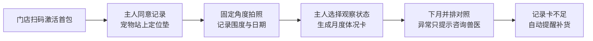

# 体况卡：给宠物洗护店的犬猫月测柜台包

> **一句话讲清楚：** 给只有 1—3 家门店的独立宠物洗护店，卖一套“定位垫 + 软尺 + 记录卡 + 二维码页面”的柜台包，让宠物主人在洗护时自己记录犬猫体型变化；店主支付 199 元购买首包，后续购买记录卡补充包。

**五分钟读完：** 这不是诊断、减肥方案或宠物 SaaS。它是一件全国可发货的实物商品，二维码只负责留存趋势。公开证据能证明市场、标准和体重管理问题存在，不能证明门店一定愿意买。

## 1. 先看懂：这是个什么生意？

一只柯基每月都来洗澡。主人天天见它，很难察觉腰线是在三个月里慢慢消失的；洗护店员也不应该凭肉眼说它“肥胖”或给出治疗建议。现在的洗护订单通常只留下品种、项目和照片，没有一组位置一致、能前后对照的体型记录。

“体况卡”把这件事变成洗护结束前的 3 分钟动作：宠物站在带俯视和侧视定位线的折叠垫上，主人拍两张固定角度的照片，用软尺记录一个约定位置的围度，再由主人按照经过兽医审核的原创说明选择“本月观察状态”。二维码页面把本月与上月并排显示；出现连续变化时，只提示“建议向持证动物诊疗机构咨询”，不输出诊断、目标体重、喂食量或药品建议。

店主得到的是一个可见、可分享、能自然提醒下次洗护的增值服务。你卖的不是“宠物健康管理平台”，而是一个能摆上柜台、开箱即用、需要补充耗材的商品。

**最小可售单元：** 199 元首包，含 1 张可清洁折叠定位垫、1 把软尺、1 张柜台说明牌、100 张编号记录卡和 90 天二维码趋势页；49 元补充包含 100 张记录卡。价格均为建议定价假设。

## 2. 为什么偏偏是现在？

**2026 年 2 月 27 日，国家发布 GB/T 47217—2026《犬猫体况评分技术规范》，并将于 2026 年 9 月 1 日实施。** 它是推荐性国家标准，主要起草单位包括中国农业大学、中农大动物医院、中国兽医协会等。标准的出现意味着“犬猫体况”开始有全国共同术语，但不等于任何商品获得了官方认证。

**2025 年我国城镇犬猫数量达到 1.26 亿只，消费市场规模为 3126 亿元。** 央视网和新华社均引用了《2026 年中国宠物行业白皮书》的数据；新华社同时指出，市场增长正从单纯增加宠物数量转向单只宠物的精细化消费。

**体重管理不是虚构痛点。** 2025 年《中国饲料》发表的研究综述称，宠物犬超重肥胖问题越来越严重，宠物主人也越来越重视该问题。它证明“关注存在”，但没有提供可直接用于本项目的中国患病率，也不能替代兽医判断。

三个信号叠在一起，制造了一个短窗口：标准将在三周后生效，宠物消费正向精细化走，而洗护店需要比“洗干净”更容易被主人看见的服务差异。把专业概念翻译成非诊疗的日常记录用品，可能形成新的商品类目。

## 3. 谁会付钱，为什么会付？

- **唯一付费客户：** 有 1—3 家门店、主营犬猫洗护、没有自研系统的独立宠物店店主。
- **购买触发：** 同城洗护价格接近、老客复购下降，店主需要一个 200 元以内、无需装修和培训一天就能上线的差异化项目。
- **今天的替代方案：** 洗前洗后照片、纸质会员卡、店员口头提醒，或价格更高的连锁门店系统。它们要么无法前后对照，要么不是小店能轻松采用的柜台商品。

行业平台 2025 年的一篇商业案例称，洗护是许多宠物门店的主要收入来源，传统门店还面临客流、服务标准和信任问题。该文章来自项目方，含营销立场，只能作为“门店正在寻找增值服务”的弱证据，不能拿其中经营数字做收益承诺。

店主可能付钱的真正理由不是“响应国标”，而是同一套动作同时产生三个结果：给主人一张可带走的月度记录、给社交平台一组规整的前后照片、给下次洗护一个自然提醒。这里仍是 AI 推断，必须由真实订单才能证实。

## 4. 它具体怎么运转？



第一步，首包上的门店码自动建立一个轻量页面，不要求店主安装 App。第二步，主人现场决定是否记录；不参与也不影响洗护服务。第三步，店员只协助摆位和拍照，观察状态由主人选择。第四步，页面生成一张带日期、角度和“非诊疗记录”水印的卡片。第五步，主人可自行保存；选择提醒时才留下最少联系信息。

**完成定义：** 门店能在 3 分钟内生成一张本月记录，主人下次打开能看到同角度对照，系统能按记录卡消耗量提醒店主补货。

**明确不做：** 不称“国标认证”；不复制标准中的受版权保护图表；不让店员诊断肥胖；不计算处方粮用量；不推荐药物；不接入宠物医院病历；不把宠物照片默认用于公开营销。

## 5. 怎么赚钱，能自动到什么程度？

建议定价假设是 **199 元/首包**。一份示意账：定位垫、软尺和印刷 48 元，包装与快递 18 元，平台支付及售后准备金 8 元，获客 50 元，二维码服务 5 元，单包贡献约 70 元。49 元补充包若材料、发货和渠道成本合计 21 元，单包贡献约 28 元。以上均为测算假设，未扣公司、税费、兽医审核、打样和退货固定成本。

复购不是靠软件续费，而是靠记录卡耗材。假设一家店每月有 30 位主人愿意记录，100 张卡约 3 个月用完；真实使用率未知。也可以让店主免费送给老客，或每次收 3—9.9 元，但终端收费方式由门店决定，你只向店主卖商品。

- **可自动化：** 电商收款、第三方仓发货、门店码生成、记录卡页面、月度对照、补货提醒和电子发票。
- **必须人工：** 兽医审核说明、首批打样、异常照片申诉、退货、数据删除请求和合规复查。
- **自动化上限：** 如果每个门店每月需要超过 10 分钟人工客服，或者必须人工看照片才能生成结果，这就不再是适合副业的小商品。

## 6. 最大问题与最终判断

**结论：有条件值得继续关注。** 它抓住了一个即将实施的新标准，又没有落回咨询、内容课或纯 SaaS；实物可全国销售，发货和补货可以外包。但它必须把“记录”和“诊疗”分得非常清楚。

最可能失败的三个原因：第一，宠物店觉得主人不在意，首包摆在柜台却没人用；第二，消费者把卡片误解为健康结论，引发合规和信任风险；第三，100 张记录卡用不完，耗材复购不存在。

停止条件设为：售出 100 个首包后，60 天内完成激活的门店少于 40%；激活门店中 90 天补充包购买率低于 25%；任何一次宣传被兽医或监管指出构成诊疗暗示且无法通过改版消除；每店月均客服超过 10 分钟；首包综合退款率超过 8%。

你的系统能力适合二维码租户页、自动发货、对照卡生成和数据最小化；但这不是进入机会的理由。真正缺口是执业兽医内容审核、包装打样、宠物店渠道和动物诊疗边界法律意见，前三项都可以按项目外包。无论谁执行，都应把它保持为“实物耗材 + 自动记录页”，不要改写成健康咨询。

---

## 事实与推演附录

### A. 行业坐标与商业系统

- 主行业：宠物用品 / 宠物洗护增值商品。
- 商业模式：B2B 实物首包 + 纸质耗材补充包，二维码页面是商品配套。
- 价值链位置：洗护服务结束前的主人自助记录。
- 新鲜信号：GB/T 47217—2026 于 2026-09-01 实施。
- 受益者与付款者是否相同：付款者是宠物店，直接使用者是宠物主人，受益不同。
- 最小可售单元：199 元首包；建议定价假设，不是市场事实。
- 机会形态与商业系统：产品 → 电商交易 → 第三方仓配 → 门店使用 → 耗材补货。

### B. 市场证据与事实来源

| 日期 | 一手或权威来源 | 可直接复核的事实 | AI 推断 | 证据局限 |
|------|----------------|------------------|---------|----------|
| 2026-02-27 | [全国标准信息公共服务平台](https://openstd.samr.gov.cn/bzgk/std/newGbInfo?hcno=29A40C6C3A58B990787D061B68B6A8F5) | GB/T 47217—2026 发布，2026-09-01 实施，农业农村部主管 | 标准生效会提高店主和主人的认知 | 推荐性标准不创造强制购买义务 |
| 2026 | [国家标准项目页](https://std.samr.gov.cn/gb/search/gbDetailed?id=4C1BF798CB0A83B0E06397BE0A0A640A) | 起草单位包括中国农业大学、中农大动物医院、中国兽医协会等 | 可请相关专业背景兽医审核消费说明 | 起草单位不为本商品背书 |
| 2026-04-29 | [央视网](https://tv.cctv.com/2026/04/29/VIDEphwmDqTwXiREo8KhMPVj260429.shtml) | 2025 年城镇犬猫数量为 1.26 亿只 | 存在足够大的终端用户池 | 数量不等于柜台包需求 |
| 2026-06-12 | [新华社 / 经济参考报](https://www.news.cn/20260612/62c75b0abfeb4df1aeb3534ffaba2424/c.html) | 白皮书称 2025 年消费规模 3126 亿元，行业转向精细化消费 | 体型趋势可能成为可付费的小场景 | 媒体转引行业报告，非官方统计 |
| 2025-08-05 | [《中国饲料》研究综述](https://journal.chinafeed.com.cn/EN/Y2025/V1/I15/144) | 综述称宠物犬超重肥胖问题越来越严重，主人关注度上升 | 非诊疗的日常记录可能有价值 | 无本项目可用的中国患病率与付费数据 |
| 2025 | [派读行业案例](https://petdata.cn/infodetail_7655568014426112.html) | 案例称洗护是许多门店主要收入来源，门店面临客流和服务标准问题 | 店主可能购买差异化柜台商品 | 项目方营销稿，经营数字不可独立验证 |
| 2022-09-07 | [农业农村部《动物诊疗机构管理办法》](https://xmsyj.moa.gov.cn/gzdt/202209/t20220909_6408940.htm) | 动物健康检查、诊断和治疗属于动物诊疗，机构须取得许可证 | 产品必须只做主人自助观察记录 | “记录”与“健康检查”的实务边界仍需法律意见 |
| 2021-08-20 | [《个人信息保护法》](https://www.npc.gov.cn/WZWSREL25wYy9jMi9jMzA4MzQvMjAyMTA4L3QyMDIxMDgyMF8zMTMwODguaHRtbD9yZWY9aW1i) | 处理个人信息须告知目的、方式、种类和保存期；个人可撤回同意 | 可用最小数据和主动订阅降低风险 | 宠物照片可能连带识别主人，仍需具体评估 |

### C. 收入与单位经济

| 收入项 | 建议定价假设 | 可变成本假设 | 毛利逻辑 | 回款与复购 |
|--------|--------------|--------------|----------|------------|
| 首包 | 199 元 | 129 元 | 约 70 元贡献 | 电商即时回款，一次成交 |
| 100 张补充包 | 49 元 | 21 元 | 约 28 元贡献 | 由真实卡片消耗驱动 |

首包成本 129 元包括：物料 48、包装快递 18、支付售后 8、获客 50、二维码服务 5。所有数字都需要供应商报价和真实订单重算。

### D. 运营与自动化系统

供应端由印刷厂和软质垫供应商完成；第三方仓接收成品并发货；每个包装贴唯一门店码；激活后自动建立门店页；主人记录只关联宠物昵称和随机编号，联系方式仅在主动订阅提醒时收集。异常时关闭自动输出，只保留原始记录和“请咨询持证机构”提示。

长期可沉淀的资产不是宠物照片库，而是原创的非诊疗说明体系、不同体型的拍摄定位模板、门店补货预测和渠道名单。未经主人单独同意，不把照片用于模型训练或门店营销。

### E. 30 / 90 天演进路线

- 0—30 天：合法获取并研读标准全文；请执业兽医和法律顾问审核术语；完成原创图示、材料打样、二维码静态原型和包装警示语。
- 31—90 天：通过宠物用品批发商和电商平台销售单一首包；接入第三方仓；只统计激活率、记录次数、客服分钟、退款和补充包购买，不扩张到诊疗建议。
- 可沉淀资产：包装模具、原创图示版权、门店激活漏斗、补货模型、兽医审核清单和异常案例库。

### F. 风险、合规与停止条件

- 最大风险：消费者把观察卡当成健康诊断；门店店员越界解释；耗材没有复购。
- 合规边界：不提供健康检查、诊断、治疗、目标体重、处方或用药；不声称“国标认证”；不直接复制标准图表；最小化收集主人信息，支持撤回和删除。
- 停止条件：100 个首包后的 60 天激活率低于 40%；90 天补充包购买率低于 25%；退款率高于 8%；每店月客服超过 10 分钟；诊疗暗示无法消除。
- 未知项：标准全文的具体评分方法与版权许可、宠物店真实采购价、定位垫耐用性、主人参与率、记录卡消耗速度、不同犬猫体型的拍摄可比性。

## 反馈（skill_run）

```yaml
skill_run:
  skill: creative-capture-assistant
  workflow_stage: single-idea
  plan: Plans/创意捕捉/2026-08-11-副业创意-体况卡犬猫月测柜台包.md
  date: 2026-08-11
  contexts_used:
    - path: Contexts/决策/Skill反馈协议.md
      utility: high
      reason: "用五分钟正文承载理解和判断，用事实附录区分可核验事实、AI 推断、定价假设与未知项。"
  contexts_missing: []
  contexts_stale: []
```
